# 概要 {#synopsis} 

I strongly believe the best chance of long-term success is achieved with a broad product boundary coupled with feature teams executing within the full scope of the product. If the art of the possible excludes this choice, an incremental approach starting with _extended_ (more cross-functional) component teams and aggressively moving towards _expanded_ (more cross-component) component teams and feature teams can still be worth pursuing.
我坚信宽泛的产品边界，结合在产品全范围之内运行的特性团队，是最有可能取得长期成功的。如果因可能性的艺术从而排除了这种选择，那么一种增量的方式 - 从*扩展的*（更多跨职能）组件团队开始，积极地转向*扩大的*（更多跨组件）组件团队和特性团队 - 仍然是值得追求的。

Benefits of this strategy within Nakashima's Modular Compute System division included:
在中岛公司的模块化计算系统部门，这个策略的好处包括：

* 在扩展组件边界内这个局部改善了**适应性**和**价值交付**
* 改进了带来**质量提升**的技术实践，同时也提升了团队对改进所能带来什么的认知
* 早期识别和解决与扩展组件相关的**缺陷**
* 提升了在扩展组件团队内的员工**协作、参与度和学习**
* 提升了对**组织障碍**，以及更多组织变革必要性的认知

I hope you will find our success inspirational and instructive. Similarly, I hope you will avoid repeating our mistakes and instead spend your energy learning as you make new ones.
我希望我们的成功能让你感受到鼓舞和启发。同样，我也希望你能避免重复我们的错误，而是把精力放在新错误的学习上。

# 略读提示

这个案例特别长，并且很详细。如果你想快速浏览，我建议只读以下部分：

* 概要章节
* 所有图表及相关说明
* 结论章节

# LeSS导入的总体背景 {#overall-context-of-less-adoption}

## 产品概述及相关人员 {#product-overview-and-people-involved}

Nakashima's Modular Compute System (MCS) division is focused on product development for a family of integrated hardware, software, and networking components which collectively act as a complete pre-bundled in-house data center solution. It is to some extent an on-site forklift deployment of an Amazon Web Services type platform. Typical end customers are large banks, insurance companies, mobile phone providers, and scientific research organizations.
中岛公司的模块化计算系统（MCS）部门专注于一系列集成硬件、软件和网络组件的产品开发，这些组件共同作为一个完整预捆绑的内部数据中心解决方案。在某种程度上，它可以说是一个亚马逊网络服务类型平台的现场迁移部署。典型的终端客户是大型银行、保险公司、手机供应商和科研机构。

To help provide a sense of scale, the MCS division of Nakashima alone has somewhere on the order of a few thousand people. Most of the division's staff are concentrated in the greater metropolitan areas of San Francisco, Portland, and Bengaluru.
就规模而言，仅中岛公司的MCS部门就有几千人。该部门的大多数员工集中在旧金山、波特兰和班加罗尔等大城市地区。

The entirety of the MCS division is focused on product development of the MCS product. All manufacturing including circuit board fabrication, metal fabrication, assembly, and other mass-production efforts are outsourced using specifications the MCS division creates.
整个MCS部门都聚焦于MCS产品的开发。而所有的制造工作，包括电路板制造、金属制造、组装和其它大规模生产工作，均采用MCS部门制定的规范被外包出去。

Field support is handled by yet another division of Nakashima. The field support division focuses on providing a seamless customer support experience across all of Nakashima's products. Products supported by the field support division include a broad array of networking products such as telephone systems, video conferencing solutions, wireless networking solutions, and a host of other products that have nothing to do with MCS.
现场支持则由中岛公司的的另一个部门负责。现场支持部门专注于为中岛公司的所有产品提供无缝的客户支持体验。现场支持部门支持的产品包括广泛的网络产品，如电话系统、视频会议解决方案、无线网络解决方案，以及许多与MCS无关的产品。

In practice, there are specialists within the field support division focused on supporting the MCS product. These specialists are exceptionally well positioned to observe the on-the-ground customer reality, and how it varies across the large and diverse MCS customer base. Due to the position of the field support specialists, engineers developing the MCS product can obtain some of the most useful and unfiltered feedback available by directly collaborating with these field support specialists.
实际上，现场支持部门里是有专家专注于支持MCS产品的。这些专家能够观察到现场客户的实际情况，以及存在于大且多样的MCS客户群体中的差异。基于此，开发MCS产品的工程师可以通过直接与这些现场支持专家合作，来获得一些最有用的且未经过滤的反馈。

The MCS product support staff and organizational capabilities should not be confused with what you might encounter for a typical mass consumer product. Rather this is the sort of quick responding, large budget technical support that comes with actual humans on-site when the need arises. Many of the field support specialists are just as knowledgeable and well-compensated in their area of expertise as are the engineers who develop the MCS product.
MCS产品支持人员和组织能力不应与你可能在典型大众消费产品中会遇到的相混淆。这是一类快速响应、预算充裕的技术支持，当需要时就会有真正的人员到现场。许多现场支持专家在他们的专业领域里与开发MCS产品的工程师一样地知识渊博和薪酬优厚。

Trent Gambale was running the project management group within the MCS division, which consisted of less than a dozen project managers who helped coordinate the overall MCS development efforts. Much of the day to day project management facets were being handled by the various engineering directors within the MCS division. My initial sponsorship within the MCS division came through Trent, with active involvement of his VP and the Senior VP/GM at the time. Trent had heard of me through my previous work in another division within Nakashima.
特伦特·甘贝尔（Trent Gambale）负责MCS部门内的项目管理组，该小组由不超过十几名项目经理组成，帮助协调MCS的整体开发工作。日常项目管理的许多方面都由MCS部门内的各个工程总监负责。我在MCS部门的最初赞助来自特伦特，当时他的VP（副总裁）和SVP（高级副总裁）/GM（总经理）都积极参与。特伦特是通过我之前在中岛公司另一个部门的工作听说我的。

## 敏捷导入的初始重点 {#initial-agile-adoption-focus}

The initial focus of the engagement was to assess a small handful of pre-existing (ostensibly) ‘agile’ teams, assist them in whatever improvements made sense, and to begin an agile adoption in other promising areas of the division we could identify.
最初的重点是评估少量业已存在的（表面上）“敏捷”团队，以协助他们做任何有意义的改进；并在该部门内识别出一些有希望的领域开始导入敏捷。

After a few days of investigation, it became very clear all of the pre-existing ‘agile’ efforts were not. For example,
经过几天的调研，所有这些现存的“敏捷”工作很明显其实什么都不是。例如，

* 管理层习惯性地将估算视为*承诺*。
* 缺乏熟练的工程实践，例如自动化单元测试。
* 没有正式的“检查并适应”活动，例如回顾会议。
* 团队远没有自我管理。

Following my initial examination of the pre-existing so-called agile efforts I discussed what I had learned with Trent. We judged the most effective place to focus our energy would be on creating new proper cross-functional and cross-component Scrum teams in areas deemed most conducive to success of the change. Each team should have the skills and empowerment to work on any aspect of the various technologies involved, along with the ability to perform all aspects of development, testing, release, and any other activities involved.
在我对现存的所谓敏捷工作进行初步检查之后，我与特伦特进行了讨论。我们认为，当下聚焦我们精力最有效的地方应该是，在那些被认为最有利于成功变革的领域创建新的合适的跨职能和跨组件Scrum团队。每个团队应该拥有技能和授权以工作于各种相关技术的任何方面，同时具备完成开发、测试、发布，以及其它相关活动的所有方面的能力。

From my investigation of the pre-existing efforts, it had become clear the majority of the senior management had no real understanding of or exposure to healthy self-managing teams. Without that, it would be challenging to generate sufficient interest in more sustainable division-wide organizational change. Trent and I hoped a successful showcase Scrum team would help achieve greater buy-in.
从我对现存工作的调查来看，大多数高级管理层对健康的自管理团队显然并没有真正的了解或接触。没有这一点就很难让大家对更持续的整个部门组织变革产生足够的兴趣。特伦特和我希望借助一个成功的Scrum团队示例来获得更大的支持。

But our _failure to address some of the structural forces eventually unraveled much of our earlier success_. Two large structural forces contributing to the unraveling were:
但我们*未能解决一些结构性问题最终瓦解了我们早期的成功*。导致瓦解的两大结构性问题是：

* 未能充分重组汇报关系鼓动了一些经理分散了团队成员的工作注意力。
* 新构建的功能对管理者激励的贡献有限，尽管它为中岛公司整体带来了巨大的节省。

The _[Manifestation of Larman's First and Fifth Laws of Organizational Behavior](#bookmark=id.26in1rg)_ section covers these in more detail.
[第一条和第五条拉曼组织行为法则的表现](#manifestation-of-larmans-first-and-fifth-laws-of-organizational-behavior)章节对此有更详细的阐述。

We initially established a single Scrum team focused on adding an end-to-end diagnostic capability to the MCS product. The end-to-end diagnostics showcase team is not the primary focus of this case study, although partial success in this effort helped open the door to the broader BIOS related efforts which are.
我们最初成立了一个单独的Scrum团队，专注于为MCS产品增加端到端诊断能力。端到端诊断展示团队并不是本案例的主要重点，尽管这项工作的部分成功为更广泛的BIOS相关工作敲开了大门。

Because the end-to-end diagnostics efforts help to illuminate and foreshadow some of the challenges encountered in the BIOS efforts, the diagnostics team efforts are described in a little more detail later on.
因为端到端诊断的工作帮助照亮和预示了BIOS工作中遇到的一些挑战，稍后也将更详细地描述诊断团队的工作。

## 在BIOS组内面向LeSS的导入 {#less-oriented-adoption-within-bios-group}

The early success of the diagnostics team along with my continued socialization within the MCS division piqued the interest and eventual enrollment of Mitya, who was the director for the U.S.-based engineers in the BIOS group. The LeSS-oriented adoption within the BIOS group spearheaded by Mitya and myself is the primary focus of this case study.
诊断团队的早期成功以及我在MCS部门的持续交流传播激发了兴趣，并最终有了BIOS组美国工程师主管米提亚（Mitya）的加入。由米提亚和我牵头、在BIOS组内面向LeSS的导入是本案例的主要重点。

The level of artificial self-inflicted complexity and the esoteric nature of the BIOS domain were such that a component boundary restricted to BIOS development alone still greatly benefited from a LeSS-oriented structure. It would help to resolve years of problematic practices.
人为自加的复杂程度以及BIOS领域本身难懂的属性，使得即使仅限于BIOS开发这样一个组件边界，仍能从LeSS结构中受益良多。LeSS结构将有助于解决多年来那些有问题的实践。

The BIOS domain also provided a natural evolutionary path towards a full slice through the entire MCS system. The ability to quickly absorb a new generation of pre-production Intel CPUs into the MCS product prior to Intel’s production launch of the CPUs is critical to maintain market relevance. This includes ensuring all required BIOS functionality works correctly on the pre-production CPUs, as well as ensuring any revisions and extensions of the blade architecture are working properly from a CPU integration perspective. Additionally, this includes ensuring all CPU administration services exposed at the MCS administration user interfaces are working, and have been extended to support new functionality Intel is introducing with the pre-production CPUs.
BIOS领域还提供了一条通向整个MCS系统完整切片的自然演进路径。在英特尔CPU生产上市之前将其新一代预生产CPU快速吸收到MCS产品中的能力对于保持市场相关性至关重要。这包括要确保所有必需的BIOS功能在预生产CPU上正常工作，同时要确保刀片（blade）架构的任何修订和扩展都能与CPU正常集成。此外，还需要确保MCS管理用户界面上公开的所有CPU管理服务都能正常工作，并得到扩展以支持英特尔在预生产CPU中引入的新功能。

All of the above could be seen as a natural LeSS Huge Requirement Area for the MCS product as a whole.
所有这些都可以被视作一个自然的以MCS为整体产品的LeSS巨型需求领域。

The LeSS framework rules state each Requirement Area in a LeSS-Huge adoption should have the complete LeSS structure established “at the start”. Although Mitya and I did completely restructure the U.S.-based members of the BIOS group from the start, better senior management alignment and buy-in would have made it possible to have started with a fuller, and more appropriate vertical slice of the product.
LeSS框架规定，在LeSS巨型导入中每个需求领域都应“在开始时”建立完整的LeSS结构。虽然米提亚和我从一开始就对BIOS组内的美国成员进行了彻底重组，但如果能更好地让高级管理层达成一致认同，其实可以从更完整更合适的产品垂直切片开始。

We started as best we could and then incrementally began expanding the BIOS component boundary upward through the various overall component layers. The _Feature Team Adoption Map for BIOS_ in conjunction with the _Initial BIOS Component Boundary,_ and _Expanded BIOS Multi-Component Boundary_ diagrams illustrate this incremental expansion. The astute reader will notice this approach aligns with the _Feature Team Adoption Map_ guide described in _Large-Scale Scrum: More with LeSS_.
我们从尽可能好的起点开始，然后逐渐沿着各种整体组件层次往外扩展BIOS组件的边界。*BIOS的特性团队导入地图*以及*初始的BIOS组件边界*和*扩大的BIOS多组件边界*这些图呈现了这种增量扩大。敏锐的读者会注意到这种方式与《大规模Scrum》书中描述的*特性团队导入地图*指南相一致。

The BIOS LeSS-oriented adoption efforts were hindered by a change in the Senior VP/GM, which occurred just around the time Mitya and I began our efforts. Had we retained the same level of executive support found with the original Senior VP/GM, far broader and more sustained success would likely have been achieved.
BIOS面向LeSS的导入工作因VP/GM的变动而受阻，恰好发生在米提亚和我开始变革的时候。如果能保持与原先VP/GM同等的管理层支持，那么我们很可能会取得更广泛更持久的成功。

I learned a great deal from both the successes and failures of the LeSS-oriented adoption efforts within Nakashima’s MCS division. Hopefully, this case study will help guide you in your journey as you learn from our successes and even more from our failures.
我从中岛公司MCS部门面向LeSS的导入工作的成功和失败中学到了很多。希望当你从我们的成功和失败中学习时，本案例能帮助你在旅程中有所指引。

## Initial Focus on Firmware Not Hardware Development 初始重点在固件而非硬件开发 {#initial-focus-on-firmware-not-hardware-development}

Historically the vast majority of the release schedule forecasting problems occurred in the firmware (e.g. BIOS, Network Interface Controller, Chassis Controller, etc.) and higher-level software (e.g.  MCS Administrator, diagnostics, etc.) development aspects of the MCS product development group. Hardware development aspects tended to be far more predictable.
从历史上来说，大多数的版本时间表预测问题都发生在MCS产品开发组的固件（比如BIOS、网络接口控制器、机框控制器等）和更高层级的软件（比如MCS管理员、诊断等）开发部分。而硬件开发部分通常更能预测。

 In practice, I only spent a small amount of time in conversations with people involved with designing manufacturing specifications for the external fabricators. Although expanding the LeSS adoption to include the engineers involved in hardware design would make sense in the long-term, it was not part of my initial focus.
实际上，我只花费了少量时间与为外部制造商设计生产规范的人员交谈。虽然把LeSS导入扩大包含进硬件设计工程师从长期来说是合理的，它并不是我的初始重点。

In practice, neither the diagnostic nor BIOS teams I spent most of my time working with had much need to collaborate actively with the hardware engineers. Whenever a firmware developer had a need they would go over and talk with the hardware design engineers, it just didn't happen often. The MCS product was a relatively mature product by the time I was involved with the MCS division; as such most hardware design changes tended to be small and incremental. There was likely a potential opportunity to encourage greater innovation through more broadly cross-functional teams in the future with more tightly integrated hardware and firmware development.
实际上，我花费大多数时间一起工作的诊断团队和BIOS团队都不需要跟硬件工程师活跃地协作。任何时候固件工程师有需要，就会去找硬件设计工程师交谈，只是不经常发生而已。我在参与MCS部门的时候MCS产品已经相对成熟；从而大多数硬件设计改动通常比较小且增量。将来有机会可以通过更宽泛的跨职能团队 - 更紧密地集成硬件和固件开发 - 来鼓励更大的创新。

<figure>
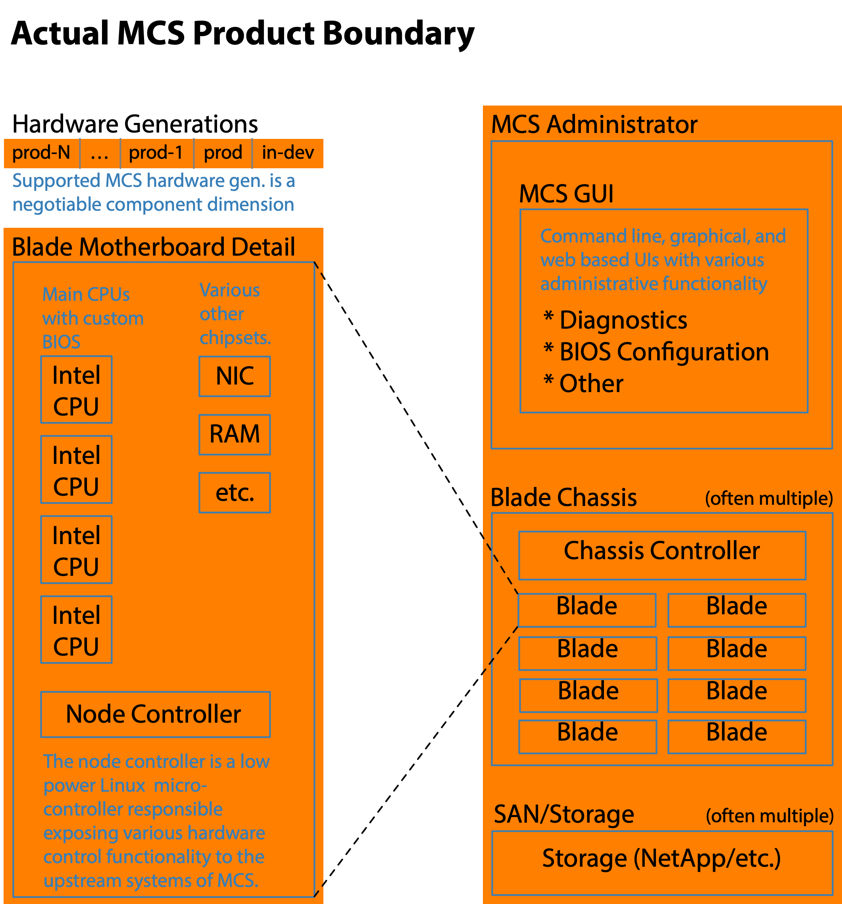
<figcaption>
图1：从产品管理组、中岛公司的部门边界以及外部客户的视角，自然的产品边界包括网络、计算和存储能力的整个系统。
  
即使更为宽泛的产品边界是可能的，但并不那么现实，考虑到与其它系统的耦合已被充分标准化，来自不同供应商的数据中心硬件和软件可以互换。在更大规模测试范围中这些其它系统确实会扮演一定角色，但它们并不是MCS测试的重点。
</figcaption>
</figure>

<figure>
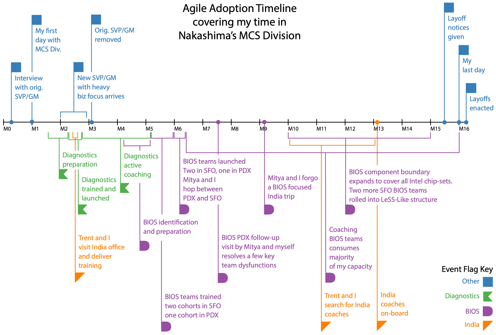
  <figcaption>图2：伴随各种重叠的导入工作和管理上的变化，容易失去对整体故事架构的跟踪。希望这个时间线能有助于理解。</figcaption>
</figure>

# Demonstrate Benefits of a Scrum Team 展示Scrum团队的好处 {#demonstrate-benefits-of-a-scrum-team}

There was a great deal of initial skepticism within the MCS division that Scrum made sense within a hardware and firmware development effort. The thought being firmware and hardware efforts were somehow different from typical enterprise software development, and therefore not a good match for Scrum (ironic, as the original 1980s roots-of-Scrum research from Harvard involved hardware products). This perspective was reinforced by the fact that all the pre-existing ‘agile’ development efforts within MCS were not.
在MCS部门最初存在许多对Scrum是否适合硬件和固件开发工作的怀疑。他们认为固件和硬件工作与典型的企业软件开发不同，因此并不适合使用Scrum（具有讽刺意味的是，原先1980年代来自哈佛大学Scrum根源的研究就涉及硬件产品）。这一观点因事实上MCS内所有先前存在的“敏捷”开发工作都不与硬件和固件开发相关而得到加强。

Considering the context, it made sense to apply the incremental LeSS-adoption Guide using a _Feature Team Adoption Map_ to identify a meaningful multi-component boundary to stand-up a healthy Scrum team that could demonstrate useful results. This is to say it made sense to demonstrate the value of having a small team of people with all the skills to solve a problem, working directly with the customers who have the problem, and to have this team of people iteratively, adaptively, and incrementally solve the customer's problem.
考虑到这种情况，合理的做法会是应用增量的LeSS导入指南，使用*特性团队导入地图*来识别一个有意义的多组件边界，建立起一个健康的Scrum团队，并能展示有用的结果。这是说合理的做法是展示一个小团队的价值，他们拥有解决问题的所有技能，直接与有问题的客户工作，并且迭代地、适应地和增量地解决客户问题。

We hoped to gain additional political capital by demonstrating:
我们希望能获得额外的政治资本，通过展示：

* 固件/硬件Scrum
* 自管理团队
* 改善客户协作
* 改善价值交付
* 结构对文化的影响
* 提高代码质量
* 避免合同游戏

## Desired Characteristics of Pilot Multi-Component 多组件试点的期望特征 {#desired-characteristics-of-pilot-multi-component}

To achieve the demonstration objectives above, we needed to identify the right feature set of the MCS product for a pilot Scrum team to focus on. I recognized the chances of success would be greatest if we could identify a largely isolated and _decoupled set of multiple components which mapped significantly to a natural LeSS Huge Requirement Area_ (RA) of the overall product. (Note that an RA is _not_ defined by a component or architectural boundary, but sometimes there is a significant overlap of a functional RA and a body of related code, which in this early-step case was an advantage in simplifying the adoption).
为了实现上述展示的目标，我们需要识别出适合让试点Scrum团队专注的的MCS产品功能集。我认识到，如果我们能够识别*一组基本隔离和解耦的多个组件，它能映射到整个产品中的一个自然LeSS巨型需求领域（RA）*，那么成功的机会将会最大。(请注意，RA并*不是*由组件或架构的边界来定义的，但有时功能RA和相关代码体有很大的重叠，这在前期步骤下是一项优势，可以简化导入）。

The following criteria delineate the group of multiple components we were looking to identify. We wanted a group of components…
下面的标准描述了我们寻找识别的多组件组。我们想要一组组件……

* 贯穿MCS的“前端到后端”
* 适合单个团队的能力
* 为客户提供有意义的价值
* 其成功交付在政治上难以忽视
* 可以保护团队不受交付压力的影响
* 代码库与MCS系统其它部分至少适度解耦，以避免瀑布式开发大军的糟糕实践

另一个我们可以没有但希望也能找到的标准是：

* 一组可以独立于瀑布式MCS发布的组件；从而提供来自真实客户的更快反馈

# Appropriate Diagnostics Feature Set Identified for Pilot Scrum team 为试点Scrum团队识别的合适诊断特性集 {#appropriate-diagnostics-feature-set-identified-for-pilot-scrum-team}

It took some thoughtful discussion with Trent and others within the organization to find a good candidate set of components. The conclusion? A _diagnostic feature set_ of MCS turned out to be a remarkably good choice since it satisfied every item on the list.
我们与特伦特和组织内的其他人进行了一些深思熟虑的讨论，以找到好的候选组件集。结论是什么？MCS的*诊断特性集*结果是一个非常好的选择，因为它满足了清单上的每一个项目。

Tremendous financial savings in customer support costs and associated reputational benefits helped provide political air-cover while also generating enthusiastic support from the field support division. The diagnostic feature set was the only obvious feature set meeting our criteria, yet the fit was fantastic!
在客户支持成本方面的巨大财务节省和相关的声誉利益有助于提供政治上的掩护，同时也能在现场支持部门产生热情的支持。诊断特性集是唯一明显符合我们标准的特性集，但它的匹配度非常棒！

<figure>

  <figcaption>图3：虽然诊断代码基本都封装在定制ISO镜像中，还有一些专注诊断的代码是在MCSA中，诊断能力却是被广泛关注，并与所有硬件批次相关。经常需要整个MCS系统中每个组件的详细知识。当一个给定MCS组件的固件缺乏探测它的能力时，诊断团队就会为它添加。</figcaption>
</figure>

<figure>
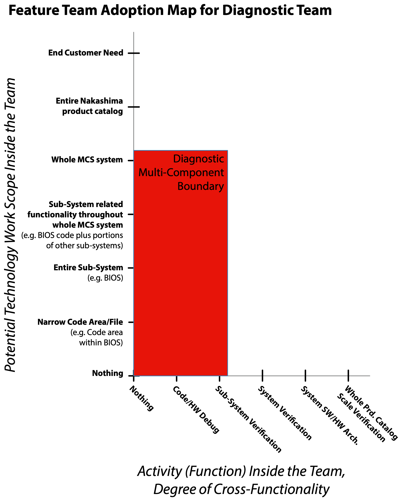
<figcaption>
图4：诊断能力很窄地聚焦在帮助客户诊断他们现场MCS系统的问题，特别是硬件组件故障。虽然焦点很窄，其范围却跨越整个MCS系统。
  
关于使用特性团队导入地图的更多信息可以在此找到：<a href="https://less.works/less/adoption/feature-team-adoption_map">https://less.works/less/adoption/feature-team-adoption_map</a>
</figcaption>
</figure>

## Diagnostics Team Behavioral Achievements 诊断团队行为成就 {#diagnostics-team-behavioral-achievements}

From the initial launch onward people began to behave differently than before. After four or five Sprints changed behaviors included …
从最初启动大家就开始在行为上跟以前有所不同。在四或五个迭代之后，改变的行为包括……

* 在整个诊断Scrum团队和现场支持部门的工程师之间积极协作
* 一个协同工作而非只有个体的团队，每个迭代增量地调整和改进他们的实践，总能产出可交付的组件增量，并和关键干系人建立了丰富直接的协作关系
* 一份多组件的待办列表，其排序受到现场支持和另一个协作部门所产出度量的很大影响。这些度量让我们能为大多数构想的诊断能力指定一个估算的每月延迟成本。高优先级诊断能力的预期节省是*惊人的*！

## Diagnostics Team Technical Achievements 诊断团队技术成就 {#diagnostics-team-technical-achievements}

An explicit and expanding Definition of Done, effective Scrum events, a small amount of technical coaching, and avoiding the Contract Game combined to make a huge difference in technical practices.
一个显式并扩展的完成定义、有效的Scrum活动、少量技术指导，以及避免合同游戏，这些加一起在技术实践上产生了巨大的变化。

Within four or five Sprints the following were readily observable:
在四到五个迭代中，很容易观察到如下：

* 诊断团队触碰到的MCS任何部分的C++和Python代码都有自动化单元测试
* 自动化单元测试实践，为所有诊断特定代码和整个MCS代码库的一些部分能有更精心编写的代码和更少的麻烦代码，起到了一种强制作用
* 积极开发比以前为MCS系统存在的更完善、更广泛的自动化集成测试

## Diagnostics Team Launch Steps 诊断团队启动步骤 {#diagnostics-team-launch-steps}

There was no mystery to our success. Steps included:
我们的成功并不神秘。步骤包括：

* 将LeSS指南*临时性伪产品负责人*应用于诊断多组件，确认了一个有利于支持和指导团队的人格，他有足够的地位和政治影响力，其决定会得到各干系人的尊重。
    * 这个人是*伪*产品负责人，因为他们仍然要玩*合同游戏*，按照公司其他人的指示做需求并遵守里程碑。
* 组建了一个由八人组成的开发团队，拥有所有需要的（或可以学到的）软件和测试工程技能，以在要求的各种MCS子系统中工作。
* 完全占有一间中型会议室，作为开发团队的联合工作空间。
* 我为所有Scrum团队成员以及关键干系人提供了两天正式的课堂培训。
* 我们进行了一次协作的章程制定工作，包括两天专门的章程制定会议，以及各种准备和跟进会议。这有助于实现干系人和Scrum团队成员之间以及他们内部的整体对齐。
* 在最初的几个迭代中，我提供了积极的管理、流程和技术指导，然后将大部分精力重新聚焦于即将在MCS部门BIOS组发生的面向LeSS的导入上。

See the _Getting Started_ guide in _Large-Scale Scrum: More with LeSS_ for additional guidance on launching teams. Although written from the perspective of launching multiple teams within a LeSS structure, it is just as applicable to launching a single pilot Scrum team.
更多关于启动团队的指导，请参阅《大规模Scrum》书中的*开始*指南。虽然它是从在LeSS结构中启动多团队的角度写的，同样适用于启动一个试点Scrum团队。

## Diagnostics Team Photos and Artifacts 诊断团队照片和工件 {#diagnostics-team-photos-and-artifacts}

<figure>
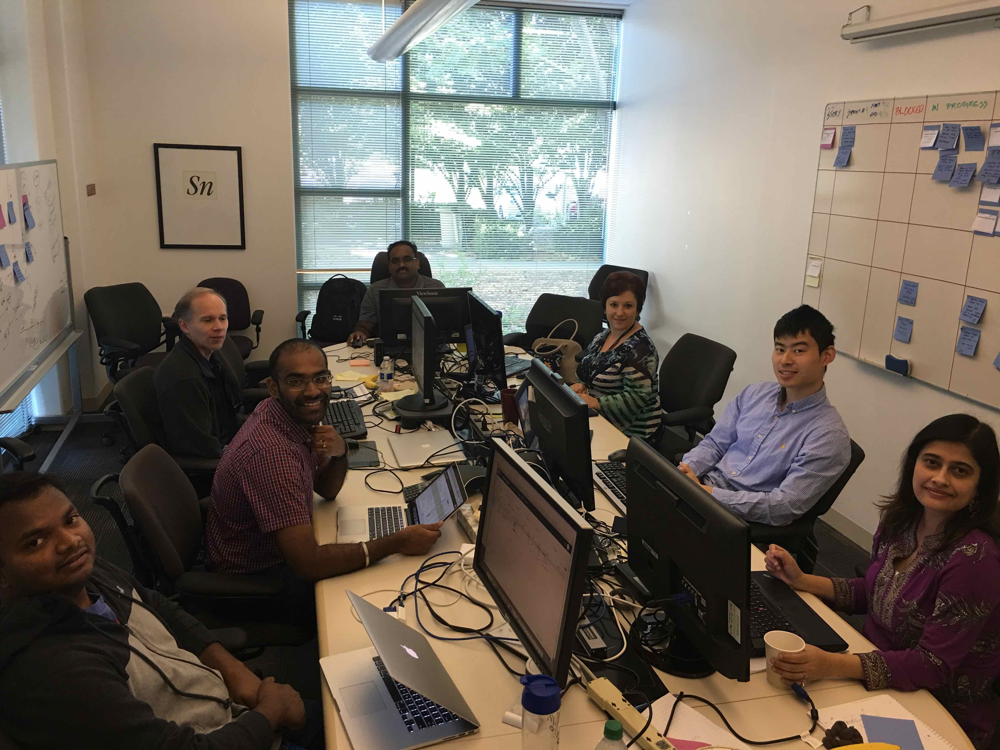
  <figcaption>图5：这是一张诊断Scrum开发团队的照片。随着时间的推移，结对和群聚变得越来越普遍，尽管完全的群聚编程从未真正流行起来。该团队同时拥有测试和开发人才，以便在每个迭代结束时交付一个潜在可发布的增量。开发团队使用一个物理任务板。我们占据的会议室比我们希望的要小一些。</figcaption>
</figure>

<figure>
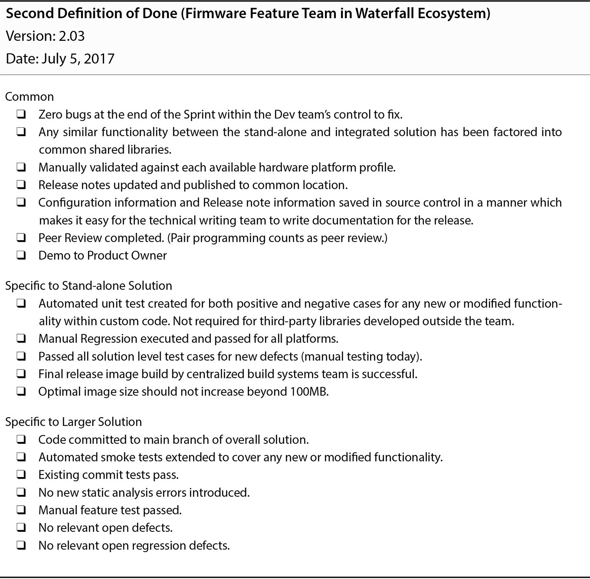
<figcaption>
图6：诊断团队使用的完成定义在几个迭代之后演进成你这边看到的样子。每个迭代结束增量中的独立部分会提供给现场服务部门。而提供给终端客户MCS的集成诊断能力则需要等待一个瀑布开发的MCS产品发布。这个示例的完成定义以及额外的上下文可以从《Forging Change》书中的表格9.2找到。
</figcaption>
</figure>

## Diagnostics Team Culturally Relevant Elements 诊断团队文化相关的要素 {#diagnostics-team-culturally-relevant-elements}

A few cultural observations concerning the pilot effort are listed below. Many of these cultural observations are also relevant to a better understanding of the subsequent LeSS-oriented adoption in the BIOS group.
一些试点工作相关的文化观察被列在下面。它们中的许多也有助于更好地理解随后BIOS组面向LeSS的导入。

### Manifestation of Larman's First and Fifth Laws of Organizational Behavior 第一条和第五条拉曼组织行为法则的表现 {#manifestation-of-larmans-first-and-fifth-laws-of-organizational-behavior}

The first and fifth of Larman’s Laws of Organizational Behavior are:
第一条和第五条拉曼组织行为法则分别是：

* **组织隐含地被优化成会避免改变现状中的中层和初级经理以及“专家”的地位和权力结构。**
* **（在大型成熟组织中）文化遵循结构。而在小型年轻组织中，则结构遵循文化。**

All five of Larman’s Laws of Organizational Behavior can be found on [the structure page of the LeSS website at](https://less.works/less/structure/index).
所有五条拉曼组织行为法则都可以从[LeSS网站上LeSS结构页面](https://less.works/less/structure/index)找到。

Even within the small diagnostics pilot Scrum team, the first and fifth laws were clearly on display. The positive changes in effective structure and resulting culture were limited to the diagnostic team and the stakeholders with whom the diagnostic team actively collaborated. In contrast, the status quo in the majority of the middle management layer remained largely unchanged.
即使在较小的诊断试点Scrum团队中，第一条和第五条法则也明显可见。在有效的结构和由此而来的文化上，正向变化只局限于诊断团队以及他们积极协作的干系人中。相反，大多数中层管理的现状基本没有变化。

The diagnostic team’s expanded component boundary cut across many different components within the MCS system. Each of these components typically had its own set of engineers along with a manager per geographic region, rolling up into one of two VPs. The diagnostics development team was formed by having each of the relevant managers fully allocate a software or test engineer with knowledge of the relevant components. Given the delivery pressure of the overall waterfall efforts, managers were very reluctant to allocate people to the diagnostics team. They ultimately only did so at the behest of the original Sr. VP.
诊断团队扩大的组件边界涉及MCS系统中的许多不同组件。这些组件中每一个通常都有自己的一组工程师，并在每个地理区域有一位经理，往上汇报给两位VP中的其中一位。诊断开发团队的建立是通过让每一位相关经理完全分配一位有相关模块知识的软件或测试工程师。考虑到整体瀑布开发的交付压力，经理们是挺不愿意把人分配给诊断团队的。他们最终这么做只是因为原先的SVP要求所致。

Once the Scrum team was up and running, it took a great deal of political pressure as well as a formal directive from the original Sr. VP before the first and second level managers stopped attempting to task individual diagnostics development team members with unrelated work. Some of the development team members eventually had to be formally assigned to a manager related to the diagnostics effort to stop some problems.
当Scrum团队开始运转时，通过来自原先的SVP的许多政治压力和正式指示，才使得第一第二级经理停止试图给诊断开发团队个体成员指派不相关的工作。一些开发团队成员不得不被正式指派给一位与诊断工作相关的经理，才得以终止这些问题。

Just as Larman's Laws of Organizational Behavior would predict, having the Scrum development team members report to engineering managers who concurrently experienced delivery pressures from the overall MCS product was very problematic. Although the Sr. VP mitigated this problem by being supportive, the organizational chart was never fully flattened. Many of the development team members still continued to report up through one of the VPs who never fully embraced the changes. The only reporting changes involved related to which director was responsible for some of the diagnostics Scrum development team members.
就像拉曼组织行为法则所预测的那样，让Scrum开发团队成员汇报给同时承受来自整体MCS产品交付压力的工程经理是很有问题的。虽然SVP的支持缓解了这个问题，组织结构图从未完全扁平化。许多开发团队成员仍继续往上汇报给其中一位从未完全拥抱变化的VP。唯一涉及的汇报变化是由哪位主管负责一些诊断Scrum开发团队成员。

#### Contrast with LeSS Book Guidance 与LeSS书中指南的对比 {#contrast-with-less-book-guidance}

At first glance, the diagnostic pilot aligns with the _Parallel Organizations_ guide in the third LeSS book, _Large-Scale Scrum_. Regrettably, there are at least a couple of pernicious differences.
乍一看，诊断试点与第三本LeSS书《大规模Scrum》中的*并行组织*一致。很遗憾，至少有两点有害的差异。

When describing the parallel organization strategy Larman and Vodde list a few caveats. The first caveat listed is:
当描述并行组织的策略时，拉曼和沃代列出了一些告诫。第一条列出的告诫是：

>A parallel organization is not a pilot, and one consequence is that the line of organizational reporting must be separate from the traditional organization.
>一个并行组织并不是一个试点，由此而来的一项后果就是它的组织汇报线独立于与传统组织。

The effective team level structure of the diagnostic team was radically changed and aligned with Scrum, yet the formal organizational reporting relationships remained. This failure left the team overly vulnerable to change in the executive management layer.
诊断团队的有效团队层面结构被显著改变以与Scrum一致，然而正式的组织汇报关系却保留了下来。这一失败让团队非常易受高层管理变动的影响。

Even though the diagnostic team was never subject to the Contract Game, the diagnostic team members still reported up through middle managers who were engaged in the Contract Game for the overall waterfall efforts. As the middle managers became increasingly desperate for more development capacity to throw on the bonfire of an upcoming waterfall release they increasingly resumed their earlier behaviors of redirecting the efforts of individual diagnostic team members. Although the original engineering SVP/GM had actively protected the diagnostic team from such dysfunctions, as soon as he departed the legacy status quo began to incrementally erode the supportive context that had enabled the diagnostic team's early success.
尽管诊断团队从未受合同游戏影响，诊断团队成员却还是汇报给参与到整体瀑布工作合同游戏中的中层经理。当中层经理为有更多开发产能投入到即将到来的瀑布发布而感到绝望时，他们越来越多回到之前重新指派诊断团队个体成员工作的行为。尽管原先的工程SVP/GM积极保护诊断团队免受其害，一旦他离开了，遗留的现状就开始侵蚀让诊断团队早期成功的支持性环境。

The second key difference is the diagnostic team was seen as a showcase rather than as the first of many teams that would eventually form a parallel organization. In other words, the diagnostic effort was not seen as the first step in executing a committed collective decision by senior management to slowly migrate all of MCS development into a LeSS-oriented structure.
第二个关键差异是诊断团队被看作是一个展示案例，而不是最终会形成一个并行组织的许多团队中的第一个。换句话说，诊断工作并没有被看作是在执行一个被高管承诺的集体决策 - 逐渐把所有MCS开发转成面向LeSS的结构 - 的第一步。

<figure>
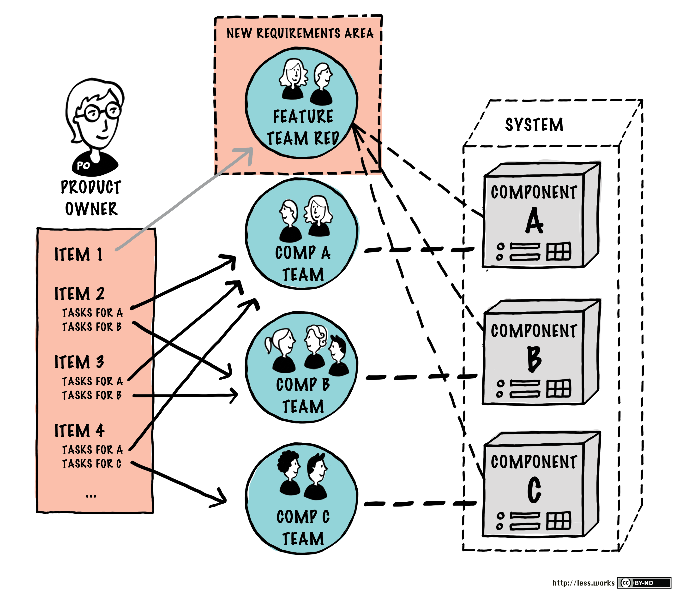
<figcaption>
图7：你会在《大规模Scrum》书中图4.11找到这个图，作为转向特性团队指南的一部分。你会注意到特性团队Red在新形成的需求领域中与其它所有组件团队从同一份产品待办列表中拿工作。虽然这与诊断团队的情景大致相近，日常现实却不尽相同。诊断团队是一个真正的自管理团队，不受合同游戏的负面直接影响。相反，大多数其他MCS团队则受制于瀑布交付环境中的合同游戏。
  
诊断团队的组织汇报关系从未改变成横切组织架构图，处于受合同游戏束缚的瀑布团队的层次之上。这一失败最终导致了诊断团队成功所需要支持性环境的侵蚀。这一失败在原先的工程SVP/GM离开之后变得越发显著。
</figcaption>
</figure>

#### Relevant References 相关参考 {#relevant-references}

The most up to date version of the [LeSS rules can be found on the LeSS website]
最新版的LeSS规则可以在[LeSS网站](https://less.works/less/rules/index)上找到。

The following LeSS Rule seems particularly relevant:
以下LeSS规则看起来特别相关：

* *“LeSS规则：对产品组从一开始就建立完整的LeSS结构，这个对LeSS导入至关重要。”*

We clearly didn’t achieve this since only one team was set up. Although the diagnostics team level structure was created from the start, we didn’t manage to change the reporting relationships and flatten out the org chart as it pertained to the diagnostics team.
因为只建立了一个团队，我们明显没有做到这一点。虽然从一开始就创建了诊断团队层面的结构，我们没有做到改变汇报关系，并削平与诊断团队相关的组织机构图。

_Large-Scale Scrum: More with Less_ provides the following relevant guides:
《大规模Scrum》提供了以下相关指南：

* *指南：构建基于团队的组织*：特别关注这个指南中论述设立稳定组织优于动态矩阵结构的部分。
* *指南：LeSS组织结构*：包含如下引述：“LeSS组织没有矩阵结构，也没有虚线经理。”
* *指南：转向特性团队*：提供了各种转变策略的高度概括。
* *指南：一次一个需求领域*：详细说明了LeSS巨型导入的一个增量方式。
* *指南：并行组织*：详细说明了作为一个导入策略的单独组织创建。列出的告诫尤其富有洞察力。
* *指南：特性团队导入地图*：提供了更多洞察用以可视化特性团队职责的逐渐扩大，如以上[图4](#figure4)所呈现的那样。
* *指南：演进完成的定义*：解释了完成的定义可以如何用来更显式地可视化增量改进以及与各个干系人的关联。
* *指南：开始*：不仅适用于一组团队，同样适用于单个团队

### Reflections on Executive Layer Changes 对于高层管理变更的反思 {#reflections-on-executive-layer-changes}

Although the new SVP was extremely talented in his own way and moderately technically savvy, he lacked the engineering insight of the short-tenured chief engineer style SVP he replaced.
尽管新的SVP以他自己的方式也是很能干的，并且具备一定的技术水平，他却缺乏他所替代的短期的总工型SVP所具有的工程洞察力。

The existing senior management reporting into the SVP lacked real-world exposure to anything like a proper agile team with good software engineering practices. Without such exposure, it was difficult to obtain support for even greater change.
现有汇报给SVP的高层管理缺乏与具备良好软件工程实践的像样敏捷团队的真实接触。没有这样的经历，就难以取得对更大变革的支持。

Failure to avoid the Contract Game and a desire for self-preservation of the status quo power structures made it hard for many to appreciate or accept the improvements which were made over time. This is exactly as the first of the aforementioned _Larman’s Laws of Organizational Behavior_ predicts.
没能避免合同游戏，以及想要自我保护现有的权力结构，使得很多人难以欣赏并接受所发生的改进。这恰恰是之前提到的第一条*拉曼组织行为法则*所预测的。

Had I the wisdom and skill at the time to recognize the need for and to conduct an executive workshop comparable to a _Certified LeSS for Executives_ course focused on helping senior management to own rather than rent the change, things might have gone differently.  Had I done this when I still had the original SVP to support me, the original SVP might have been seen as making enough drastic changes to have survived the political forces at play above the divisional layer.
如果我那时就有智慧和技能意识到需要举行一个类似*认证LeSS高管*的管理层工作坊，聚焦帮助高管来对变革形成拥有而非租借的态度，那么事情也许会有不同。如果我在还有原先的SVP支持的时候这样做，原先的SVP可能会被认为做出了足够大的改变，从而在部门层面之上的政治力量下存活下来。

If nothing else, an executive workshop coupled with an informed consent workshop may have helped highlight passive aggressive behaviors by the software VP.
如果没有别的作用，一个管理层工作坊，结合对变革知情同意的工作坊，至少有助于突显出软件VP的消极挑衅行为。

Driving greater awareness of the magnitude of structural organizational change required for sustainable cultural change would run the risk of shutting down any improvement efforts before being able to make the incremental gains which were made. Yet, had the original SVP been willing to commit to a LeSS-oriented adoption after such an executive workshop it would have been even harder to reverse the adoption efforts.
让大家更多意识到持续文化变革所需的组织结构变化量级也有风险，也可能在形成增量收益之前就停止了任何改进。然而，如果原先的SVP在一个管理层工作坊之后愿意承诺面向LeSS的导入，反转导入进程也会变得更难。

By the time the new SVP showed up, the die leading to the massive layoffs and destruction of many meaningful improvements had already been cast. I just didn’t know it yet, and wouldn’t for another year.
在新的SVP出现那时，大量裁员和破坏许多有意义改进的前景其实已经注定。我只是还不知道，在接下来一年中都不知情。

There was still great benefit to what was achieved. The diagnostic functionality put in place by the pilot diagnostics team continues to save millions in return costs. It is unlikely any diagnostics capability of comparable quality would have been achievable within the legacy organizational structure. The even greater positive impact of many of the improvements in the BIOS production code, BIOS test infrastructure, and organizational norms within the BIOS teams obtained far too much momentum to ever be fully reversed.
对于所取得的仍有很大的收益。由试点诊断团队开发的诊断功能继续节省着百万成本。在老的组织结构下不太可能实现同等质量的诊断能力。在BIOS生产代码、BIOS测试基础设施，以及BIOS团队组织规范上所做改进产生的积极影响已经大到无法完全被反转。

Enlightened minds never again see the world the same. Similarly, improvements ingrained in the code of a production product tend to last for decades.
开启的头脑看到的世界永远不再一样。类似地，嵌入在生产代码中的改进也将持续数十年。

# BIOS Management Interest {#bios-management-interest}

As the diagnostics Scrum team began to gel, I began looking for another area of the MCS landscape to focus on. I again leveraged Trent's knowledge of organizational dynamics. As before, we wanted to gradually transition to feature teams while focusing on areas with fully enrolled management support. Given the effectiveness of the diagnostic Scrum team efforts, a somewhat broader scope had become more tenable. That said I was still the only coach, and there was not enough funding for additional coaching capacity at the time.
随着诊断Scrum团队开始融合，我开始寻找MCS的另一个领域来关注。我再次利用了特伦特的组织动态知识。和以前一样，我们希望逐步过渡到特色团队，同时把重点放在有充分注册的管理层支持的领域。鉴于诊断性Scrum团队工作的有效性，更广泛的范围已经变得更加可行。尽管如此，我仍然是唯一的教练，而且当时也没有足够的资金来增加教练的能力。

There was a director, Mitya Dubinksy, who although initially somewhat skeptical, expressed interest in what benefit might be possible. Over the course of a few weeks, I was able to bring Mitya further along in his thought processes. I was assisted in this effort by a peer of Mitya named Krishna Mishra. Krishna played a key role in the diagnostics pilot Scrum team effort. Krishna also happened to manage a group of engineers who frequently interacted with Mitya's group.
有一位导演，米迪亚-杜宾克西，虽然最初有些怀疑，但他对可能的好处表示了兴趣。在几周的时间里，我能够使米迪亚在他的思想过程中进一步发展。在这一努力中，我得到了米迪亚的一位名叫克里希纳-米什拉的同行的协助。Krishna在诊断试验Scrum团队工作中发挥了关键作用。Krishna还碰巧管理着一组工程师，他们经常与Mitya的小组互动。

Mitya's group was responsible for providing a customized BIOS for MCS. BIOS is the firmware used to perform hardware initialization of a compute node (blade) during the booting process. It also provides runtime services to whichever operating system happens to be running on a compute node within MCS. In the case of MCS and competing products, a custom BIOS is part of what makes it possible to remotely administer each node’s hardware settings without having to physically access the hardware. The access is particularly important when you realize the hardware is often in a distant lightly staffed server farm.
Mitya的小组负责为MCS提供一个定制的BIOS。BIOS是用于在启动过程中对计算节点（刀片）进行硬件初始化的固件。它还为MCS内的计算节点上运行的任何操作系统提供运行时服务。在MCS和竞争产品的情况下，定制的BIOS是使远程管理每个节点的硬件设置成为可能的部分原因，而不需要实际访问硬件。当你意识到硬件通常在一个遥远的、人员稀少的服务器场时，这种访问就显得尤为重要。

# BIOS Overview BIOS概览 {#bios-overview}

The custom BIOS code was easily the most challenging and specialized software development aspect of the entire overall MCS system. Much of the remaining systems were comprised of C++, Java, and Python middleware running on mature chipsets and running within stripped-down Linux operating systems on dedicated appliance hardware. Some of these systems required contending with low power and memory constraints, yet that was nothing compared to what the BIOS engineers had to deal with. In spite of all this, the BIOS group was the one with management expressing the greatest eagerness to change and improve.
定制的BIOS代码很容易成为整个MCS系统中最具挑战的，是专门开发的软件部分。大量剩下的系统是由运行在成熟芯片组上的C++、Java和Python中间件组成的，它们运行在专用的设备硬件上的精简Linux操作系统中。其中一些系统需要在低功耗和内存限制的环境下竞争资源，但这与BIOS工程师必须处理的问题相比微不足道。尽管如此，BIOS组仍然是管理层最渴望改变和改进的组。

Market viability demands Nakashima develop custom BIOS releases quickly enough to keep pace with Intel's processor releases. Even with AMI providing the base of the BIOS firmware, historically poor engineering practices and lack of cross-functional multi-learning teams meant it still took a group of forty or more highly specialized hardware, software, and test engineers working on the custom MCS BIOS to keep current with Intel.
市场生存能力要求中岛公司对定制化的BIOS有足够快的版本更新速度，以便能跟上Intel处理器的版本更新步伐。虽然AMI提供了BIOS固件的基础，但由于其历来工程实践较差，以及缺乏跨职能的多元学习团队，这意味着它仍需要一组由40个甚至更多的高度专业的硬件、软件和测试工程师为定制MCS BIOS工作，才能与Intel保持同步。

Although major BIOS releases tend to correspond with an overall MCS release, smaller independent BIOS releases also happen on occasion. The smaller independent releases are generally motivated by minor Intel hardware revisions or minor updates in the AMI codebase on which the custom MCS BIOS is based.
尽管主要的BIOS版本往往与MCS大版本相对应，但有时也会发布较小的独立的BIOS版本。较小的独立版本通常是由Intel硬件的微小修订，或者定制的MCS BIOS所基于的AMI代码库的微小更新所驱动的。

In consideration of the eagerness for change within the BIOS management reporting line, and the lack-luster support from the Software VP, the sensible thing was to pursue the art of the possible within the influence of the Hardware VP and Quality Assurance VP. We decided to define a component boundary constrained to the custom BIOS alone, and then slowly expand the boundary as the BIOS teams matured.
考虑到BIOS直线管理层对改变的渴望，以及缺乏软件总裁(VP)的支持，明智的做法是在硬件总裁(VP)和质量保证总裁(VP)的影响力下去追求“可能性的艺术”。我们决定定义一个仅限于定制BIOS的组件边界，然后随着BIOS团队的成熟，再慢慢扩展边界。

At a macro level the BIOS is merely one component of the overall MCS system, yet at a micro level every bit of a LeSS-oriented structure remains fully relevant. The BIOS component is itself composed of a very large set of sub-components which are beyond the scope of this document.
在宏观层面上，BIOS仅仅是整个MCS系统的一个组成部分，但在微观层面上，面向LeSS的结构的每一点都是完全相关的。BIOS组件本身由一组非常大的子组件组成，这些子组件超出了本文的范围。

The MCS division has somewhere on the order of a few thousand engineers all focused on various aspects of the MCS product. Starting with a broader expanded BIOS multi-component boundary before first improving the engineering practices and cross-training within the scope of the BIOS component teams would have been problematic. The engineering practices throughout MCS were relatively abysmal, just as you might expect from years of playing the Contract Game. There were more than enough quality problems and engineering silos within the initial BIOS component boundary to consume all the coaching focus we had available to provide.
MCS部门拥有数千名工程师，他们专注于MCS产品的各个方面。在BIOS组件团队范围内，如果在改进工程实践以及交叉培训之前，就从更广泛地扩展BIOS多组件边界开始，可能会出现问题。整个MCS的工程实践是相对糟糕的，你可以期待的就好比多年来玩的合同游戏。在最初的BIOS组件边界内，有足够多的质量问题和工程陷阱，足以消耗掉我们所有的辅导精力。

LeSS advises to have coaching on three levels (organizational, team, and technical) [as explained here](https://less.works/less/adoption/coaching), and I was covering all three of them. I helped Trent interview and recruit a couple of coaches in Bengaluru, yet I was the only agile coach the MCS division had in the western hemisphere. Had we not lost the original engineering SVP/GM within the first two and half months of my tenure, the coaching capacity situation would have likely been different. With the new engineering SVP/GM looking to downsize the division and not fully understanding the agile adoption effort, we were lucky to have the coaching capacity we did.
LeSS建议在三个层面（组织、团队和技术）进行辅导，正如本文所述，我涵盖了所有三个层面。我在班加罗尔帮助特伦特面试并招募了几名教练，但我是西半球MCS部门唯一的敏捷教练。如果在我任职的前两个半月里没有失去我们原来的工程SVP/GM，那么教练容量的局面可能会有所不同。由于新的工程SVP/GM希望缩小部门规模，而没有完全理解敏捷导入所需要的工作量，很庆幸我们的辅导精力最后是足够的。

## BIOS Expanded From the Bottom Up BIOS自下而上的扩展 {#bios-expanded-from-the-bottom-up}

As explained in LeSS:
根据LeSS所述：

>There are roughly two approaches to LeSS Huge adoption:
>
>1) One Requirement Area at a time
>
>2) Gradually expanding the work-scope of the team, Definition of Done and the Product Definition
>
>&mdash; [from here](https://less.works/less/less-huge/huge-adoption)
>LeSS 巨型的导入大致有两种方法：
>
>1) 一次一个需求领域
>
>2)逐步扩大团队的工作范围、完成的定义，以及产品的定义
>
>&mdash; [来源](https://less.works/less/less-huge/huge-adoption)

We followed the 2nd approach, although the first one: One Requirement Area at a time would have meant more impactful organizational change.
我们采用了第二种方法，尽管第一种方法（一次一个需求领域）意味着更具影响力的组织变革。

The BIOS LeSS-oriented adoption was not directly driven by the principle of being customer-centric with a whole-product focus. Rather the mechanics of a LeSS-oriented structure were seen as a solution for solving many of the transparency, coordination, and quality issues the BIOS teams were facing.
BIOS面向LeSS的导入并不是由以客户为中心、以整个产品为中心的原则直接驱动的。相反，面向LeSS架构的机制被视为BIOS团队正面临的许多透明度、协调性、以及质量问题的一个解决方案。

The benefits of working towards an expanded BIOS multi-component boundary until it aligned with a natural feature set of the MCS product were not initially clear to the BIOS teams or management, yet they became so over time. The increased awareness was driven by a variety of factors including: improved transparency of the impediments caused by dealing with dependencies outside of the BIOS teams, effective retrospectives resulting in meaningful experiments within each new Sprint, and continued coaching on my part. More detail is provided in the _BIOS Component Boundary Expands_ section later on.
我们致力于扩展BIOS多组件边界直到它与MCS产品的自然功能集达到一致。原本BIOS团队或管理层并不清楚这其中的好处，但随着时间的推移，这些好处变得越来越明显。这些意识的提高是由多种因素推动的，包括：由BIOS团队外部依赖关系所导致障碍的透明度得到了提升，有效的回顾会议在每个新Sprint中会促发出有意义的实践，还有我的持续辅导。“BIOS组件边界扩展”章节会提供了更详细信息。

Oddly, the expanded multi-component boundary of the LeSS teams started deep within an esoteric component of the overall product architecture, and then slowly expanded upwards towards the user interface. Although this is an unusual and less than ideal place for a LeSS adoption to start, it was where management buy-in and interest for change was found. It is remarkable how much can be accomplished simply by enabling the creative potential of teams, even with less than ideal starting conditions.
不太寻常的是，LeSS团队扩展多组件边界，是从整个产品架构中的一个只有内行才懂的组件开始的，然后再慢慢向上扩展到用户界面。虽然这是一个不寻常的地方，也不是导入less的理想起点，但这是管理层认可并对变革有兴趣的地方。值得注意的是，即使在不太理想的起步条件下，只要发挥团队的创造力，就能取得显著的成就。

<figure>
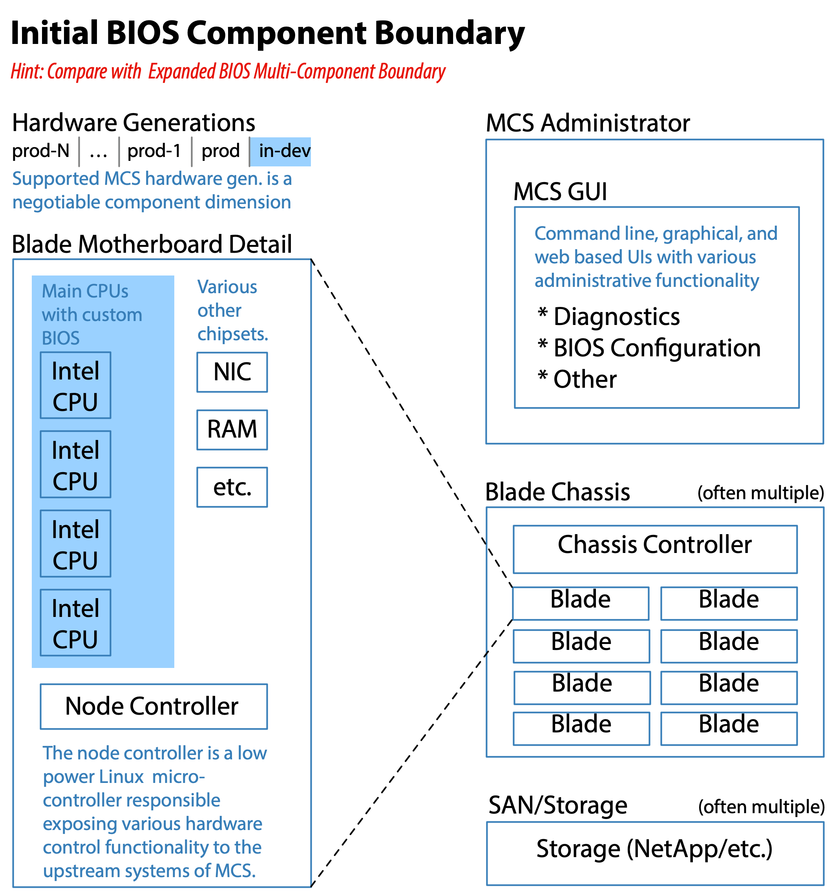
  <figcaption>Figure 8: The initial BIOS component boundary only included the custom BIOS. Even at this narrower scope, it still included hundreds of specialized code areas within the custom BIOS itself and millions of lines of C code. Few if any of the several dozen BIOS engineers initially knew more than one or two aspects of the BIOS code. 图8：初始BIOS组件边界仅包含定制的BIOS。即使在这个较窄的范围内，它仍然包含了数百个定制BIOS中的专用代码区域，以及数百万行C代码。几十位BIOS工程师中几乎没有人原本就知道BIOS代码的一个或两个以上的方面。</figcaption>
</figure>

<figure>
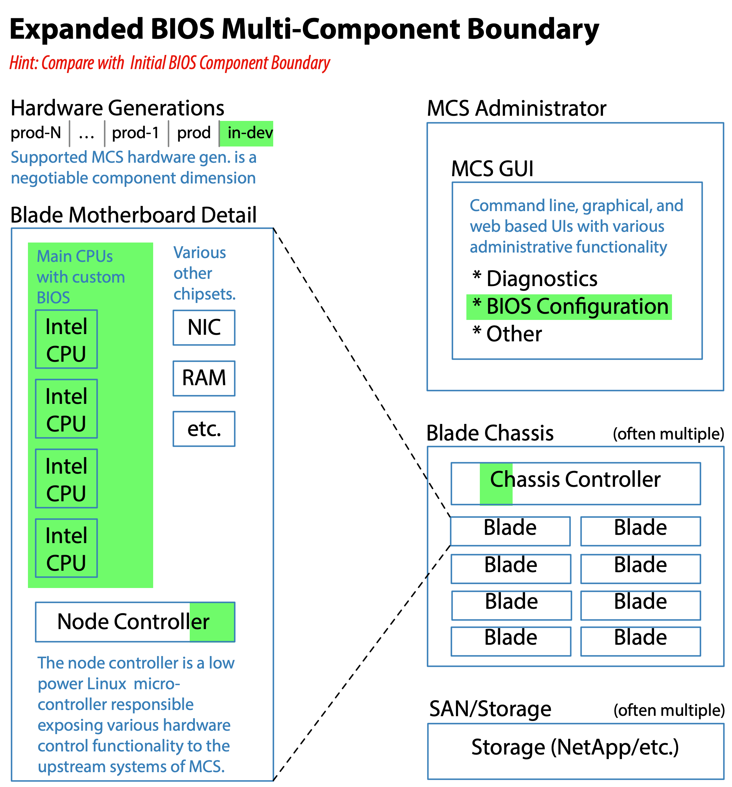
  <figcaption>Figure 9: The expanded BIOS multi-component boundary included everything along the BIOS configuration control path. It mapped to a natural product requirement area, and could be easily understood by a Product Owner from the Product Management group. Although never fully realized, efforts to move in this direction were made. 图9：扩展的BIOS多组件边界包含BIOS配置控制路径上的所有内容。它映射到一个自然的产品需求领域，很容易被产品管理组的产品负责人所理解。尽管它并没有完全实现，但我们是努力朝着这个方向前进的。</figcaption>
</figure>

<figure>
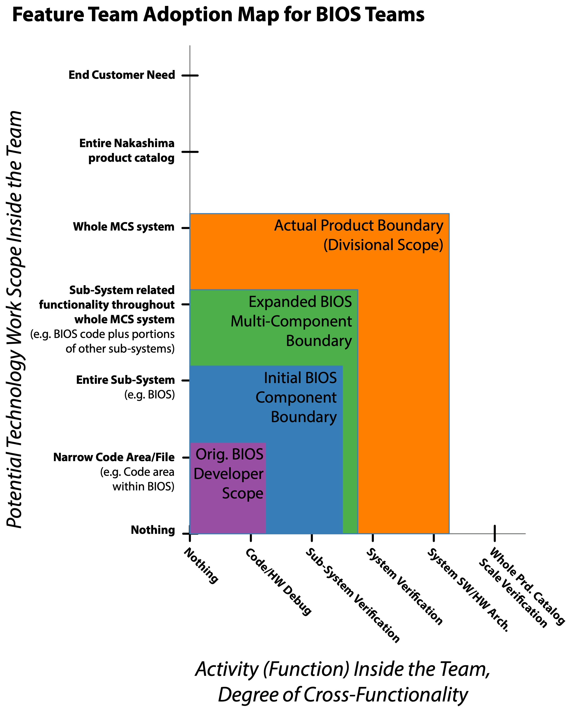
  <figcaption>Figure 10: The BIOS developers were originally more of a loose group of a few dozen individuals who each specialized in a narrow aspect of the BIOS customization. The BIOS system alone contained millions of lines of code in an extremely esoteric system domain. 图10：BIOS开发人员 最初是由几十个人组成的松散团队，每个人都专门从事BIOS定制的一个狭窄领域。BIOS系统里，仅仅在其一个只有内行人才懂的系统领域中，就包含了数百万行代码。</figcaption>
</figure>

## “In-Between” BIOS Teams “中间”BIOS团队 {#in-between-bios-teams}

It is a little challenging to select a good adjective for the newly formed BIOS teams.
为新组建的BIOS团队选择一个好的名称是有点困难的。

The newly formed BIOS teams were vastly more ***cross-functional*** than the legacy BIOS teams. Each team was responsible and capable of the authorship and end-to-end testing of any BIOS changes.
新组建的BIOS团队比传统的BIOS团队跨职能得多。每个团队都有责任和能力授权对BIOS进行创作，以及对任何改动的端到端测试。

The newly formed BIOS teams were also ***self-managing*** and ***co-located*** from the start. Though due to the layoffs and other organizational churn they were not as ***long-lived*** as Mitya and I intended.
新组建的BIOS团队也从一开始就进行自我管理，并在同一地点工作。尽管由于裁员和其他组织变动，这些团队并没有像我和米提亚所预期的那样长存。

The _Feature Team Adoption Maps_ guide in _Large-Scale Scrum_ provides several useful definitions for describing teams. Two are:
大规模Scrum中的“功能团队导入地图指南“为描述团队提供了几个有用的定义。其中两个是：

>**Extended component teams**—Any team that has a limited component work scope yet is responsible for checking that their part works within the larger product is an extended component team.
>
>**Feature teams**—Any team that has a whole-product focus and is involved from clarifying customer-centric features to testing them is a feature team. Feature teams also exist along a scale. They can be limited to just implementing the features stated they need. Or, when the product definition is broad enough, they can be involved with identifying and solving the customers’ real problems and thus co-creating the product on the whole system.
>
>**扩展组件团队**--任何团队，如果其组件工作范围有限，仍然负责检查其部件是否在较大产品中正常工作，那么它们就是扩展组件团队。
>
>**功能团队**--任何团队，如果它是以整个产品为中心，并且其负责的范围是包含从以客户为中心的功能澄清直到测试完成的团队，都是功能团队。功能团队也有一定规模。它们可以仅限于实现那些被需要的功能。或者，当产品定义足够广泛时，他们可以参与识别和解决客户的实际问题，从而在整个系统上共同创建产品。

The newly structured BIOS teams were capable of acting as _extended component teams_ from their formation. They had the capability and responsibility of performing end-to-end testing on any changes they made. The _testing_ extended from the MCS GUI (whose code they did not write), through the Chassis Controller (whose code they did not write), through the Node Controller (whose code they did not write), and finally ending in the BIOS code running on the Intel CPUs. In contrast, the _coding_ of the newly structured BIOS teams initially was only within the _Initial BIOS Component Boundary_ detailed in [Figure 8](#figure8). As you can see this aligns perfectly with the definition of an _extended component team_.
新组建的BIOS团队从其构成而言，是有能力作为临时扩展组件团队的。他们有能力和责任对所做的任何改动执行端到端测试。测试从MCS GUI（代码不是他们写的）扩展到Chassis Controller（代码也不是他们写的），再到Node Controller（同样，代码也不是他们写的），最后以英特尔CPU上运行的BIOS代码结束。相比之下，这些新组建的BIOS团队，他们的编写的代码码最初仅在图8中详细描述的初始BIOS组件边界内。如您所见，这与扩展组件团队的定义完全一致。

The newly structured BIOS teams failed to initially meet the definition of a _feature team_. To become _feature teams_ would require including all relevant code front-to-back. Although the BIOS teams never quite achieved this during my time with Nakashima's MCS division, they were making progress.
新组建的BIOS团队最初未能满足功能团队的定义。要成为功能团队，需要包含从前端到后端的所有相关代码。虽然在我任职中岛公司MCS部门期间，BIOS团队从未完全实现这一目标，但他们是取得了一些进展的。

In summary the newly structured BIOS teams:
总结一下，新组建的BIOS团队：

1. Started as _extended component teams_ which were _self-managing_ and _co-located_.
2. Aimed to become _component-expanded teams_ to cover more components along the communication path between the BIOS component and the MCS GUI component.
3. Planned to become _feature teams_ by expanding their responsibility to “everything” needed to deliver end-to-end features.

1. 是从自我管理和在同一地点工作的扩展组件团队开始的。
2. 旨在成为组件扩展团队，以使其范围涵盖BIOS组件和MCS GUI组件的通信路径上的更多组件。
3. 计划通过将其职责扩展到交付端到端功能所需的“一切”，从而成为功能团队。

## BIOS Organizational Context BIOS的组织背景 {#bios-organizational-context}

The BIOS LeSS-oriented adoption occurred during a period of active churn in the executive layers. When the BIOS adoption was started the VP in charge of all the Hardware development was very supportive, as were a variety of other VPs throughout the organization. This was sufficient to make the initial adoption efforts possible and successful in the short run. As both the SVP and VP level management changed we lost much of the support needed, even though our efforts were widely regarded as successful by most people involved. Ambivalence by a new SVP along with the loss of the supportive Hardware VP coupled with massive layoffs ultimately eroded our progress. The following series of organizational chart diagrams help to highlight the situation.
BIOS面向的 LeSS的导入发生在公司高管领导层的活跃变动期间。当开始BIOS导入时，负责所有硬件开发的VP非常支持，整个组织中的其他VP也是如此。这足以使初始的导入工作在短期内成为可能并取得成功。由于SVP和VP级别的管理层都发生了变化，我们失去了很多所需的支持，尽管大多数相关人员普遍认为我们的工作是成功的。由于新的SVP不一致的意见，以及支持我们的硬件VP的流失，再加上大规模裁员，最终侵蚀了我们的进度。下面一系列组织架构图，可以让我们明显地看到当时的情况。

<figure>
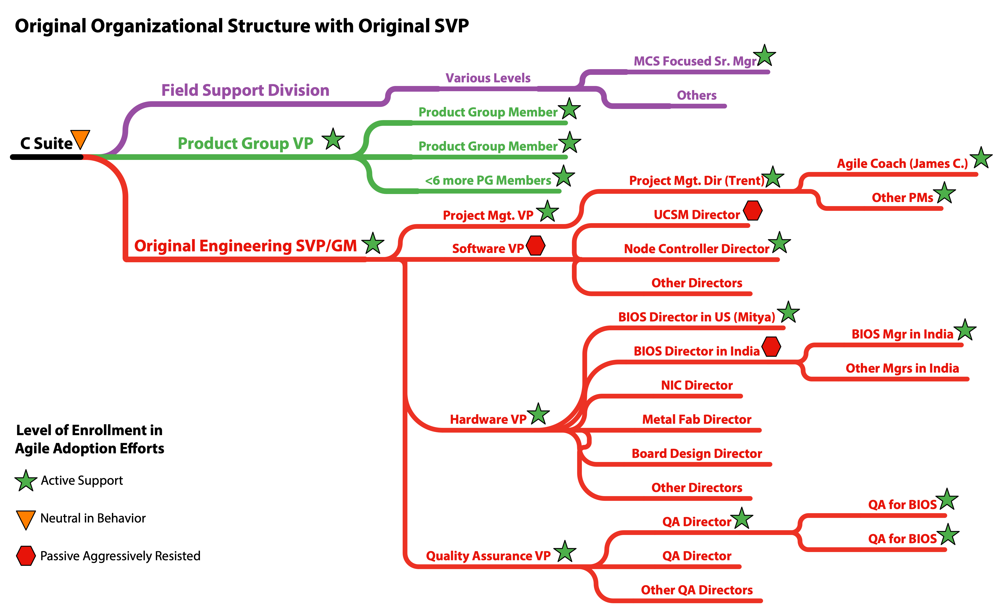
  <figcaption>Figure 11: The initial Sr. VP/GM of engineering for the MCS division was extremely supportive of the agile adoption efforts. I also found active support throughout much of the organization. A large number of directors, managers, and individual contributors provided active guidance as I attempted to better understand and help the organization. Unfortunately, this Sr. VP’s tenure was very short and there was a key VP responsible for the more pure software portions of the product who was passively aggressively opposed to any real change. 图11：MCS部门最初的工程SVP/GM对敏捷导入工作给予了极大的支持。我也在整个组织中得到了积极的支持。当我试图更好地理解和帮助这个组织时，许多董事、经理和个人贡献者都提供了积极的指导。不幸的是，这位SVP的任期很短，有一位关键的VP负责产品中更纯粹的软件部分，他消极且强烈地反对任何真正的变动。</figcaption>
</figure>

<figure>
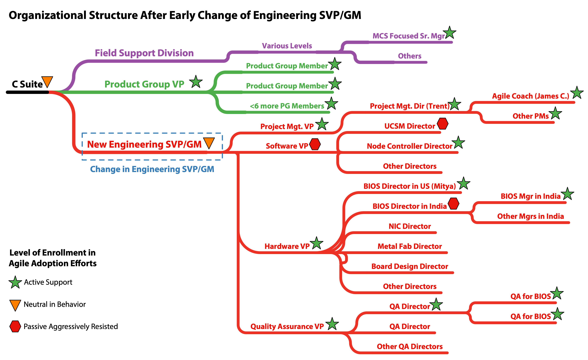
  <figcaption>Figure 12: The initial Sr. VP/GM of engineering of the MCS Division only had his role for a few months before I arrived. Within a couple months of my arrival he was replaced with another Sr. VP. In retrospect it is obvious the new Sr. VP’s direction from the C suite was to rationalize the size of the division. The new Sr. VP was almost completely unavailable to me and unwilling to actively engage in the agile transformation efforts. Although it generally happened outside of my view, I believe I continued to receive active support and air cover from the Project Management VP. Although there were some additional organizational changes over time once the new engineering SVP took over, none were very significant to the teams attempting an agile adoption until the Hardware VP left. 图12: 在我来之前，MCS部门原先的工程SVP/GM仅担任了几个月的职务。在我来后的几个月内，他被另一位SVP接替。回想起来，很明显，C套件的新SVP的方向是使部门规模合理化。新的SVP几乎完全不理我，也不愿意积极参与敏捷转型工作。虽然这通常发生在我的视野之外，但我相信我会继续得到项目管理VP的积极支持和隔空保护。尽管在新的工程SVP接管后，随着时间的推移，组织结构发生了一些额外的变化，这些变化对尝试敏捷导入的团队来说并没有太大影响，直到硬件VP离开。</figcaption>
</figure>

<figure>
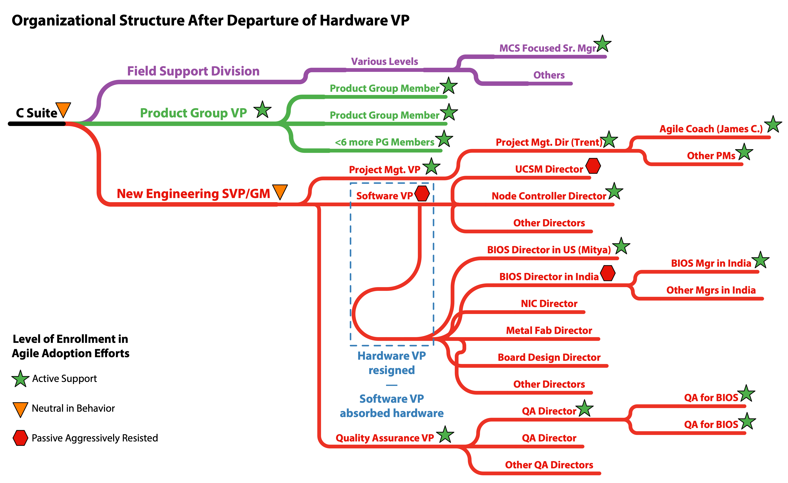
  <figcaption>Figure 13: Under the cloud of upcoming and active layoffs many people began to depart the organization voluntarily. Around the same time a new extremely well funded startup began to actively recruit some of the more skillful engineers and managers in the MCS division. One of these departures was the Hardware VP who the BIOS teams had reported through. The new engineering SVP chose not to backfill the Hardware VP but instead to have all those previously reporting up through the Hardware VP report through the Software VP. As the Software VP was always passively aggressively working against the agile adoption efforts this did not bode well. Over the course of a few months half the BIOS team members were laid off, my engagement ended, and Mitya followed the Hardware VP to the same well funded startup the Hardware VP had left for. A little over a year later, Trent also left Nakashima Incorporated. 图13：在即将到来的裁员的阴影下，许多人开始自愿离职。大约在同一时间，一家资金充裕的新创业公司开始积极招聘MCS部门中一些相对来说更熟练的工程师和经理。其中一位离职者就是BIOS团队所需要汇报的硬件VP。新的工程SVP选择不再需要新的硬件VP，而是让所有先前汇报给硬件VP的人员向软件VP汇报。由于软件VP总是消极地对抗敏捷导入工作，这并不是个好兆头。在几个月的时间里，一半的BIOS团队成员被解雇了，我的工作也结束了，米提亚跟随硬件VP去了那家资金充足的初创公司。一年多后，特伦特也离开了中岛公司。</figcaption>
</figure>

## BIOS Component Boundaries and Geography BIOS的组件边界和员工的地理位置 {#bios-component-boundaries-and-geography}

<figure>
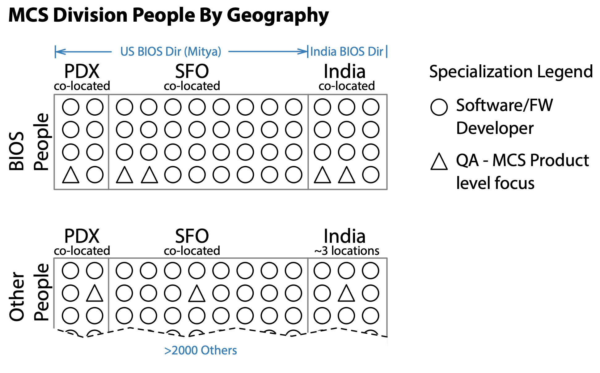
<figcaption>
Figure 14: The vast majority of the people within the MCS Division are co-located on one or two floors within a single building in their respective cities. We were careful to ensure BIOS team members were generally sitting within a few feet of their teammates. Workstations were generally friendly to swarming. Half the work occurred in lab space so many team members effectively had two working locations. With the exception of a handful of the testing specialists, everyone in the US reported through Mitya. Even the testing specialists were co-located, fully allocated to BIOS, and treated just like everyone else on the teams. There were one or two BIOS developers who were dispersed but these were the only exceptions.
  
Unfortunately, we didn’t manage to officially remove specialist manager roles as part of a matrix structure. Nevertheless, managers didn’t emphasize or hold onto specialism but supported people being multi-skilled.
图14：MCS部门内的绝大多数人都在其各自城市的一栋建筑内的同一层或两层内工作。我们小心翼翼地确保BIOS团队成员基本坐在离队友几英尺的地方。工作站也几乎都很方便移动。一半的工作发生在实验室，所以许多团队成员实际上有两个工作地点。除了少数测试专家外，所有在美国的人都汇报给米提亚。即使是测试专家也被安排在同一地点工作，完全分配给BIOS，并像对待团队中的其他人一样对待他们。有一两个BIOS的开发人员不在同一地点工作，但这是唯一的例外。
  
不幸的是，我们没有成功将专家经理的角色作为矩阵结构的一部分正式移除。尽管如此，经理们并没有强调或坚持保持人才专业化，而是为人才的多技能发展提供支持。
</figcaption>
</figure>

<figure>
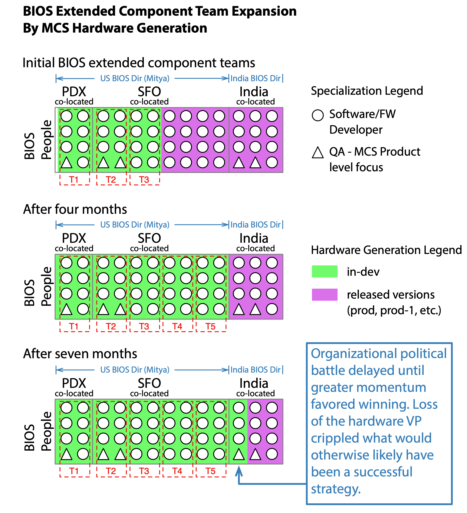
  <figcaption>Figure 15: MCS hardware generation was used as one of the component dimensions in defining the boundaries of the LeSS-oriented adoption within the BIOS component. With the supportive hardware VP and a few trips to India it is likely Mitya and I would have been able to successfully work out the politics. Unfortunately, the change in the VP layer coupled with the layoffs precluded this strategy. The information in the timeline and organizational structure diagrams is relevant to what you see in this diagram. 图15: 在面向LeSS的导入过程中，MCS硬件的更新换代被用作定义边界的组件维度之一。有了硬件VP的支持，再加上几次印度之行，我和米蒂亚很可能能够成功地解决政治问题。不幸的是，VP层的变化加上裁员，使得这一战略无法实施。您可以在该图中看到，随着时间线的移动，组织架构图也相应变化的信息。</figcaption>
</figure>

Due to historical reasons the reality was that each new generation of hardware had an entirely separate BIOS code base with very little factoring of common functionality into reusable sub-components.
由于历史原因，现实是每一代新硬件都有一个完全独立的BIOS代码库，几乎没有将通用功能提取成可重用的子组件。

Interestingly this provided an opportunity to grow BIOS teams at a more sustainable pace. As previously uninvolved BIOS developers would finish working on escaped defects related to earlier production hardware generations, we would form additional cross-functional teams within the LeSS-oriented structure. The dynamics of the BIOS code base and the relationship with AMI will be explained in more detail further down.
有趣的是，这提供了一个以更可持续的速度去发展BIOS团队的机会。由于先前未参与BIOS开发的人员即将完成前几代产品硬件缺陷修复工作，因此我们可以在面向LeSS的架构中，组建额外的跨功能团队。BIOS代码库的动态以及其与AMI的关系将在下面更详细地解释。

This provided a half-year reprieve to establish cross-functional BIOS teams with US based people who reported through Mitya before needing to more actively involve the BIOS developers and managers in India. By the time the India BIOS engineers began to work on the same BIOS code base as the US based BIOS engineers, the US based BIOS engineers had jelled enough to push back when the India-based BIOS engineers not yet on a cross-functional BIOS team failed to meet the same improved quality standards.
在需要更积极地影响印度的BIOS开发人员和管理人员之前， 这为那些在美国向米提亚汇报的人员建立跨职能BIOS团队的提供了半年缓期。当印度BIOS工程师开始使用与美国BIOS工程师相同的BIOS代码库时，由于印度BIOS工程师尚未真正成为一个跨功能BIOS团队而导致达不到相同的质量标准时，美国BIOS工程师这时已经团结起来进行抵制。

Initial struggles were often as simple as ensuring India-based BIOS engineers were being careful not to check-in code unless it built cleanly and passed basic smoke tests. Additional automated testing along with a private CI server within the cross-functional BIOS teams’ direct control helped the U.S.-based teams detect when problems were introduced by a developer not following the improved quality standards.
最初的挣扎通常很简单，比如确保印度的BIOS工程师小心翼翼地，不签入那些构建不干净的代码，并通过了基本的冒烟测试。在跨职能BIOS团队的直接控制下，额外的自动测试以及一个私有CI服务器成功地帮助美国团队检测到问题是由某个不遵循已经改进的质量标准的开发人员引入的。

The success of the cross-functional BIOS teams ensured Mitya and I were in a much stronger political position to begin resolving the underlying structural issues. Mitya was delivering Nakashima-wide presentations on the improvements within the cross-functional BIOS teams at the behest of the Project Management SVP; so our success was definitely getting noticed.
跨职能BIOS团队的成功确保了米提亚和我在开始解决潜在的结构性问题方面处于更强大的政治地位。米提亚应项目管理SVP的要求，在全中岛公司就跨职能BIOS团队内的改进进行了演讲；我们的成功显然引起了注意。

The obvious solution for the India-based BIOS people was to on-board them as one or two additional cross-functional BIOS teams. Ideally all of these structural problems would have been solved from the very beginning, yet that had not been politically viable when we started. Instead, we did what was achievable. We intentionally creatively isolated and delayed the problem, while setting ourselves up for a future political win. We not only anticipated friction from two separate operating models, we were counting on it to make meaningful structural change politically achievable in the future.
对于印度的BIOS人员来说，显而易见的解决方案是将他们作为一个或两个额外的跨功能BIOS团队加入。理想情况下，所有这些结构性问题都会从一开始就得到解决，然而，当我们开始时，这在政治上并不可行。相反，我们做了一些可以实现的事情。我们有意创造性地孤立和拖延这个问题，同时为未来的政治胜利做好准备。我们不仅预计到了两种不同运营模式之间的摩擦，我们还指望它能在未来实现有意义的结构变革。

Mitya and I were getting ready to travel to India and otherwise starting to work through the politics, about the time the supportive hardware VP resigned and the layoffs were announced. Had the hardware VP remained in place I think we would have been able to resolve the more pressing political challenges within the BIOS component boundary. We already had an India-based BIOS manager on our side, but we needed to work through some issues in the director layer.
米提亚和我当时已经准备好了前往印度，否则就要从政治入手了，大约在支持性硬件VP辞职并宣布裁员的时候。如果硬件VP仍然在位，我认为我们将能够解决BIOS组件边界内更有压力的政治挑战。我们已经有了一个基于印度的BIOS管理者站在我们这边，但我们还需要解决董事层的一些问题。

### Separate Codebases Not Good 单独的代码库不好 {#separate-codebases-not-good}

Each new generation of hardware having an entirely separate BIOS code base was not a good thing. We used that fact to our advantage, yet it was far from desirable.
每一代新硬件都有一个完全独立的BIOS代码库，这不是一件好事。我们利用这一事实为自己创造了优势，但这远不是理想的。

There was entirely too much copy-paste reuse, inadequate automated test coverage to enable developers to confidently make backward compatible changes, and a failure to use the AMI plugin layer to isolate any MCS related changes from AMI codebase changes.
有太多的复制粘贴重用，自动化测试覆盖率不足，无法让开发人员自信地进行向后兼容的更改，以及未能使用AMI插件层将任何与MCS相关的更改与AMI代码库更改隔离开来。

This self-inflicted overburden made it far more difficult to adapt to changes in the Intel CPUs than would otherwise have been the case. Ironically, the _ability to adapt to changes_ in Intel CPUs faster than Intel’s release cycle is extremely critical to the MCS division’s continuity of revenue and market share.
这种自我造成的过重负担使其更难适应英特尔CPU的变化。具有讽刺意味的是，比英特尔发布周期更快地适应英特尔CPU变化的能力对MCS部门的收入和市场份额的持续性至关重要。

An effort to begin to resolve these issues can be seen in the _BIOS Definition of Done_ section discussed later.
开始解决这些问题的努力可以在稍后讨论的“完成的BIOS定义”部分中看到。

## BIOS Geographically Dispersed Teams BIOS地理位置分散的团队 {#bios-geographically-dispersed-teams}

From a perspective of optimizing for highest level adaptiveness in the service of learning and delivering highest-level value at a global level, there should never have been as many engineers working on the product as there were. The same could be said regarding the engineers being spread across multiple locations and timezones. Yet, that is where things started from, and trying to convince the organization otherwise from the beginning would not have been successful.
如果要优化“学习服务中最高级别的适应性，以及在全球范围内，交付最高级别的价值”，从这个角度来看，不应该有那么多的工程师在一个产品上工作。对于分布在多个地点和时区的工程师来说，情况也是如此。然而，这正是我们试图说服组织开始的地方，否则从一开始就不会成功。

The criticality of being prepared for the Intel release date, coupled with the massive amount of copy-paste reuse in the legacy code base made for a challenging situation. Without the combined efforts of most of the US based BIOS team members there would not be enough combined knowledge to make the required changes in time, and to do so while concurrently addressing the poor engineering practices which caused the situation. In contrast, adding yet another region in a hugely different timezone just slowed things down.
为英特尔发布日期做好准备的关键性，再加上遗留代码库中大量使用了复制粘贴，使得这一局面充满挑战。如果没有大多数美国BIOS团队成员的共同努力，就不会有足够的综合知识及时做出所需要的更改，同时包括解决导致这种情况的不良工程实践。相比之下，在一个完全不同的时区添加另一个地区只会降低速度。

A few different quotes from the LeSS books help highlight this point:
LeSS书中的一些不同的引用有助于突显这一点：

>Start with a small group of great people, and only grow when it really starts to hurt.” That rarely happens. &mdash; **_Scaling Lean & Agile Development_**
>
>Rather than debate if so many people are needed, we try to support people to improve their development with agile and lean principles so that at some point it becomes clear to the group that they have too many people in too many places. &mdash; **_Practices for Scaling Lean & Agile Development_**
>
>“从一小群很棒的人开始，并且，只有他们在真正开始受伤时才会成长。”这种情况很少发生。-大规模精益和敏捷开发
>
>与其要争论是否需要这么多人，我们试图支持人们以敏捷和精益的原则来提升他们的开发水平，以便在某一节点上，团队就可以清楚地看到，他们在太多的地方有太多的人。-大规模精益和敏捷开发的实践

## Quality Assurance Group Very Poorly Named 质量保证小组-一个很糟糕的名称 {#quality-assurance-group-very-poorly-named}

It is important to realize that quality can not be bolted on after the fact. Why? Product quality is the outcome of the entire product development system as a whole, not the responsibility of a separate quality control group. Although the formal title of the testing group was “Quality Assurance”, a more accurate title would be “Quality Control”.
一个重要的认识是，质量问题是不能在事后被保证的。为什么？产品质量是整个产品开发系统的结果，而不是单独的质量控制小组的能负责的。虽然测试组的正式名称是“质量保证”，但更准确的名称是“质量控制”。

A proper usage of quality assurance would refer to activities such as establishing test-first or test-driven development, establishing effective code review practices, putting static code analysis tooling in place, establishing continuous integration behaviors, and establishing pairing or swarming behaviors. Notice none of these practices have anything to do with trying to bolt on quality once the software development has been deemed “code-complete”, or other nonsense.
正确使用质量保证指的应该指向建立测试优先或测试驱动开发、建立有效的代码评审实践、将静态代码分析工具放置到位、建立持续集成的行为，以及建立结对或群集编程等活动。请注意，一旦软件开发被视为“代码完成”，再企图采用这些行为保证质量，那便成为无稽之谈，再也没有意义。

The Quality Assurance group was indeed very poorly named. Even the very naming implies a broken mental model of how to best develop high-quality products. Yet, for the sake of historical accuracy I will continue to refer to the organizational branch which contained all the testers within the legacy structure as the QA group. Please remember this distinction when reading this document.
质量保证小组的名称实在很糟糕。甚至连命名本身都暗示着“如何最好地开发高质量产品“的思维模型已经支离破碎。然而，为了历史的准确性，我将继续将包含遗留结构中所有测试人员的组织分支称为QA组。阅读本文件时请记住这一区别。

## BIOS Testers Brought End-to-End Knowledge BIOS测试人员带来端到端的知识 {#bios-testers-brought-end-to-end-knowledge}

The breadth and complexity of MCS coupled with a history of over-specialization, meant very few people understood the end-to-end product as well as the testers who had previously spent most of their time doing end-to-end testing in the legacy structure. Consequently, the testers brought just as much value to their respective BIOS teams as the traditional BIOS firmware developers.
MCS的广度和复杂性，再加上有史以来过度的专业化，意味着很少有人了解端到端产品，也很少有测试人员以前在传统结构中花费大部分时间进行端到端测试。因此，测试人员为他们各自的BIOS团队带来的价值与传统的BIOS固件开发人员没有什么区别。

The BIOS team members from a testing background still formally reported up through the Quality Assurance VP. Her support and that of the relevant QA Director was critical in enabling de facto equality within the BIOS teams. Retaining this formal reporting relationship was useful in obtaining the organizational acceptance of the radically improved quality being produced by the BIOS LeSS-oriented teams.
BIOS团队里的有测试背景的成员仍然通过质量保证VP做正式汇报。她的支持和相关QA主管的支持对于在BIOS团队中实现事实上的平等至关重要。保持这种正式的汇报关系有助于获得组织对BIOS面向LeSS的团队所生产的质量得到根本改善的认可。

Retaining a separate reporting structure for the testers  introduced a degree of systemic organizational fragility. A change in the Quality Assurance VP role could easily unravel much of the positive change that was happening. As a long-term goal, eliminating any formal testing specific distinction in the organizational structure would help avoid the risk of team members with a testing background being distracted by work unrelated to their team's Sprint Backlog.
为测试人员保留单独的报告结构会带来一定程度的系统性组织脆弱性。质量保证VP角色的改变很容易瓦解正在发生的许多积极变化。作为一个长期目标，在组织架构中消除任何正式的测试特殊区分将有助于避免具有测试背景的团队成员被其它与其团队的Sprint Backlog不相干的工作转移注意力的风险。

Chapter 3 in _Practices for Scaling Lean & Agile Development_ provides a comprehensive treatment of how to best approach testing at both a practical and strategic level.
《大规模精益和敏捷开发实践》中的第3章全面介绍了在实践和战略的层面，如何最好地实现测试。

## Expanded BIOS Multi-Component Goals and Constraints 扩展的BIOS多组件目标和限制 {#expanded-bios-multi-component-goals-and-constraints}

Although never formally documented outside of emails, whiteboard scribbles, and verbal conversations the goals of the BIOS LeSS adoption included:
尽管在电子邮件、白板涂鸦和口头对话之外从未正式记录，但BIOS LeSS导入的目标包括：

* Improve the ability to adapt the MCS BIOS to any future changes in the MCS hardware, especially the routine periodic updates to the Intel chipsets.
* Create a culture which values technical excellence and avoids the unproductive stress created by the _Contract Game_.
* 提高MCS BIOS适应MCS硬件未来任何变化的能力，尤其是对Intel芯片组提供例行定期更新。
* 创造一种重视技术卓越的文化，避免由“合同游戏”带来的非生产性压力。

BIOS support for the latest Intel chipset would seldom if ever be an important point of differentiation between the MCS product and that of its competitors, yet lack of parity during an Intel release event would drastically reduce market share and revenue overnight. This fact was well understood throughout the division’s management. Consequently the following constraint was critical:
BIOS对最新Intel芯片组的支持, 很少情况下会成为MCS产品与其竞争对手之间的重要区别点，但在Intel发布活动期间缺乏对等性可能会使我们在一夜之间大幅降低市场份额和收入。整个部门的管理层都很清楚这一事实。因此，以下约束条件至关重要：

* The BIOS agile adoption efforts could never be allowed to be the reason the MCS product could not support a production version of an Intel CPU.
* BIOS敏捷导入的工作永远不能成为MCS产品无法支持英特尔CPU生产版本的原因。

Consequently, although the BIOS adaptability goal was not at the forefront of senior management’s mind to the extent it was in Mitya’s, the importance of the goal was still implicitly well understood and valued.
因此，尽管BIOS的适应性目标在高级管理层心目中并地位并不如在Mitya心目中的那样，但该目标的重要性仍然得到了充分理解和重视。

Despite this shared understanding, the extent of the dysfunction with the traditional legacy waterfall approach was not widely accepted. The _Contract Game_, poor engineering practices, and over-specialization were observable throughout the division.
尽管有这样的共识，但传统瀑布式开发仍然广泛存在。整个部门都仍可以看到合同游戏、糟糕的工程实践，以及过度专的业化。

If you reflect on the goals above, you will find they resonate very strongly with both the LeSS perfection vision found in the _Organizational Perfection Vision_ guide mentioned in _Large-Scale Scrum: More with LeSS._ You will also find they resonate strongly with the two questions in that guide for discerning a real system improvement from a local optimization.
如果你反思上述目标，你会发现它们与《大规模Scrum:MorewithLeSS》里提及的“组织完美愿景指南”中的LeSS完美愿景非常相似。您还可以发现，它们与该指南中的两个关于“从局部优化中识别真实的系统改进“的问题也有很强的联系。

Objectives within the BIOS group which supported the above goals included:
BIOS组中用于支持上述目标的Objectives包括：

* Establish a single BIOS-component backlog, to make the highest-value BIOS work more visible. Baby steps towards a single product-level backlog. 
* Expand the knowledge and skills of each engineer to encompass a broader portion of the product, thereby improving the adaptiveness of each team and the overall ability to switch to and then focus on newly-discovered  highest-value work.
* Increased “whole product focus” (a LeSS principle)  by each BIOS team while transitioning towards an expanded BIOS multi-component boundary spanning a greater portion of MCS.
* Work to improve the craftsmanship practices around the MCS BIOS component.
* Avoid the Contract Game as much as possible.
* 
* 建立单个BIOS组件的backlog，以使最高价值的BIOS工作变得更加可视化。慢慢地朝着一个单独产品级别的backlog迈进。
* 扩展每个工程师的知识和技能，以涵盖产品的更广泛部分，从而提高每个团队的适应能力，以及可以切换到并专注于新发现的最高价值工作的整体能力。
* 每个BIOS团队增强了“整个产品聚焦”（一个LeSS原则）的理念，同时向扩展的BIOS多组件边界的过渡，该边界跨越了MCS的大部分。
* 致力于改进MCS BIOS组件的craftsmanship实践。
* 尽可能避免合同游戏。

## BIOS Adoption Story in Diagrams Alone 图表中看到的BIOS导入的故事 {#bios-adoption-story-in-diagrams-alone}

Taken together the timeline diagram, the component boundary diagrams, the feature adoption maps, organizational chart, and feature team expansion by hardware generation diagrams along with every diagram’s respective caption provide a rather clear view of the overall story arch once you gain enough context to understand them.
当您有足够的上下文来理解就可以发现，时间线图、组件边界图、功能导入图、组织图和功能团队根据硬件更新换代而扩展的图解，以及每个图的相关说明，它们一起提供了一个相当清晰的整体故事架构视角。

## BIOS Engineering and Cultural Challenges BIOS的工程和文化挑战 {#bios-engineering-and-cultural-challenges}

Hopefully you now have a decent high level understanding of the role the customized BIOS system plays within MCS. While attempting to avoid going too deep into the details, I will try and summarize a few of the engineering and cultural challenges faced by the BIOS teams. Feel free to skip ahead if this is more detail than you care to bother with.
希望你现在对定制BIOS系统在MCS中所起的作用有了相当程度的理解。在试图避免过于深入细节的同时，我将尝试总结BIOS团队面临的一些工程和文化方面的挑战。如果这对于你来说过于详细，请随意跳过。

### AMI provided foundation of BIOS code AMI提供了BIOS代码的基础 {#ami-provided-foundation-of-bios-code}

The custom BIOS for MCS compute nodes had been created by modifying a constantly updated codebase licensed from AMI. Typical events driving AMI to make a continual stream of BIOS codebase changes include:
MCS计算节点所定制的BIOS是通过修改一个AMI许可的持续更新的代码库创建的。驱动AMI进行持续BIOS代码库更新的典型事件包括：

* Intel changes an aspect of the hardware to firmware interface in their prototype chipsets or reference board designs
* AMI adds support for this or that new BIOS functionality enabled by some improved features of the prototype Intel chipset or reference board designs
* AMI fixes a bug that AMI or one of the license partners identified
* AMI decides to change the BIOS codebase for any reason they believe makes sense
* 
* Intel在其原型芯片组或参考板设计中改变了一个从硬件到固件接口的方面
* AMI增加了对Intel芯片组原型或参考板设计的一些改进功能所启用的新BIOS功能的支持
* AMI修复了一个它的或者它的一个许可证合作伙伴发现的错误
* AMI决定基于他们认为合理的任何原因更改BIOS代码库

With largely stable interfaces between the MCS BIOS customizations and the AMI codebase, the impact of these normal AMI updates would be minimized. Alas that was seldom the case. Although some formal plug-ability existed with the AMI codebase, most of Nakashima's BIOS customizations had historically been made deep in the AMI codebase.
如果能让MCS BIOS定制和AMI代码库之间的接口非常稳定，那么由这些常态化的AMI更新造成的影响就可以达到最小化。可惜这种情况很少发生。尽管AMI代码库中存在一些正式的插件功能，但中岛公司的大多数BIOS定制在历史上都是在AMI代码库内进行的。

With each new chipset the MCS BIOS engineers would attempt to _copy_ functionality from customizations used to adapt older BIOS versions to older chipsets into code for the new prototype chipsets. Similarly, the MCS BIOS engineers would attempt to keep current with any AMI code changes, merge those into their active working branch, and then manually retest. Some of the testing required hands-on work in the lab, although far more of the testing could have been automated than historically had been.
对于每一个新芯片组，MCS BIOS工程师都会尝试将旧BIOS版本适应旧芯片组的定制功能复制到新的原型芯片组的代码中。同样，MCS BIOS工程师会尝试保持任何AMI代码更改的最新状态，将这些更改合并到他们的活动工作分支中，然后手动重新测试。有些测试需要在实验室里亲自动手，尽管有很多测试的自动化程度可能已经远超于以往。

### Death March Culture Driven by Intel Releases 由英特尔发布主导的死亡行军文化 {#death-march-culture-driven-by-intel-releases}

The cadence of the market is dominated by Intel chipset release dates. Hardware integrators are given early access to prototype chipsets and reference board architectures. Ability to co-ship with Intel release dates is critical to staying viable within the market.
市场的节奏主要取决于英特尔芯片组的发布日期。硬件集成商可以尽早获得原型芯片组和参考板架构。能够与英特尔发布日期合作对于在市场上保持竞争力至关重要。

The intelligent organizational design decision would be to optimize for responsiveness to changes in Intel specifications. Unfortunately, the legacy organizational response had been to throw huge numbers of people at the problem and then death march towards a release date. Quality had inevitably been perpetually sacrificed on the altar of an impending release date.
明智的组织设计决策是通过优化来加强对英特尔规格变化的响应能力。可不幸的是，传统的组织反应则是将大量的人投入到这个问题上，然后死死亡行军奔赴向发布日期。在即将到来的发行日期面前，质量不可避免永远地被牺牲了。

### Loss of Nakashima MCS Tribal Knowledge 失去的中岛公司的MCS部落知识 {#loss-of-nakashima-mcs-tribal-knowledge}

Many of the people who initially built the constituent parts of Nakashima's MCS system left Nakashima over the years. As these people left, their tribal knowledge walked out the door with them. Ideally there would be extensive automated tests at all levels of the test pyramid and well crafted readable code. At a minimum there would at least be some useful documentation detailing the overall system architecture. As you would expect of any complex product developed under the delivery pressures of a waterfall culture, very little of any of this existed.
多年来，许多最初建MCS系统组成部分的人离开了中岛公司。当这些人离开时，他们的部落知识也随之失去了。理想情况下，在测试金字塔的所有级别都应该有广泛的自动化测试和精心制作的可读代码，或者至少会有一些有用的文档详细说明整个系统架构。但是正如您所料，在瀑布文化的交付压力下开发的任何复杂产品，这些几乎都没有。

### Intel BIOS is highly specialized Intel BIOS的高度专业化 {#intel-bios-is-highly-specialized}

AMI estimates there are only somewhere on the order of a couple thousand engineers around the world who are familiar with BIOS customization. Many of the x86 hardware firmware interface behaviors and defacto specifications require tribal knowledge dating back to the early years of the PC revolution.
AMI估计全世界只有几千名熟悉BIOS定制的工程师。许多x86硬件固件接口的行为和实际规范需要追溯到PC革命早期的部落知识。

In practice, each area of customization in the MCS BIOS is the result of one or two engineers digging deep into the AMI code base and reverse engineering what they find there. In some ways this is no different than what any professional software engineer spends their day doing, the difference is just how esoteric and frequent this is within BIOS development.
实际上，MCS BIOS中的每个定制领域都是一两个工程师深入挖掘AMI代码库并对其进行逆向工程的结果。在某个角度上来看，这与任何专业软件工程师花一天的时间做的事情其实是一样的，不同的只是BIOS开发中有多深奥和频繁。

### Large number of engineers over three geographies 三个地区的大量工程师 {#large-number-of-engineers-over-three-geographies}

There was enough work to keep around forty engineers busy. With better craftsmanship practices it is likely far less people would eventually be needed. That said, it was going to take a tremendous amount of work and alignment just to dig out of all the self-inflicted technical problems.
原本有足够的工作让大约40名工程师忙碌。随着更好的工艺实践，最终需要的人可能会远远比这少。也就是说，原本的巨大的工作量和相互对齐，只是用来解决所有自己造成的技术问题。

Due to historical reasons, there were BIOS focused software, hardware, and test engineers spread across greater Portland, San Francisco, and Bengaluru. Any plan to scale the teams would have to solve the distributed problem. Fortunately, we were somewhat able to self-organize into co-located teams. Furthermore, the work being done by Bengaluru was somewhat independent of the efforts in Portland and San Francisco.
由于历史原因，有以BIOS为中心的软件、硬件和测试工程师遍布波特兰、旧金山和班加罗尔。任何扩大团队规模的计划都必须解决这个地理分布的问题。幸运的是，我们在某种程度上能够自行组织成同一地点的团队。此外，在班加罗鲁所做的工作在某种程度上独立于波特兰和旧金山的工作。

### Largely Innate Technical Challenges 巨大的先天技术挑战 {#largely-innate-technical-challenges}

Although many of the challenges the MCS BIOS teams faced had been self-inflicted, some were largely inherent to the work itself. These included:
尽管MCS BIOS团队面临的许多挑战都是自己造成的，但有些挑战很大程度上是工作本身固有的。其中包括：

* Hardware updates to the prototype chipsets and boards would arrive periodically. The typical lead time for fabricating a new board design was around six weeks. One could argue some of this was less about the physics and more about organizational impediments.
* 原型芯片组和电路板的硬件更新会定期到达。制造新电路板设计的典型时长约为六周。有人可能会说，其中一些问题与其说是物理问题，不如说是组织障碍。
* Prototype chipsets were just as likely to be responsible for problems as the firmware. Consequently, significant aspects of testing and troubleshooting required hands-on work in the lab.
* 原型芯片组就像固件一样很可能是问题所在。因此，重要的测试和故障排除n需要在实验室进行实际操作。
* The x86 BIOS toolchain is extremely old and crufty as there was insufficient economic incentive for AMI to make significant investments improving the tooling.
* x86 BIOS工具链非常陈旧，因为AMI没有足够的经济激励来进行重大投资以改进工具。
* Software engineering practices such as automated unit testing are generally lacking within the entire world-wide x86 BIOS development culture. This cultural history was clearly observable within the AMI codebase, which the MCS BIOS teams customized. This created the following complications:
* 在整个全球x86 BIOS开发文化中，自动化单元测试等软件工程实践基本都是缺乏的。我们可以在MCS BIOS团队定制的AMI代码库中清楚地观察到这种文化历史。这导致了以下并发症：
    + Any unit test tooling had to be entirely hand-rolled.
    + Wedging an effective dependency inversion mechanism into the AMI BIOS code base was much harder than it would have been in your typical Java or C# framework.
    + No books, articles, forum posts, example code, or other resources were available to provide unit test guidance in a BIOS context.
    + The concept of automated unit testing, yet alone test-first or TDD practices, was completely foreign to the MCS BIOS engineers.
    + 任何单元测试工具都必须完全人工测试。
    + 将有效的依赖性反转机制嵌入AMI BIOS代码库比在典型的Java或C#框架中要困难得多。
    + 没有书籍、文章、论坛帖子、示例代码或其他资源可用于在BIOS环境中提供单元测试指导。
    + 对于MCS BIOS工程师来说，自动化单元测试的概念是完全陌生的，更不用说的测试先行或TDD实践了。
* Everything in the world of low-level firmware development is more tedious than is typical of your average software development effort. A few examples relevant to the MCS BIOS include:
* 低级固件开发领域的一切都比一般软件开发工作更加乏味。与MCS BIOS相关的几个例子包括：
    + No operating system services exist because there is no operating system.
    + Code must be cross-compiled and then flashed to the target.
    + No TCP/IP network stack exists in early stages of the BIOS boot process, which makes it particularly difficult to communicate with the target early on. Early communication with the target device was limited to serial port communications and similar constrained mechanisms.
    + Most firmware development engineers tend to be people with greater microelectronics engineering expertise than software engineering expertise.
    + 不存在操作系统服务，因为没有操作系统。
    + 代码必须经过交叉编译，然后闪存到目标。
    + 在BIOS重启流程里，不存在TCP/IP网络堆栈，这使得早期与目标设备通信特别困难。与目标设备的早期通信仅限于串行端口通信和类似的受限机制。
    + 大多数固件开发工程师倾向于拥有比软件工程专业知识更丰富的微电子工程专业知识。

None of the problems listed here are insurmountable. In many cases techniques from other domains such as large web application development already provide insight into how to solve many of these problems.
这里列出的问题没有一个是无法克服的。在许多情况下，来自其他领域的技术（如大型web应用程序开发）已经提供了如何解决这些问题的方向。

For example, Java and C# both have sophisticated dependency injection frameworks available off-the-shelf. _Test Driven Development for Embedded C_ by James Grenning is one example of an attempt to help improve cross-pollination of these techniques.
例如，Java和C#都有现成的复杂依赖注入框架。詹姆斯·格伦宁（James Grenning）的嵌入式C测试驱动开发（Test-Driven Development for Embedded C）就是一个偿试帮助改进这些技术进行交叉磨合运用的例子。

# BIOS Adoption Efforts BIOS导入工作 {#bios-adoption-efforts}

Mitya Dubinksy and I realized the daunting scope of our endeavor. The steps we used to stand-up, launch, and mature the BIOS feature teams were largely the same as I had done with the diagnostics team. The main differences were in the level of difficulty and scale of the challenges involved.
米提亚杜宾斯基和我意识到我们的努力有个令人生畏的范围。我们用来建立、启动和帮助BIOS功能团队变得成熟的步骤与我在诊断团队中所做的基本相同。主要差异在于所涉挑战的难度和规模。

The major differences mostly revolved around the rather straightforward scaling aspects.
主要的差异主要集中在相当直接的规模方面。

## BIOS Launch Steps {#bios-launch-steps}

Mitya and I decided to initially focus on the engineers in San Francisco and Portland first. San Francisco and Portland were mostly focused on bringing up a new Intel chipset and board design. The engineers in Bengaluru were predominantly focused on fixing problems dealing with support for a chipset which was already in production.

I worked with Mitya to arrange training venues and to schedule Scrum training for every MCS BIOS engineer in San Francisco and Portland. We made sure to include a few closely collaborating test engineers from another group, and a few other relevant parties. If I remember correctly, this resulted in two training sessions in San Francisco and one in Portland over the course of three weeks. Mitya attended each training session in San Francisco. Mitya did not attend the Portland training, but Krishna Mishra was there providing support. Mitya did fly with me to Portland during the subsequent launch steps less than a week later.

The launch efforts were split across San Francisco and Portland. The initial two days of launch activity were conducted on a Thursday and Friday in San Francisco with the Portland BIOS team members conferenced in. The following week Mitya and I met up in Portland and continued the launch efforts with the Portland team members. This provided the Portland team members a better chance to influence, adjust, and ratify the work of the previous week. During the Portland launch efforts we frequently conferenced-in the San Francisco team members.

During the launch activity I wrote out a list of everything we needed to achieve, making sure everyone understood the intent of each item. I then largely took a back seat allowing the group to drive as much as possible, only stepping in when required. The list included things like creating an initial BIOS component backlog, figuring out a common Definition of Done, determining individual team boundaries, and working out event scheduling.

## BIOS Component Backlog {#bios-component-backlog}

The most interesting part of the launch effort revolved around the creation of the component backlog. The knowledge of what was needed to bring up the next Intel chipset was very broadly dispersed across the entire team. No one team member had a good understanding of the whole. The solution involved a couple days of brainstorming, followed by detailed refinement of individual PBIs in small working groups, and finally an incremental story mapping effort.

### Initial Component Backlog Brainstorming {#initial-component-backlog-brainstorming}

The structure of the initial BIOS component backlog brainstorming was fairly standard, the difference was the level of useful detail and alignment achieved and the amount of time required to do it well.

In this case the BIOS engineers were doing something they had collectively done many times before. As long as they collectively worked to pull the necessary knowledge out of each other's head, they were capable of creating a massive and detailed list of almost everything required. In retrospect I believe poor software practices such as copy-paste reuse and a reliance on manual testing meant the BIOS engineers had mostly been _re-tracing the same steps_ with every new Intel chipset.

We would collaboratively write everything we could think of on post-it notes and place them onto the windows of a large corner conference room we had reserved. Mitya or another team member would then lead the group through each post-it. We gathered the post-it notes into sensible emergent groupings while concurrently consolidating duplicates. As the group discussed each post-it to gain consensus the participants would generate new post-its on the fly as it made sense. We would then spend a bit more time in small work groups generating new post-its before returning to a discussion session in which we consolidated everything again. This took us most of the first day. At the end of the first day we switched to some other items on the launch checklist, agreeing to let people prepare even more post-its for the next day.

On the morning of the second day we continued the BIOS Component Backlog brainstorming activity, concluding the brainstorming around lunchtime. We then went back to finishing up other things on the launch checklist.

We had enough Component Backlog to support the first Sprint, but not yet enough to achieve the level of useful detail we desired and knew was possible. If this were a new product being developed in a more typical software engineering context, I think what we did would be wasteful. Yet in this case, we were effectively consolidating and documenting years of tribal knowledge.

The _Initial PBR_ guide in _Large-Scale Scrum: More with LeSS_ covers _Initial Product Backlog Refinement_ in more detail. One motivation includes:

>**Limited knowledge of customer-centric view**.
>
>Even if the old items were previously expressed in a customer-centric way, the prior siloed-specialists focus on narrow tasks, and so don’t understand the full customer-centric view.

_Chapter 5: Planning_ of _Practices for Scaling Lean & Agile Development_ also has a variety of relevant experiments. The most directly relevant is _Try...Kickstart large-scale Scrum with one initial Product Backlog refinement workshop_.

<figure>

  <figcaption>Figure 16: The initial BIOS component backlog brainstorming produced a series of preliminary PBI post-its with little more than short descriptions and/or titles. Each PBI post-it was assigned an effort estimate using poker planning, and given an appropriate order in the BIOS Component Backlog. Just before leaving we captured photos of our work in preparation for transitioning the data to electronic format.</figcaption>
</figure>

### Initial BIOS Component Backlog Refinement {#initial-bios-component-backlog-refinement}

Over the course of the first couple Sprints I worked with different small groups of engineers who knew the most about different aspects of the initial BIOS Component Backlog created during inception. I would remind each working group of the INVEST test, and help them work through the creation of a few PBIs. Once a group got a feel for what a well sliced PBI felt like, they would continue to work through every PBI they knew enough about to refine. In most cases I stayed with them to support them as they did this. It generally took each working group an hour or two to get a hang of how to turn a one-line description into a PBI with good acceptance criteria. It then took a working group another hour or two of effort to refine the remaining relevant higher priority PBIs into well refined PBIs. The developers in these working groups generally spanned two or more of the BIOS feature teams we formed during inception.

Once we felt we had enough detail in the BIOS Component Backlog, Mitya and I moved onto story mapping and affinity estimation. Mitya and I printed out the summary details of each PBI in small card format and started building out a story map in a small dedicated _information radiator_ room near where the San Francisco BIOS teams sat. Mitya and I would pull in various groups of BIOS engineers anytime it made sense, while trying to be sensitive to any demands on their time. We eventually worked out a sensible BIOS Component Backlog ordering along with the MVP for the new Intel chipset and board design. The MVP turned out to be more than half of the component backlog. With all the complexity involved it took several sessions of an hour or two each over the course of several contemplative days before the story map started to settle down.

Towards the end of this initial refinement effort we called a larger meeting with every BIOS team member to review what we had on the wall. We used a combination of digital photos and video conferencing to enable the Portland team members to participate effectively. During this larger meeting the BIOS team members helped Mitya perform an overall sanity check of the story map. We also obtained rough effort estimates for every PBI within the MVP using affinity estimation.

Now that we had finally captured the collective knowledge of everyone on the BIOS teams, we settled into routine on-going refinement sessions which mostly focused on a shorter term horizon of a sprint or two out.

A variety of multi-site reference content from the LeSS books is listed in the [Multi-Site Reference Content](#multi-site-reference-content) sub-section below.

<figure>
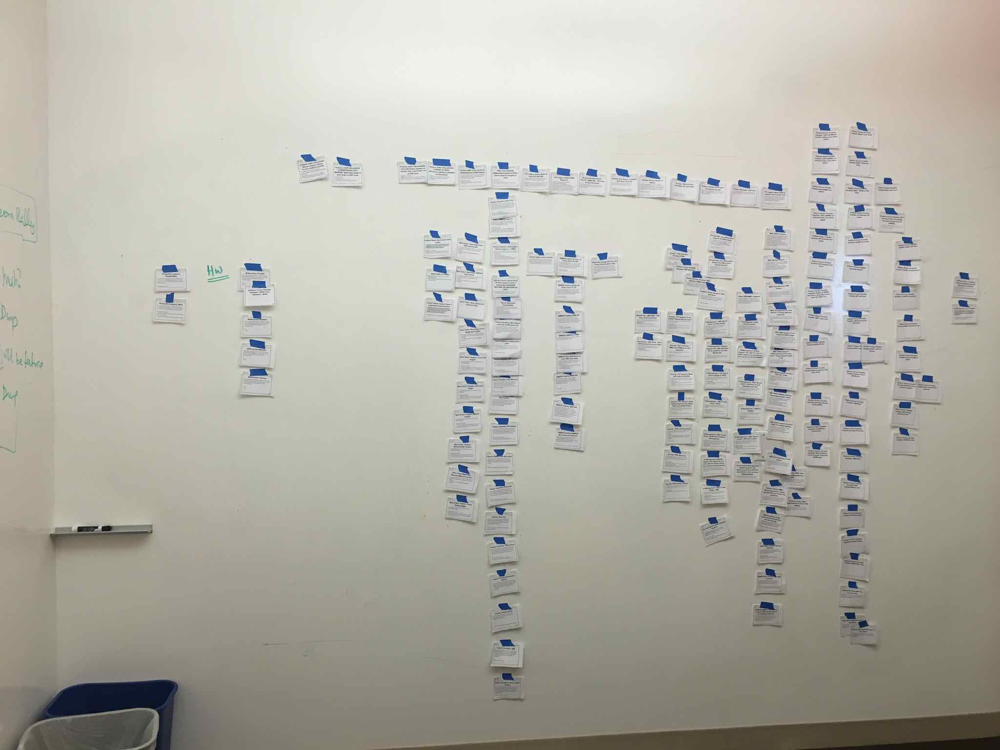
  <figcaption>Figure 17: The brief post-it note PBIs from the initial two day launch meeting were further refined and stored electronically. These refinement efforts were done by small cross-team groups focused on particular areas of the BIOS component. It took a Sprint or more before the cross-team groups reached a point of diminishing return. Now that we had enough additional insight from the cross-team refinement efforts; we returned to a physical format to help us see the bigger picture. Here you see the story cards printed out and randomly taped to the wall in preparation for more refinement activities.</figcaption>
</figure>

<figure>
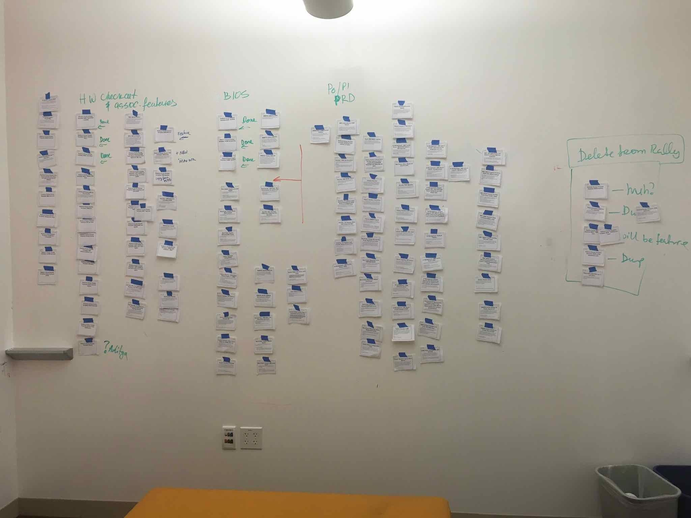
  <figcaption>Figure 18: The BIOS Fake Product Owner began to look for natural groupings and orderings. The end result was a bit of a mix between a story map and a snake-like ordered Component Backlog with epic groupings. This large map was slowly evolved over the course of several days. Various groupings of people from the BIOS feature teams would be pulled in for more insight as it made sense. As the wall settled down the Fake Product Owner made sure to call a meeting with every BIOS Scrum team member to conduct an overall sanity check. At this point the MVP had become evident as seen by the red arrow.</figcaption>
</figure>

<figure>
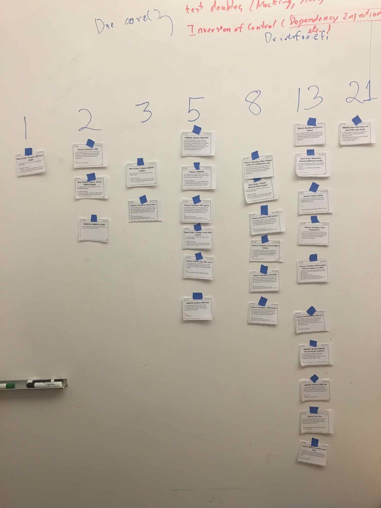
  <figcaption>Figure 19: While every BIOS Scrum team member was available during the large group multi-team sanity check, affinity estimation was used to re-estimate every remaining PBI within the MVP. Afterwards the cards were rearranged into a cleaner story map version, and Rally was updated to reflect the new information.</figcaption>
</figure>

<figure>
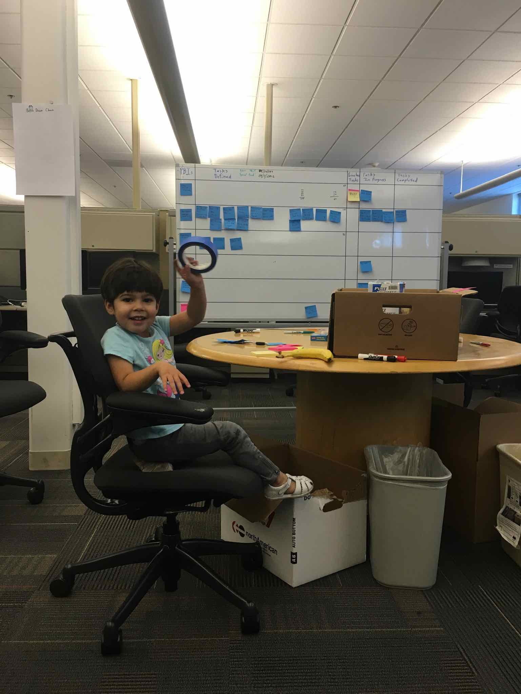
  <figcaption>Figure 20: Mitya ensured we had a helper to provide any masking tape we needed.</figcaption>
</figure>

#### Multi-Site Reference Content {#multi-site-reference-content}

There is a great deal of useful content related to facilitating multi-site meetings in _Practices for Scaling Lean & Agile Development: Large, Multisite & Offshore Product Development with Large-Scale Scrum_. Even the sub-title implies as much.

_Large-Scale Scrum: More with LeSS_ also includes a relevant narrative and a couple relevant guides.

_Large-Scale Scrum: More with LeSS_ content includes:

* _Guide: Cross-Team Meetings_
* _Guide: Multi-Site PBR_
* _LeSS Huge Story: Multi-Site Teams_

_Chapter 12: Multisite_ in _Practices for Scaling Lean & Agile Development: Large, Multisite & Offshore Product Development with Large-Scale Scrum_ is entirely devoted to dealing with multi-site challenges. A few experiments within this chapter most directly related to the initial BIOS component backlog refinement effort include:

* Try...Seeing is believing—ubiquitous cheap video technology and video culture
* Try...Multisite planning poker (estimation poker)
* Try...Basic practices for multisite meetings

### Reflecting on the Initial Refinement Efforts {#reflecting-on-the-initial-refinement-efforts}

The amount of detail and effort spent in refining the initial BIOS component backlog is certainly greater than any similar effort I have done before or since. Yet given the context I would do it again. We achieved a level of alignment, and enrollment of the BIOS engineers we would not have otherwise achieved.

The detail created is sure to be used in the future when extending the Component Backlog to account for future prototype Intel chipsets. With more use of the AMI plugin architecture the rework will be far less, so the details will vary. Yet the best place to start seeding new PBIs will be to look through what was done before.

We didn't so much force ourselves into some artificial set of refinement time-boxes. We determined what level of clarity and detail made the most sense in context, and then focused our energies to achieve it. Once done we switched gears and adopted cadenced cross-team refinement meetings.

## BIOS Definition of Done {#bios-definition-of-done}

The second most interesting part of the inception effort was the Definition of Done creation. The team decided to ensure as much as possible they would move away from the terrible copy-paste behaviors of the past. They decided to be sure and leverage AMI's pluggable extension points whenever possible, and to pressure AMI to add any missing required extension points. You can see this commitment manifested in the more formalized Definition of Done included below. Look for the line starting with:  “No changes outside of pluggable layer, ...”

<figure>
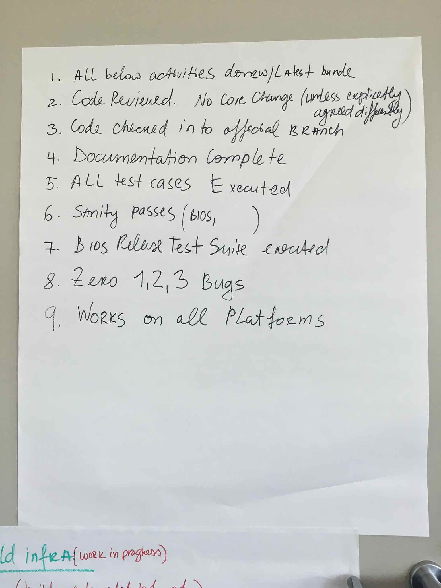
  <figcaption>Figure 21: This is the initial draft Definition of Done created by the BIOS teams during their multi-day launch event.</figcaption>
</figure>

<figure>
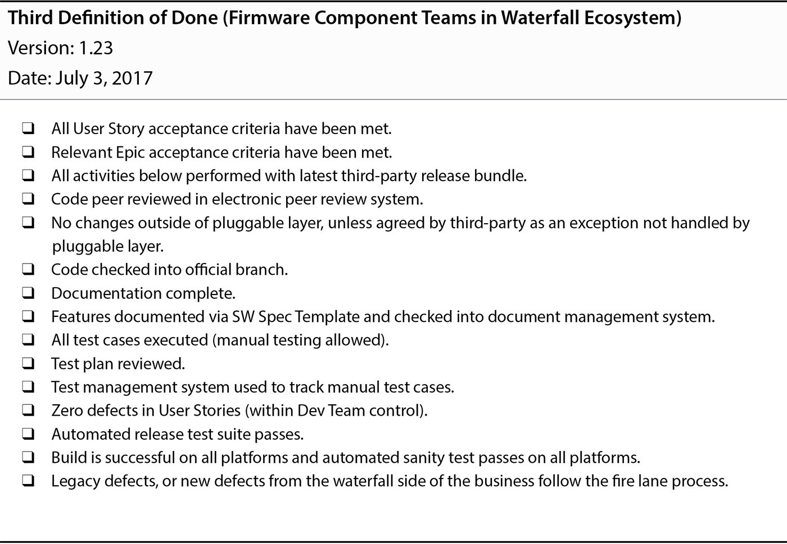
<figcaption>Figure 22: The Definition of Done used by the BIOS teams evolved to what you see here after a few Sprints. This example Definition of Done along with additional context can be found in Table 9.3 of <b>Forging Change</b>.</figcaption>
</figure>

## BIOS Scrum Key Roles {#bios-scrum-key-roles}

Trent, Mitya, and I spent a great deal of thought trying to work out the best choice of Product Owner and Scrum Masters.

As I will explain in more detail, Mitya ended up being the only sensible choice of Product Owner available.

We also came to the conclusion I would initially need to act as the Scrum Master for all the teams. No other Scrum Master choice available had the necessary experience. Had we not been so reliant on having Mitya as the Product Owner, we would likely have selected Mitya as the Scrum Master.

More nuanced insight into our choices of Product Owner and Scrum Master is given below. Read if you have interest, and skip over if not.

### Mitya as Temporary Fake Product Owner {#mitya-as-temporary-fake-product-owner}

Mitya was the director for all of the BIOS group. Mitya, Trent, and I recognized (and all Scrum experts recognize) it is usually hugely problematic for a Product Owner to have direct line authority over the members of the development team due to the imbalanced power relationship (see below). With another personality inhabiting the role this would likely have been a significant problem. In our case Mitya is such a naturally humble servant leader the conflict was not a significant issue.

Trent, Mitya, and I tried to figure out a better choice of Product Owner. In the end we realized there was no one else available who had enough component depth to be effective in the role while also having the right personality strengths. The other available candidates either had problematic personalities, or lacked sufficient knowledge of the overall MCS product and BIOS component to perform the role.

#### Avoid Line Manager as Product Owner {#avoid-line-manager-as-product-owner}

Just because we got away with Mitya as both the line manager and Fake Temporary Product Owner in our specific situation, I don’t generally recommend you try the same. LeSS guidance on organizational structure explicitly avoids having team members report into the Product Owner.

The following quotes from _Large-Scale Scrum: More with LeSS_ are instructive:

>**Peers, not peons**—If teams report to the Product Owner directly or indirectly in a hierarchical power relationship, that structure needs to change so that the teams and the Product Owner are peers collaborating. The Product Owner doesn’t treat teams like peons for tasks, but fosters a collaborative relationship. &mdash; **_Guide: Five Relationships_**
>
>An important point in this organizational structure is that the Teams and the Product Owner are _peers_—they do not have a hierarchical relationship. We have found it important to keep the power balanced between the roles. The Teams and Product Owner should have a _cooperative_ peer relationship to together build the best possible product, and a peer structure supports this. This point is further explored in the Product Owner chapter. &mdash; **_Guide: LeSS Organizational Structure_**

#### PO Concerns Arising from a Compromised Component Boundary {#po-concerns-arising-from-a-compromised-component-boundary}

There were real Product Owner candidates in the product management group who we considered having as PO. Unfortunately, limits on the scope of influence of the relevant Vice President precluded expanding the component boundary far enough to result in a multi-component boundary any of these individuals had the domain knowledge to manage. It is important to remember even with an expanded BIOS multi-component boundary, the natural complexity of the MCS BIOS component as well as the overall MCS product is radically greater than the typical corporate information system.

Although we had buy-in from some of the most senior executives within the division, those executives had a multitude of other competing concerns to address. I'm fairly certain a few key divisional executives provided far more political air cover for our efforts than we will ever know. The ground level reality was it would take some time and more demonstrated success to gain enough political capital to make even more significant organizational changes on our behalf.

Until more of the highly specialized BIOS engineers were themselves more comfortable working across the various BIOS sub-components, an even broader expanded BIOS multi-component boundary would have stretched the technical and teaming capabilities of the BIOS teams more rapidly than was sustainable. Therefore further expanding the BIOS component boundary early on wasn't really an option anyway. These are the kinds of reasons that also motivate the LeSS guidance to _incrementally_ expand a product definition, and to incrementally add Requirement Areas in a LeSS Huge adoption.

#### Relevant LeSS Product Rules {#relevant-less-product-rules}

The following selected LeSS Framework rules are particularly relevant:

* There is one Product Owner and one Product Backlog for the complete shippable product.
* The Product Owner shouldn’t work alone on Product Backlog refinement; she is supported by the multiple Teams working directly with customers/users and other stakeholders.
* All prioritization goes through the Product Owner, but clarification is as much as possible directly between the Teams and customer/users and other stakeholders.

#### Product Ownership Not The Biggest Challenge {#product-ownership-not-the-biggest-challenge}

From the perspective of the expanded BIOS multi-component, the customer problem is rather simple. The custom BIOS for each new Intel chipset has to provide the same services provided by previous generations of BIOS running on previous generations of Intel chipsets. Minor extensions of these capabilities are often required for each new chipset generation, yet they are minor in comparison to the base functionality. To some extent, the Fake Product Owner for BIOS was just an expert who worked with the teams to figure out a better way of solving the problems in the future.

The poor state of the code base was a consequence of historically poor engineering practices driven by the Contract Game. With constant pressure to meet unrealistic artificial “code-complete” deadlines imposed from the top, there had not been sufficient personal safety for craftsmanship. The history of massive amounts of copy-paste reuse coupled with poor automated test coverage provide two great examples of the self-inflicted wounds resulting from the Contract Game. The end result was to artificially make adapting the BIOS code base to each new generation of Intel chipset a monumental undertaking.

Ironically, with a more comprehensive Definition of Done and with a cross-functional team which could incrementally complete all the testing, there always had been sufficient time to do a better job. The Intel chipset release dates were real, but the waterfall stage gate dates were an artificial artifact arising from the imposition of a waterfall process.

The drastically improved quality being produced by the new BIOS teams would have changed this situation in time. Once the vast majority of the BIOS customizations were in a pluggable layer with better automated tests, it would likely become possible to adapt to a new Intel chipset with far less effort than in the past. Furthermore, with continued improvement efforts the BIOS teams would have fully expanded their capabilities to work all the way up through the MCS Admin layer.

Once both the quality improvements and the expansion of the component boundary had progressed far enough, the new teams would have both the available time and the skillset to handle far more dynamic requirements. Until that time, the truth is the expanded BIOS multi-component goals were so clear, and succinct -- and the work involved so massive -- there wasn’t a lot of need for a Product Owner role. The truth is, this group of BIOS engineers with years of BIOS experience simply needed to charter a new path regarding how to better implement what they had already implemented many times before.

Once the BIOS teams had started to jell, the engineering practices had been improved, and the expanded BIOS multi-component boundary had been stretched up through the MCSA forming a natural Requirement Area of the overall MCS product, a real Product Owner from Product Management would eventually become critical.

#### Product Owner Selection Constraint Summary {#product-owner-selection-constraint-summary}

All these reasons collectively brought us to selecting Mitya as the best mid-term choice for Product Owner. This is to say we chose to implement the _Fake Product Owner_ experiment as described in _Practices for Scaling Lean and Agile Development_ and the _Start Early or Messy with a Temporary Fake Product Owner_ guide in _Large-Scale Scrum: More with LeSS_.

* The overspecialization and local focus of the BIOS teams, coupled with additional complexity introduced by years of poor engineering practices required having a Fake Product Owner to start. This person would have enough specialized technical depth to make sense of the BIOS Component Backlog and also maintain the respect of the BIOS teams.
* A Product Owner who by nature tended to empower others and avoided micromanagement was important in helping to establish a supportive context within which the BIOS teams could grow and mature.
* Since the BIOS LeSS-oriented structure was running inside of a large waterfall context still driven by the Contract Game, it was important to have a Product Owner who had enough positional and political influence to help establish a supportive context for the BIOS teams.
* Expanding the component boundary would help to reduce the BIOS specific knowledge necessary to understand and guide the BIOS component backlog and thereby enable other good choices of Product Owner. Until greater cross-functionality of the BIOS engineers made this possible, we would need a Fake Product Owner with a great deal of BIOS knowledge.
* The existence of a Fake Product Owner would further isolate the BIOS teams from the customers of the overall MCS product. We would look to move away from the need for a Fake Product Owner as soon as practical.

### Coach as Scrum Master {#coach-as-scrum-master}

There were not any full-time employees in the MCS division who we judged had enough experience to effectively guide the establishment of Scrum teams in as challenging a context as we were going to attempt with the BIOS teams. Any full-time employee selected would need to be gradually coached into the role.

Both Trent and I felt Mitya had the right personality, relationships, organizational knowledge, and component knowledge to be an excellent Scrum Master. Unfortunately, we really needed Mitya to take on the Product Owner role until the component boundary could be further expanded.

We ultimately decided I would initially need to act as the Scrum Master. Trent and I were careful to ensure I had the bandwidth available to perform the role. I moved into an empty desk in the BIOS engineering area and spent the next several months largely devoted to launching and maturing the BIOS teams. Since I flew in every week anyway, I could travel to Portland whenever it made sense. As a practical matter Mitya and I did most things together. I would continually help Mitya and other strong natural leaders in the group grow into leading most activities themselves.

As the BIOS teams gelled and began to mature a couple of additional natural Scrum Master candidates emerged. These were not necessarily engaged with Scrum to begin with, yet they became so over time. Mitya and I focused on growing these particular individuals into potential future Scrum Masters as we identified them.

The following recommendation from Mitya illuminates the challenging context involved:

>Working with James was a transformational experience for me, and for the team.
>
>He took us from "No Way Scrum Can Be Done Here" to "We Can't Ever Go Back". He brought the team from Waterfall to Scrum.
>
>We are a team of Firmware engineers and firmly believed that Scrum does not belong in our field. James demonstrated that Scrum is a framework to bring focus to the Software Craftsmanship, Quality, and way of planning our work.
>
>James coached me to act as a Product Owner, and coached the team past the learning curve of the Scrum framework.
>
>The team found extremely useful his focus on the technical aspect of development, test, CI/CD. He introduced a number of concepts and tools to us, and worked with team members on the technical side where it was needed.
>
>Results are very straightforward. We have been practicing Scrum for almost a year. We have much better visibility into the backlog. The team engagement is better. The initial product quality is better.

#### Scrum Master Selection Constraint Summary {#scrum-master-selection-constraint-summary}

* The exotic hardware and firmware engineering context coupled with the cultural challenges involved were too challenging for the skill-set of any full-time Scrum Master candidate available.
* Mitya had the natural aptitude to be quickly grown into an effective Scrum Master. This option was precluded due to our need for Mitya to act as the Fake Product Owner.
* Once it became politically and technically practical to expand the component boundary we could replace Mitya as Product Owner, transitioning Mitya or anyone else who showed promise and growth to a Scrum Master role.
* I was the only person available to us with a strong enough Scrum Master skill-set to attempt such a challenging Scrum adoption. I could only do it by leaning heavily on the BIOS developers, Mitya, and others for guidance as we collectively found our way to improving things.

## BIOS Teams Self-Selected {#bios-teams-self-selected}

During inception we collaboratively worked out who would be on each new team.

Having the Portland people form a single team was an easy decision for the group. There were only a half dozen or so people in Portland. This included software, hardware and test engineers. Mitya, Krishna, Trent, and I had worked to ensure this would be the case way back when we decided who we would train in Portland. I think Krishna may have helped us find an appropriate test engineer we took from a group working on another part of MCS.

The real challenge was who would be on which of the San Francisco teams, and how many San Francisco teams there would be. We initially ended up with two. As I recall the group made an initial pass at self-designing their team compositions on the afternoon of the first launch day. After some contemplation and thought overnight, the group made a few minor adjustments to the team compositions on the second day of the launch.

In a few months we would roll in a few more developers working on the edges of the BIOS component boundary and form another team or two working within the same LeSS-oriented structure.

Although the Portland team was largely co-located, there were initially a few critical engineering skills they were missing. For a little while one or two San Francisco engineers were members of the Portland team. Over time I believe the Portland engineers became entirely self-sufficient.

## BIOS Cadence and Sprint Timing {#bios-cadence-and-sprint-timing}

The group decided on a two week cadence. We made sure the Sprint boundary was mid-week so that I could be available to the teams and not somewhere in the stratosphere sitting on a plane.

## BIOS Retrospective Structure Adaptation {#bios-retrospective-structure-adaptation}

We tried several variations on a combination of cross-team and per-team retrospectives. The retrospective structure was similar in spirit to the LeSS Sprint Rules, although it varied slightly in the details.

From a retrospective meta-structure perspective we typically followed the advice seen in _Agile Retrospectives_ by Esther Derby and Diana Larsen. The most common techniques were simple brainstorming with dot voting, time-boxed discussions, and the use of a brief four-box retrospective on the retrospective structure itself.

### Initial Retrospective Structure {#initial-retrospective-structure}

The initial retrospective structure was as follows:

1. Cross-team meeting to identify the highest priority cross-team discussion item
2. Per-team retrospectives to discuss per team issues as well as the highest priority cross-team item
3. Cross-team meeting (a LeSS Overall Retrospective) to discuss the output of the per-team meetings and to come to consensus on an approach to solving the cross-team issue

Both cross-team meetings included all team members from every BIOS team, Mitya (the Fake Product Owner), and myself (acting Scrum Master).

The first cross-team meeting was focused on identifying any cross-team team issue the group felt was important for the team level retrospectives to consider. The intent was to provide an opportunity for people to work out potential solutions to the cross-team issue in smaller team level discussions, such that the subsequent cross-team meeting would benefit from deeper insights that might not have surfaced in a larger group discussion.

You will notice this is very similar to the LeSS Framework structure of team level retrospectives followed by an overall retrospective. The key difference is the team level retrospectives were sandwiched between the first and second part of an overall retrospective.

In practice, the team level retrospectives seemed to spend most of their time on whatever issues were identified in the first part of the overall retrospective. Had the team level retrospectives been conducted before any overall retrospective meeting as the LeSS framework prescribes I believe the team level retrospectives may have been more insightful.

Most of the problems surfaced were cross-team in nature. I don’t know if this was simply a result of context, or whether having a portion of the overall retrospective before the team level retrospectives had the effect of unintentionally distracting the teams from more challenging team level discussions.

### Later Retrospective Structure {#later-retrospective-structure}

We were generally careful to close the final cross-team retrospective with a retrospective on the retrospective itself. From this we eventually decided to change to the following retrospective structure.

1. Cross-team meeting to identify the highest priority cross-team discussion items
2. Breakout groups for the top few dot voted issues. Break-out groups tended to cross team boundaries, with people often self-selecting to attend the breakout they were most passionate about or most needed for.
3. Cross-team meeting to discuss output of breakout group meetings and to come to consensus on an approach to solving the cross-team issues discussed

As you can see this structure was identical to the initial structure with the exception of the middle step. Rather than breaking into per-tegam retrospectives we were breaking off into working groups which cut across team boundaries, and aligned with whatever people felt most they had the most affinity with.

In practice the Portland team generally stayed as a team during the second step. We generally conducted any cross-team events in a set of tele-presence rooms. If anyone in San Francisco felt particularly passionate about the topic the majority of the Portland folks had taken, we would use the tele-presence room for that topic. Other working groups would go elsewhere in other break out rooms with limited tele-presence capability.

How the retrospective working groups split up in San Francisco was often somewhat random. We would often split down the middle of a conference table, with a few people switching working groups when it made sense.

Given the naturally collaborative nature and relationship history of the people involved, lack of a dedicated per-team retrospective didn't seem to matter. In other groups I have worked with, per-team retrospectives often turn out to be crucial. Perhaps with time and additional teams the dynamics would have shifted such that the group would have decided to restore team level retrospectives.

### Larger Structural Issues Not Addressed in Overall Retrospectives {#larger-structural-issues-not-addressed-in-overall-retrospectives}

In LeSS, the overall retrospective is intended to address broader systemic issues. Although the BIOS teams actively addressed and implemented solutions to cross-team systemic issues within their control, there was little ability to address broader systemic issues. Neither the VP layer managers, nor the new SVP manager ever attended.

See _Guide: Overall Retrospective_ in _Large-Scale Scrum: More with LeSS_ for more nuance around this topic.

# BIOS Alignment to LeSS Rules {#bios-alignment-to-less-rules}

Before going on to discuss a few more details and insights from the BIOS teams, it is instructive to review alignment to the formal LeSS Rules.

<figure>
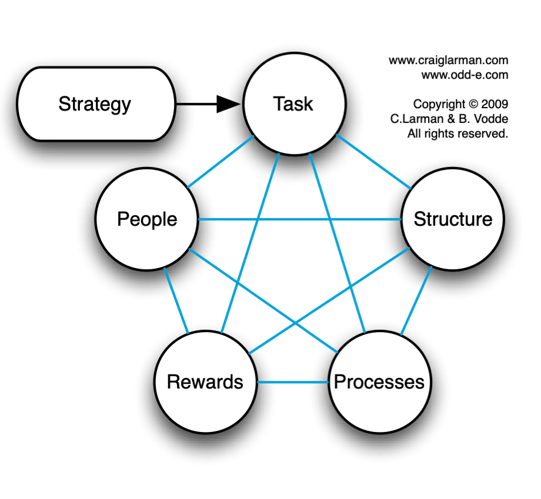
<figcaption>Figure 23: In Scaling Lean and Agile Development, Larman and Vodde talk about organizational strategy in terms of Jay Gilbrith’s star model. Some of the greatest problems in the LeSS adoption relate to Rewards and People, and their intersection with Structure. There was a failure to flatten the formal organizational structure, coupled with insufficient attention to compensation structures which reward technical proficiency at the same level as managerial proficiency. It is useful to keep Gilbrith’s model in mind as you read through the <a href="#bios-alignment-to-less-rules">BIOS Alignment to LeSS Rules</a> section. (Figure used with permission.).</figcaption>
</figure>

## LeSS Structure Alignment {#less-structure-alignment}

* Structure the organization using real teams as the basic organizational building block.
    >Yes

* Each team is (1) self-managing, (2) cross-functional, (3) co-located, and (4) long-lived.

    >**_self-managing:_** Every team was self-managing from day one. The teams controlled how much work they pulled into a Sprint, collaboratively tasked out each Sprint, had full control of their architectural decisions within the BIOS codebase, ran their own daily scrums, and everything else one might expect of a self-managing team.
    >
    >**_cross-functional:_** Early on each team tended to have a strong affinity for certain areas of the BIOS component. Growing into being more cross-functional even within the BIOS component took each team a while. As teams further evolved they began to progressively stretch themselves outside of their original affinities.
    >
    >The existence of a common BIOS Component Backlog and single Fake Product Owner created structural forces which continually encouraged increasing levels of cross-training within and across teams.
    >
    >As the BIOS teams worked to further stretch the BIOS component boundary up through the MCSA the teams slowly became further cross-functional from an overall MCS product perspective. This never reached its full potential, yet one team with an affinity for MCSA related BIOS work was certainly on that path. This topic will be explored further in the _[BIOS Component Boundary Expanded](#bookmark=id.1mrcu09)_ section.
    >
    >**_co-located:_** Each team was mostly co-located. Since the Portland team lacked knowledge in a few areas of the BIOS codebase, the Portland team initially had one or two members based in the San Francisco area. The teams worked to aggressively do the cross-training to resolve these exception cases. As I recall the San Francisco team based members of the Portland team were able to leave the Portland team and join one of the San Francisco teams within a few sprints.
    >
    >**_long-lived:_** The teams largely stayed intact for months on end. The massive layoffs obviously eventually impacted the longevity. There was also a bit of self-directed shuffling of members across teams as the Portland team became less dispersed and as more BIOS developers became available for working on the in-development hardware generation of BIOS. Generally speaking the newly available team members formed up new teams, with the original three teams remaining fairly stable.
    >
    >So the teams were not ultimately as long-lived as I would have liked, yet they certainly were not being randomly retasked to new teams every few months.
    >
    >When looking at longevity from a multi-year timescale, there was definitely a problem. In _Scaling Lean and Agile Development_, Larman and Vodde talk about organizational strategy in terms of Jay Gilbrith’s star model. Of the various elements, the Rewards and People elements were not given sufficient attention.
    >
    >Although the pre-existing compensation structure already provided some level of incentive for engineers to continue on a technical track, the financial and cultural incentives for moving up the managerial ladder remained much stronger. Similarly, the continual pressure cooker resulting from the commitment game being played at the highest levels of the division left little time for significant learning and professional growth.

* The majority of the teams are customer-focused feature teams.

    >Although the teams were largely vertically sliced within the BIOS component boundary, the BIOS component boundary was itself a compromise. As the BIOS teams matured we worked to establish an even more vertical expanded multi-component boundary slicing through the entirety of the MCS product, although never as vertical as we might have eventually achieved.

* Scrum Masters are responsible for a well-working LeSS adoption. Their focus is towards the Teams, Product Owner, organization, and development practices.

    >Yes

* A Scrum Master does not focus on just one team but on the overall organizational system.

    >Yes

* A Scrum Master is a dedicated full-time role.

    >Yes

* One Scrum Master can serve 1-3 teams.

    >I was serving 5 teams by the time all of the US based BIOS engineers had been rolled into feature teams. In practice I shared much of the load with Mitya and others we were growing into Scrum Masters.

* In LeSS, managers are optional, but if managers do exist their role is likely to change. Their focus shifts from managing the day-to-day product work to improving the value-delivering capability of the product development system.

    >Yes. Mitya, Trent and I kept the effective structure very flat. I don't recall Mitya ever focusing on managing the day-to-day BIOS component work.

* Managers’ role is to improve the product development system by practicing Go See, encouraging Stop & Fix, and “experiments over conformance.”

    >Yes.
    >
    >Mitya and I were both sitting with the SFO based teams and would also fly to Portland from time to time. Various examples of Go See and experiments over conformance include:
    >
    >* Both Mitya and I would occasionally pair program with one or more BIOS developers and/or attend design discussions when deemed beneficial.
    >* Mitya and I would actively meet with various people up, down, and across the organization to help work through numerous organizational impediments.
    >* I spent significant time pairing with Emmett Brown as we worked out how to create automated unit tests for BIOS code.
    >* I spent significant time pairing with a couple developers to stand up a CI server within the BIOS team’s control.
    >* BIOS team retrospectives consistently identified at least one experiment every Sprint which the teams took action on in the respective subsequent Sprint.

* For the product group, establish the complete LeSS structure “at the start”; this is vital for a LeSS adoption.

    >Yes, within the scope of the extended BIOS component. No, within the broader overall MCS product scope.

* For the larger organization beyond the product group, adopt LeSS evolutionarily using Go and See to create an organization where experimentation and improvement is the norm.

    >Yes

## LeSS Product Alignment {#less-product-alignment}

* There is one Product Owner and one Product Backlog for the complete shippable product.

    >Yes for the BIOS component. No for the overall MCS product.

* The Product Owner shouldn’t work alone on Product Backlog refinement; she is supported by the multiple Teams working directly with customers/users and other stakeholders.

    >Yes

* All prioritization goes through the Product Owner, but clarification is as much as possible directly between the Teams and customer/users and other stakeholders.

    >Yes for the BIOS component. No for the overall MCS product.

* The definition of product should be as broad and end-user/customer centric as is practical. Over time, the definition of product might expand. Broader definitions are preferred.

    >Yes in terms of expanding the BIOS component boundary as broadly as possible. No in terms of the lack of a LeSS context encompassing the entire MCS product.

* One Definition of Done for the whole product common for all teams. Each team can have their own stronger Definition of Done by expanding the common one.

    >Yes in terms of the common Definition of Done used by the BIOS teams. No in terms of the overall MCS product.

* The perfection goal is to improve the Definition of Done so that it results in a shippable product each Sprint (or even more frequently).

    >Yes in terms of the BIOS component. There was a little bit of Undone work we couldn't avoid until we could extend the LeSS adoption more broadly over the entire MCS product..

## LeSS Sprint Alignment {#less-sprint-alignment}

* There is one product-level Sprint, not a different Sprint for each Team.

    >Yes in terms of the BIOS extended component teams.

* Each Team starts and ends the Sprint at the same time. Each Sprint results in an integrated whole product.

    >Yes in terms of the BIOS extended component teams.

* Sprint Planning consists of two parts: Sprint Planning One is common for all teams while Sprint Planning Two is usually done separately for each team. Do multi-team Sprint Planning Two in a shared space for closely related items.

    >Yes in terms of the BIOS extended component teams.

* Sprint Planning One is attended by the Product Owner and Teams or Team representatives. They together tentatively select the items that each team will work on that Sprint. The Teams identify opportunities to work together and final questions are clarified.

    >Yes in terms of the BIOS extended component teams.

* Each Team has their own Sprint Backlog.

    >Yes in terms of the BIOS extended component teams.

* Sprint Planning Two is for Teams to decide how they will do the selected items. This usually involves design and the creation of their Sprint Backlogs.

    >Yes in terms of the BIOS extended component teams.

* Each Team has their own Daily Scrum.

    >Yes in terms of the BIOS extended component teams.

* Cross-team coordination is decided by the teams. Prefer decentralized and informal coordination over centralized coordination. Emphasize Just Talk and informal networks via communicate in code, cross-team meetings, component mentors, travelers, scouts, and open spaces.

    >Yes in terms of the BIOS extended component teams.

* Product Backlog Refinement (PBR) is preferably done with multiple teams to increase shared learning and to exploit coordination opportunities.

    >Yes in terms of the BIOS extended component teams.

* There is one product Sprint Review; it is common for all teams. Ensure that suitable stakeholders join to contribute the information needed for effective inspection and adaptation.

    >Yes in terms of the BIOS extended component teams.

* Each Team has their own Sprint Retrospective.

    >Initially yes in terms of the BIOS extended component teams. We later deviated a bit as described earlier in the _BIOS Retrospective Structure Adaptation_ section.

* An Overall Retrospective is held after the Team Retrospectives to discuss cross-team and system-wide issues, and create improvement experiments. This is attended by Product Owner, Scrum Masters, Team representatives, and managers (if any).

    >Yes in terms of the BIOS extended component teams.

# BIOS Triage Rules {#bios-triage-rules}

The BIOS teams were often distracted by demands from engineers and management working on other parts of the overall MCS system. Some of these demands required prompt action in service of the overall MCS development efforts, while other demands were best promptly rejected or perhaps moved into and prioritized within the BIOS Component Backlog.

With the exception of a few test engineers, all the BIOS Scrum development team members reported directly into Mitya. The problem of functional managers distracting BIOS team members who reported to them was largely non-existent.

The distractions were predominately a function of the imperfect BIOS component boundary when compared to the actual MCS product boundary, and the over coupling of the MCS BIOS code with the AMI BIOS code.

Creating a formalized set of triage guidelines was very helpful in managing these distractions until the underlying root causes could be more fully addressed. Benefits included:

* Respecting the Product Owner's intent
* Remaining responsive to critical unanticipated demands
* Helping BIOS engineers say no to inappropriate demands
* Providing transparency to everyone involved
* Consolidating the collective wisdom of the BIOS engineers
* Achieving alignment within the BIOS teams
* Ability of the BIOS Scrum teams better inspect and adapt based on historical data

<figure>
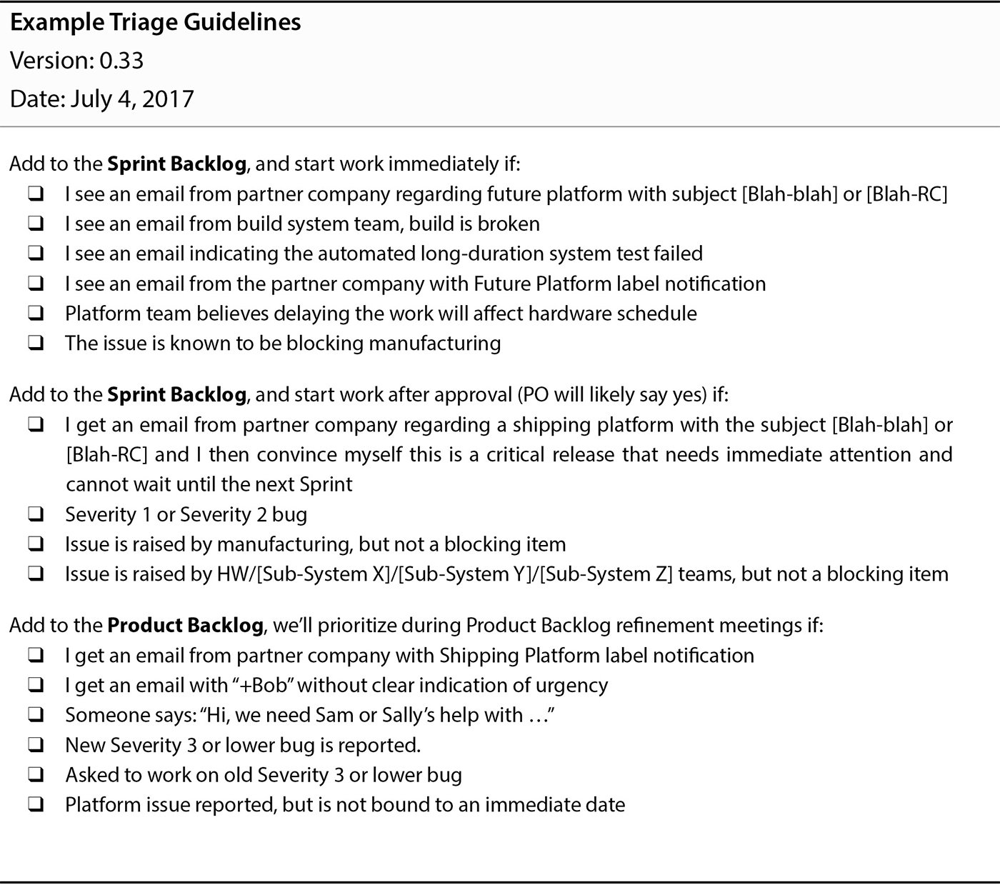
  <figcaption>Figure 24: This triage guideline used by the BIOS teams establishes three basic categories: take immediate action, ask the Product Owner, and put it on the BIOS Component Backlog. The Product Owner has clearly communicated intent while empowering the Scrum Development Teams to take immediate action when appropriate. By making the guidelines explicit, the Product Owner also improves the odds of collaboratively refining the guidelines based on the collective wisdom of the teams.).</figcaption>
</figure>

# BIOS Unit Testing Is Possible {#bios-unit-testing-is-possible}

Where there is a will, there is a way. We knew automated unit testing within BIOS was going to be extremely challenging. No TCP/IP network stack existed during early stages of development, very few of the standard C library functions are available, all code has to be cross-compiled and flashed to the target, and no existing approach to unit testing within the AMI BIOS ecosystem could be found.

Although I spent well over a decade as a software engineer practicing test first development, I know almost nothing about BIOS and low level hardware design. Similarly, the BIOS engineers had almost no exposure to the languages, tooling, design patterns, and various craftsmanship practices seen in higher performing middle-ware teams. In many ways most of the MCS BIOS engineers are electronic engineering wizards with very narrow software engineering skills.

Emmett Brown was a passionate engineer who was determined to figure out how to move towards test first development for the MCS BIOS code. I worked with Emmett to help him understand the design elements required, and to show him examples of each in various higher level development ecosystems. Emmett would in turn teach me about various details of the UEFI standard, the BIOS tool-chain, and the hardware constraints involved. We would then puzzle through the challenges and consider different approaches to solving the problem.

It took a few weeks of work, but Emmett eventually had a working prototype in place. He used part of the UEFI standard to achieve dependency inversion, hand coded his test doubles, ported a crude C unit test framework, and built a basic transport protocol over a serial connection to get the results back to the Windows workstation or CI server which had the build toolchain orchestrating the effort.

I have heard engineers in far less technically challenging contexts developing in an imperative language provide all kinds of reasons as to why automated unit testing isn't technically possible. Don't believe them. Emmett achieved automated unit testing working way down in the primordial ooze of a complex half-instantiated circuit board in a context without any useful pre-built unit test tooling.

# BIOS Team Count Increases {#bios-team-count-increases}

In order to keep the initial adoption scope manageable only those working on support for the newest Intel chipset and reference board design were originally included. Anyone working on bug fixes and other minor work related to the older production Intel chipsets continued to work within the legacy organizational design. Said another way, the BIOS component boundary only included the newest prototype Intel chipset.

Since each major Intel release involved a separate AMI codebase, this strategy worked fairly well. By the time the work related to the legacy Intel chipsets tapered off, the first three BIOS Scrum teams had largely jelled.

As additional San Francisco BIOS developers became available, and so we formed two new teams working off of the single combined BIOS Component Backlog. Each new team was allowed to influence and ratify the various cross-team artifacts to help ensure their full engagement and commitment to the process. I don't recall, but I'm sure I ran anyone who still needed it through agile overview training as part of this effort.

As we rolled in the two new BIOS Scrum teams, we effectively expanded the BIOS component boundary at the same time to include all generations of the Intel chipset.

# BIOS Component Boundary Expanded {#bios-component-boundary-expanded}

At the top of the MCS system is the Modular Compute System Administrator (MCSA) which is responsible for administering the entirety of the MCS infrastructure. When the system administrator at a customer of MCS interacts with MCS, it is typically the MCSA they are interacting with.

Some of the enhancements in the MCS BIOS code required making small changes in the MCSA. Less commonly changes would also have to be made within the firmware running on a low power node controller running on each node.

Initially the BIOS teams would collaborate with a few of the more senior MCSA developers for any cross-cutting functionality. The BIOS Scrum teams often found coordinating their work with the MCSA developers challenging. The MCSA developers were suffering under all the normal delivery pressures inherent in a waterfall managed project.

Had it been politically viable to start with a broader expanded BIOS component boundary which aligned with a natural Requirement Area of the overall MCS product to begin with none of the coordination issues above would have existed.

In consideration of the political situation the obvious solution was for the MCS BIOS developers to slowly develop the expertise to make MCSA changes themselves. As the BIOS Scrum teams matured, this need became increasingly obvious to many of the BIOS Scrum teams. I also tended to encourage them in this direction.

Through a variety of conversations we were able to get buy-in from a small handful of engineers who worked within MCSA, and from another set who worked within the node controller firmware. The agreement was to have them help guide the BIOS Scrum teams in identifying when a cross-cutting change would be simple enough the BIOS Scrum could make the change themselves. The BIOS Scrum team would then do the work and have the relevant expert outside the BIOS team perform code review.

The San Francisco BIOS developers had been successfully collaborating with many of the San Francisco MCSA developers for years. From the perspective of the key MCSA team leads and architects, anything the BIOS teams could do to take care of some of the MCSA/BIOS integration work was seen as a welcome reprieve. So the fact the Software VP was passively aggressively working to maintain the status quo turned out not to be a significant issue in practice. As long as the MCSA/BIOS integration work got done, no one in senior management cared how it happened.

The Node Controller developers reported up through the same director who had been involved in helping to establish the diagnostic team. So there were no significant political challenges dealing with cross-training the BIOS teams to make small changes within the Node Controller. Most of the Node Controller developers sat in the same small Portland office the Portland BIOS team did.

Mitya and I reasoned the success of this approach would grow over time. We predicted it would eventually become politically difficult not to reassign one or two MCSA experts to the BIOS group. The more the BIOS Scrum teams gained the ability to work end to end across MCS, the more natural the BIOS component boundary would become. More and more of the Product Backlog Items would become something meaningful to the MCS product management group. As that happened Mitya could transition out of being the Fake Product Owner. He could then work to further improve team dynamics and help grow effective Scrum Masters to take my place.

But before significant action could be taken on the agreement to start stretching at least one BIOS team outside of the BIOS code base, the division began to erode around us. _[The Support System Collapses](#bookmark=id.3l18frh)_ section farther down will elaborate a bit more on the senior management changes and layoffs.

# BIOS India Team Challenges {#bios-india-team-challenges}

The tremendous time zone differences between the San Francisco and India offices were always a challenge. Similarly, the different reporting lines also tended to complicate alignment issues. A few of the complexities are detailed below.

It is instructive to reflect upon the following LeSS Framework and LeSS Huge Framework rules:

*  _For the product group, establish the complete LeSS structure “at the start”; this is vital for a LeSS adoption._
* _LeSS Huge adoptions, including the structural changes, are done with an evolutionary incremental approach._

With broader senior level management buy-in some of the challenges encountered in working with the India teams could have been structurally addressed earlier on. On the other hand only so much change at any one time would have been sustainable. It is important to remember the actively enrolled original engineering SVP had left by the time the BIOS LeSS adoption was launched.

Throughout the BIOS agile adoption, Mitya and I made sure to broadly socialize the work we were doing. Even engineers working on the legacy support for older Intel chipsets were aware of the Definition of Done being used for the new Intel chipsets. Lead engineers from India often dialed-in from their home to attend the LeSS-oriented Sprint Reviews.

In Figure 15 and the nearby _[BIOS Organizational Context](#bios-organizational-context)_ section I described the tactic Mitya and I took of isolating and delaying the organizational changes for the India-based BIOS developers. The ability to use the Intel chipset generation as one of the expanded multi-component boundaries and the fact India was initially focused on fixing problems related to older generations of the Intel chipset is what made this possible. This was a risky strategy in that it depended upon continuity of support from the hardware VP who left before we fully executed on our strategy, yet I can’t think of any other workable choice given our constraints. Although I might be willing to repeat this strategy in the future if there were no other option, I strongly recommend trying to get buy-in for a broader change up front if at all possible.

## Coaching Support {#coaching-support}

I was the only coach within the MCS division for the first year I was there. Although Trent and I traveled to India very early on, we didn't initially have sufficient coaching capacity to significantly influence things there. I delivered a few days of training and built relationships, but little else was practical.

In my second year, Trent managed to get enough funding to hire a few coaches in India. Finding better seasoned agile coaches in India is even harder than finding them in the US, yet after many months of interviewing I eventually found a few. After another month or so Trent and I managed to get the co-blessing of the India managers for these coaches and wrapped up the negotiations and on-boarding.

## Waterfall Pressures on India-Based BIOS Engineers {#waterfall-pressures-on-india-based-bios-engineers}

As work related to the legacy Intel chipsets tapered off, several BIOS engineers based in India started contributing to the BIOS codebase for the new Intel chipset. The India engineers were kept fully aware of the common Definition of Done and related norms of the LeSS-oriented BIOS teams. Unfortunately, their management was still being driven in a waterfall fashion.

The early San Francisco members of the BIOS Scrum teams were adamant about not letting the quality they had worked so hard to improve be allowed to erode. The San Francisco BIOS team members improved their continuous integration practices, improved their integration test automation, performed frequent review of any code changes, and had lots of heart to heart conversations with the India BIOS engineers. These tactical solutions definitely made a positive impact and partially mitigated some of the issues.

Mitya and I had anticipated these problems. We had intentionally designed the BIOS component boundary so as to delay the organizational battle until greater political momentum favored winning. The intentional delay had ensured qualified agile coaches were available in the India office, the US based BIOS LeSS teams had jelled, and there was significant proof of massive improvements in quality and forecast transparency within the BIOS LeSS teams.

Mitya, Trent, and I recognized it was going to take a good bit of effort and shuttle diplomacy to resolve the underlying structural issues. We were ready to drive the structural issues to crises such that we could solve them. Unfortunately, the roughly concurrent loss of the supportive hardware VP and the massive layoffs crippled our strategy.

You can see the confluence of these various elements using a combination of the _Agile Adoption Timeline_ diagram, _Organizational Structure_ diagram sequence, and _BIOS Extended Component Team Expansion By MCS Hardware Generation_ diagrams.

# The Support System Collapses {#the-support-system-collapses}

Towards the end of my tenure in the Nakashima MCS division there were massive changes in the reporting structure, divisional funding, headcount, and senior management.

With eroding market share and a maturing competitive landscape, the MCS revenues were shrinking. There was a decision by the C suite of Nakashima to radically downsize the MCS division. The result was to reduce divisional headcount by about half. Many people at Nakashima told me it was the largest layoff they had ever seen at Nakashima. At least half of the BIOS teams would soon be laid off.

Prior to the layoffs many people in the management layer were being recruited to an exceptionally well funded start-up company. This included the VP to whom Mitya originally reported. Mitya then began reporting to the Software VP who had never been fully supportive of Scrum and agile to begin with. Not too long after my departure Mitya followed his prior VP to the new startup company.

Although I remained after the layoffs occurred it became politically untenable for Trent to renew my contract. The market rate and travel costs for an agile consultant are easily enough to pay for at least two or three engineers. Had it been up to Trent I would likely have had my contract extended, but even Trent had to obtain budgetary sign-off a couple layers up. A little over a year later Trent also left Nakashima.

# Conclusion {#conclusion}

## Reflections on Deep Organizational Change {#reflections-on-deep-organizational-change}

In retrospect the early loss of the supportive engineering SVP coupled with the lack of long-term job safety in a culture of frequent layoffs focused on short-term quick fixes of profit margins drastically reduced the odds of long-term success in transforming the organizational structure and culture. Without these challenges I believe success within the BIOS component could have been leveraged into a broader LeSS adoption.

After the success of the LeSS adoption within BIOS, I believe the original engineering SVP would have helped achieve the broader enrollment of senior management that was required to go further. Instead the senior management was busy scrambling to push out the upcoming MCS release while struggling to navigate the political landscape of an impending layoff. I believe more aggressive structural changes earlier on would have been very helpful, yet I don’t think the senior management involved would have been ready to accept it without the time we took to slowly build up a record of success.

I am reminded of the parable of the sower in which a farmer casts seeds broadly over a variety of soil conditions. Although the seeds cast on shallow soil germinated and grew quickly, they soon withered under the sun for lack of deep roots. In contrast, seeds cast on deeper soil produced an abundant crop. Failure to properly prepare the soil for a LeSS adoption is likely to result in problems over the long-term, even though you will often encounter dramatic success early on. The soil for the BIOS LeSS adoption was sufficiently deep to produce some great early results, yet not quite deep enough to reach its abundant potential.

## Summary of Benefits {#summary-of-benefits}

The BIOS teams started as extended component teams while moving towards _expanded_ component teams and feature teams. Benefits included:

* Locally improved **adaptability** and **value deliver**y within the extended component boundary
    + Prior Observations:
        - Only one or two people understood a given BIOS sub-component. Code ownership and knowledge was effectively at the individual file level.
        - Knowledge of the codebase outside of the BIOS component was almost non-existent within the BIOS engineering group.
        - No one person was aware of the entirety of the work required to bring up a new Intel CPU generation on new blade hardware. Each BIOS firmware engineer and BIOS firmware tester only understood their small piece of the puzzle.
    + Prior Impacts:
        - BIOS engineers could not choose the most valuable work at any point in time, because they were restricted to their individual area of expertise.
        - It was nearly impossible to accurately forecast completion.
    + Subsequent Observations:
        - Every team member was slowly becoming comfortable working on a broader number of BIOS sub-components than they previously were.
        - Many BIOS team members were becoming increasingly skilled in testing and modifying every aspect of the overall system along the execution path between the GUI and the BIOS component.
        - Every BIOS team member had a good overall understanding of the work required to bring up a new Intel CPU. Any member of any of the LeSS-oriented BIOS teams could explain any item on the BIOS component backlog and how it fit into the overall picture.
        - The BIOS component backlog consistently provided an up to date view into all of the known remaining work required to ship the upcoming BIOS release.
        - The BIOS teams accepted the natural variability of product development, and committed to _quality_ (not _scope_) as explicitly expressed in the BIOS Definition of Done.
    + Subsequent Impacts:
        - The LeSS-oriented BIOS teams were able to consistently focus on the most valuable work at any point in time.
        - The BIOS teams were far more confident in their release forecasts.
        - The BIOS teams were able to ensure a releasable level of functionality was achieved before working on lower priority functionality.
        - The LeSS-oriented BIOS extended component teams ensured every Sprint Increment was successfully integrated and tested with the MCS system as a whole. Across a few thousand engineers, only the small Diagnostics pilot Scrum team could claim anything similar.
* Improved technical practices that created **improved quality**, along with improved awareness of what additional improvements could bring
    + Prior Observations:
        - There was no common agreement on what the quality standards were.
        - Changes in the BIOS code supplied by AMI were co-mingled with the MCS specific code in a difficult to maintain fashion. Every new generation Intel CPU effectively required starting from scratch.
    + Prior Impacts:
        - Adapting MCS to each new generation of Intel CPU took over a year and an army of BIOS engineers. Failure to complete this work before Intel officially released a new CPU would result in tens of millions in lost revenue.
    + Subsequent Observations:
        - The BIOS Definition of Done is a living quality standard embraced by each of the new BIOS teams. The Definition of Done is continually clarified and extended over time by the teams themselves.
        - The BIOS Definition of Done has always included a commitment to ensure any MCS BIOS changes leverage the AMI plugin layer whenever possible. This sensible requirement originated within the teams, not from the coach or management.
    + Subsequent Impacts:
        - Improved technical practices are expected to help dramatically reduce the time required to adapt to future generations of Intel CPUs.
        - Healthy retrospectives and a focus on quality continuously provide clarity on the next improvement.
* Early identification and resolution of **defects** related to the extended component
    + Prior Observations:
        - BIOS firmware engineers would make code changes and then throw the code over the wall to the testing group. It would generally be weeks or even months before the testers would identify problems and throw them back over the wall to the BIOS firmware engineers.
        - There was very little if any automated testing. Almost all testing was very manual.
        - It was common practice to commit code to source control which had compilation problems.
    + Prior Impacts:
        - It generally took months before defects were found and resolved.
        - BIOS engineers often wasted time chasing breaking changes introduced by another developer. Many times this was done by another developer in a distant time zone who was no longer at work when the problem was discovered.
    + Subsequent Observations:
        - Every BIOS team contained people with the skills and domain knowledge to both develop and test any changes.
        - Each BIOS team typically focused on making a small number of changes at any one time. They worked as real teams rather than as individuals as they actively focused on achieving the Definition of Done for the relevant Product Backlog Item.
        - BIOS team members actively cross-trained each other in both technical and domain knowledge. Testers became stronger developers, and developers became stronger testers.
        - Increasing levels of automated testing, and automated build systems helped further ensure problems were discovered as early as possible.
        - The automated builds and tests were especially helpful in identifying conflicting priorities between the legacy teams and the LeSS-oriented teams.
    + Subsequent Impacts:
        - Defects were found and resolved within minutes or hours rather than months. The usual months wasted in multiple months of bug squashing after a “code-freeze” were completely unnecessary.
        - Conflicting quality incentives and goals of the overseas teams working in the legacy structure became extremely visible once the overseas teams started to work on the same codebase. With time and management continuity I believe this visibility would have made it politically viable to restructure and improve the overseas teams as well.
* Improved employee **collaboration, engagement, and learning** within the extended component teams
    + Prior Observations:
        - People worked as individuals rather than team members, each person focused on their own personal assignments.
        - The teams followed a typical engagement model in which the manager led and drove the interactions and work assignments.
        - Growth and learning was limited to an individual’s area of responsibility and historical expertise.  Expanding one’s expertise and responsibilities into new areas required arranging and shifting assignments. This took time, and was not always practical.
    + Prior Impacts:
        - _“A lot of effort with limited returns.”_ – Mitya
    + Subsequent Observations:
        - The teams managed the work themselves, collectively and enthusiastically focusing on delivering the PBIs their team selected.
        - Individuals and teams actively learned whatever was required to complete the PBI their team was focused on at the moment. The degree of knowledge transfer within and across teams was an order of magnitude greater than previously observed.
    + Subsequent Impacts:
        - In the terminology of _Leading Teams_ by Richard Hackman, BIOS teams acted as _real teams_ rather than loosely collaborating individuals. Each team had a clear team _task_, clear _boundaries_, clearly specified _authority_ to manage their own work processes, and membership _stability_ over time.
* Increased awareness of **organizational impediments** and the need to make even more organizational changes
    + Prior Observations:
        - Long development cycles, late discovery of defects, frequent hand-offs cross teams, work becoming bottlenecked on a single individual, and lots of other problems were accepted as normal. There was very little awareness that things could be significantly better.
        - Individual team members had little structural incentive to focus on adaptability or value delivery at a global level.
        - There was very little discussion or effort taken to remove long-standing organizational impediments.
    + Prior Impacts:
        - There were very few productive efforts at improving adaptability and value delivery at a global level.
    + Subsequent Observations:
        - Regular team and overall retrospectives within the BIOS teams frequently identified organizational impediments, which the teams and management would then actively attempt to resolve.
        - The efforts of the BIOS extended component teams to fully validate any BIOS changes increasingly drove them to challenge code ownership boundaries and expand their ability to make code changes across multiple components.
        - The pursuit of more rigorous quality standards manifested in the BIOS Definition of Done helped highlight the conflicting structural incentives of the legacy BIOS teams.
    + Subsequent Impacts:
        - People were slowly waking up to what was possible, and the need for greater organizational change.

## Wrapping Up {#wrapping-up}

I strongly believe the best chance of long-term success is achieved with a broad product boundary coupled with feature teams executing within the full scope of the product. If the art of the possible excludes this choice, an incremental approach starting with extended component teams and aggressively moving towards expanded component teams and feature teams can still be worth pursuing.

# Appreciations

I am grateful for the extensive work and mentorship provided by Viktor Grgic and Craig Larman throughout the editorial review process.

