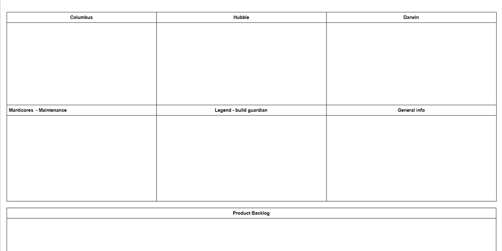

# 在Solarwinds的增量LeSS导入

**免责证明：**本文描述了其中一个SolarWinds产品组在2017年之前的情况，也就是在2020年末发生的被称为[Sunburst供应链攻击](https://www.cynet.com/attack-techniques-hands-on/sunburst-backdoor-c2-communication-protocol/)事件大约3年之前。文中的任何描述都与攻击无关。

## 背景

SolarWinds是领先的IT管理软件供应商，其产品被全球数万IT专业人士使用，使他们能够更好地了解他们的网络、应用程序、数据库和公司IT基础设施的其它元素。作为该公司的首批产品之一，网络性能监视器从2001年就在开发了。

不久之后，跟进了第二款有着类似焦点的产品。这两款产品共同形成了一个产品系列，被称为“Orion系列”。该公司意识到这两款产品有许多共同点，于是创建了一个公共平台Core - 本案例的主题。Core由5-6个团队开发。

公司是成功的，并且随着时间的推移，增加了第三、第四甚至第十款产品。

这导致该平台扩大了需要覆盖的用户用例的数量。除了从技术角度为更多模块提供服务外，Core团队（是组件团队）还需要与越来越多的模块组（由其他组件团队组成）协调工作。与组件团队一直都有的问题一致，这导致了需要耗时数月的复杂的计划和估算过程，当然，由于实际会有变更和理解偏差，在计划之后估算显然会变得无效。该公司雇佣了许多经理和伪“PO：Product Owner - 产品负责人”（实际上是PM/BA：Project Managers/Business Analysts - 项目经理/业务分析师）来处理协调的问题，每增加一个经理，优先级就会更加模糊，因为每个人都有自己的议程和优先级列表。这些管理上的“速效方案”总只是暂时“解决”了问题，因为它们的长期影响反而是增加了组织的复杂度。

管理层感到沮丧。他们曾经希望在Core中增加许多能力（新的UI样式和感觉，支持高可用性，无缝的客户升级体验）。但是Core组被模块的请求和维护当前特性占用了太多时间，从而没有产能向产品中添加新的能力。管理层采用了如下方法：独立的新建方案小组，每个小组专注于为所有模块增加一种新的能力（例如：一个新的UI框架，一个新的安装程序）- 又一个快速方案的示例。可以预测的是，这进一步增加了集成的复杂度，以及向客户交付完整产品构建的时间。

这些速效方案的失败，是因为它们没有设法解决根本原因 - Core团队（组件团队）的*存在*，因为组件团队的数量增加了计划的复杂度、依赖、交付端到端客户特性的延迟，以及协调的需求。协调需求通常会通过增加更多的协调者（一种管理*速效方案*）来解决，这进一步降低了团队理解整体产品的能力，同时产生压力以有更严格的组件边界，从而进一步增加了计划的复杂度。当然，如果移除所有的组件团队，或者一开始就没有引入，整个恶性循环就可以被消除或者避免。[图1](#figure1)以一个系统模型呈现了该动态。

<figure>

  <figcaption>图1：协调需要的系统模型</figcaption>
</figure>

然而，Core是作为一个专门的组件组织被引入的，之后可以预测的是，以下的动态就开启了（参考[系统思考的11条法则](https://en.wikipedia.org/wiki/The_Fifth_Discipline)）。增加一个新的协调者，是一个“速效方案”，暂时降低了协调的复杂度。然而结果是，组织的复杂度增长了，因此一段时间之后，协调的需求甚至比以前更高（法则3：在情况变糟之前会先变好）。这两个事件之间的延迟又使它更难被察觉到（法则7：因和果在时空上并不紧密相连）。

拥有更多的协调者（因此更高的组织复杂度）是对问题长期临时响应的结果。它的根源在过去，当第一个协调者被添加的时候，然后就有下一个，一个接一个（法则1：今天的问题来自于昨天的解）。这些步骤中的每一步看似都是无恶意和无害的，而且在当时看起来也有道理 - 再增加一个协调者（法则4：选择最容易的办法往往会无功而返）。每增加一名协调者，团队和高层管理都会变得更加依赖于协调者工作的成果（通常是一些中间的工件，例如项目计划、状态报告、为每个“故事”写下的验收标准）。很快地，没有人能够想象不靠他们组织工作（法则5：对策可能比问题更糟糕）。

## 导入范围

协调问题和更多协调者的根本原因在于组件团队的存在本身，因此解决方案就是要消除它。但是没能改变这一结构的原因是错误的管理信念（以及错误的两分法） - 相信把工作按（大型）组件团队组织是开发大型产品的*唯一*方式。

考虑到我们受限于不能消除Core组，为了至少在提高适应性和更可能工作于有价值的条目上实现一些小范围的改进，我们决定改变以下组织设计要素：

* 定义尽可能广泛的“产品”
* 减少组织中无论是显式的还是隐含的待办列表
* 减少协调者数量

本案例展示了我们如何使用这些要素向*提高适应性* - 以易于学习并转向工作于新发现的更有价值的条目 - 的系统优化目标迈出第一步。

由于我们并没有消除一阶的影响因素，也就是组件团队的存在，这导致了缓慢的和痛苦的部分LeSS导入，以及对系统优化目标的改进有限。

例如，使用Core作为初始“产品”的决定让我们无法更频繁地准备一个潜在可交付的产品，这延迟了来自客户的反馈。

被视为从第一步中取得的进展呈现在[图2](#figure2)中：

<figure>

  <figcaption>图2：本案例中描述的完美目标及进展</figcaption>
</figure>

部分导入又进行了后续步骤，但这超出了本案例的范围。这些步骤包括进一步扩展产品定义和减少待办列表的数量。参见[图3](#figure3)。

<figure>

  <figcaption>图3：导入的时间线</figcaption>
</figure>

但是首先第一件事，让我们描述产品开发组在导入之前是如何组织的。

### 初始状态

架构背景：Orion系列由多个“模块”（即组件）组成，例如NPM（网络性能监视器Network Performance Monitor）、SAM（服务器和应用程序监视器Server & Application Monitor），还有VMAN（虚拟管理器Virtualization Manager）。每个模块关注于监控客户公司基础设施的不同方面。例如，NPM监控关键网络接口上的流量，VMAN监控例如虚拟机、磁盘。可以独立下载和安装一个模块，但也可以一起安装所有模块在同一台服务器上（作为一个产品*套件*）。

在LeSS导入之前，开发组织由典型的局部优化的*组件团队*构成，如下所示（见[图4](#figure4)）：

* **模块团队** - 每个模块组（如NPM、SAM、VMAN）通常有自己的开发组，由1到3个团队组成
* **Core组** - 负责维护大多数的共享组件（如用户管理、数据库访问层）和一些用户导向的特性（如节点和卷监控），由5个（后来是6个）团队组成。
    * *该组的部分LeSS导入就是本案例的范围。*
* **新方案团队** - 由于对*共享*服务或组件的需要不断增长，Core团队无法满足交付新特性的需要，管理层制定了单独的新建方案小组。与Core组一样，每个小组都专注于为*所有*模块开发新能力（例如，新的UI框架，新的安装程序）
* **其他组** - 有些角色例如架构师或UI设计师不是工程团队的成员，而是创建了独立的职能组。

<figure>

  <figcaption>图4：LeSS导入前Orion产品组的组织架构（对于模块组，团队的数量由团队图标的数量表示）</figcaption>
</figure>

## 导入方法

### 初始产品定义

为了最大限度地提高适应性，最理想的是使用尽可能广泛和尽可能终端用户/客户导向但又现实的产品定义（第3本书）。第3本书中的“定义你的产品指南”建议使用扩展和限制的两组问题来定义产品。让我们重新回顾一下它们是如何应用在我们的案例中的。

#### 扩展的问题

**如果我们问终端客户 “我们的产品是什么？” ，他们会回答什么。**

这个问题的答案可能是“SolarWinds”。考虑到Orion客户可能不知道完整的SolarWinds产品组合，并且认为SolarWinds=Orion，我们可以安全地将此答案修改为“SolarWinds Orion套件”。

**我们是否有跨越当前所有产品的共享组件或相同功能？**

是的，实际上Orion系列的大部分代码都是共享的。它还共享相同的UI模式，如仪表盘、图表、菜单等等。

**我们的产品是什么的一部分？这个产品为终端客户解决了什么问题？**

用户（在SolarWinds的业务模型里几乎等同于客户）需要监控他们的公司基础设施，并了解那里发生的任何重要事件。

#### 限制的问题

**产品愿景是什么？客户是谁？产品所在的客户领域是什么？**

不同的Orion模块服务于不同的客户 - 例如网络工程师和系统工程师。然而，这些产品之间存在共性，公司积极尝试向已经购买了一个模块的客户交叉销售多个模块。因此，这个问题的答案会建议我们不要去限制产品定义。

**哪些开发是在我们公司内部进行的？有多少结构性的变革是现实的？**

最后一个问题是最难的。该指南包含了考虑部门边界作为限制初始产品定义的可能方式，特别是如果存在失调的管理-政治力量使其难以扩展。进一步的指南建议之后再扩展产品定义。这使得最初的变革在政治上更容易，因为LeSS导入所需的结构变化程度被最小化了。

另一方面，这里存在这样一种风险，即部门代表组件团队，因此最初定义的“产品”将仅覆盖一组组件，而不是真正的以客户为中心的端到端产品。同时，没有架构变革的话，很容易忽略LeSS实践的能达到什么预期的深度（前端到后端），作为其他支持角色或者中间的工件将可能保持不变，因为它们需要服务于不参与LeSS实践的部门，并且可能妨碍导入组。因此，虽然最初的实践可能更容易，但是组织剩余部分的力量可能足够强大，可以在之后恢复最初的变革。

从只是一组组件（而不是真正的前端到后端的定义）的部分产品定义开始的另一个缺点与管理者目前的政治博弈有关：现有组件团队的管理者希望保留现有的架构，以使其职位不受威胁。允许“产品”定义仅从一组组件开始打开了扭曲变革意图的大门，从而组件可以被错误地称为“产品”，然后组件管理者可以成为（伪）“PO”。这已经在世界各地许多伪“规模化敏捷”导入中被多次观察到。

另一种可以选择的思考方式是忽略这个问题，保持初始的产品定义不受限制。这通常意味着我们处于一个LeSS巨型的环境，会使导入更加复杂 - 我们需要将多个组纳入到初始的讨论，导入也会花费更多时间（一次一个需求领域），并且因此会更容易受公司政治影响。

#### 选择产品

正如你们所见，这不是一个容易的选择。在我们的案例中，如果我们将*扩展*问题的输出（SolarWinds Orion套件）作为这一步骤的输入，我们最终得到的产品由数十万行C#、C++、Javascript、SQL、python、go、VB6代码组成。开发产品的团队总数为30-40个，即便我们不把当前未包含的额外角色（架构师、UI设计师）算在内。即使我们设想移除所有的协调角色，并且设想减少所需开发人员来做一个简化产品，这仍然意味着我们需要比小的LeSS导入所推荐的8个团队更多（可能多很多）的团队。这意味着我们处于一个LeSS巨型的环境中。

在上述两个选项中，我们选择了第一个：将初始的产品定义限制为一个部门 - “Core”（[图4](#figure4)中高亮显示的一个多组件组）。为什么？在多个地点为多个部门做组织架构变革看起来…让人害怕。我们假设我们最初的“产品”以后将成为更大的产品中的一个需求区域，因此我们尝试让其它属性与一个典型的需求区域定义保持兼容，即：

* 合适的规模 - 导入的时候为5个团队，之后扩展为6个团队
* 部分的客户导向 - 尽管“Core” 作为提供给Orion套件其它部分的组件和服务的共享集合，Core团队自己也已经能够交付一些面向客户的特性（例如，监控和可视化网元的CPU利用率）

为了减少混淆，我们将进一步在提及Core时使用术语“部分产品”、“部分产品待办列表”等；只在提及扩展了的产品（Orion套件）时使用术语“产品”。

我们相信，这个部分产品之后将作为其他部门的榜样 - 交付面向客户的特性时减少了对管理者协调的需求。然而，后来我们意识到这不是一个好的第一选择。特别地，Core主要是一个多组件的组，服务于内部利益相关方而不是客户，这一事实导致了如下典型问题：

* 部分产品待办列表充斥着技术导向的组件任务，而不是端到端的客户特性（参见[产品待办列表](#产品待办列表)章节）
* 仍然需要大量的协调努力，将Core的工作与模块和新方案工作整合起来以交付面向客户的特性。一个面向客户的特性通常需要在模块和Core代码库两者中实现。由于两个组有不同的部分产品待办列表，最后这项工作不得不被计划、跟踪和检查。
* 每次发布前一个月的测试阶段是在模块和Core之间需要协调努力的另一个示例。

为了完整起见，我们还曾考虑但又放弃了一个反对选择“Core”作为产品定义初始范围的原因，我们从一开始就意识到：Core团队位于两地（捷克的布尔诺和乌克兰的利沃夫）的这一事实。我们至少有一点担心，在变革的第一步就包括两地的团队会太冒险。此外，利沃夫团队是供应商的员工，而不是SolarWinds自己的员工。然而，这一不利条件被认为相对较小。尽管如此，我们还是小心地克服了由地域自然产生的沟通边界，结果包括这两地并没有成为一个主要障碍。

<figure>

  <figcaption>图5：根据扩展和限制问题得出的初始产品定义</figcaption>
</figure>

将Core作为一个初始的产品（参见[图5](#figure5)），我们可以在[图6](#figure6)的特性团队导入地图上显示部分导入的进展。

<figure>

  <figcaption>图6：部分导入的特性团队导入地图</figcaption>
</figure>

## 引领部分组织实现更大的适应性

将最初的“产品”定义为Core（本质上是一个大组件）限制了我们接下来可以做的改变。本章节将描述我们如何减少协调者的数量，减少待办列表的数量，并略述了稍微宽泛的产品定义对团队协调的一些影响。

在我们开始前，让我们回顾一下所有这些活动的一些共同方面 - 我在工程部门中的个人角色以及导入前的人员培训。

### 历史

在2015年，大约在本案例发生的前一年，我是一个向公司介绍“Scrum”的小组成员，回想起来，主要是在公司引入*Scrum剧场*，但有一个值得注意的例外。我们建立了团队的概念：5-9名成员，长期的成员，部分跨职能（程序员和测试人员），但没有在整个Core范围内跨组件。在2016年，我接受了众多团队间和组间协调者其中一个职位。我的官方头衔是“PO”，但和往常大多数伪“敏捷”导入中一样，它只是项目经理的代名词。我的任务就是Core。有5个团队在一个组中工作，当时我在寻找组织工作的更好方式，例如，基于全局优先级对待办列表排序，或者寻找更频繁地收集客户反馈的方法。从LeSS开始似乎是一个自然的选择。

### 培训

我把第三本LeSS书交给了两位一线经理和一位潜在的部分产品PO，并让他们读一下第二章（*LeSS介绍*）。Scrum Masters在他们的社区中讨论过LeSS几次。我有最多的LeSS知识 - 阅读了所有三本LeSS书，并在大规模环境中作为Scrum Master工作了12年。就是这样。

回顾过去，培训是极度不充分的。LeSS导入是复杂的，需要所有相关参与者 - 管理层（一线和高级管理层都包含），工程师，Scrum Masters，业务部门 - 的深入理解。在导入开始之前，所有这些人都需要彻底理解组织架构要素对团队和整个组织的影响。这是对所有渴望开始LeSS导入的人的一个警告，不要过早开始 - 不要在他们理解组织设计和组织动态之前（开始）。

### 减少协调者的数量

#### 导入前的Core组织架构

Core工程组被组织成多个团队（见[图7](#figure7)）。团队通常是长期的，相同的人在一起待几个月甚至几年，直到自然流失或者需要新鲜空气进入团队。每个团队都有自己选择的名字，例如，哈勃（Hubble），传奇（Legend），达尔文（Darwin）。团队规模通常为5-9人，倾向于较小的规模。团队由开发人员（主要是C#，很少有其他语言）和测试人员组成。团队总是集中办公（“团队型组织”指南，第3本书）。通常，一个团队的成员向同一个工程经理报告，并且一个经理管理两个团队。Scrum Masters也存在，他们是兼职的团队成员。

团队之外的其他角色也仍然存在，例如UI设计师，文档编写者和架构师。这些员工归属不同的管理架构，并且他们通常位于美国等不同国家。当然，它（这种组织架构）降低了适应性，因为团队只能交付由这些其他专家预处理或后处理的特性，并且不能容易地变更。这个方面在[图6](#figure6)的FTAM上可以看到。这些角色的存在也产生了一些协调工作，主要由专门的协调者处理。

相反地，如果我们使用真正的Scrum团队，将所有这些角色都包含在团队中，协调工作会因此主要发生在自管理团队的内部，而不需要外部协调者。

<figure>

  <figcaption>图7：LeSS导入前的Core组织架构</figcaption>
</figure>

工程经理和伪“PO”（事实上是PM/BA）向一位对Core最终负责的高级经理报告。

团队分别位于两个地点：两个团队在捷克共和国的布尔诺，三个团队在乌克兰利沃夫。这三个乌克兰团队不是SolarWinds的员工，而是由一家供应商公司雇用，并根据合同为SolarWinds工作。然而，所有上述描述也适用于供应商员工 - 他们是由开发人员和测试人员组成的长期团队。供应商方面没有其他产品开发角色。经验最丰富的供应商员工为SolarWinds工作了将近10年。

供应商团队并不正式向SolarWinds管理层报告，而是向当地的供应商管理层报告。供应商组织指定了一名联系人，作为高级经理的对应方，负责与人员相关的决策，例如雇用或解雇开发人员。除此之外，联系人没有授权管理团队的工作。

#### 伪“PO”（PM/BA）

团队的工作条目是由伪“PO”准备的，他们并不是（真正的PO）那样的人，只是做项目管理和业务分析活动（PM/BA）的人。他们还负责与不同组（例如模块）的其他团队还有其他角色（例如UI设计师）协调团队的工作，见[图8](figure8)。

因此，PM/BA有太多事情要做，他们很少能管理两个以上的团队。当需要两个以上的团队时，会创建一个新的组织单元，有另一个PM/BA。Core有5个团队，加上3个PM/BA。

对于Core，粗粒度的待办列表优先级由一名产品经理完成，他负责与客户和业务的其它部分（例如高管、销售或市场）进行沟通。他应该担任唯一的（部分产品）PO角色。

<figure>

  <figcaption>图8：关键组以及他们与PM/BA的沟通路径</figcaption>
</figure>

#### 减少协调者的数量

[图7](#figure7)显示了有三个PM/BA分配给Core。我们决定将这个数字减少到*一个*，以减少协调者的数量，并创造压力让团队开始协调自己的工作。因此，下一步是说服三名擅长业务分析和项目管理的人员找到一个新的角色 - 即使是部分的LeSS导入，这也是一个常见的问题，“工作安全，而非角色安全”指南对此进行了探讨。

对导入来说幸运（虽然对公司来说并不怎么幸运）的是，他们中的两人决定在部分导入开始之前离开公司（因为无关的原因），并且第三个人（我自己）想成为一名Scrum Master。因此找了一个新的人选来担任（部分产品PO）角色。他从公司另一个部门的测试主管角色转过来。让一个新人担任这个角色也强调了一种新方法的导入开始了的事实。

为了提高适应性，如果这个角色由现有的*产品经理*担任，那将会更好，一个接近真正PO人选的经典Scrum选择，但组织的限制阻碍了我们这样做。他只是来自一个不同的部门，工程管理层确信，他们需要工程部门的人来负责与公司其他团队的协调。

PM/BA的关键任务之一是在不同利益相关方的请求之间保持平衡（见[图8](#figure8)），这占用了他们大部分的工作时间。由于只有*一个*PM/BA，他显然不能再用以前的标准来做这项工作，有些工作必须由团队自己来做。我们使用的技术是产品待办列表梳理和共同的迭代计划。

#### 产品待办列表梳理

每一个或两个团队有一个PM/BA，团队习惯于给到他们的产品待办条目包含更高程度的细节，通常是使用验收标准的书面形式。只有一个PM/BA改变了这种情况。由于是独自一人，他没有时间详细分析来自利益相关方的需求，因为他有更多的事情要做。他不得不花费部分时间来做优先级排序或向管理层汇报。他还必须管理完成外的工作 - 因为团队不充分的“完成的定义”而存在的任务。团队被鼓励与利益相关方交谈，以澄清他们的待办列表条目的细节。利益相关方愿意与工程师讨论，但由于他们通常位于不同的办公室（甚至是不同的时区），并且使用不同的语言，澄清对我们一些内向的开发人员来说尤其是一个挑战。团队通常将澄清委托给最有口才的团队成员，这再次造成了信息瓶颈、延迟、信息分散和丢失，以及更多的误解和“需求缺陷”。

同时，团队没有直接与用户/客户交谈，而只是与公司内部的利益相关方交谈。甚至一些内部组也没有直接与客户交谈！因此，每一组内部利益相关方对于如何实现待办列表条目以及首先实现哪些条目都有不同的想法。这产生了冲突和大量讨论 - 选择Core作为初始产品的另一个后果。

换句话说，通过引入一个PM/BA，我们减少了协调者的数量，并交给团队一些协调和澄清工作（这支持了团队的适应性），但是我们没有显著地减少协调工作的总量。

##### 尝试……分散-合并来梳理待办列表

在多地场景中尝试不同形式的产品待办列表梳理很有趣（每个团队都在一地，但不同团队在多地）。从一开始我们就很艰难，互动性和参与度与本地会议相比都较低。真正深入的讨论在正式的梳理会议刚结束之后在本地发生。看起来几乎就像大家都在等待会议的正式结束，以便可以开始交谈！我们曾经尝试了各种实验，以使会议更具有互动性。例如：

* 邀请邀请外部专家提供更多见解
* 为每个待办列表条目安排一名支持者，该支持者在会议开始前对其进行了研究
* 在会议期间使用共享文档工作

他们都没有真正帮助参与者克服由于多地设置所造成的语言、身体和心理隔阂。

最后，我们对以下使用分开-合并循环的模型进行了迭代（灵感来源于“多团队PBR”指南，第三本书）。我们用一个维基页面来开启整体PBR，PM/BA在页面上复制了他想要梳理的一列条目。团队对每一个条目进行了标记 - 是在布尔诺还是在利沃夫本地梳理。然后，并行组织两个本地的多团队PBR，在没有地域或语言隔阂的情况下团队来梳理所选的条目。这些本地会议通常所有的团队成员都会参加。

几天后再组织了一次整体PBR会议。来自一地的团队代表向来自另一地的团队代表介绍本地梳理的结果。

有时候，我们有意地让两地并行梳理相同的条目，以便可能发现两个解决方案。这种方式使每个人都有机会参加深入的本地会议，同时又能有对完整待办列表的概观。

这种模式不是完美的，团队还在继续尝试，但是我们认为它当时来说够好了。

#### 迭代计划

在LeSS导入之前，团队有各自的团队待办列表。团队习惯于*在迭代计划前*从他们的待办列表中预先选择一些条目，并将它们移到各自的虚拟迭代空间。此外，前一个迭代中未完成的条目几乎自动地添加到当前计划的迭代中。

第一个LeSS的迭代计划一会议则有所不同。不仅只有一个（部分）待办列表，而且没有预先选择，未完成的条目全部放回到待办列表中，团队被告知我们将从头开始（指南“迭代计划1”，第3本书 - 一组团队共享一组条目）。简单来说，就是期望所有决策都直接在迭代计划一会议上做出。团队很惊讶，但是都接受了这个事实，然后我们开始了这个活动。结果是，一些之前预选的和剩余的条目不再是最重要的，而不同的条目被选入了迭代。第一次计划活动的时间有些长，但是一个新的标准被建立了。

迭代计划一活动仍然存在两个问题：

* 5个（后来6个）团队的迭代计划有些长，多数时候大家被动地坐在电话旁边，等待轮到他们（发言）
* 当前的工具在对团队预测的迭代负载可视化上还不够好

以下部分描述了一个试图克服这些困难的实验。

##### 尝试……在一份共享文档中进行多地迭代计划

PM/BA为一个迭代选择了足够的条目，把它们从跟踪系统复制-粘贴到个人文档中。迭代计划活动的引导者准备了以下文件，所有团队代表和PM/BA都有该文件的编辑权限。

<figure>

</figure>

前五个单元格构成团队迭代计划的空间。每个单元格都由一个团队名称标识（例如哥伦布、哈勃、达尔文）。第六个单元格可以包含一般的迭代信息（例如迭代目标、公共假日）

PM/BA通过传达迭代目标并提供大体的信息启动了迭代计划一。回答完所有问题后，他开始将待办条目复制到团队单元格下方的“产品待办列表”区域。

每当他将一批条目复制到文档中，团队代表就开始*同时并行地*将这些条目移动到他们的单元格中。这减少了等待时间，同时增加了团队代表在迭代计划中的参与度。当第一批中的所有条目都被分发后，PM/BA复制下一批，以此类推，直到所有团队都满了为止。

每时每刻每个团队预测这个迭代做多少条目都高度可视化，其他团队可以挑战他们的决策，如果出现任何冲突则当场解决。例如，当两个团队想要工作同一个条目时，他们的代表会立即约定哪个团队更适合该条目，例如，如果他们想学更多。

通常知识最丰富的团队会认领条目，但是有时候一个团队也会想要从一个新领域拿一个条目，如果他们真得想要，知识更丰富的团队会“允许”他们拿。当无法达成约定时（这种情况非常罕见），我们不得不掷（虚拟）骰子来分配没有人想要的条目。

迭代计划一完成后，约定的计划会反映到跟踪系统中。然后，PM/BA将迭代计划一的结果通知其他人。整个会议，5个团队参加，通常不会花费超过30分钟。它减少了等待，并大大提高了透明度和协作。

### 减少待办列表的数量

#### 产品待办列表

我们的起点是有多个*显式的*和多个*隐含的*列表。

每个PM/BA都有各自为几个团队创建的*显式的*列表。

同时也有更多的*隐含的*列表。也就是说，如果团队X是任务Y的专家，那么团队X就会做Y。这是一种局部优化，它会降低团队做新的和不同的工作的适应性（敏捷性），因为他们狭窄局限的知识。这样的话，即使每个PM/BA只为多个团队维护**一份***显式*的列表，但实际上，N个有各自单一专业的团队，就会有N份*隐含的*列表。

随着多个PM/BA（以及他们的多个显式的列表）的消除，并转向所有团队只有一个PM/BA（“部分产品的PO”），多份显式的列表消失了，并只维护一份显式的优先级列表。

虽然有一份显式的列表比多份列表更具适应性，但是仍然存在一些不足，阻碍着我们显著提高适应性：

* 大多数条目都不是端到端面向客户的的*特性*，而只是组件*任务*
* 只有粗粒度的条目才可能使利益相关方受益，优先级排序通常在粗粒度级别上进行

让我们详细看看这两个问题。

#### 产品待办条目缺乏客户导向

待办列表的内容受到两个重要因素的制约：

* 初始的产品定义
* 团队设置

这两个因素都让Core团队之外的一些组保持了原样。将Core作为初始的部分产品，意味着*模块*团队存在于初始产品组之外。团队中只有开发人员和测试人员，意味着架构师、UI设计师和支持代表存在于初始的产品团队之外。所有这些组都有自己的利益，并且其中一些表现为Core待办列表中的条目。一些示例：

**架构改进** - 架构师（一个单独的小组，见[图4](#figure4)）提出了新架构要素的想法，假设这些要素在以后会带来好处。

**模块请求** - 一些请求开始是对模块团队的一个客户请求。模块团队随后进行了初步分析，并意识到该请求有一个“模块部分”和一个“Core部分”。Core部分被放入了Core列表，但经常没有带原始的业务上下文。

**工程改进** - 这些改进是由工程师自己提出的，反映了程序员缺乏增量地改进产品的能力。

**客户特性** - 一位产品经理做了市场调查的工作，并将几个粗粒度的条目添加到Core列表中。

**可支持性改进** - 通常由支持代表和与真实存在的客户一起工作的工程师带来。这些改进应该可以解决当前客户所经历的痛苦。

#### 粗粒度的优先级排序

有两个因素影响了粗粒度条目被视作优先级排序单元的事实：

* 合同游戏驱动的六个月发布周期
* 待办列表条目由*内部的*利益相关方定义

我们将在[后面的章节](#发布频率)中讨论长发布周期，现在我们会重点关注它对待办列表条目的影响。当利益相关方每六个月才有一次机会将某些东西加入产品时，他们希望这些东西能产生影响。他们看到眼前广阔的六个月空间，想象着在这段时间内能够交付的所有大的东西。因此，他们最初提出的条目通常比必要的要大，带着他们想象的所有浮华虚饰。

在这里起作用的第二个影响是，待办列表条目不是由客户自己而是由内部利益相关方定义的 - 通常是公司的中层管理人员。利益相关方花费了不同的时间与真正的付费客户在一起 - 其中一些接近于零。当他们缺乏直接联系时，他们会猜测。在猜测时，他们想要面面俱到（因为如果他们错了怎么办），因此他们提议的待办列表条目往往比必要的更大更复杂。随着利益利益相关方与真正的付费客户/用户之间的距离越来越远，这种影响也越来越大。

这种想法是基于公司高层/中层管理人员预先知道对客户最有利的是什么的假设。这很少是真的。即使所有的管理者都是领域专家（在大型公司中不太可能），他们也需要得到真正的付费客户的验证，以确保他们先前的想法对客户有益。

这两种影响导致Core部分产品开发被组织为一系列的项目（被称为版本）。每个项目都有它定义的交付物（粗粒度条目）。为了完成交付物，一系列任务被定义。这些任务形成了团队用于迭代计划的列表 - 伪的部分产品待办列表（见[图9](#figure9)）。利益相关方只对完成这些粗粒度交付物的进展感兴趣。

<figure>

  <figcaption>图9：一个项目的工作分解结构示例</figcaption>
</figure>

这与Scrum所说的真正的产品待办列表理念形成了鲜明对比：一个有序列表，包含了可以在一个迭代中完成、且有独立潜在价值的条目，该列表在每个迭代都会基于学习来进行调整（添加或删除条目、更改优先级），并由真正的PO进行优先级排序。为什么会发生这种偏差？

我们列表中的条目不是独立的，因为每一个都属于同一个交付物 - 每个条目的意义在于它对完成交付物的贡献。条目的独立性并不被公司里的所有人重视。不被利益相关方重视（他们需要交付物），也不被PM/BA重视（他们想要完成交付物以满足利益相关方）。

出于同样的原因，这些条目通常并不小，而且往往不会在一个迭代中完成。一个条目是否完成并不重要，重要的是它如何帮助完成各自的交付物。

条目排序不是绝对的，而是遵循[图9](#figure9)所示的二维方案。PM/BA有权在一列中对条目进行优先级排序，而交付物则由产品经理进行优先级排序 - 这是产品经理应成为真正的PO的另一个指示。

为什么利益相关方想要大的交付物？我们已经提到了两个原因：巨大的期望，以及六个月长的发布周期导致想要覆盖各种假设场景。让我们再加一个重要的原因。在一个有多层管理的公司中，中低层管理人员*不会*将开发产品的业务成功作为他们的主要目标（隐含的或显式的）。事实上，他们*不能*以业务成功为目标，因为他们的影响范围只是“项目”（合同游戏的所有部分）中要交付的一小组组件或一组预定义的条目。因此，他们将专注于“交付特性”，尤其如果添加的特性清晰可见，或者它的创意可以在公司内部推销时。换句话说，他们更喜欢预定义的大爆炸式交付物，而不是基于学习和反馈自适应的小的增量改进。

专注于大的交付物显然会降低全局的适应性。如果交付的条目较大，它们的交付时间也会较长，这会延迟客户反馈，并延迟我们对客户行为的假设/猜测的验证。同时，实现更大的条目往往会给产品和代码库带来更大的复杂性，使得后续开发成本更高，并进一步降低适应性。

#### 大的交付物对机会成本的影响

大的交付物也更有可能混合了潜在高影响条目和潜在低影响条目。暂缓发布潜在高影响条目，直到所有潜在低影响条目都准备好（发布），会给公司带来机会成本。让我们用一个示例来演示它。

我们的交付物包括两个条目 - I1和I2。假设I1有100个影响值（想象成销售额增加10万美元），假设I2有50个影响值。现在想象一下，在待办列表中有一个假设影响值为75的条目I3，正在等待团队来取。如果我们决定交付条目I1和I2（因为它们是同一交付物的部分），那么我们的机会成本是75-50=25。交付物越大，更有可能至少待办列表中的一些条目比当前正在开发交付物中的未完成部分有较高的潜在影响。

#### 降低计划持续时间和复杂性

六个月的发布周期再加上来自多组利益相关方的愿望清单，导致了另一个常见的问题 - 在六个月周期开始时去估算和计划大量的待办列表条目。现在由于只有一份而不是五份待办列表，这一情况更加严重了 - 列表更长，并且我们希望所有的团队都能参与估算和计划过程。

在导入之前，估算和计划过程花费了大量的时间和精力。在接下来的文字中，我们描述了两个能使我们降低计划开销（从精益的角度来看是浪费）的具体实验 - 对待办列表使用相似性分组估算，和使用“购买特性”游戏来与许多利益相关方一起计划。

让我们再次强调，与特性团队频繁交付给客户一个广泛定义的产品，并直接从客户那里收集反馈的情况相比，这一改进对适应性的影响相对较小（小一个数量级）。然而，我们认为这些实验可能值得分享，因为这一切都是通过将三份列表合并为一份列表这一事实所触发并成为可能的。

##### 尝试……通过使用相似性分组估算来缩短计划的持续时间

要求对交付物进行估算花费了大量时间。它是如何工作的？交付物的定义通常非常模糊，有时甚至与“支持设备X的监控”一样模糊。工程师们对给这样一个模糊需求提供估算感到不自在，因而要求研究的时间。“研究”（实际上是前期需求分析的同义词）被计划作为下一个迭代的产品待办条目。当迭代结束时，研究的结果会给请求该特性的利益相关方咨询。这常常导致在下一个迭代又一个研究条目，以此类推。

为了减少这种来回，我们要求团队对业务提供的所有交付物进行定期一周的研究。在这段时间之后，我们与所有团队的代表组织了一个小时的估算会议。作为本次会议的准备，我们准备了一个Trello板，其中有5个空列（XS-XL），预先填充了在过去六个月周期内完成的特性示例。因为这些条目已经完成了，所以它们的大小是已知的，可以将它们分配到合适的列（参见[图10](#figure10)）。

<figure>

  <figcaption>图10：估算会议前的Trello板</figcaption>
</figure>

板的第一列预先填写了所有粗粒度条目的标题。在会议上，团队代表以轮流的方式将Trello卡片一张一张地移动到合适的列中。总是一个条目被一个人所移动。如果下一个人不同意，他/她可以将已分配的条目移动到其它列，而不是分配一个新的特性。完成的条目用作参考，以帮助更好的比较，特别是在会议开始时，只有几个新的条目已经被分配。

这个会议通常需要花费大约一个小时，结果是如[图11](#figure11)所示的条目分布。然后，根据每个交付物对应的细粒度待办列表条目的数量，来为这些列分配相应的数字。这个数字是使用已完成条目的示例来估算的。

我们没有对单个待办列表条目使用故事点，而是遵循#不估算（#NoEstimates）假设，即所有待办列表条目*平均来说*大小相同，这一假设在我们的案例中有历史数据的支持。

另一个观察到的效果是对模糊的条目谨慎行事。例如，下图中的“AddNode API重构”条目最终出现在最后一列（XL），因为团队在估算时对它几乎一无所知。这清楚地表明条目的提出人（本例中为架构师）需要就条目的内容与团队进行更多的沟通。

<figure>

  <figcaption>图11：估算会议后的Trello板</figcaption>
</figure>

对研究限定时间以及在一个小时内完成所有估算，帮我们减少了计划阶段所需要的时间，团队因此可以花费更多时间工作在产品上，通过做来学习。

##### 尝试……“购买特性”游戏，当你有许多利益相关方时

即使在将所有条目添加到一份待办列表中之后，利益相关方仍然将某些条目看作是“他们的”，并努力将其优先于其它条目。这种态度导致（待办列表是）一份是由满足一个特定利益相关方的条目组成的待办列表，而不是由所有利益相关方都同意的经过优先级排序的列表。

为了打破这种动态，我们使用了“购买特性”游戏。首先，我们准备了所有特性的列表，带有工程组给出的估算成本，请参阅[尝试……通过使用相似性分组估算来缩短计划的持续时间](#相似性分组估算)章节。其次，我们给每个利益相关方一定数量的*虚拟资金*。表格可以如下所示：

|                          | Stakeholder | Jeff | Tom | Kate |
|--------------------------|-------------|:----:|:---:|:----:|
|                          | Budget      | 60   | 20  | 20   |
| Feature A                | 40          |      |     |      |
| Feature B                | 25          |      |     |      |
| Feature C                | 15          |      |     |      |
| Feature D                | 20          |      |     |      |
| Feature E                | 50          |      |     |      |
| Feature F                | 20          |      |     |      |
{: .grid_table_with_header .beforeEstimationTable}

然后，我们组织了与所有利益相关方的会议，他们可以将资金投资到特性上。在会议结束时，表格可能如下所示。

|                          | Stakeholder | Jeff | Tom | Kate |
|--------------------------|-------------|:----:|:---:|:----:|
|                          | Budget      | 60   | 20  | 20   |
| Feature A                | 40          | 25   | 15  |      |
| Feature B                | 25          | 25   |     |      |
| Feature C                | 15          | 10   |     |      |
| Feature D                | 20          |      | 5   |      |
| Feature E                | 50          |      |     |      |
| Feature F                | 20          |      |     | 20   |
{: .grid_table_with_header .afterEstimationTable}

在这个编造的示例中，特性A、B和F将被计划进主要发布，而特性C、D和E则被拒绝。有时候，我们会组织多轮“购买特性”，以便利益相关方重新分配资金，花费来自被拒特性上的资金。

总的来说，这种方法提高了计划过程的透明度，减少了利益相关方之间的争吵（如上面示例中Jeff和Tom一起购买特性A）。然而，它也有一些缺点。合同游戏仍然存在，尽管以一种更具协作性的方式 - 利益相关方仍然假设购买的内容将在六个月的发布中交付。此外，很难在已接受的（绿色）特性之间设置优先级 - 利益相关方还是认为*所有*特性都将交付。

### 产品广度对团队专业化的影响

在部分LeSS导入之前，团队习惯于让多个PM/BA准备工作。记得那时有3个PM/BA对应5个Core团队，因此一个PM/BA通常为1-2个团队服务。

前一段揭示了两个有趣的事实。首先，工作条目是为适合*团队*而不是个人而准备的，这与适应性作为最高目标是一致的。其次，存在多个PM/BA，这导致了隐性的团队专业化。团队专业化并不必需遵从代码中的组件边界，而是“他们的”PM/BA的专业化所带来的边界。这类单一专业化（即使它不是由代码边界定义的）与作为适应性作为最高目标并*不一致*。

通过将3个PM/BA替换为1个，我们消除了把团队往单一专业化方向推动的边界，为更广泛的知识和灵活性开辟了道路。我们没有严格的代码所有权政策，不需要*抛弃*已有的进展。我们还有一个优势，可以依靠历史经验 - 一些团队成员多年前就在开发部分产品了，他们记得那时并*没有*单一专业化。

当然，推动团队获得更广泛知识的主要工具是1）以单份待办列表进行的迭代计划，2）多团队产品待办列表梳理。我们在[减少协调者的数量](#减少协调者的数量)一章中提到了它们。在这里，我们想提及支持这一过程的另外两个因素 - 社区和维护。

#### 社区

2015年，大约在部分LeSS导入的一年前，公司引入了社区的概念。从那个时候开始，已经建立了几个社区（见[图12](#figure12)）。示例包括：安全社区，持续集成社区，招聘社区，自动化测试社区，敏捷俱乐部。这些社区通常不限于Core，而是遍布整个公司（尽管他们倾向于在一地）。管理人员积极鼓励工程师参与社区生活。一般来说，社区可以帮助其成员从其他组或团队中获得灵感，而且经常能帮助他们克服局部思维以看到整体。特别是对于Core团队的成员来说，参与社区有助于他们将Core视为更大系统（Orion产品开发）的一部分，从而减少了他们对在工作中学习Core的多个组件的抵制。

<figure>

  <figcaption>图12：社区示例</figcaption>
</figure>

#### 处理维护工作量

我们过去开发的产品的维护工作量很大。为什么？这里有很多原因。

首先，它是由产品的本质引起的。Orion是一种预置软件，安装在成千上万个客户站点非常多样化的环境中。虽然感观的产品质量很高（从每年续费维护支持的客户比例很高得到的判断），但环境的差异仍然会带来意外的情况，从而导致客户报告问题。

高维护工作量的第二个原因是系统性的和公司内部的。每个客户问题主要由支持部门 - 一个独立于工程部门的组 - 的代表处理。支持代表处理绝大多数问题，但少数最困难的问题不得不由工程组处理。

在短期内，这种设置看起来像是一个好主意（见[图13](#figure13)）。支持组处理的客户问题越多，待解决的问题就越少，需要的支持代表就越少，这就形成了一个平衡（B）回路。然而，这有很强的长期影响。当客户问题由一个独立于产品开发人员的组处理时，这些开发人员不知道客户的问题，他们很可能会开发出客户（至少是*现有*客户）不喜欢的产品。如果不了解这一动态，它会形成一个增强（R）回路，导致越来越多的客户问题，接着支持组的规模也会不断扩大。

<figure>

  <figcaption>图13：在公司内部设立单独支持组的系统动态</figcaption>
</figure>

由于我们的导入只是部分导入，我们并没有解决上述根本问题。我们的目标只是把花在维护上的工程活动用作学习机会，从而更好地理解整个部分产品，从而提高适应性。作为连带影响，我们预计报告的客户问题会略有减少。

我们的出发点是20%的工程时间用于解决客户问题。一种轮流的维护职责被建立了（基于《敏捷开发的艺术》第一版书中的[蝙蝠侠理念](https://www.jamesshore.com/Agile-Book/iteration_planning.html)）。每一个迭代，5个团队中都有1个被“牺牲”只处理所谓的客户问题。期望有两个好处。首先，剩余的团队可以在迭代中避免意外中断和切换上下文。其次，由于客户问题来自部分产品的所有领域，团队将会随着时间的推移了解整个部分产品，这将导致在开发新功能时有更明智的设计和实现决策。

中断次数稍有减少，但总体情况没有改善，因为预期的学习并没有发生。团队讨厌维护职责。除此之外，团队成员知道他们只需要每五次迭代轮到一个迭代处理客户问题。因此，阻力最小的方法是推迟客户问题的解决，直到其他人接手。已经作了几种尝试来改善这一情况。例如，来自所有团队的一组最有经验的工程师每天会面来讨论最困难的长期客户问题。或者我们尝试分享解决客户问题的成功故事。然而，这些实验都无法克服团队里缺乏学习。

经过近两年的轮流维护责任实验，团队自己提出了将部分产品分拆的想法 - 每个团队都将在某些部分产品功能上专业化，并处理与这些功能相关的所有客户问题（让我们在此强调，这种划分并没有应用于部分产品待办列表的工作 - 团队仍然应该根据优先级来实现条目）。这项建议已经被实现，虽然学习只发生在有限的范围内，但比以前还是有了更多。此外，团队能够更快地识别部分产品中他们负责部分的问题，并提出改进建议。

有趣的是，也显示了这种动态视情景（也许甚至是个人）而定的特征，与Core团队没有（或没能）从轮流中获得益处相比，轮流维护职责在公司的其它部门*却是成功的*。一些较小的组（最多4个团队）能够长期应用它，并提高了他们团队对部分产品的认识。这些组和Core之间的一个关键区别是代码库大小和部分产品的复杂性。对于Core来说，两者都高出了一个数量级；因此，一些专业化可能是不可避免的，因为理解整个部分产品和代码库的认知负荷对团队来说确实太大了。

未来，在引入专业化时，我们应该避免“每个团队都知道整个产品”和“每个团队必须专门处理几个固定组件”之间的错误二分法。我们更应该将开发人员的认知负荷视为一个系统约束，尝试在最大化约束的同时支持尽可能最高的适应性。这也是导致不得不引出LeSS巨型的同一个动态，其中PO的认知限制通常是限制因素。

可以采取多种方法，带来比固定的组件分配更高的适应性。例如，如果使用LeSS巨型，团队可以负责其面向客户的领域中的所有客户问题，而不用管他们需要了解哪些组件来解决这些问题。或者，他们可以使用偶然的专业化来分发客户问题，就像对待办列表条目采用的方式。

### 发布频率

学习在*每个迭代*都能够向客户发布软件通常是敏捷导入中的一个主要挑战。当使用连续的生命周期时，发布是一个需要许多人英勇努力的成就，需要数周甚至数月的时间（从下图中可以看出，这也是我们的情况）。变更它为频繁发布，并遵循指南“至少每个迭代发布”（第三本书）是……困难的。我们在这方面没有成功，主要是因为我们的产品定义太窄，我们必须与公司的其他团队协调发布。

尽管如此，分享一些分析可能会很有意思，这些分析显示了较长的发布周期是如何影响产品开发的适应性的。

#### 发布周期

Core每六个月对外发布一次。它总是与旗舰模块NPM（网络性能监视器Network Performance Monitor）一起发布。发布周期由[图14](#figure14)所示的四个阶段组成。正如你所看到的，这是一个具有典型伪Scrum导入模式的顺序（瀑布）生命周期 - 仅在开发（阶段）使用伪“迭代”（这并不能提高适应性），违背了真正迭代的根本含义：每个迭代都以完全完成（包括所有形式的测试）的产品增量结束。

<figure>

  <figcaption>图14：主要发布周期</figcaption>
</figure>

* **计划（Planning）：**计划的目标是确定整个版本的内容（也请参阅[合同游戏](#合同游戏)部分）。
* **开发（Development）：**开发被组织成两周的伪迭代，实际上只产出开发增量。软件通常一天集成多次，每次迭代都会生成一个可供模块使用的构建，但它*不是*潜在可发布的（有许多*完成外*工作，如回归测试，一直在增加）
* **回归测试（Regression）：**大约一个月的回归测试阶段，计划来做所有之前完成外的工作，以让软件达到可交付状态。
* **客户验收（CA - Customer Accepantance）：**这个为期一个月的阶段用于收集客户对产品新功能和整体质量的反馈。它开始于向客户提供一个发布备选构建，结束于达成一般可用（GA - General Availability）里程碑。

#### 阻碍更频繁发布的历史原因

当我们优化从客户那里获取快速反馈，以试图证伪假设的客户价值时，每六个月交付一次是不理想的。当然，长期发布背后的想法根植于管理层的信念，即我们知道该做什么，不需要试图证伪我们的假设。

尽管采用很长的顺序发布周期，SolarWinds多年来仍能开发出成功的产品，这里有两个重要的历史原因。

首先，公司逐渐形成了多种代理机制来收集反馈。产品经理们每周花费数小时与客户通电话，公司雇佣用户体验研究员收集产品可用性的反馈，客户有机会在社区门户网站上投票，整个CA阶段都专注于收集客户的反馈。

其次，公司对每个产品的六个月发布周期进行了隐式优化，每次公开发布后都会进行在线营销活动。每个活动都推动了新的销售、维护更新和品牌认识。六个月被确定为两次连续营销活动之间的最佳时间间隔。稍微夸张点，可以说一个新产品版本一直都只是市场营销活动的一个交付物。

#### 六个月发布的后果

当然，长周期发布会带来成本。我们已经在[粗粒度的优先级排序](#粗粒度的优先级排序)章节中讨论了一项 - 大的交付物。大的交付物是需要准备定期营销活动的一个后果 - 围绕大特性而不是围绕小特性更容易进行营销。

由于长周期发布本身就是一个大的（事实上是巨大的）交付物，它带来了描述大的交付物的那些所有问题，特别是[机会成本](#大的交付物对机会成本的影响)。我们在此不再重复分析，因为它是相同的。

不过其它成本也很有趣，尤其是那些形成增强回路的成本。例如，如果你很少将产品交付给客户，那么你通常不会太在意升级体验（因为升级是一种罕见的事件）。因此，升级产品通常是一种痛苦。公司中必须处理客户升级的人员（例如，支持组里的人员）会感受到痛苦，并推动降低发布频率，以便他们不需要经常地经历这种痛苦。

在我们的情况中就是如此。特别是较大的客户，每发布一个新的主要版本，就必须花费数小时，有时甚至数天来升级产品。为了扭转这一趋势，公司决定明确投资去改善升级体验（[图4](#figure4)中所谓的“举措”之一），但在撰写本案例时，该举措尚处于起步阶段，还未观察到升级体验的改善。

对于痛苦升级，一个精益的答案是：如果感到痛，就多做它。每次公开发布都是一个机会，可以识别是什么让客户的升级体验痛苦而缓慢，并解决它，以便下次升级时他们需要更少的时间和精力。通过反复这样做，我们将逐步把升级的交易成本降低到（几乎）为零，这将允许我们随心所欲地升级，并作为连带结果（据推测）会赢得更高的客户满意度。

长的发布周期还导致缺乏适当的自动化测试 - 当你偶尔发布一次时，可以接受手动测试。当你需要使用手动测试来交付产品时，你就不想经常重复这一工作 - 又一个增强回路。在我们的案例中，手动测试占据了回归测试阶段的主要部分。

缺乏自动化测试覆盖这一问题由于Core只是一个部分产品而加剧了 - 为了产出一个可发布产品，Core组必须与模块团队协调回归测试。所有集成点的协调和测试是一项人工活动，需要两个星期才能完成。

#### 合同游戏

长的发布周期也导致了所谓的合同游戏（第二本书，*思考产品管理*章节）。组织的业务方开始有一份长长的需求列表。工程方提供了估算，清楚地表明只有三分之一的需求可以在发布中交付。业务方不满意，要求工程领导交付更多。

双方多次会面，讨论增加团队产能或改变单个交付物范围的各种选择（SolarWinds中称为“马匹交易”的过程）。马匹交易需要长达两个月的时间，并消耗了工程组的大量产能。两个月后，没有人感到满意，但是在六个月的发布周期内，只剩下三个月的开发时间了，所以各方很快就一些事情达成一致，然后开始开发。当然，没有人之后想再问这个问题，“我们今天还在做着最高明的事吗？”结果是，资源被花费在那些我们通常只有薄弱推断的产出上，而推断本身随着时间的推移可能已经失效。

在周期接近尾声时，工程人员意识到最初的估算是错误的，于是又开始了另一轮谈判。程序员来寻找削减任务但保留大交付物要点的想法。如果幸运的话，他们会找到一些。但随着最后期限的临近，这一选项越来越不可能。因此，程序员查看他们的*秘密工具箱*，找到一些神奇的工具可以在截止日期前交付“原始范围”。在这个时候，他们会停止重构或编写自动化测试，会没找到根因就快速修复缺陷，等等。

#### 尝试……定期的累积服务包，以更频繁地收集客户反馈

当然，你在花时间计划和“执行”长周期的主要发布的时候，世界不会停止。使用你们产品的客户会发现许多改进方式。其中一些任务很难推迟6个月或更长时间。示例包括：

* 一个重要的安全修复
* 一个非常小的改进，但可以立即帮助完成一笔非常大的交易
* 一个影响许多客户的缺陷
* 一个与你们产品集成的其它软件新版本的不兼容

当然，当我们每一个迭代都交付给客户时，可以将上述所有内容作为待办列表条目，并对其进行适当的优先级排序。在六个月的主要发布周期中，公司使用所谓的热补丁来交付这些关键的修复。由于我们没有成功缩短主要发布的周期（这将是对适应性的一个重大改进），我们尝试使用热补丁作为一种收集反馈的方式，并试图证伪我们的假设。

在部分LeSS导入的过程中，我们显著地改变了发布热补丁的方式，事实上，将它们转变为小型和常规的次要发布。

**首先**，我们完全自动化了热补丁安装过程（不再复制二进制文件）。

**其次**，我们让热补丁是累积的，即每个新的热补丁都必须包括以前补丁中的所有内容。通过这样做，我们增加了在发布补丁给客户之前内部发现补丁组合问题的概率。

**第三**，我们已经改变了安装程序，以便每当客户安装最新的主要发布时，它都会自动安装最新累积的热补丁。这增加了安装了最新热补丁的客户数量，从而增加了对此热补丁中发布的更改的反馈量。

**第四**，我们定义了一个发布累积热补丁的固定节奏 - 每月一次。

**第五**，我们能够发布一些补丁，通过特性开关将其隐藏，为选定的客户开启它们。

所有这些变化都有助于减少[合同游戏](#合同游戏)，至少对小的条目而言是如此。利益相关方在主要发布的计划时更加放松了，因为他们知道可以在定期的热补丁中发布一些小的关键条目。

## 结论

本案例描述了，在一个属于大型产品套件一部分的多组件产品部门中，一次部分和增量的LeSS导入。我们决定使用Core（一大批底层组件）作为初始的产品，并在由5个团队组成的对应多组件产品部门中进行了导入。

这是一个错误。它将我们的思维和组织变革限制在一个大组件上，并保留了许多妨碍适应性的机制 - 组件团队、大批量发布、大的交付物，等等。可能更好的做法是，开始以整个Orion作为初始的产品，采用LeSS巨型的方式，并逐步在一个真正面向客户的需求领域开始导入。

尽管这么说，“可能的艺术”是组织变革中的一种重要心态和行为。我们并没有所需的高级管理层支持，来以“自上而下和自下而上”的LeSS导入推荐方式开始，所以我们做了我们认为能做的事情，从中学到了很多东西，并推动组织通向一些改进。

当然，这个关键的决策只允许我们在适应性方面做相对较小的改进 - 减少伪PO的数量；提高了团队的协调能力；减少待办列表的数量，让我们减少了计划的开销；使用比以前更广泛的产品定义帮助我们减轻了团队的单一专业化。

可是，影响适应性的许多方面仍保持不变。组件团队（由于缺乏跨职能和产品定义过于狭窄而存在）仍然需要管理者和其他中间人进行大量的交接和协调。产品只能每六个月发布给客户一次，每次发布都需要大量人工协调精力。这也是拿一批组件放一起称为“产品”的最初决定的后果，我们即使在本案例之后的几年里也无法克服它。

## 参考文献

我经常在文章中提及三本LeSS书。

**第一本**，《精益和敏捷开发大型应用指南》

**第二本**，《精益和敏捷开发大型应用实战》

**第三本**，《大规模Scrum - 大规模敏捷组织的设计》

其它书籍和资源直接在文章中放入了链接。
