<figure>
  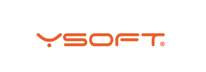
</figure>

# Evolving Y Soft’s Organizational Design

Y Soft adopted LeSS in 2019. A differentiator of Y Soft’s LeSS adoption was not only making significant *organizational design* (OD) changes, but then also <u>changing the changes</u> based on learning. Such changes are a prerequisite for being adaptive and hence making Scrum or LeSS work. Learning and *evolving* in OD is often needed based on experience. Therefore, a theme of this case study is the *evolution* of their OD elements in their LeSS journey.

Each section describes an experiment of an OD change in the LeSS adoption. It is structured as:

1. Context
2. Narrative
3. Inspection: reflection on recent OD changes
4. Adaptation: changing the changes

My role (Mark - main author) in the LeSS adoption at Y Soft was the on-site coaching and improvement of the LeSS adoption after exactly one year (January 2020) into the LeSS adoption as the only external consultant. After over a year (Spring 2021), it became a more supporting and mentoring role (1-2 days a week) towards the Scrum Masters that support the product and the teams, until summer 2022. The scope of this case study is from the start of the preparation in 2018 until late 2021.

This study ends with interesting but secondary-topic appendices on Y Soft’s related experiments with improving technical excellence, and some key preparation events.

## Who’s Y Soft?

Y Soft is a multinational software and electronic hardware company founded in 2000 operating worldwide. The company’s headquarters are in Brno, Czech Republic with other offices around the world. Y Soft products are enjoyed by over 29,700 customers around the world, including 44% of the Global Fortune 500 companies.

Y Soft’s product development is centered in the Czech Republic with offices in Brno, Prague, Ostrava, but also Copenhagen with 120+ people within Research & Development (R&D), where most of the product development takes place.

<figure>
  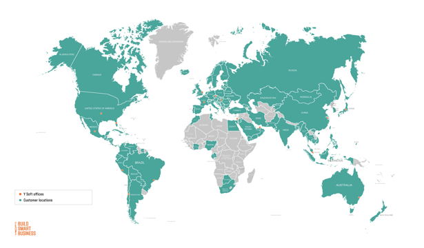
</figure>

## Product

*This section describes the status of the product involving the LeSS adoption at Y Soft, YSoft SAFEQ, in the timeframe from <u>2018 to late 2021</u>, for context of this case study. Since then, Y Soft’s portfolio has changed and extended, and Y Soft acquired EveryonePrint in 2022. These developments are not taken into account in this section. For the latest information about Y Soft and its products, visit ysoft.com.*

SAFEQ has a series of Print Management solutions for print devices. Big printer vendors have SAFEQ installed on their devices and are in direct contact with customers. For most customers, it’s unknown that they use SAFEQ.

SAFEQ has customers and vendors worldwide and their requirements might be different based on local/country strategies or regulations. Therefore, there is a constant trade-off between implementing features globally or locally and choosing which of those requirements are desired to be in the long-term strategy of the product. One of the key points why vendors & customers want to collaborate with Y Soft is their adaptability and speed to deliver new and innovative features.

SAFEQ complexity comes from different features that different print vendors and customers (in different markets) need. Additionally, vendors are using software in  many - sometimes only slightly - different devices. But even small differences in devices have big consequences for the SAFEQ installation. At the time of the case study, most installations for customers are on-premise (*note: since then, more and more customers have a cloud-based print management solution*), and therefore there is a lot of contact with vendors, and if needed, customers for installation, support etc. Collaboration happens mostly with (local) customer departments, and R&D will be involved when customer departments can’t solve the problems. At the time of the case study, Y Soft is moving to a cloud-based product, which simplifies this complexity.

In the upcoming sections, the different steps of Y Soft’s LeSS journey are explained, step by step from mid 2018 until late 2021. Perhaps there will be a subsequent case study about the steps after this. More info about the latest developments, watch back the [Y Soft talk at the 2023 LeSS conference in Berlin](https://less.works/conferenza/sessions/2023-less-conference-berlin-y-soft-case-study-huge-less-without-less-huge-316).

## 0. Before the LeSS Adoption

### 0.1 Context

Coming from waterfall-based product development, Y Soft started trying “agile product delivery”, a name they gave to their new way of working that had little to do with agility or product delivery. They re-organized into 9 *component* teams with an architect as “Product Owner” per team! it took at least 4 “Sprints” to get one feature delivered, while no team would be able to deliver this feature independently. Note that these were fake “Sprints”, since with component teams (rather than feature teams) the result of a “Sprint” is often just a set of component tasks and hence incomplete features rather than the true intention: a shippable product every Sprint. Many different roles (e.g. project managers, sales, marketing) approached and interrupted developers directly to work on features. To address the challenges with delivering customer features, Y Soft’s Vice President (VP) of R&D installed a product governance committee. They made decisions on product level and decided on features that teams needed to develop. This resulted in a heavily governed process with virtually no adaptiveness, and which didn’t give much transparency to what was going on. Additionally, people that wanted a feature or change used their connections with team managers and developers to get things done outside of the process. This demonstrated that the *easy way out* (by installing a product governance committee) *usually leads back in* and probably worsened the situation.

### 0.2 Narrative

The first attempt of a feature team was in the scanning area of the product, a recognizable area for customers. Two component teams and people from testing & releasing were merged together into one feature team and started something closer to actual Scrum. There were *no big organizational changes* involved yet, as implicitly required by Scrum, but a few changes were there to enable the team to work this way. This also led to hiring the first Scrum Master that helped in this change. The team did a first attempt for incremental & iterative development with delivery every 1 or 2 Sprints to customers. This enabled the team to work closer with customers. The collaboration helped the team to deliver the right things and avoid building the wrong things, because there was faster feedback and no middlemen in between the developers and customers. There was some increase in adapting based on learning. With this attempt for a feature team, the Head of Product within R&D (who was the manager of the team leads for all SAFEQ teams) also did a *minor* organizational change in the management structure: instead of three managers (from the two component teams and one testing team) for the new team, he selected one manager for the whole feature team. This was a first shift of management’s behavior towards a more supportive role. The experiment also led to the removal of team lead positions.

The scanning example was thereafter considered “the way to do it” across the entire R&D organization. However, due to the existing structure of the organization, and also the desire of various managers and specialists to stay in their status quo power structures, several *critical* factors were actually ignored, such as truly cross-component, cross-functional teams. In short, rather than real feature teams, they adopted trivial practice changes rather than the deep organizational design changes that would actually bring a large benefit in terms of adaptiveness, lead time, and customer delight. Therefore only a few minor things improved, and so Y Soft still looked for better ways to address their challenges.

#### 0.2.1 Organizational design elements

Before the LeSS adoption, Y Soft experimented with a few OD elements on a small scale, which didn’t affect the larger organization. These OD elements had some minor effects on the agility, but couldn’t bring the larger impacts without the needed *larger* OD changes. In short, the OD-elements that were involved in a single experiment with a single team were:

* LeSS Rule: Each team is (1) self-managing, (2) cross-functional, (3) co-located, and (4) long-lived.
* LeSS experiment: Try…Eliminating the ‘Undone’ unit by eliminating ‘Undone’ work
* LeSS experiment: Try…Work redesign

All of these OD elements were limited, because the *organization around* the single team *didn’t change*. The team was more cross-functional, co-located and stayed long together. However, it was hard to self-manage, because they couldn’t deliver a working increment without help. And their ability to deliver end-to-end customer-centric features was only from their perspective, but not from the whole product’s perspective. However, from the small perspective they had, there were some minor benefits, work redesign and functions integrated that were organized in an ‘Undone’ unit before for their perspective. More explanation about these OD elements in the [OD elements section](#125-organizational-design-elements) of the first OD experiment.

### 0.3 Inspect

The first feature team attempt and the failed expansion feature teams led people in Y Soft to search for additional external information to find out how to move forward with their Scrum adoption(s). They found the first benefits of Scrum, but were unable to gather the benefits that it could bring without *the needed organizational changes*. They found the LeSS website through Google Search, and people participated in local agile communities and events which led to some genuine interest in LeSS. Especially the presentation by Jürgen De Smet at [Agile Prague 2016: “How organizations go nuts”](https://youtu.be/QkGyVKl9CGE) caught their interest in LeSS.

### 0.4 Adapt

The supporting VP of earlier changes wasn’t completely convinced about LeSS and decided to attend a public Certified LeSS Practitioner (CLP) in February 2018 together with another VP. This became the start of truly considering LeSS as the way forward.

Examining a possible LeSS adoption, the people in Y Soft R&D realized this was a kind of change where they would need external support for. They contacted [Jürgen De Smet](https://less.works/profiles/jurgen-de-smet) with a request for collaboration around April 2018, because of their positive experiences from the CLP. Together, they crafted a budget proposal for the LeSS adoption towards the board, including the why of the change and possible success metrics. The board approved the proposal by the end of May 2018, which initiated the LeSS adoption activities to start in June 2018. This led to the preparation of the *first major organizational design changes*.

## 1. Experiment 1 Organizational Design: A Single product with feature teams

### 1.1 Context

The Head of Product decided to start the LeSS adoption and set a time in the future to have a 4-day event to follow the LeSS adoption guide *Getting Started* and follow the steps of the guide to make a proper start. They called this their ‘LeSS Flip-forward’ event. The Head of Product with product marketing (outside R&D) chose a specific product and clear scope for it to go ‘deep & narrow’, following the LeSS adoption principle *deep & narrow over broad & shallow*. The 4-day event was used to do the *structural change (organizationally & product)* at once.

### 1.2 Narrative

Y Soft senior management chose Co-Learning (today known as Simplification Officers) as their partner in the LeSS adoption. The Y Soft internal supporters (Scrum Masters, developers and some middle managers) that volunteered to help prepare the LeSS adoption and the workshops came together to understand the current situation, challenges and learn what changes are needed (see following sections). This way, the internal people could take ownership of the change itself, which is a key factor of making a successful change and really owning the change. External knowledge is then used as guidance and a knowledge base.

#### 1.2.1 Preparation for the LeSS adoption

An analysis of the Y Soft R&D context from different perspectives started the preparation: organizational, work processes and technical health of the actual code. The goal of the remote preparation is to learn about the current state of Y Soft, to acquire a better understanding for both Y Soft and Co-Learning (as the partner in the LeSS adoption) and to learn together about next steps. In the analysis were taken along:

* Analysis of internal tools like Confluence & ERP for the organizational assessment
* Evaluation of the technical health by analyzing the code, build- and deployment plans, branching strategies and architectural documentation

The technical health evaluation was used to validate and learn with the developers how to improve. An example  learning point that developers took, is to make sure that the knowledge of people that are the single points of knowledge (of certain components or technologies) would be spread amongst teams in the team self-design and to make sure team members could learn this knowledge.

The following results from the initial evaluation were addressed in the preparation of the LeSS adoption:

* Many management layers for a reasonably small organization
* No clear Product Owner - there are “team PO’s”, architects and project managers while these roles don’t exist in Scrum
* In a constant state of firefighting and checkbox hunting
* Jira workflows with more status differences than employees working with it
* +/- 75 explicit backlogs
* 898 build plans in total, maximum build time 25 hours, 50 build plans in continuous failure
* Releasing was difficult and took a lot of time, since each team focused on a specific part around (a) component(s)

The results were validated in workshops and taken as preparation for the 4-day event’s workshops.

The first step of the LeSS guide *Getting Started* is: educate everyone. The VP’s and Scrum Masters all joined Jürgen de Smet’s CLP to get a deeper understanding of LeSS. For all developers - and some others - potentially volunteering in the LeSS adoption, there was a Lego 4 Scrum workshop towards a LeSS organization. Jürgen made the workshop very intense, to really get the right volunteers and to know where they would sign up for. Emphasis is to understand it’s extremely important to collaborate with other teams, customers and users.

<figure>
  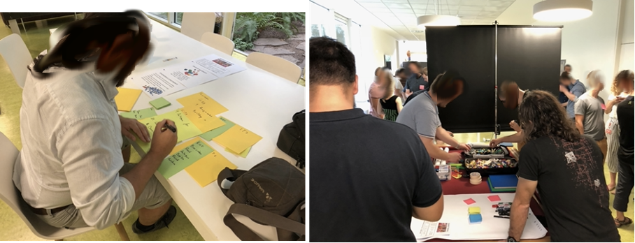
</figure>

<figure>
  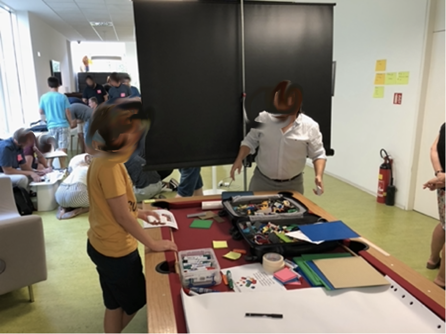
</figure>

<figure>
  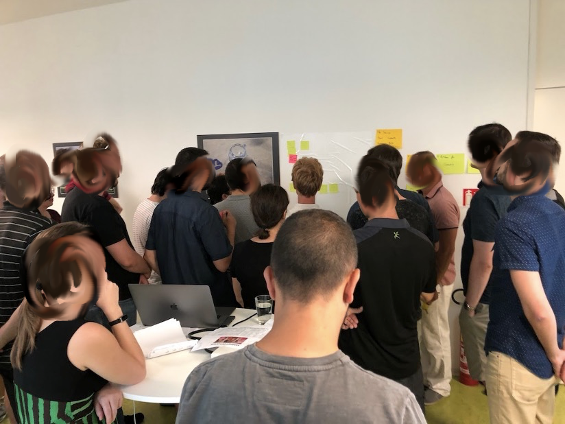
</figure>

<figure>
  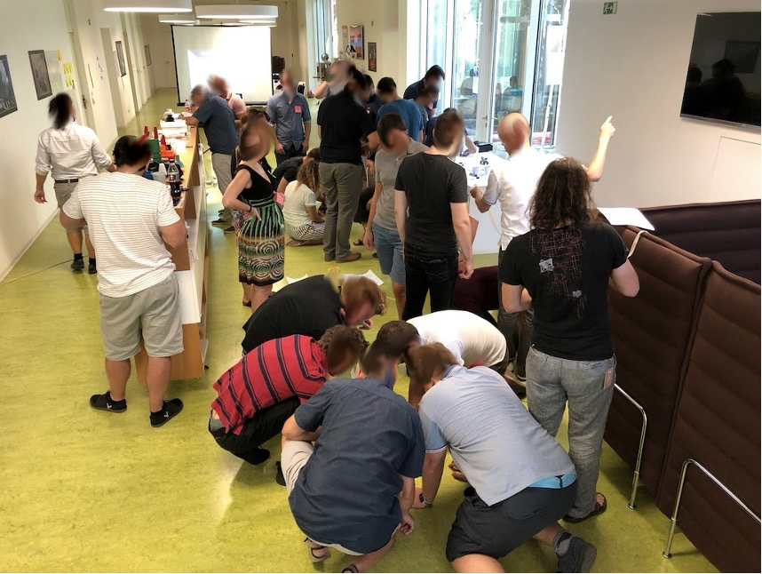
</figure>

More elaboration on the preparation for the preparation of the LeSS adoption can be found in [this Appendix](#appendix-b-preparation-to-the-4-day-events-that-kicked-off-the-less-adoption).

#### 1.2.2 Initial Organizational Improvement Kata (August 2018)

Based on the results from the preparation, an Organizational Improvement Kata was organized, based on the Toyota Kata approach. The direction and challenge that was set forward was to find the optimal organizational structure for starting in the LeSS adoption after the 4-day event.

<figure>
  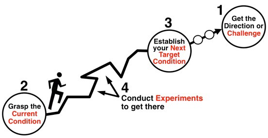
</figure>

Positive about the current situation:

* Component focus and deep knowledge of components
* Product is a central point for all requests
* UX & Security knowledge is within R&D
* Focus on support
* Lot of internal knowledge

Improvements for the current situation:

* Teams wait for each other a lot
* The build pipeline doesn’t work well on product level
* Almost no feedback back from the field
* No direct information flow to teams from the field
* Requests that go to the teams are not what the customer actually wanted
* No clarity for roles
* Support interrupts new development
* Escalations go through different channels
* Documentation is not right

A selected group was working to design a future state using the Meddlers Game from Management 3.0. They  explored options to elevate the favorable patterns discovered and eliminate most (not to say all) less favorable patterns.

The same group defined together what ‘product’ could mean in the context of the new organizational setup. Define product is the second step in the LeSS guide *Getting Started*. Volunteers from the ‘educate everyone’ session were added to get feedback on the results for the organizational setup. The whole group did a *Feature Team Adoption Map* exercise. This LeSS guide *Feature Team Adoption Maps* helps to make transparent the kind of organizational change you can expect for the LeSS adoption. It’s a representation of the gradually increasing work scope of the teams on one axis and the degree of cross-functionality of teams on the other axis.  It resulted in insights on the organizational setup and to set boundaries of what is in scope for the 4-day event that starts the LeSS adoption.

<figure>
  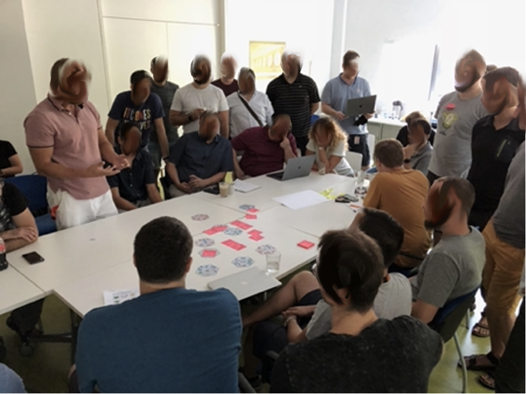
</figure>

<figure>
  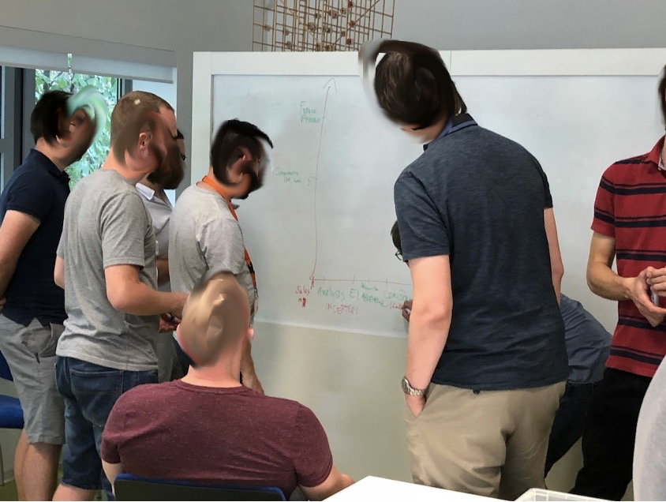
</figure>

An important observation was that nobody wanted to be the Product Owner for the newly defined product.

More elaboration on the preparation for the preparation of the LeSS adoption can be found in [this Appendix](#appendix-b-preparation-to-the-4-day-events-that-kicked-off-the-less-adoption).

#### 1.2.3 Preparing the 4-day event starting the LeSS adoption

Within Y Soft, the VP and the Scrum Masters took the lead to further prepare the 4-day event. There was no official change team and the responsibilities for all activities were taken by volunteers. The volunteers met twice a week to synchronize on progress and discuss and plan next steps.

One activity was to set up communities (AKA ‘Communities of Practice’) to be able to coordinate between teams, work together on designs and share knowledge between teams. The LeSS guide *Communities* is there to address cross-team concerns about e.g. skills, standards, tools and designs. Recommended communities include design/architecture and test. Developers were asked to set up communities they thought were useful, which resulted in many “communities” without any real impact.

Additionally external support was used to organize several in-depth technical workshops. In an event-storming workshop, volunteers linked their (technical) architecture back to business context. Teams had to move from a component focus to a whole-product focus, and these insights helped teams to better understand that whole product. Additionally, there was an internal code retreat on baby-step refactoring to bring in some necessary engineering practices for teams to move ahead. People could use the learnings of this workshop in their teams. This way, they could integrate all components in one product, including support, releasing and other activities.

One of the crucial activities that was needed in the preparation was to find a Product Owner. After searching and discussing this internally, the VP of product marketing took the role of Product Owner, as in the very first Scrum adoption at Easel in 1993. The people in his department from product marketing would help teams to get the needed customer understanding.

More elaboration on the preparation for the preparation of the LeSS adoption can be found in [this Appendix](#appendix-b-preparation-to-the-4-day-events-that-kicked-off-the-less-adoption).

#### 1.2.4 The 4-day event starting the LeSS adoption

In January of 2019, the 4-day event took place. All possible volunteers would join, including the Product Owner, management and some other supporting roles. The Head of Product explained to everyone the reason for the change in the introduction.

##### Day 1: initial Product Backlog Refinement (initial PBR)

The Product Owner shared the product vision as a starting point for initial Product Backlog Refinement. The LeSS guide *Initial PBR* is to make sure that teams have a Product Backlog with enough understood items to start working. It’s important to do at the start of a LeSS adoption, because usually the so-called “Product Backlogs” that exist follow the old structure, often functional or component focused instead of customer-focused. With feature teams, the Product Backlog Items (PBI’s) will be customer-focused and therefore the old “Product Backlogs” will often not be useful, but can be a good source for the initial PBR. Among several other reasons why initial PBR is important, it’s needed to make sure teams understand the PBI’s, instead of having PBI’s written down by one person, team or someone else and assuming others understand it.

The product vision was the starting point for the initial PBR, done together by all participants. Engineers created a marketplace, and worked together with around 6 people per item. People worked in several iterations, and after each iteration, people shared the results to each other in something like a LeSS Sprint Review Bazaar, but only for item analysis, not for done features. After the Refinement iterations, groups of people did ‘mob documenting’, where they added the results of the Refinement to the Wiki and the Product Backlog. After this, the group did estimation on the refinement PBI’s.

More elaboration on the activities of the 4-day event can be found in [this Appendix](#appendix-b-preparation-to-the-4-day-events-that-kicked-off-the-less-adoption).

##### Day 2: Creating the Definition of Done & self-design the team

Everyone participated in a Definition of Done workshop, to get to a common Definition of Done (DoD) for the product. According to the LeSS guide *Creating the Definition of Done*, it was created before the first Sprint started. Participants re-grouped and with facilitation techniques from the LeSS guide *Cross-Team Meetings*, the entire group ended up with 1 DoD with diverge-merge cycles.

After that, they did an ‘undone’ workshop to discover which activities can be done each Sprint (following the LeSS guide *Creating the Definition of Done*). People divided activities that weren’t on the DoD - meaning teams weren’t able to get that ‘done’ - into the groups. Each group defined how the activities will get done (when, where & what) to identify all the missing pieces to get to a ‘perfect’ DoD and to be able to ship the product to customers. Teams would use this Definition of Undone to improve the DoD in the future. It gave teams transparency with whom to collaborate closely about what. This gave the teams insight into how to deal with (certain types of) ‘undone’ work and what opportunities there are to improve the DoD in the future.

Then, people ‘burned’ their old teams. Teams made materials about their current teams and what it meant to them. They literally burned these materials, as a way of saying goodbye to the old teams and being able to design the new teams with a fresh mind.

Then, the team self-design workshop started. One of the LeSS adoption principles is *Use volunteering*, to engage people and it gives people the feeling of being empowered. An important part of this is to self-design the teams, meaning to let people decide themselves how the team looks like. The criteria for the self-design for the teams were:

* Team is co-located
* Size is between 6 and 10 people
* Being able to deliver as much PBI’s independently as possible
* High diversity of skills and personalities

Before starting the workshop, it was announced that only volunteers that want to be a team member (following the *Use Volunteering* adoption principle), Scrum Masters and managers could stay in the room, because they are the ones that are going to work together primarily in the new setting. All other people were requested to leave. Some architects were leaving and decided not to be part of a team. Each volunteer filled in a template ‘personal character sheet’. They included personal skills, technology skills and other important things that they wanted to add to their sheet. This sheet was used in each iteration of the team self-design subsequently. After three iterations, all team members were at least ‘ok’ with the team setup and that meant that the initial teams were final.

More elaboration on the activities of the 4-day event can be found in [this Appendix](#appendix-b-preparation-to-the-4-day-events-that-kicked-off-the-less-adoption).

##### Day 3: Team agreements & follow-up with teams

Teams started day 3 with the final iteration of self-design. After the team self-design, teams worked on several things to get to some team agreements:

* Team name
* Team song
* Guiding principles to weigh options and make decisions
* Potential struggles for the team and how to cope with that
* Work agreements

The teams were also able to choose a Scrum Master from the group of Scrum Masters (constraint: co-located). After that, each team did a Done/Undone review in its team, to learn which parts of the DoD they were able to deliver and where they should improve.

Then, participants discussed the support for the product. Besides customer features, there will be other types of work, often bugs or defects coming in, often ‘sudden’ and not plannable. A support department within Y Soft takes care of first, second and third level support of the product, directly with customers. If the support department can’t fix the problem for the customer or needs R&D for that, they create a ‘level 4’ support ticket that is handled by R&D (meaning: the teams). The newly formed teams decided that one team per Sprint takes care of these level 4 support tickets and works with the support department (and customers sometimes) to fix these problems. This team is the fast-response team from the LeSS guide *Handling Special Items*, that enables a rotating responsibility shared among the teams for support and gives the other teams focus. Because the teams in the old structure were component focused and handled this support separately, for many teams it meant that they didn’t have the knowledge to support all tickets, and as a consequence they needed to learn that.

More elaboration on the activities of the 4-day event can be found in [this Appendix](#appendix-b-preparation-to-the-4-day-events-that-kicked-off-the-less-adoption).

##### Day 4: Sprint Planning

On the last day of the event, teams did their first Sprint Planning One in the new setup, following the LeSS guide *Sprint Planning One*. Jürgen explained the purpose of the Sprint Planning and the guidelines of the Sprint Planning. The Product Owner opened the Sprint Planning by explaining the priorities from his perspective.

Each team shared which availability they had for the upcoming Sprint (holidays, meetings etc.) and the things they needed to finish that were already in progress. Additionally, they added bugs to solve. Then, there was a bazaar for teams to share their selection and design of their Sprint, for the PBI’s they picked themselves. These PBI’s were printed so teams could grab them to select and discuss with other teams who would pick which PBI.

In the next step, each team crafted a Sprint Goal individually. Then, all Sprint Goals were collected and there was an agreement on an Overall Sprint Goal for all teams combined for the upcoming Sprint. Important to mention is that LeSS - in contrast to Scrum - doesn’t require a Sprint Goal. When useful and when there is a natural clear overall goal, it’s good to apply. But when there isn’t a natural clear overall goal (e.g. because of the heterogeneity of work across teams), then it’s better to not have a common Sprint Goal.

Each team selected the - printed - PBI’s they want to work on into their Sprint Backlog (magic whitepaper on the wall) in their team space in the room. In the LeSS guide *Multi-Team Sprint Planning Two*, it’s emphasized to have the Sprint Planning Two in the same room with all teams, to be able to coordinate with other teams using the *‘just talk’* or ‘just scream’ technique.

Team members looked at the selection of other teams with the instruction to minimize dependencies between teams and move things from teams to other teams. In LeSS, there are no dependencies, because each feature team has the necessary knowledge and skills to complete an end-to-end customer-centric feature. If not, the team is expected to learn or acquire the needed knowledge and skill. The teams were new, and therefore some features didn’t have teams yet with all the knowledge and skills to deliver it end-to-end. In Sprint Planning Two, the teams coordinated between each other how to deliver the features end-to-end, with help from knowledge and skills from other teams if needed, preferably by learning them. This way, there is no dependency, because the teams together - at the same time - make sure the features get done. In hindsight, the instruction to minimize dependencies might have given the wrong perception to teams, because the focus should be on learning or acquiring the knowledge and skills, by working together with the other teams. And these are not dependencies, but simply working together to learn and get features done. Over time, that should have eliminated the perception of having dependencies, by giving the right message.

At the end, all participants celebrated with a dancing challenge! And from that moment the new teams would start working together in the new structure.

More elaboration on the activities of the 4-day event can be found in [this Appendix](#appendix-b-preparation-to-the-4-day-events-that-kicked-off-the-less-adoption).

#### 1.2.5 Organizational Design elements

A summary and short elaboration of the OD-elements that were involved in the OD experiment:

* *LeSS rule: Structure the organization using real teams as the basic organizational building block.*

Products are created by teams, while traditional organizations are built around individual accountability. Individual accountability doesn’t promote well-functioning teams that take a shared responsibility to achieve their goal. That’s why an important OD-element is to structure the organization around (real) teams and thus the LeSS guide: *Build Team-Based Organizations*. Building your organizations around teams has significant implications. Teams are the primary go to for work, rather than individuals, which also means that individuals are not shifted and ‘resourced’ through the organization. This also means that work goes to teams, instead of individuals. As a consequence, the organizational structure will stay (much more) stable and doesn’t need to be restructured, with all of its negative consequences. These teams form around customer value, not around sub-products or organizational functions. Many organizations are organized by functions, and in that case, the implications are big. Before the LeSS adoption, Y Soft experimented with cross-functional teams, but didn’t change their R&D organization yet this way. From the start of the LeSS adoption, teams became the building block for the product. The exception were the Architects and the UX specialists, who were still outside of the teams in the LeSS adoption.

* *LeSS rule: Each team is (1) self-managing, (2) cross-functional, (3) co-located, and (4) long-lived.*

As a corollary to the previous OD-element, LeSS defined what it means to be a team. Some interpretations of a team won’t give the benefits the team-based organization should bring. Therefore teams are self-managing, cross-functional, co-located and long-lived. Additionally - perhaps unnecessary - each team member is dedicated 100% of this time to one and only one team. The teams need to have the (functional) skills to produce a shippable product (and improve the cross-functionality over time). Long-lived teams need to have stability if you want them to care about how they work as a team. The teams within R&D redesigned themselves into cross-functional teams, at one location and these teams stayed together for a long time (exceptions are natural changes like people moving). Over time, the teams learned to self-manage more. However, this improved especially in the second OD experiment, when additional OD changes were made, more about that in [upcoming sections](#2-experiment-2-organizational-design-redesigning-the-feature-teams-and-removing-the-management-layer).

* *LeSS rule: The majority of the teams are customer-focused feature teams.*

Creating Feature Teams according to the LeSS guide *Understanding Feature Teams*, means that the team organize around customer value and specialize in customer domain instead of technological domain (technological specialization is an accidental specialization as it follows the customer-focus). A Feature Team is a stable, long-lived team with the necessary knowledge and skills to complete an end-to-end customer-centric feature. If not, the team is expected to learn or acquire the needed knowledge and skill. This *doesn’t* mean that every team can *deliver every feature*. For example, a big feature is splitted into customer-centric parts (instead of component or technology parts) and delivered by - often - different Feature Teams. Each team can deliver that feature (or learns or acquires to do so). In the LeSS Adoption Principle *Use Volunteering*, teams can be formed by self-design to redesign the existing teams into Feature Teams. Another option is to grow the scope and cross-functionality over time, for example using the *Feature Team Adoption Map* (LeSS guide). This way, the teams over time grow to Feature Teams. The teams working for the product redesigned themselves at the start of the LeSS adoption to become cross-functional and customer-focused. They optimized to have as many skills in their team as possible. More about that in [the inspection section](#134-inspection-od-element-less-rule-the-majority-of-the-teams-are-customer-focused-feature-teams).

* *LeSS rule: The definition of product should be as broad and end-user/customer centric as is practical. Over time, the definition of product might expand. Broader definitions are preferred.*

Before the start of the LeSS adoption the ‘products’ were architectural parts of the whole products, each with a team focusing on one part of the architecture. After deciding to start a LeSS adoption, and in preparation of the LeSS adoption, in the organizational improvement kata workshop the participants defined the product definition together. The initial product definition was the whole product - SAFEQ - and all architectural parts of it, except for the infrastructure. Additionally, all surrounding functions were included in the product definition, e.g. the support duty, regression testing and releasing the product. This included the largest part of the R&D department, and as SAFEQ was at the time the main product of the company, it affected the collaboration with most other departments of Y Soft. A broad product definition, which couldn’t be more end-user/customer centric.

* *LeSS experiment: Try...Eliminating the ‘Undone’ unit by eliminating ‘Undone’ work*

Having an ‘Undone’ unit (Y Soft had a test & release team) delays creating a done increment, delays learning and feedback and removes responsibility from teams. Therefore, the ‘Undone’ units should be removed. Most significant ‘Undone’ unit within Y Soft was the test & release team. In the team self-design, the people from the test & release team joined the feature teams. Teams made the agreement to have teams rotate for creating releases (per release) and support duty (per Sprint). This team is the fast-response team from the LeSS guide *Handling Special Items*, that enables a rotating responsibility shared among the teams for support and gives the other teams focus.

This removed bottlenecks and created big improvements on shared ‘processes’, like support, fixing bugs, regression testing and the releasing of the product. Teams learned a lot to accomplish this (and needed to teach and help each other), and after a year most teams could do most of these ‘processes’. Additionally, teams improved a lot in these processes, because they are responsible for them throughout the whole product now. It felt sometimes painful and was a lot of effort and mistakes were sometimes made, so the implications were not small. However, teams learned to know the whole product better and shared responsibility.

* *LeSS experiment: Avoid...Functional units*

Many organizations are structured around functional specializations like test, development, architecture and product marketing. These functional units lead to local optimization with limited perspective for the functional specialists. Instead, have the (cross-functional) teams as the organizational units. In Y Soft’s case, before the LeSS adoption, there were functional units within R&D with (middle) managers responsible for testing, development, architecture etc. In the restructuring at the time of the LeSS adoption, the managers became manager of a few (cross-functional) teams. The only exceptions were security and architecture, but the architects decided not to take part in the teams (yet). The security specialists did take place in teams, but were also very active to spread the security knowledge to teams without security specialists, which limited the local optimization for security.

* *LeSS experiment: Try...Work redesign*

In Scrum, teams finish complete customer-centric Product Backlog Items each iteration. This has a big impact on the organization of work, but also at the design of the work. Important in this is to design the work with broader responsibilities for teams from a customer perspective. As a logical consequence of having *component teams*, the work design within Y Soft was focused on components, technology and functions. When starting the LeSS adoption, the work was redesigned to cover customer-centric Product Backlog Items, combining tasks (of different *components* and *functions*) in the *feature teams*.

Inspecting at the [organization design principles](https://less.works/blog/2020/03/02/more-with-less-seven-tools-for-simplifying-organizations.html) from the LeSS principle More with LeSS:

We use the following organizational design principles to descale into LeSS organizations:
1. From Specialist Roles to Teams: teams became the organizational building block. Over time, specialists in certain (mostly technological) domains shared their knowledge within and outside their team, so teams would gain that knowledge instead of relying on individual specialists.
2. From Resource-Thinking to People-Thinking: the building block of the organization became teams and individual performance appraisals changed to team feedback. There was still a desire to add ‘capacity’ in the form of full teams, which suggests still some Resource-Thinking and over time this is something that slowly improved to more People-Thinking. One example of People-thinking is that the CEO found out that the compensations were below average compared to the market, and he increased the compensations massively for everyone in R&D to get above average.
3. From Organizing around Technology to Organizing around Customer Value: teams became feature teams working on customer-centric Product Backlog Items. Technology was obviously still important, but specialism was shared within and amongst teams.
4. From Independent Teams to Continuous Cross-team Cooperation: the LeSS adoption improved the cross-team cooperation and transparency on what’s going on. After the start of the LeSS adoption, there was more cooperation, but real and more continuous cooperation took a while to learn.
5. From Coordinate to Integrate to Coordination through Integration: this was still a challenge, see also [this section](#136-inspection-od-element-less-experiment-tryeliminating-the-undone-unit-by-eliminating-undone-work). Because teams became responsible for all product-related work, they started improving the preconditions and behavior to integrate continuously.
6. From Projects to Products: for R&D there were no more projects and all work came from a single Product Backlog. Though there were projects outside R&D, they had limited impact on the teams, sometimes there were PBI’s on the Product Backlog that originated from a project. These projects were used for e.g. marketing.
7. From Many Small Products to a Few Broad Products: instead of having *component teams* working on specific components and functional teams working on functions, the definition of the single product was redefined to one with many teams working on the same product. A good first step moving from many small products to one broad product. Outside this product, there were some other (still small) products in the company, but the product was the main product for Y Soft at the time.

### 1.3 Inspect

In this section, there is an inspection on the Organizational Design (OD) experiment by looking at the OD changes and the LeSS adoption. First, a generic inspection, and later an inspection on the OD-elements that were changed with the start of the LeSS adoption.

#### 1.3.1 Generic inspection of the first OD experiment

Y Soft experienced big benefits from the LeSS adoption, even though the first 3 months were bumpy and considered ‘painful’ (see below). First, all the future work was collected in one Product Backlog and was prioritized by a single Product Owner. Though this wasn’t perfect yet, teams had more clarity about priorities and could make decisions easier themselves. Second, teams were better able to see and understand the whole product, and additionally able to deliver customer centric features more end-to-end than before. Third, there were less queues and waiting time because of the improved cross-functionality and cross-component nature of teams and the shared responsibility of teams. This is the fourth main benefit: removed bottlenecks and improvements on shared ‘processes’, like executing regression tests, solving bugs, having support duty and releasing the product. More reflection on the last point is in [this section](#136-inspection-od-element-less-experiment-tryeliminating-the-undone-unit-by-eliminating-undone-work).

After the start of the LeSS adoption, the newly formed feature teams started working in the first Sprint. Teams were delivering whole features end-to-end. These features were more customer-centric (though not perfect yet). For the rest of the organization, R&D was less of a black box, because of the higher transparency of the Product Backlog and what the teams were working on. Stakeholders within Y Soft had better understanding of what was developed and could better use this in their work, e.g. in communication with customers (for e.g. product marketing).

Y Soft already had a high customer focus: customer requests are taken seriously, get priority and the collaboration with ‘vendors’ (the partners that sell the printers with the print management solution of Y Soft embedded) is intensive. People in Y Soft are passionate about the product and eager to move things forward and deliver value to customers. After the start of the LeSS adoption, teams got more in direct touch with customers and vendors, because they were working on customer-centric features instead of component requirements.

However, the transparency of the old pains also had a downside, a very predictable one familiar to groups adopting Scrum: some people blamed the new way of working and LeSS for these pains. People needed to share their knowledge with other people for whole product knowledge (which some people didn’t like), people had to do regression testing while they didn’t have to do that before, doing Product Backlog Refinement together while before some people created requirements etc. Instead of working to improve the system, the blaming prevailed. This was reinforced by some of the managers of the teams that were focusing on “efficiency” and *output* (not *outcome*), and they pushed teams into doing the things fast, and not always focusing on quality and improving the product. And that pushing of course was driven by historic “efficiency and output” management measurement and bonuses, which were removed, but people didn’t change their behavior based on that yet. However, there was still focus of top management on so-called “velocity”, the amount of work that teams did in a Sprint. That continued this behavior initially, even though there were no bonuses attached to it. Later, when things settled down and the new Product Owner (see [this section](#324-change-of-product-owners)) came, slowly the feeling of teams to get pressured decreased.

All in all, the first Sprints were described as ‘painful’, but they brought a lot of transparency to continue working on improvement. With some external support, the Head of Product and the Scrum Masters kept working on improving product development further, which was a bumpy ride.

After a few months, there seemed to be a lot of improvements in the product development. Though value was still not measured, the output and predictability of teams had grown massively. Teams felt this as important improvements for themselves, even though output (vs *outcome*) is not important if it doesn’t bring value and doesn’t contribute directly to adaptiveness. Some other signs that felt like improvements:

* Customers and vendors directly involved in some of the main features.
* Internal stakeholders showed gratitude for better results on developing features.
* Internal stakeholders worked more closely with teams.
* More interactive PBR with more sharing and learning between teams.
* More transparency on the Product Backlog and more explicit - and hard - decisions taken on the priority of features.
* Teams were visibly happier about the way of working.

Though most teams were happier, Y Soft lost around 20% of the people in the first year of the LeSS adoption. People might have felt forced into the change to LeSS, instead of being a volunteer. As the product is the one big product of the company, there were limited options to move to other parts of the organization. Communicating well about the real option of volunteering and setting expectations with people well, could have prevented part of the people leaving. Note: later the CEO found out that the compensations were below average compared to the market, and he increased the compensations massively for everyone in R&D to get above average. For some people leaving, compensation was the reason they mentioned.

##### Re-Alignment Workshop

After a few months, Y Soft realized that they needed help with their LeSS adoption. They asked Jürgen De Smet to do a series of workshops to inspect the LeSS adoption, improve further and help prepare for a future move to LeSS Huge. The first of these workshops was a re-alignment workshop to get a better understanding of the organizational system and be able to determine which system variables to improve. The CEO, Head of Product, R&D management and Scrum Master representatives participated in this workshop.

The participants created a *system model* (causal loop diagram) and identified trend metrics to regularly evaluate whether actions done would lead to overall system improvements. Some of the main metrics to evaluate that came out of this workshop were:

* Time to merge pull request
* Ratio features vs other types of PBI’s
* Time to fix broken builds
* Time to fix bugs
* Estimated business value per Sprint
* Work satisfaction
* Predictability of Sprint delivery
* Predictability of Release delivery

The resulting causal loop diagram:

<figure>
  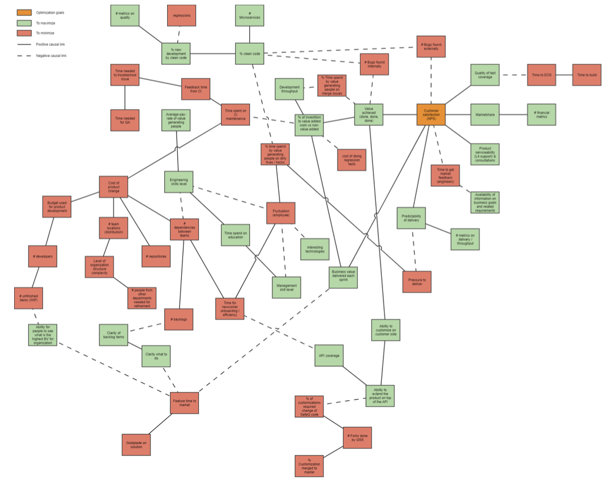
</figure>

Zoomed in on a part of the diagram:

<figure>*
  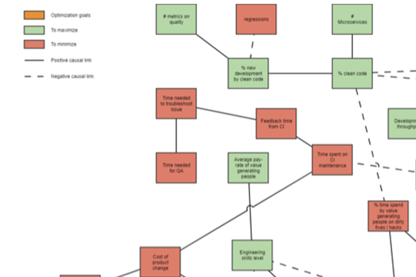
</figure>

The result of the workshop and the system metrics led to better understanding. They collected many of the insights for a while, but didn’t focus on shared understanding to really improve them. The metrics the participants chose to focus on were mostly ‘predictability of Sprint delivery’, ‘ratio features vs other types of PBI’s’ and ‘time to merge pull requests’. Teams used especially the first two often to check progress and identify further improvements. Note that the predictability metrics are *not* what is desired in Scrum and LeSS, because the optimization goal is to be *adaptive to discover highest customer value or delight*, which in some cases is the opposite of predictability. The need for predictability also originated from the past, where customer requests and agreements were not met for all sorts of reasons. Product marketing and the CEO wanted more predictability to be better able to make agreements with customers. There was no pressure from them to have it as soon as possible, as long as the delivery would be at the time (or earlier) they set together. Since the LeSS adoption, teams set the expected dates of delivery, in contrast to the previous project manager set deadlines. The intention of the workshop was to let the people from Y Soft find out their own metrics, and little emphasis was on the discussion of the results of metrics.

The results from the product development system dynamics modeling were used as the foundation for the follow-up workshop on maturity models and creating a new organizational design. The follow-up workshop was an Improvement Kata workshop to identify steps to the next target condition.

Engineers, Scrum Masters and management participated in the two-day maturity model workshop. The mixed group of participants defined a definition of ‘maturity’ in Y Soft context, and identified which roles and elements are relevant for maturity models. This led to several maturity models for the categories:

* Empowered self-driven teams
* Product Backlog
* Scrum Masters
* Managers
* Technical excellence

The participants defined areas for each category. For example, for the category ‘empowered self-driven teams’, the participants defined areas like ‘engineering skill level’ and ‘process customer feedback’. For each area, they described the definition of the five maturity levels. For example the description of level 3 of ‘engineering skill level’ was described as: ‘delivering features by our design: We are able to design and deliver the feature on our own. Where the team includes novices, they are appropriately supported (but not supervised or checked constantly) and their development planned.’

The CEO, Head of Product, middle management of R&D and one Scrum Master discussed the resulting maturity models. An external consultant did an analysis of the current state (for each category). In the preparation, the Scrum Masters used the outcomes of previous workshops and this analysis to select several topics to discuss with the CEO, Head of Product and management:

* Organizational structure (including LeSS Huge)
* Product and product area definition and setup (incl backlogs)
* Roles & responsibilities within this structure
* Communities
* Enablers to become technology leader
* Information flow and availability within the structure
* KPI structures

The group improved some of these topics after the discussion. One of the improvements was the dissolution of the architectural team, and instead architects joining the teams. This inspection led to improvements in the current OD and LeSS adoption.

##### The CEO goes to Gemba and Blogs

One of the teams in Prague invited the CEO to participate for two full days to work with them. In those two days, he joined all their meetings and participated in mob programming sessions (including coding, he started developing the product himself when he founded the company) to do actual product development.

Some highlights from his blog to the whole company about these two days:

‘After some time, I feel I have information worth sharing with everyone.’ [...]

‘I welcomed the initiative of the \<*removed team name*\> team from Prague’s R&D office to join them for a couple of days. I thought becoming an engineer (again) for two days would not only be fun, but it can also help me to explain some reasons, why we aren't more efficient. It was actually even a greater experience than I expected, so I decided to share my experience and findings with the entire world.’ [...]

<u>Day 1</u>

‘The first day we were troubleshooting a defect in \<*name of component and what it does*\>. After upgrade to a new version of the tool, it seemed that some additional configuration needs to happen before the backup can be launched. We used a technique called Mob Programming. We had about 6 people in the team, one computer and each 15 minutes, we changed who is sitting behind the keyboard. At the beginning, I thought it was very inefficient and I was pretty sure, that just two people working on it would be much faster. After two hours I realized, that thanks to the technique, the whole team – who was not familiar with the part of SAFEQ we’ve been troubleshooting – gained the knowledge and experience about it. Even I, who never seen the installation tool called \<*name*\> before, was able to write code pretty fast. I would never believe that I can actually contribute this fast, but thanks to the mobbing I learnt so quick.’ [...]

‘What really made my day was when I challenged the team, that just fixing a defect will not improve customer experience. The team actually took it seriously and added an incremental improvement: once \<*tool\>* is installed, now it will be automatically configured for the database. This is the right way, how we should work: when we are fixing something, we should always ask, how can we improve customers’ life? But that’s not all. The team also took the \<*tool*\> configuration files and put them under standard source code control, which will make it very easy for future changes. So the code is now a little bit cleaner. Again, small quick improvement. But if we do small, insignificant, improvement with every defect we fix, SAFEQ will become significantly better.’

‘To sum up my key takeaways:

* Mob Programming should be used more often as a learning technique or to fast-track newcomers.
* Lot of different tools lead to massive inefficiencies. We need efforts to simplify and better document, how are we using them (especially the tools that are use rather sporadically)
* It is possible to bring small improvements with small bug fixes and improve the life of SAFEQ users and admin.’

<u>Day 2</u>

‘We started with a refinement session. The purpose of it is to dive deeper into a certain topic and refine how it delivers value, what needs to happen and estimate efforts. These inputs are later used by product marketing for roadmap planning. The main takeaway was that there is not enough business knowledge. The teams did not have a clear idea, why \<*topic*\> is important.’ [...]

‘When the refinement session had at least one knowledgeable person (\<*example topic*\>), the meeting was very productive and it also helped many people to get acquainted with the specific problem. The estimation process was constructive and efficient. Good experience.’

‘After that I took regression testing of \<*part of product*\>. The process was well documented, but troubles with <part of product> cost me about an hour. To be honest, this work was rather boring. I define an engineer as someone, who would rather spend 3 hours by automation of something, that would manually take them about one hour… But I had to catch a train back to Brno so I did it manually.’ [...]

‘I took a short nap in the train dreaming about the day, when our engineers won’t need to do simple admin steps with no value add because even \<*component name*\> regression will be automated. Afterall, the whole IT industry is about automation, isn’t it?’

‘Key takeaways from day 2 are:

* Refinements significantly improved, but only if knowledgeable people are present
* We don’t have enough understanding how Epics deliver value and how important they are
* We improved a lot with automation, but we are still spending significant time on manual testing (but it is now improved in order of magnitudes compared to where we’ve been a year ago).’

#### 1.3.2 Inspection OD-element: LeSS Rule: Structure the organization using real teams as the basic organizational building block.

From the 4-day event that started the LeSS adoption, there was a single Product Backlog and teams directly selecting work from the Product Backlog. To enable the teams to select this work following customer value and knowing what (skills) to learn, it became very transparent that the product strategy and vision was too weak. For example, during Product Backlog Refinement the Product Owner couldn’t explain well what was needed and even during refinement priority changed sometimes. People in Y Soft were used to working in *projects* and split the work into functional and component tasks for different groups. Working from a product perspective was a massive change for product marketing, the Product Owner and the rest of the organization. Having teams as building block required this, and the Scrum Masters and VP had underestimated the effect of having teams as building block and a weak product vision.

Many people outside R&D still used unofficial communication channels to get work done from R&D, e.g. people from other departments that still contacted engineers directly. This was reinforced by some of the R&D managers that accepted this and even brought this work to the teams! Scrum Masters needed to make sure others understood they had to work with the PO directly to get work prioritized (and why work was not picked up based on priority), and that stakeholders had to help teams directly to make sure teams understood the context and value. The OD change took a while to work properly.

#### 1.3.3 Inspection OD-element: LeSS Rule: Each team is (1) self-managing, (2) cross-functional, (3) co-located, and (4) long-lived.

The teams had self-designed themselves at the start of the LeSS adoption, they were co-located, stayed together and had most of the (cross) functional skills they needed or acquired the skills. The self-management was harder to achieve. Work was defined customer-centric and teams had more end-to-end skills to get work done. However, they still hold on to reactive behavior for work to be done, improve and make sure things get to done. Because they had more of the necessary skills, it automatically became easier, but there was not more improvement.

One of the reasons was that some basic Scrum principles were not implemented well, a consequence from having inexperienced Scrum Masters in Scrum and LeSS adoptions. This resulted in low empiricism and limited learning within and between teams. For example, in Sprint Planning there was low transparency on the work to be done, and little interaction between teams to come up with the best selection of value for the Sprint. A rotating Scrum Master ‘led’ the Sprint Planning and most team representatives just wanted the Sprint Planning to be over. Consequence was that there was limited transparency on the value to deliver and the choices made, which led to little interaction and almost no discussion on what best to do next. Another example was the Sprint Review, which were basically demo’s where teams shared some of the delivered features, without feedback and without transparency about the whole product Increment. Limited number of internal stakeholders joined, and there was no transparency - and thus no inspection and adaptation - on future work in order to get feedback on next steps. On top of that, the overall feeling was that ‘improvements are for Scrum Masters’ (one team member said that literally), so teams didn’t take responsibility to improve the way they worked and collaborated. The Scrum Masters didn’t organize an Overall Retrospective in over 6 months! At the start, the Product Owner and supporting Product Marketing people took responsibility from teams, by acting as both the domain experts and customers, which prevented teams from figuring out the customers’ problems and reinforced the previous behavior by teams: please tell us what to do. These factors are not helping to set the stage for teams to learn to self-manage.

The Scrum Masters were really diligent to help and move things forward. However, this led to compensating behavior, filling in gaps that appeared and helping to ‘push’ things forward to deliver features and fix problems. However, teams didn’t learn to self-manage this way, and didn’t take responsibility for these ‘gaps’ and kept relying on others, now on Scrum Masters instead of project managers. After a while with external help, Scrum Masters refocused and improved the basics of Scrum and LeSS to improve empiricism. One example was the improvement of Product Backlog Refinement (PBR), and helping teams how to do PBR, split big pieces of work in a good way and making sure that teams were the ones to make PBR useful, taking initiative and inviting users and stakeholders.

#### 1.3.4 Inspection OD-element: LeSS Rule: The majority of the teams are customer-focused feature teams.

In the team self-design at the start of the LeSS adoption, one of the criteria was ‘being able to deliver as much of PBI’s independently as possible’. This led to teams trying to involve as many different specialties as possible within their team, instead of focusing on a specific - customer focused - part of the product. Some teams started learning from each other to increase knowledge within their team, e.g. testers learning to code and developers learning developing on more components. Other teams still had focus within their team on their old specialties, which led to a lot of handovers in the team, bottlenecks when wanting to work on certain features and limited ‘challenging’ and trying to understand the features at hand and the problems to solve. Consequence was that some teams started working on the ‘newer’ technologies for features, while other teams kept working on features that they ‘know’. This resulted in teams working on lower priority PBI’s, because those teams didn’t feel confident to work on the ‘newer’ technologies. Obviously, this didn’t help to adapt to work on the highest customer value.

This is a good example of the *False Dichotomy* thinking mistake sometimes made when adopting LeSS: incorrectly going from the extreme of a person and team knowing only one thing, to the other extreme of aiming for teams to know “everything.” The degree to which customer-area focus is important when starting to form the new teams is influenced by the difficulty in learning; in some smaller and simpler product groups this is not a concern. Although we had not adopted LeSS Huge at this point, note that this is the motivation for LeSS Huge: focusing teams within a smaller scope so that the learning required is not overwhelming.

#### 1.3.5 Inspection OD-element: LeSS rule: The definition of product should be as broad and end-user/customer centric as is practical. Over time, the definition of product might expand. Broader definitions are preferred.

The broad product definition brought initial challenges for teams to have whole product focus and understanding. This was combined with eliminating most of the ‘undone’ work and bring it to the teams, for which the challenges explained in the following section.

For the other parts of the organization, the broad product definition was also a shift. Before, they had to connect to multiple teams to get things done. While now, they had to contact a single Product Owner and work with multiple teams during Product Backlog Refinement. Overall, this went quite well, though there were some challenges in people approaching developers that they knew well directly instead of bringing ideas to the single Product Owner.

#### 1.3.6 Inspection OD-element: LeSS experiment: Try…Eliminating the ‘Undone’ unit by eliminating ‘Undone’ work

Before the LeSS adoption, there had been a component focus and many activities were scattered across the organization. Examples are the execution of regression tests, fixing bugs, other support (all spread across many component teams) and testing & releasing the product (separated team). From the start of the LeSS adoption, teams shared these activities. For example support duty and releasing the product were done by teams on turns (‘duty’), reflecting the LeSS suggestion of rotating any required focussed task (eg. handling release, surprise defects, improving the build system) across the feature teams. Teams found out that their build system and their own practices didn’t support them to be able to integrate easily and deploy their work. The build pipeline was not optimized for the whole product and consisted of many different branches, not a clear master branch, and no easy way to integrate into the master. Before, teams didn’t have the mindset to integrate their changes quickly, and created many different branches without merging to the master branch and removing obsolete branches. There was a lot of confusion on which branches to use and integration took a lot of time and effort. LeSS guide *Integrate Continuously* explains clearly that Continuous Integration (CI) is developer behavior. And to support this behavior the policies and tools should help, but the developer behavior and habits are still the main part of being able to integrate continuously. Executing regression tests and fixing bugs were - mostly, except for high urgency bugs - done by (automated) selection and if needed discussed in Sprint Planning 1.

Because the ‘undone’ work was the responsibility of the teams, the teams took more responsibility for these ‘pains’ and created more understanding of broader product matters by teams. Teams could do more - often small - improvements in how these things were done. For example when they develop a new feature, often they created automated tests as well, which made regression testing easier, faster and better. Before, the pains led to delays in delivery and quality problems in the product, which is significantly better now all teams (can) take responsibility for them. Though these pains aren’t completely gone - even not after 2 years in the adoption -, the teams reduced the pains significantly and it at least didn’t block the delivery of value. Most ‘pain’ right now is for teams having these ‘duties’ and working on these pains instead of developing (customer) features. Slowly, this is improving as well, but the biggest pains are at least conquered. Note that ‘pain’ as described here is the work that has to be done for teams, but the removal of many of the ‘undone’ work made the pain for the product significantly less, as a consequence of the OD change.

#### 1.3.7 Inspection OD-element: LeSS experiment: Avoid...Functional units

There were several functional units prior to the LeSS adoption, which will be inspected in this section. In the team self-design, the Head of Product identified three types of specific roles that could either join teams, or stay outside of teams (use volunteering):

* Security specialists
* Architects
* User Interface (UI)/User eXperience (UX) specialists

From the start of the LeSS adoption, the security specialists decided to join (different) teams and spread security knowledge across teams, being ‘regular’ developers. They set up a strong community, invited all teams to send a representative (‘security champion’) to the community, to share knowledge and make sure each team knows the basics of security. The Head of Product and teams considered this approach successful and all teams were able to address at least the basic needs in regular development on security. Teams brought more complex matters to the community or they moved it to teams with security specialists. Teams felt more sense of urgency on security, which was a great result from spreading this knowledge across teams.

The architects decided not to join teams and stayed a separated group at that time. Following the LeSS adoption principle *Use Volunteering*, there was job safety for them (but not role safety). The agreement was that they couldn’t be blocking any developments and if they wanted to have influence on the product, they needed to work closely together with teams. Some of the architects did this quite well, and some architects didn’t like to work this way and eventually left. A few of the architects joined teams along the way, and from the next *significant OD change* (see [upcoming section](#2-experiment-2-organizational-design-redesigning-the-feature-teams-and-removing-the-management-layer)) they formally became part of a team. Their knowledge in teams helped teams to better understand the product, and the architects got closer to the actual product. This way they had much more impact, because they spread their knowledge more across the organization.

The UI/UX specialists decided not to join teams. In a later stage, they experimented to join teams, but teams and the UI/UX specialists didn’t consider it a success. In the experiment, they were working ‘in’ a team, but basically doing their own work and not getting involved in the teams much. For them, there wasn’t much overlap with the work of the teams, and teams saw no benefit in having them in the team, because they were mostly working on non-product related work. This was the general conclusion, and they moved to other parts of the company where they could use their skills. In the meantime, some teams had hired ‘frontend developers’, who were hands-on and joined development in teams. Their role was useful for teams and helped them in addressing ‘frontend’ work better.

The Product Owner was the manager of the product marketing group, organizationally located within Marketing, outside R&D. Most members of the product marketing group worked closely with the teams, similar to the PO *representative* or *Supporting* PO from the LeSS experiments ([Practices for Scaling Lean and Agile Development](https://www.amazon.com/Practices-Scaling-Lean-Agile-Development/dp/0321636406)). The PO representatives organized themselves mainly around ‘topics’, often customer centric features but also e.g. around requests or bugs from specific vendors. The PO representatives took their main role in Product Backlog Refinement, but also had an active role in Sprint Planning and Sprint Review. They discussed together with teams the importance of features and helped in making trade-offs. However, they still acted as a separate functional unit and while the collaboration had improved, teams weren’t able to do the work related to product marketing themselves and always needed to work with them to get things shipped.

The group of Scrum Masters worked within R&D, but acted as a functional unit. They were very diligent and were closely collaborating together. A downside of that was that they were too focused on the group of Scrum Masters and less focused on other important aspects from the Scrum Master role, especially supporting the Product Owner. Their main focus to teams was to organize and facilitate team- and multi-team events. We did a system modeling session with the Scrum Master group to understand the system and the main challenges. This led them to understand that they should address certain challenges where they were not focusing on. It was a start for them to understand the system better, understanding which challenges to address and how to make these things transparent. Very soon the group started taking the approach to make topics that they wanted to address more transparent, especially around the product (mainly the Product Backlog). With some support, the group of Scrum Masters were soon focusing on the main challenges, instead of the smaller focus they had before and their own group.

Considering these functional units, the best improvements resulted from the functional specialists when joining the teams. The OD change to avoid (and thus remove) functional units leads to major improvements in adaptiveness, but has serious consequences in the organization.

#### 1.3.8 Inspection OD-element: LeSS experiment: Try...Work redesign

When starting the LeSS adoption, the work was redesigned to cover customer-centric Product Backlog Items, combining tasks (of different *components* and *functions*) in the *feature teams*. The teams struggled with this in the beginning - coming from component teams - because they weren’t used to seeing the whole product and the customer perspective. Working more closely with vendors, large customers and internal stakeholders that work directly with customers and vendors led to better understanding of the customer domain, and less ‘whispering game’. Before, teams received their work mainly from project managers or internal stakeholders, with almost no interaction to real customers and users. Starting defining customer-centric PBI’s required learning from the teams, especially in the area of refinement and work design. Over time, the teams got better at this and the OD change to redesign the work led to this improvement eventually.

### 1.4 Adapt

A summary of the main adaptations that happened in this experiment:

* A single Product Backlog with a single Product Owner
* Cross-functional and cross-component teams with shared responsibility for the whole product
* Teams shared the common work for the whole product (support duty, fixing bugs, regression testing & releasing) instead of having separate ‘undone’ units or teams
* Teams to self-manage (and improve in this area)

This brought the following main results:

* More emphasis on technical excellence
* After a while, better focus on whole product releasing
* Define Product Backlog Items more customer-centric combining component and *function* tasks in the end-to-end Product Backlog Items
* Teams being able to pick up more customer-centric Product Backlog Items and work together with other teams to learn when needed

After the re-alignment workshop, the Head of Product decided to add external - more intensive - help in their LeSS adoption, mainly focused on the mentoring of their Scrum Masters. This way, the Scrum Masters could learn and be able to move things forward by themselves. This is when the main author came in.

Based on the inspection, after a year Y Soft wanted to make the next big step forward. This next step involved a team redesign, removing the managers within R&D and the Scrum Masters role becoming the agile coach role and getting other people onboard with more experience in organizational design and team coaching. Y Soft CEO and Head of Product had several reasons for making the next step:

* Extend self-management of the teams, remove delays in decision making and increase organizational level transparency. The CEO decided to remove the management layer between the Head of Product and the teams, to get more transparency on things that happen within teams on organizational level and less people required for decision making (to get rid of delays in decision making) by removing the management layer.
* The amount of people (& teams) in the product has grown and the teams differ greatly in size. Teams hired new people and incorporated other roles (e.g. architects). The Head of Product added a full ‘team’ to the product from the infrastructure department (still as a component team), from which the skills needed to be divided between the teams. Additionally, the CEO and the Head of Product had the desire to add extra teams (capacity), so two new teams (fully hired from a consultancy company) started.
* Both teams and management wanted to improve the ability of teams to deliver end-to-end customer centric features better. This would result in more cross-functionality in the teams and teams being able to work on more parts of the product. Some teams realized that they needed to improve their range of skills to be able to deliver end-to-end customer centric features better. Some of these teams had a too wide range of specialist skills, and they needed some customer-area focus to be able to *easily* get better and learn within a certain focus. And not necessarily focus on being able to work on *everything* in the Product Backlog. These teams wanted to change team designs to optimize this. This resulted in top-down and bottom-up (for most people) support for the step forward.

The next step was a second event that made *significant Organizational Design changes* and next steps in their LeSS adoption. They called this ‘Flip 2’, after calling the initial 4-day event that started the LeSS adoption ‘LeSS Flip-forward’ or ‘Flip 1’. Basically, certain steps of the LeSS guide *Getting Started* were repeated. A summary of the OD changes:

* Team (self-)redesign
* No more managers directly for the teams

The context and narrative for these OD changes are described in the next section.

## 2. Experiment 2 Organizational Design: redesigning the Feature Teams and removing the management layer

### 2.1 Context

As mentioned in the previous section, a new event was set forward to start the next OD changes. The event was planned on May 11th, already in February of 2020, before the COVID-19 pandemic arrived. The Head of Product decided to still move on, because 1) it was not clear when it would have been possible in real-life and 2) they didn’t want to postpone the further improvements and steps forward.

The main changes that happened were:

* **Team redesign**: people self-designed into ‘new’ team designs. The teams optimized themselves to ‘deliver more end-to-end customer value’. Additionally, the remaining architects and the infrastructure team people joined the teams.
* **No more managers directly for the teams**: managers became either agile coach or left Y Soft. Teams designed ‘macro-processes’ to define how e.g. hiring, performance evaluation, and escalations will be handled without managers.
* **Scrum Master role replaced for agile coach**: the Head of Product concluded that the Scrum Masters had a narrow scope of attention (mainly on teams) and too little focus on the larger system and organization. Additionally, some teams had negative experiences with some Scrum Masters, for the same reason. That’s why the Head of Product decided to start working with agile coaches that had explicitly more emphasis on a broader scope of attention. Some Scrum Masters became agile coach, most Scrum Masters left Y Soft. In the upcoming sections, there will be a reflection about this situation and reasoning.

In the next section, the narrative of these changes and the reasoning behind these changes are described.

### 2.2 Narrative

In the second round of OD changes, certain steps of the LeSS guide *Getting Started* were repeated and improved. There were a couple of reasons for Y Soft to do these OD changes, which are listed below.

* **Extend self-management of the teams and remove the managers** The CEO and Head of Product concluded that the managers limited the self-managing capabilities of the teams, caused delay in decision making and filtered information towards them. The role of the managers had already changed since the start of the LeSS adoption, where they were structured to ‘manage’ two cross-functional teams instead of their component or functional responsibility. The managers didn’t have responsibility for the results of the team. They mainly needed to deal with HR practices. However, the different managers filled in their roles in different ways. Some managers took a proactive role in escalations, negotiating between ‘stakeholder requests’ and the work of the team. While other managers focused on supporting the individual team members and stayed away from any influence on the team's daily work. Some of this behavior led to dysfunctions and less self-management from teams. When the managers were removed, there was no drop in “predictability” and output of teams. Historically, the managers in R&D were an interface and escalation point for the rest of the organization. Removing this role without having clear ways to do support, releases, prioritization, working together between teams and the rest of the organization, would have been harmful. At the time it happened, it was possible because of the pre-conditions just described.
* **Functional teams added to the LeSS adoption and many new people joined the teams** There were several causes for changing within the teams: teams hired new people, people from other departments that joined teams, architects that - informally - joined teams, and people leaving led to differences in team size. Additionally, the Head of Product added the Infrastructure team to the LeSS adoption, but still in their original setup as a component team. They wanted to become more cross-functional and other teams wanted to have more skills related to infrastructure.
* **Desire to improve the ability of teams to deliver end-to-end customer value better** The general conclusion amongst teams was that in the initial team self-design at the start of the LeSS adoption they designed too much to have as many skills (functions and parts of the product) in their teams as possible. One of the criteria for teams in the initial team self-design (‘Being able to deliver as much of PBI’s independently as possible’) wasn’t explained clearly enough, in hindsight. It led to teams ‘collecting’ as many skills as possible in their teams across the whole product, instead of looking at a good cohesion of skills to deliver features end to end. As a result, in many teams, team members were working individually on ‘tasks’ and handing over work between each other. People didn’t teach others in their teams their skills, because their skills were too different.

#### 2.2.1 Preparing the second event with organizational changes

The Head of Product decided that this second event shouldn’t be as big as the 4-day event that started the LeSS adoption, because people were already used to working closely together. Additionally, COVID-19 caused a lockdown so nobody was at the office. In [this LeSS conference video](https://www.youtube.com/watch?v=k6MD4kW0Xwo&t=2s) and in [this blog](https://co-learning.eu/2020/06/11/a-full-remote-highly-collaborative-teams-self-design-workshop-with-80-people-yes/), more details are shared about how Y Soft did the team self-design remotely. To have an effective preparation, the preparation was splitted in different workshops. After the explanation and the announcement of the way forward, the teams were asked on behalf of the Head of Product to re-design themselves to be able to deliver end-to-end customer value better. The Scrum Masters and the onboarded agile coach organized two workshops to help teams do this.

**Team design workshop 1**

Goal of this workshop: form (draft) team designs and learn about the possibility of end-to-end feature delivery by teams.

There are three sites with teams working on the product. On the biggest site (more than 50% of the teams), teams already started an initiative to improve the current team designs. From that initiative, a couple of team members helped in preparing for the workshop. Important input from these team members was e.g. the current status of the (draft) teams and the most common team size number.

Learning: because the 3 sites differ in size (8 teams after the workshop on one site and 2 + 3 on the two other sites), we could have differentiated the way the 3 sites were preparing and participating in the workshop. The individual team discussions about who would be in which team, were complexer for the biggest site. For the two smaller sites, the involvement from teams in some parts of the self-designing iterations was significantly smaller. For similar future situations with differences in size of sites, it would be good to consider how smaller sites would participate, but still include them in deciding how the team of teams as a whole would optimize best.

We split the team design workshop in two workshops on purpose. In co-located team designs, team members often chat in breaks about the team design. Learning from previous team designs is to take 30 minutes breaks between iterations to let that happen. Otherwise, these discussions will happen after the workshop and teams will change afterwards. Remotely, this chat in breaks is hard to accomplish. We organized a week between the first and second workshop, so team members could reflect and discuss open issues or concerns.

We used Miro to facilitate all steps in the workshop. During each step, the participants themselves were moving in Miro and adding/changing things. At maximum, 95 people were active in Miro at the same time. Most important facilitation tip: don’t have central discussions. Use other techniques for that, like taking 5 or 10 minutes after each breakout session to read the results or adding questions in sticky notes to someone else’s input.

To help the teams reflect on their ability to deliver customer-centric features end-to-end,  in the third round of the self-design, teams did an exercise on the work of the Product Backlog. A selection of the epics (*note: an ‘epic’ is a cluster of PBI’s together in Y Soft, following the tooling they use for the PBL*) were prepared on the Miro board by the Scrum Masters and agile coach in a table. Each team could indicate whether they can deliver that epic end-to-end or were willing and able to learn it. Teams evaluated the possible epics for their team and added a green sticky note (we can deliver it end-to-end) or an orange sticky note (we are able and willing to learn to deliver it end-to-end) to the main table, see [appendix](#team-design-workshop-1) for more info. In advance, it was made clear that the results wouldn’t wouldn’t be used afterwards to see which teams could deliver which epics. There was fear of some teams that this transparency would be used to challenge them later why they wouldn’t work on a certain epic. Of course, teams could use the outcomes of the exercise themselves afterwards if they wanted to.

Participants ended with adding one possible concern for the team design. This input was used by team members, but also by the Head of Product to work on during the time between the first and the second workshop.

**Team design workshop 2**

Goal of this workshop: finalize the team design and identify follow-up steps to improve continuous learning for the future.

In the week between the two workshops, participants discussed many open ends of the team designs. Some teams were too big and some people didn’t have a team yet. The Head of Product addressed that it could be a valid outcome that someone wasn’t part of a team, and teams shouldn’t be forced to include members in their team they didn’t want to. The Scrum Masters, agile coach and Head of Product had a good overview on the status and helped by talking to the right people to get some things moving in between the workshops.

The second workshop had a similar structure to the first one. People used the online collaboration tool in the time between the workshops to keep progress of changes in their team design. After a summary of the status and a new iteration, the participants collected blocking concerns. There was a short breakout session about the single blocking concern that was voted as blocking by the participants. One person that was desired to move to another team was sick and therefore both teams involved didn’t want to make the final decision. They agreed to solve this when this person was back, and teams voted again: ‘after this action point, is there another iteration of self-design needed?’ The answer was no by a large majority (just 2 people wanted another iteration of self-design) and the team design was final.

At the end of the workshop, people identified three types of next steps, 1) needed to address on event, 2) needed to address in the first new Sprint, 3) needed to address in the follow-up two Sprints.

More info on the preparation workshops can be found in [this appendix](#appendix-d-preparation-and-start-event-of-the-second-experiment-of-od-changes).

#### 2.2.2 Second event with organizational design changes

The start event for the OD changes kicked off the work in the new teams and working without managers. The event itself was mostly a day of ‘celebration’ and a formal start of a new step. Due to COVID-19, also this event was remote.

The CEO kicked off the event by thanking everyone for their active participation and important contribution to the overall strategy and success of Y Soft. He explained more about the changes in the company strategy and the importance and need for all teams to understand this. He also talked about the ‘manager-less’ organization, because from that moment all managers in product development were removed. Teams came up with a team name (and a logo if they wanted) and discussed important team values for them, how they collaborate, and how they make sure they learn (from each other). Teams solved - with buddy teams - how to handle the fast-response team role to get new teams up to speed.

Without managers, teams came up with ‘macro-processes’ that are important aspects that used to be taken care of by managers that teams have to take care of themselves from now on. Examples of macro-processes are ‘on-boarding of new employees’ or ‘hiring new employees’. Teams used the time to choose the most important macro-processes to make a draft on how to deal with the macro-processes among teams.

The morning after, the first Sprint with the new teams started with Sprint Planning. Teams were asked join with the whole team (instead of only representatives), for two reasons:

* For teams with people that don’t know each other’s skills well yet, they can discuss together to select PBI’s.
* The Product Owner (starting a month the event) had a more strategic outline for the upcoming period prepared.

After the Sprint Planning, teams moved to their Sprint Planning 2’s and started working together in the new set up.

More info on the second start event can be found in [this appendix](#appendix-d-preparation-and-start-event-of-the-second-experiment-of-od-changes).

#### 2.2.3 Organizational Design elements

A summary and short elaboration of the OD-elements that were involved in the OD experiment:

* *LeSS Rule: The majority of the teams are customer-focused feature teams.*

As inspected upon from the previous OD experiment, teams tried to involve as many different specialties as possible within their, which led to limited collaboration and learning, and a lot of handovers in the team with bottlenecks. In the second team self-design, teams did an exercise on the work of the Product Backlog to evaluate whether they could deliver a certain big piece of work (‘Epic’) end-to-end in their team or were willing and able to learn it. This helped the teams to focus on certain parts of the Product Backlog (specializing in customer domain), instead of trying to have skills for as many Product Backlog Items as possible. Additionally, in the team self-design, the architects that were still at Y Soft formally joined the teams. These were hands-on architects that developed themselves and taught teams the broader product.

Introduction on this LeSS Rule in [this section](#125-organizational-design-elements) of the previous OD experiment.

* *LeSS experiment: Try...Expanding Product Definition*

The initial product definition is often less than perfect. By expanding the product definition - by improving the Definition of Done - organizational improvement happens. Teams learn or add skills that they didn’t have before. In this second OD experiment, the infrastructure team that was outside the LeSS adoption joined the team self-design and people moved to the feature teams. This way the Definition of Done of the product extended and part of the undone work was included in the teams.

Introduction on this LeSS Experiment in [this section](#125-organizational-design-elements) of the previous OD experiment.

* *LeSS guide: Prefer Specialization In Customer Domain*

A common misunderstanding of feature teams is that it leads to abandoning specialization altogether. Specializing is multi-dimensional, not only on technology but also on customer domain. Specializing in a customer domain (that might change over time for a team), often means *accidental specialization* in certain technology (*plural*) for the same type of features for that customer domain. The teams didn’t specialize in technology, but rather tried to have too many specialisms in their team to be able to collaborate on customer-features, limiting specialization on customer domain. In the second OD experiment, teams reflected on which types of features they were able (and willing) to work on, to specialize in a certain customer domain.

* *LeSS guide: Managers Are Optional*

In LeSS, managers are optional. Managers can perform a useful role, but most (large) organizations have no shortage of manager roles and positions. In a LeSS organization, the preference is to move responsibility to teams instead of assigning them to manager roles. From the second OD experiment, there were no managers for the people in the teams, there was only the Head of Product, but he wasn’t dealing with most of the traditional management responsibilities. These responsibilities were now for the teams, with close collaboration from the teams with HR. This guide is related to the LeSS experiment *Try...keep the organization as flat as possible*.

* *LeSS experiment: Try... Engage HR*

HR practices are a major obstacle in many organizations, only a few have succeeded in changing HR practices. Traditional HR practices focus on *individuals*, while in agile development *teams* are the driver, which causes systemic conflict. To foster real teams, HR practices need to change, like rewarding and performance review. To be able to do that, it’s important to engage HR specialists, and educate them why agile development affects HR practices. In Y Soft, HR specialists (including recruitment) started to work closely with the teams in the preparation of the second OD experiment. Teams became responsible for many prior management responsibilities and thus needed to work with HR. For example, hiring new people and promotions. From then on, they had to work closely with HR and HR was well involved in the work of the teams to be able to support them, e.g. for the recruitment of new people. In [this section](#235-inspection-on-od-element-less-guide-managers-are-optional), more details are shared about how the teams worked without managers. One of the experiments from LeSS that were tried for this is *Try...Team does the hiring*.

* *LeSS experiment: Avoid... Incentives linked to performance*

(individual) Incentives linked to performance are based on old assumptions that people are in control of their performance and are motivated by rewards. Recommendations are there to *‘decouple the task from the compensation’* ([source](https://www.alfiekohn.org/punished-rewards/)). In the first OD experiment, there were attempts to give team rewards that helped team collaboration. However, these were still incentives to performance, which didn’t work perfect. Additionally, some of the managers were still ‘rewarding’ performance of individuals, even though there was no real incentive for it. From the second OD experiment forward, there were no more incentives linked to performance, individual or team. Teams could distribute bonuses within their team once in a while, when the organization had done well and all teams got equal bonuses. Relevant experiments from LeSS in this regard are *Try...Team incentives instead of individual incentives* & *Avoid... Performance appraisals*.

Inspecting at the [organization design principles](https://less.works/blog/2020/03/02/more-with-less-seven-tools-for-simplifying-organizations.html) from the LeSS principle *More with LeSS*:

We use the following organizational design principles to descale into LeSS organizations:

1. From Specialist Roles to Teams: already in the first OD experiment, teams became the organizational building block. For the second OD experiment, teams took the lead and the basic foundations of taking responsibility were easy because teams were used to taking responsibility and working together.
2. From Resource-Thinking to People-Thinking: learning in the first OD experiment, Y Soft HR and Head of Product were focusing more on what teams and people need, since the teams as basic building blocks created transparency on how people felt and what they needed.
3. From Organizing around Technology to Organizing around Customer Value: in the first OD experiment this was restructured, and in essence this hasn’t changed in the second OD experiment. However, teams increased their learning in the customer domain and e.g. worked closer with large customers on certain customer-centric features.
4. From Independent Teams to Continuous Cross-team Cooperation: at the start of the LeSS adoption, teams focused on their own work. Increasingly, they started collaborating more on large features and worked on those together. Especially when company strategy changed and as a consequence the Product Backlog changed a lot (due to COVID-19), teams needed to work together to discover and learn what’s needed in the new strategy and technology. This was around the second OD experiment, and redesigning helped the teams to focus on this more.
5. From Coordinate to Integrate to Coordination through Integration: since the first OD experiment, this was still a challenge, see also [this section](#136-inspection-od-element-less-experiment-tryeliminating-the-undone-unit-by-eliminating-undone-work). Because teams became responsible for all product-related work, they started improving the preconditions and behavior to integrate continuously. Teams continued to work on improving technical excellence and their integration behavior, also in the second OD experiment.
6. From Projects to Products: over time, no more requests from the sideline were coming to the teams. This didn’t change because of the second OD experiment, but continued from the first OD experiment.
7. From Many Small Products to a Few Broad Products: the product definition didn’t change for the second OD experiment. However, by adding the people from the infrastructure team into the teams, the Definition of Done extended to make the product definition broader.

### 2.3 Inspect

#### 2.3.1 Generic inspection of the second OD experiment

The prior OD experiment involved more profound changes on the OD. Consequently, there is less to inspect on for this OD experiment. A topic worth inspecting on generically is the move from Scrum Masters to agile coaches from the second OD change forward.

Why agile coaches and not Scrum Masters? At a certain point, the Head of Product concluded that the Scrum Masters had a too narrow scope of attention (mainly on teams) and too little focus on the larger system and organization. Additionally, some teams had negative experiences with the Scrum Masters, for the same reason. That’s why the Head of Product decided to start working with agile coaches, that had explicitly more emphasis on a broader scope of attention. All Scrum Masters had to apply for this role.

*Reflection*: there was a misconception about the role of the Scrum Master, and defining the role of the agile coach basically meant that the role of Scrum Master was defined properly. Additionally, the problem of Scrum Master having a too narrow scope should have been prevented. The Scrum Masters had almost no outside help from the start of the LeSS adoption and therefore were unable to focus on the (systemic) important variables. They mainly focused on teams, had almost no interaction on the Product Backlog (and activities related to that) with the Product Owner and other important variables in the organization. The Scrum Masters improved when more intensive (external) mentoring and coaching started and the Vice-President of Engineering became part of their group (already in the role of agile coach). However, for the perception of others the damage was done. After the clear announcement from the Head of Product that there was no place for the existing Scrum Masters after the second event (except for 1), they could go to teams or try to find another place in the organization. In a later stage - before the Scrum Masters left - the Head of Product announced that some of the Scrum Masters could apply to become agile coach. This indicated that the Scrum Masters had learned and improved, because he didn’t announce this in an earlier stage. Unfortunately, (most of) the Scrum Masters didn’t like the way they were treated with the initial announcement and decided to leave.

If the Scrum Masters would have been helped more intensively from the start of the LeSS adoption - or even in a later stage - this could have been prevented. They were all eager and talented, but just missed experience and support. Scrum Masters are supposed to help in organizational changes and problems, but weren’t doing that because of a lack of experience and support. The Head of Product failed to understand this and help the Scrum Masters to do this. Instead, the problem was solved by the quick and dirty solution of introducing a new role. The agile coaches are acting like the Scrum Masters should act in LeSS and Scrum, and therefore there are no agile coaches needed in a LeSS adoption.

One Scrum Master became an agile coach - focused on technical coaching - and the other Scrum Masters left Y Soft. One Scrum Master stayed for a while to help. One of the managers became agile coach, the Vice-President of Engineering became agile coach and the other agile coaches were hired from outside the company.

Before the managers were removed, Y Soft already had simple job descriptions that did not distinguish specialisms within R&D. Developers could basically step up a level when they were promoted, but their roles were basically the same according the career paths. Very much like the LeSS experiments *Try... create only one job title* and *Try... generic titles with levels*.

#### 2.3.2 Inspection OD-element: LeSS Rule: The majority of the teams are customer-focused feature teams.

The root causes that led to the change of teams, could have been prevented. The lack of continuous learning and lack of collaboration on learning within and between teams, should have been given more attention, especially by Scrum Masters. In the 4-day event that started the LeSS adoption, there was too much focus on getting (almost) all the skills in each team, and therefore many teams struggled in truly working as a team and being able to deliver end-to-end. Supporting the Scrum Masters better could have helped prevent this as well.

Learning within the teams to become more cross-functional and cross-component, should have been more part of the adoption in the first place. Although some teams grew in this, many teams didn’t. In this period, teams focused on learning support tasks, doing regression tests, fixing bugs, and releasing. Though this was very important and one of the main factors to get whole product focus, teams had limited focus on collaboration and sharing knowledge on business domains and components within the team.

In the preparation for the second event with OD changes and in the workshops itself, there was focus and encouragement on team learning. The teams identified the root causes for the inability to cross-functionally deliver value together. In the event, teams identified areas for learning in their team and between teams to prevent this for the future.

The architects that formally moved into the teams worked hands-on in the teams, and most of them focused also on helping other teams to understand the bigger picture and whole product, especially related to new technology that was involved.

#### 2.3.3 Inspection on OD-element: LeSS guide: *Try...Expanding Product Definition*

In this second OD experiment, the infrastructure team that was outside the LeSS adoption joined the team self-design and people moved to the feature teams. This way the Definition of Done of the product extended and part of the undone work was included in the teams.

The infrastructure team was a separate (*component*) team outside the product for the teams that worked in the LeSS adoption. In the team self-design, the members of the former infrastructure team moved to three of the feature teams, every team having at least two people of the former infrastructure team, to prevent being isolated in the team. There was no specific evaluation of this move, but there was never an issue raised about this. Infrastructure work became part of the Product Backlog Items and the Definition of Done, and some of the teams took more infrastructure related work because of their focus on certain (customer) domains that needed infrastructure work. An extension of the product definition that worked smoothly, because the people that were involved integrated well in the teams and were eager to make it a success.

#### 2.3.4 Inspection on OD-element: LeSS guide: *Prefer Specialization In Customer Domain

Around the start of the second OD experiment, a strategic change was made (due to COVID-19) which led to large changes of the Product Backlog, involving a different focus with different technology. Three teams initially and a bit later a fourth team focused on this (customer) domain, collaborating intensively cross-team and learning the new domain. This was a good example of specialization in a (new) customer domain.

However, at some point, this domain became the prevalent part of the Product Backlog and more teams needed to be involved. It took quite some learning and collaboration to have the other teams involved in this new domain and technology.

#### 2.3.5 Inspection on OD-element: LeSS guide: *Managers Are Optional*

It’s hard to reflect on the difference between working with and without managers with hard metrics. Fact is that the amount of PBI’s the teams delivered in their new teams was similar to their old teams (with the same amount of people). A bit less per team, but an equal amount because there were smaller teams. After a few Sprints, the number of PBI’s that had been delivered had increased. Although *output shouldn’t be a goal* (at all), it gives an indication that output doesn’t change because there are no managers, and with newly formed teams there wasn’t even a decrease.

The way Y Soft promoted self-management and dealt with cross-team (and even cross-department) topics that used to be led by managers are very interesting to learn from. These topics are called ‘macro-processes’ (e.g. escalations, hiring and firing) within Y Soft. The macro-processes were there to design how this would work for all teams and be able to keep these topics moving without managers. For some topics - like hiring - teams decided within their own team how to do it, considering the constraints from the macro-process. Basically, this would be the micro-process for the specific team.

Volunteers from teams, the Head of Product, and a representative from the agile coaches created guidelines on how to deal with macro-processes in general. A volunteering group (mostly team members, but also other relevant stakeholders or the PO if needed) designed the first and most important macro-processes. It was inspired by the LeSS Complete Picture for each topic: the group defined the principles for the topic and made rules for the topic. These rules could be real constraints (e.g. response time to applicants by HR) or made together with the volunteering group to make sure there is some uniformity for a topic. Based on the principles and rules, the volunteers designed guides to use within teams to deal with the topic. Similar to the LeSS guides to start with something and based on learning in experiments, teams could adjust to their specific situation. After the guides were finished, the macro-processes (basically the principles, rules & guides) were discussed or sent around (depending on the topic) for feedback from all teams.

<figure>
  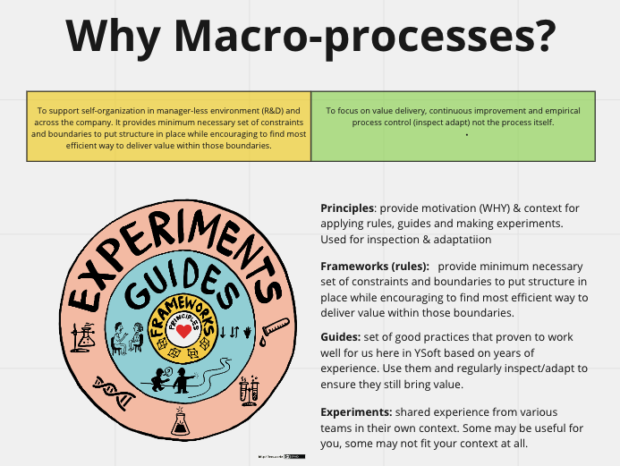
</figure>

*How the macro-processes were explained*

Designing these macro-processes created more responsibility in the teams, because they were the people that designed them and were responsible for these topics. In [this blog](https://www.daretothinkbyg.com/en/blog/manager-less-rnd-how-to-promote-people-1), there is an example of how the Y Soft teams dealt with promotions.

##### 2.3.5.1 Head of Product leaving Y Soft and was not replaced

Around 1.5 years later, the Head of Product left Y Soft. A choice had to be made: hiring a new Head of Product or the CEO acts as the Head of Product. A risk of hiring a new person is that a new person might want to change things, because that person wasn’t part of the design of the organization. The CEO decided - after consultation with some team members - to work without a Head of Product and try to work without any managers between him and the teams. To deal with this, HR got a formal role in the system around e.g. offering a contract to new people (instead of the Head of Product) and one person outside the product within R&D took the role of the Head of Product to deal with procurement and suppliers (e.g. for hiring external people in the teams), which was a relatively limited role compared to most other organizations. Until this day (Spring 2023), there hasn't been hired a new Head of Product. It turned out that the CEO didn’t have additional work because of the Head of Product leaving, because of the additional responsibilities teams took (see macro-processes section above), HR being involved more in HR matters with teams and the person in R&D taking care of procurement and suppliers. The CEO joined Sprint Review regularly anyway, sometimes Product Backlog Refinement when useful and on a frequent basis he started the Sprint Planning with a business update. This didn’t change because of the Head of Product leaving. Obviously, there was no additional work for the Product Owner as well, since the Head of Product wasn’t involved in the product and vision for the product.

#### 2.3.6 Inspection on OD-element: LeSS experiment: Try... Engage HR

In the inspection of the previous OD-element, the role of HR to help teams deal with working without managers came forward. The CEO set clear expectations with HR and what he expected from them for working with the teams in the LeSS adoption. HR was supportive and worked closely together with teams. For the hiring of new people, the teams designed a macro-process together with HR. In these macro-processes, they made agreements who took responsibility for what and what the constraints are. For example teams have to respond within 24 hours when a new candidate submits their application, and teams communicate to the applicant about the decision. HR does the recruitment and searches for new people that teams can interview themselves. Teams and HR like this way of working, and the quality of e.g. hiring improved based on feedback from applicants (hired and not hired).

#### 2.3.7 Inspection on OD-element: LeSS experiment: Avoid... Incentives linked to performance

From the second OD experiment forward, there were no more incentives linked to performance, individual or team. Teams could distribute bonuses within their team once in a while, when the organization had done well and all teams got equal bonuses, not linked to performance. Some teams experimented with different ways of distributing bonuses *within* the team and in some cases teams distributed the bonus unequally. However, most teams distributed the bonus equally within the team. There were no salary increases or any other incentives linked to performance. At one point, the CEO found out that the compensations were below average compared to the market, and he increased the compensations massively for everyone in R&D to get above average. From that point on, there were regular pay raises not linked to performance. There was no competition between teams or within teams, people felt fairly compensated and knew there is a process to get promoted when they deserved it.

### 2.4 Adapt

A summary of the main adaptations that happened in this experiment:

* Re-designed cross-functional and cross-component teams to enable the ability to deliver Product Backlog Items end-to-end by a single team (not meaning: *all teams can do all Product Backlog Items end-to-end*)
* The remaining architects joined the teams formally
* The separate infrastructure team was resolved and the people joined the regular teams
* The Scrum Master role was replaced by the agile coach role
* Removal of all managers except for the Head of Product
* Team bonuses without connection to performance of the single team

This brought the following main results:

* Some Scrum Masters left and some other managers became agile coach
* Increased self-management by the teams and additional emphasis on this

Many OD changes happened since the start of the LeSS adoption, and many small things were improved in the course of the following years. These were less significant, but Y Soft kept improving to increase and improve the responsibility of the teams and work without managers. As well as improving the collaboration with other parts of the organizations like product marketing, (local) support and sales.

The CEO indicated the desire to move to LeSS Huge for SAFEQ early in their LeSS adoption, before the second OD experiment. Y Soft has the ambition to grow their market share and possibly extend markets, and the move to LeSS Huge should help to be able to grow on this, including the growth of the number of teams.

A significant adaptation was the co-founder of Y Soft becoming the PO for SAFEQ. He is experienced, has close contact with (print) vendors/partners and large customers and knows the product in and out, because he did initial development (with the CEO) and stayed close to the actual product and code. When he started as the PO, the understanding of the vision, clarity on priorities based on vendor and customer became higher. Because he has the mandate (and his decisions were respected), he wouldn’t change direction often based on “demands” from the organization, which limited the cognitive load for teams to switch between customer domains. Including adapting to feedback and learning from (print) vendors and customers. Teams didn’t have the urge anymore to have more focus, even when there were 10 teams working together on the Product Backlog. A consistent product vision, with clear priorities and a good collaboration between the PO and the teams improved the (feeling of) focus for teams. Since this PO - and a *Supporting PO* with a lot of experience in the organization - joined the product, there was more satisfaction from internal stakeholders and external customers. Teams had a better baseline to improve further and knew better where to focus on and what to learn for the long-term.

The discussion about moving to LeSS Huge had happened a few times before. The agile coaches discussed with the (new) Product Owner the reasoning and consequences of LeSS Huge for SAFEQ. They concluded that the main reason for moving to LeSS Huge would be the inability for the Product Owner to understand all customer and market needs for SAFEQ and as a corollary know where to focus on for the mid-long term. At the time of discussion (Spring 2021), SAFEQ had just grown to 11 teams, but the Product Owner concluded that he could still oversee the customer and market requests and the main topics of the Product Backlog. He mentioned that teams had grown in moving topics forward (discovery & delivery) and refined PBI’s with internal stakeholders and partners well when necessary. His experience and knowledge of the product, market and important vendors and customers probably helped in him having this overview.  If he cannot oversee it anymore in the future, a move to LeSS Huge can happen then.

*Reflection*: Even though in the LeSS rules it states that LeSS Huge is for ‘8’+ teams, the number of teams shouldn’t be the main reason to move to LeSS Huge (or split into two products). There is some limit for the amount of people that work together, but this limit is contextual and depends on the product, the knowledge of people, the complexity, the size of the company, and more. Second, when the whole product - which in this case is almost the whole organization - is around this number of 8 (13,  and not e.g. 50), there should be dived into the root cause why teams working together is perceived as a problem. There are probably root causes that are more important to address than only ‘too many teams working together’. However, there was no deeper root cause analysis on the problems with this at the time of deciding to move to two products, e.g. the lack of sharing a good product vision, too often changing priorities and the delay of customer feedback.

## 3. Moving to two products
## 3. 转向两个产品

Deciding on the product definition is an important aspect of *organizational design*, because of the organizational consequences related to the definition. This section discusses the product definition and the decision to move to two products. The discussion focuses on the impact of the product definition for the optimization goal *to be adaptive to discover highest customer value or delight*. This section complements the OD evaluation of the previous sections.
因为产品定义会带来相关的组织后果，决定产品定义是*组织设计*的一个重要方面。这个章节将讨论产品定义及转向两个产品的决策。讨论会聚焦在产品定义对*适应以发现最高客户价值或愉悦*的优化目标。这个章节补充了前面章节的组织设计评估。

### 3.1 Context
### 3.1 背景

As described in the previous section, there was a consideration about moving to LeSS Huge several times. At some point, Y Soft introduced OMNI Series, which was a result of the development from the Product Backlog of SAFEQ: a hardware device to be able to connect printing devices to many kinds of environments, e.g. Microsoft 365, even when the printing device was not equipped to connect with Cloud environments. The customers of OMNI Series are the actual end customers and users of printing devices, while SAFEQ was sold as a package (embedded) on vendor’s devices including the software. That meant the customers and needs were different and as a consequence, the sales channels were different (direct sales vs. selling through a partner/vendor). The used technology was different (*note: not as much as assumed, see [inspection section](#33-inspect)*), and this made the CEO, strategist and VP of all products decide to split the two products. There was a move to two products, with a single Product Owner and a single Product Backlog per product. The teams already working on OMNI Series moved to work on the Product Backlog for OMNI Series (3 teams), and the other teams moved to work on the Product Backlog for SAFEQ (10 teams). The first Sprint for the new products started in November 2020. In this section, there is a focus on the move to two products.

如前面章节所述，我们多次考虑转向LeSS巨型。在某个时候，Y Soft推出了OMNI系列，这是来自基于SAFEQ产品待办列表开发的结果：一种能够将打印设备连接到多种环境（如Microsoft 365）的硬件设备，即使打印设备未配备与云环境连接。OMNI系列的客户是打印设备的实际最终客户和用户，而SAFEQ是作为包（嵌入）在供应商的设备包括软件上销售的。这意味着客户和需求不同，因此销售渠道也不同（直销与通过合作伙伴/供应商销售）。使用的技术不同（*注：没有假设的那么多，请参阅[inspection section](#33-inspect)*），这让CEO、战略规划师和所有产品VP决定将这两个产品分开。由此我们转向两个产品，每个产品有一个产品负责人和一份产品待办列表。已经在OMNI系列上工作的团队转向工作于OMNI系列的产品待办列表（3个团队），而其他团队转向工作于SAFEQ的产品待办列表（10个团队）。新产品的第一个迭代从2020年11月开始。在本章节中，重点介绍向两个产品的转变。

In summary, the CEO and a few other senior managers from e.g. marketing reasoned 1) the products have different customers and a different marketing channel and 2) the focus on both products should be higher.

总的来说，CEO和一些其他来自诸如市场的高管认为：1）两个产品有不同的客户和不同的营销渠道，2）需要对这两个产品更聚焦。

### 3.2 Narrative
### 3.2 详述

The CEO and VP of sales have the ambition to grow their market share rapidly in the coming years and be a technology leader in their market. Y Soft has many market opportunities and they want to be able to respond to these. Subsequently, opportunities change often due to changing conditions (COVID-19 is the most  relevant example) and existing customers wish change as well to the existing product(s). Being able to respond to the desires of existing customers is important, considering Y Soft’s historic strength to quickly fulfill (customized) customer needs. To be able to meet these ambitions, product development needs to be able to adapt to the desired changes.

CEO和销售VP有志于在未来几年迅速扩大市场份额，成为市场的技术领导者。Y Soft有很多市场机会，他们希望能够响应这些机会。之后，机会经常因条件的变化而变化（新冠疫情是最相关的例子），现有客户也希望对现有产品进行更新。考虑到Y Soft历史上一直有快速满足（定制）客户需求的优势，能够响应现有客户的诉求非常重要。为了能实现这些愿望，产品开发要能适应所需的变化。

From the second event with organizational changes, there were 13 teams defined in product development. When moving to 11 & 12 teams, feedback from the teams was that they didn’t have enough focus on a certain domain and had to switch too often between priorities. In other words: cognitive overload. The reasoning in Y Soft was that a split to LeSS Huge (and later: to move to 2 products) would help teams to have focus on a certain customer domain. Therefore, the CEO wanted to move to LeSS Huge and be able to have more overview and more focus on a certain (customer) domain for the teams. Their reasoning was that working in one Requirement Area would enable a better overview and more focus on a certain domain, without losing the whole product focus and collaboration with the other teams. There is a reflection on this reasoning later in this section.

从组织变革的第二次活动开始，在产品开发中定义了13个团队。当增加到11、12个团队时，来自团队的反馈是他们没法对某个领域有足够的聚焦，不得不经常在优先级之间切换。换句话说：认知过载。Y Soft的考虑是拆分为LeSS巨型（后来转向两个产品）将有助于团队聚焦于某个客户领域。因此，CEO希望转向LeSS巨型，以使团队能够对某个（客户）领域有更多的了解和聚焦。他们的考虑是工作在一个需求领域能够在某个领域获得更好的了解和聚焦，同时不失去整体产品焦点和与其他团队的协作。本章节稍后将对此考虑进行反思。

When the second event took place in May 2020, simultaneously the senior management prepared an update of the company strategy. Teams already worked on some of the product development towards this updated strategy, but because of COVID-19 in March 2020, the update of the strategy - and the accompanying development - accelerated. Customers & vendors in the ‘printing’ industry obviously had different requirements, since many people started working from home. Additionally, senior management took this as a suitable time to update the company strategy and accelerate the progress towards the corresponding goals.

当第二次活动于2020年5月举行时，高管同时准备了公司战略的更新。团队已经为这一更新的战略进行了一些产品开发，但由于2020年3月新冠疫情的影响，战略以及伴随着的开发的更新都加快了。因为许多人开始在家工作，“打印”行业的客户和供应商显然有了不同的需求。此外，高管将此视为更新公司战略并加快实现相应目标的合适时机。

The update of the company strategy was a more explicit focus on products. The CEO communicated very clearly that Y Soft is a product company and therefore should focus on product(s). The strategy can be summarized as:

公司战略的更新更明确地将重点放在了产品上。CEO非常明确地表示Y Soft是一家产品公司，因此应专注在产品上。该策略可以概括为：

* Simplifying the products that are offered to customers (e.g. pricing, installation, infrastructure)
* Enabling new customer features with new technologies
* Offering new features to different market segments, mainly to Small & Medium Businesses (SMB’s)

* 简化向客户提供的产品（例如，定价、安装、基础设施）
* 利用新技术实现新的客户特性
* 为不同的细分市场提供新特性，主要面向中小型企业

This changed the Product Backlog significantly but also introduced the use of new technologies that were not known by the teams. As a consequence, the teams needed to learn new technologies ánd new markets to be able to pursue the new targets.

这不仅大大改变了产品待办列表，还引入了使用团队不知道的新技术。因此，团队需要学习新技术和新市场才能实现新目标。

Three teams already worked - mainly - on OMNI Series from the single Product Backlog, so they moved to work on the OMNI Series product. The other ten teams worked on SAFEQ already, so they moved to work on SAFEQ. When OMNI Series was introduced to the single Product Backlog (before the move to two products), teams that liked to work on the OMNI Series product, already started working on that voluntarily. The teams discussed whether it was needed that the three OMNI Series teams would still need to help out on certain standard SAFEQ work, but the teams decided it wouldn’t make much sense to do that and even in the short term it wouldn’t be necessary.

三个团队已经主要在做来自于单一产品待办列表的OMNI系列相关的工作，所以他们就转到了OMNI系列产品。其他十个团队已经在做SAFEQ相关的工作，所以他们就转到了SAFEQ产品。当OMNI系列的工作被引入到单一产品待办列表时（在转向两个产品之前），想要工作在OMNI系列产品上的团队已经主动地开始在这上面工作。团队讨论了是否仍然需要三个OMNI系列团队帮助完成某些日常的SAFEQ工作，但团队认为这样做没有多大意义，即使在短期内也没有必要。

#### 3.2.1 Reasoning to split into 2 products
#### 3.2.1 考虑拆分成2个产品

Y Soft’s product development has grown over time, because of Y Soft’s ambition to grow rapidly, be a technology leader, and be able to respond to market opportunities quickly. The change of strategic direction transformed the items on the Product Backlog massively (up to 70%), including fundamental changes in the use of technology. Y Soft’s reasoning to move to two products could be categorized in two categories: 1) reasoning to ‘split’ the work into smaller focus of attention (either in Requirement Areas or separate products) and 2) reasoning whether the product is one or two products from customer and market point of view.

Y Soft的产品开发随着时间的推移在增长，因为Y Soft渴望快速发展，成为技术领导者，并能够快速响应市场机会。战略方向的改变极大地改变了产品待办列表上的条目（高达70%），包括使用技术的根本变化。Y Soft转向两个产品的考虑可分为两类：1）考虑将工作“拆分”成较小的关注焦点（需求领域或单独产品）；2）考虑从客户和市场的角度来看是一个还是两个产品。

##### Weak product vision and frequent change of priorities on the short term
##### 薄弱的产品愿景和短期内优先级的频繁变更

Senior management wanted to use a roadmap to keep discussing the next steps without losing long-term objectives. Before the second event with organizational changes (May of 2020), the CEO asked the Product Owner to come up with a ‘year-long roadmap’ of the product, to be able to identify upcoming needs for the product and analyze where to focus on with the organization. Creating this roadmap took almost a year. As a consequence, the Product Owner (*note: this was before the co-founder became Product Owner*) and product marketing people that supported the PO had little focus on (customer) domains while the roadmap was created. The CEO and other board members explained clearly - e.g. in Product Backlog Refinement - the direction they wanted to go with the product. However, the Product Owner wasn’t able to explain this product vision clearly to teams. He focused on - short term - customer deadlines, and missed transparency and explanation for the long-term. This resulted in a non-consistent vision of the future and (too) often a change of priorities. Additionally this prevented teams from choosing a (customer) domain to focus on.

高管希望使用路线图以在不失去长期目标的情况下继续讨论下一步行动。在组织变革的第二次活动（2020年5月）之前，CEO要求产品负责人制定一个产品的“整年路线图”，以便能够识别产品的未来需求，并分析组织应聚焦在哪里。制定这个路线图花了将近一年的时间。因此，产品负责人（*注：这是在联合创始人成为产品负责人之前*）和支持他的产品市场人员在路线图被制定的过程中几乎没有关注（客户）领域。CEO和其他董事会成员清楚地解释了 - 比如在产品待办列表梳理中 - 他们想要的产品方向。然而，产品负责人无法向团队清楚地解释这个产品愿景。他专注于短期的客户截止日期，而忽略了对长期愿景的透明度和解释。这导致了对未来的愿景不一致，而且（太）经常改变优先级。此外，这还阻碍了团队选择聚焦一个（客户）领域。

The change of strategic direction reinforced the inability to share a consistent product vision for the long term by the Product Owner. The Product Owner and the supporting product marketing people needed to shift their attention to different customer needs, different customer segments, and the use of new - for Y Soft mostly unknown - technology, also from a customer perspective as a result of the strategic direction. Additionally, the PO and the supporting product marketing people were busy trying to learn what features were needed, tried to be in touch with customers and vendors, but mainly had to discuss internally with e.g. sales and support what would be needed. Other people in the company - e.g. sales & support - were involved a lot in getting the work more clear and helping to decide what should be next, and joined PBR often, to help teams to get more understanding on the upcoming work. However, the unknowns reinforced the struggle of the Product Owner to create a product vision and decide on what to work on next for the Product Backlog.

战略方向的改变放大了产品负责人在分享一致的长期产品愿景上的能力不足。由于新的战略方向，产品负责人和支持他的产品市场人员需要将注意力转向不同的客户需求、不同的客户细分市场，以及使用新的技术（对于Y Soft来说基本都是未知的）。此外，PO和支持他的产品市场人员忙于了解需要什么特性，试图与客户和供应商保持联系，但主要还是与内部诸如销售和支持部门讨论需要什么。公司的其他人，如销售和支持人员，参与了大量澄清工作，并帮助决定下一步应该做什么；他们经常参加PBR，以帮助团队对接下来的工作有更多了解。然而，诸多未知让产品负责人在创建产品愿景和决定产品待办列表中的下一项工作上越发挣扎。

##### Cognitive Overload for the teams
##### 团队的认知过载

Teams complained they changed focus on a specific domain every (few) Sprint(s), which made it harder for them to learn in a specific (customer) domain. Actually, it was cognitive overload, needing to learn too many different things in too short a time, which they felt as a lack of focus. Main reason for the cognitive overload was the lack of sharing a good product vision and consistency on the Product Backlog as a result. However, senior management’s assumption was that making the span of attention smaller for teams, would help teams with the cognitive overload by creating more focus for the teams. With the desire to grow and add more teams in the future, moving to LeSS Huge and later moving to two products seemed a logical step for Y Soft, because of the assumption that a smaller span of attention would increase the focus and reduce the cognitive overload as a result.

团队抱怨说他们每隔（很少）几个迭代就会改变在一个特定领域上的聚焦，这让他们很难学习一个特定的（客户）领域。事实上，这是认知过载，也就是在太短的时间内需要学习太多不同的东西，让他们感到缺乏聚焦。认知过载的主要原因是缺乏对好的产品愿景的分享以及由此带来的缺乏在产品待办列表上的一致性。然而，高管的假设是，通过让团队的专注范围变小，由此为团队创造更多的聚焦，将帮助团队应对认知过载。对Y Soft来说，因为有这样的假设 - 较小的专注范围会增加聚焦从而减少认知过载，想要未来发展和增加更多团队，转向LeSS巨型并随后转向两个产品似乎是合乎逻辑的一步。

The main root cause for the cognitive overload was the weak product vision and the - too often - changing priorities in the Product Backlog, described in the previous section. Teams needed to learn new types of work associated with the change of strategic direction: cloud-related activities to make sure SAFEQ would run in the cloud and OMNI Series which included both the development on a hardware device and the use of new software technologies, partially for a new market. The consequence for teams was that teams needed to learn a lot on these new technologies and understand different customer needs. By often changing priorities, teams had to learn too many different things in a too short time, cognitive overload. To be able to develop these new PBI’s, teams had to learn both from a perspective of different technologies (and different use of those technologies by customers) and a new type of device with different product features than they were used to.

如之前章节所述，认知过载的主要根本原因是薄弱的产品愿景和产品待办列表中太过频繁变化的优先级。团队需要学习与战略方向变化相关的新型工作：与云相关的活动以确保SAFEQ将在云上运行，OMNI系列包括硬件设备上的开发和新软件技术的使用，部分用于新市场。结果就是团队需要学习很多关于这些新技术的知识，并了解不同的客户需求。由于经常改变优先级，团队不得不在太短的时间内学习太多不同的东西 - 认知过载。为了能够开发这些新的产品待办条目，团队必须从不同技术（以及客户对这些技术的不同使用）的角度学习，还要学习具有与他们之前接触的不同产品功能的新型设备。

A smaller but relevant other factor was that teams had to get used to working closely with more other departments than before. Especially in PBR - but also in Sprint Review - many people from e.g. sales and support joined. The complication was that stakeholders didn’t have a consistent interpretation of the product vision, and when stakeholders joined they sometimes argued about the direction to follow (even within PBR). This is a consequence of the lack of sharing a good product vision. The different interpretations and the lack of clarity - because when starting development there was no direct customer feedback - it was hard for teams to understand which decisions to make in the actual development and they needed to learn and interpret many different things. A strong and consistent product vision - and less changing of priorities - could have created more clarity on what to learn to reduce the cognitive overload. Teams could have focused on specific domains or technologies to learn, which would have increased their focus and reduced the cognitive overload.

一个较小但相关的其它因素是团队必须习惯于与比以前更多的其他部门密切协作。特别是在PBR中 - 但也发生在迭代评审中 - 许多来自销售和支持部门的人加入了进来。复杂的是干系人对产品愿景没有一致的解释，他们加入有时会争论要遵循的方向（甚至在PBR活动中）。这是缺乏分享好的产品愿景所导致的结果。不同的解释和缺乏清晰度 - 因为在开始开发时没有直接的客户反馈 - 让团队难以理解在实际开发中应该做出哪些决定，他们需要学习和解释许多不同的东西。一个强大且一致的产品愿景 - 以及更少的优先级变化 - 本可以让团队更清楚地了解应该学习什么，从而减少认知过载。团队本可以聚焦在特定的领域或技术上学习，通过增加聚焦来减少认知过载。

##### Having many teams & desire to add more teams in the future
#### 有许多团队并希望在未来增加更多团队

The desire to add more teams in the future was not the main reason to split into two products, but certainly a characteristic senior management took into account. They reasoned that a split into Requirement Areas/move to LeSS Huge (that was the initial idea, before moving to two products) would help in the ambition to increase the number of teams.

想要在未来增加更多的团队并不是拆分成两个产品的主要原因，但高管肯定也考虑到了这一点。他们认为拆分成需求领域/转向LeSS巨型（那是在转向两个产品之前最初的想法）将帮助到追求增加团队数量的目标。

At the moment of the discussion to move to two products, there were 13 teams working from the single Product Backlog. Because of the rule of thumb of having a maximum of “8” teams working from a single Product Backlog, senior management used this rule of thumb as a reason - though not the main reason - to split into two products. The valid reason to move to LeSS Huge is when the Product Owner starts to get overloaded and cannot oversee the market, stakeholders and Product Backlog anymore. The number of “8” is a common heuristic for when overload of the Product Owner starts to happen.

在讨论转向两个产品时，有13个团队工作于单份产品待办列表。由于存在一个最多能有“8”个团队工作于单份产品待办列表的经验法则，高管将其作为拆分两个产品的原因（尽管不是主因）。转向LeSS巨型的合理原因应该是当产品负责人开始超负荷，无法再全面看管市场、干系人和产品待办列表。“8”这个数字只是一个对产品负责人会开始超负荷的常用经验值。

##### Different customers, markets and sales channels
##### 不同的客户、市场和销售渠道

In the end, the main reason they used to split into two products was the difference in customers, markets and sales channels between SAFEQ and OMNI Series. Senior management learned from the development of OMNI Series and SAFEQ that these products are very different from the perspective of customers, markets and sales channels (B2B vs B2C), and this resulted in the discussion whether to split into two products. The CEO, strategist and VP of all products’ additional underlying assumption was that there was almost no collaboration needed between the two products. Therefore, there would be no need and desire to share learnings between the products and as a consequence no need to optimize for cross-learning.

最终，他们用来支持拆分成两个产品的主要理由是SAFEQ和OMNI系列在客户、市场和销售渠道方面的差异。高管从OMNI系列和SAFEQ的开发中了解到这些产品从客户、市场和销售渠道（B2B与B2C）的角度来看非常不同，这引发了是否拆分成两个产品的讨论。CEO、战略规划师和所有产品VP的另一个基本假设是这两个产品之间几乎不需要协作。因此，就不需要或希望在两个产品之间共享知识，从而也就不需要为交叉学习去优化。

#### 3.2.2 LeSS perspective on multiple products and how to define a product

For context: this section focuses on the optimization goal of *adaptiveness to discover highest customer value or delight* that LeSS uses. For other optimization goals, *other reasoning might be consistent and working*, but since this is the optimization goal for LeSS, this section focuses on that.

##### LeSS rule about product definition

The [LeSS rule about product definition](https://less.works/less/rules/index):

> The definition of product should be as broad and end-user/customer centric as is practical. Over time, the definition of product might expand. Broader definitions are preferred.

Let’s break down this rule and reflect on the (two) product definitions of Y Soft.

* **‘As broad [...] as is practical’** From a whole product focus perspective, Y Soft could benefit from a [broad product definition](https://less.works/less/framework/product) for the following benefits:
    * **Adaptiveness for teams to shift from one topic to the other, depending on demand from customers and opportunities in the market** The optimization goal of LeSS is to be able to adapt to changing needs to be able to work on the highest customer value. When teams are locked into a narrower defined product, they are less likely to be able to adapt to work outside of the product definition, since the whole product view, understanding of the customer and market and the knowledge of the product are limited to the narrower definition of the product. With a single product, teams will have a broader view of the product, a broader understanding of the customer and market and it gets easier for them to adapt to other types of work. Of course, this still involves learning, but it’s easier from a whole product view compared to a narrower product view.
    * **Working on highest value from global level** Having two products will at some point in time cause that for product 1 the value is significantly higher than for product 2. But the teams working on product 2 will still pick up the highest value for product 2, instead of picking up a higher value item for product 1. Which means from a customer and organization perspective less potential value that is picked up.
    * **Better overview and finer-grained prioritization** With the choice to move to two products, there is less overview on company level, because the two products have separate Product Backlogs and less alignment between them. Having two products limits the overview, while e.g. OMNI Series is relatively small with just 3 teams working on it back then.
    * **Avoid duplication between similar products** Like explained before, Y Soft considers the products as different and expects little duplication between them. There is certainly duplication amongst the products, because the products need to be connected and use the same infrastructural technologies. The consideration is how much duplication there is and whether this justifies a move to two products. Good design can also limit duplication amongst the products, especially when considered as a single product.
    * **Consistency in user experience across all products** With more products it becomes harder to get consistency in user experience, because there is more alignment needed.
    * **Simplifies organizational complexity** Splitting the products meant that teams working for one product would have different ways of collaborating than teams working for the other product, e.g. dealing with self-management (e.g. hiring) and technical practices. This would eventually lead to a divergence of organizing and collaborating between the products, and therefore a more complex organizational environment. Having one product would lead to *less organizational complexity* compared to having two products. With the introduction of OMNI Series as a separate product, the additional processes, agreements (amongst teams) and more are complicating the organization. The consideration to take into account is how much this extra complexity is, as the organization is still relatively small.  From [Large-Scale Scrum: More with LeSS](https://www.amazon.com/Large-Scale-Scrum-More-Addison-Wesley-Signature/dp/0321985710): ‘With a broad product definition all items are in the same backlog, thereby enabling fine-grained prioritization and increasing the overview in development and product.’ With two products, there is less adaptiveness between the two products; e.g. when deciding to focus more to one over the other from the Product Backlog perspective. An explicit split into two products creates separate focus, less combined product decisions in development and product visions are likely to diverge over time. When taking into consideration that over time you want to broaden your product definition, a move to two products moves away from this broadening.  Let’s look at the ‘practical’ part from a broad product perspective, taking into account: '[...] can cause the initial product definition to be less than perfect. This opens the door for using the product definition as a tool for continuous improvement.' ([Large-Scale Scrum: More with LeSS](https://www.amazon.com/Large-Scale-Scrum-More-Addison-Wesley-Signature/dp/0321985710)). Interestingly, the three teams working on OMNI Series basically already focused on OMNI Series before the move to two products, aside from doing ‘mandatory work’ (handling support as the fast-response team and release duty) that was mainly related to SAFEQ. While the teams encountered mainly practical problems for SAFEQ, the incorporation of OMNI Series wasn’t considered ‘impractical’ from teams’ perspective.
* **‘As [...] end-user/customer centric as is practical’** Both OMNI Series and SAFEQ are end-user/customer centric, they are recognized and understood by customers and end-users, and delivery can happen for both directly to customers. From this perspective, it’s practical to have two products. However, the question is whether it would be impractical to keep both as one product. Obviously, the sales channels (B2B vs B2C) are different as well as the market segments OMNI Series and SAFEQ focus on. However, does this validate the decision to move to two products from an end-user/customer perspective? Having a single (internal) product doesn’t mean that there can’t be different variations of the product sold with different names and identity. It doesn’t affect customers or end-users having a single product, as long as you organize the customer-centricity well and incorporate customer feedback into the Product Backlog. This would be an external narrow (e.g. different marketed products) versus an internal broad product, which gives you the whole product view, ability to adapt but still be able to distinguish to different customer types or markets. When the optimization goal is to have *adaptiveness to discover highest customer value or delight*, a broader product definition is consistent.  If we look at duplicate product/business functionality, customers don’t need something completely different than printing & scanning solutions, even though the offerings from the two products are for a different segment of the market. However, from a duplicate functionality perspective, several things could happen (from Large-Scale Scrum: More with LeSS). There is porting of the functionality needed from SAFEQ to OMNI Series, which requires additional coordination and code clarification, especially over time when the teams haven’t worked closely together for a longer time. Second, there is the infrastructure that is shared and organizationally included in one team outside the two products, which has introduced some associated organizational complexity mainly in the additional coordination needed.  Let’s look at the commonalities that restrain the product definition (from [Large-Scale Scrum: More with LeSS](https://www.amazon.com/Large-Scale-Scrum-More-Addison-Wesley-Signature/dp/0321985710)) for *adaptiveness towards highest customer value*: 1) vision, 2) customers or markets and 3) domain. If we look at 1) the vision, from the internal Y Soft perspective the visions are considered different between SAFEQ and OMNI Series. However, they are both there - very high level - to help customers with their printing & scanning solutions. For 2) the customers or markets, there are different segments of the market that are focused on. However, the customers still want solutions for similar problems. And this brings us to 3) domain. Both products are still around printing & scanning solutions, not something completely different.  If we look into the ‘practical’ part of the customer/end-user, we can argue that it would also be practical when having one product. Sales & Marketing kept working the same way in the same structure, independently from having one or two products. That would mean that it would not be impractical from a sales & marketing perspective.  Right now, some parts of the product are not included in the product definition, e.g. the hardware development (for both products) and the installation and support of the product for customers (for SAFEQ). From a customer/end-user perspective, the other parts could be included in the product definition in the future, when the organization learns and improves and ‘practical might evolve over time’.
* **‘Over time, definition of product might expand’**  One of the reasons to move to two products was a weak product vision. The first LeSS book ([Large-Scale Scrum: More with LeSS](https://www.amazon.com/Large-Scale-Scrum-More-Addison-Wesley-Signature/dp/0321985710)) explains impracticalities of a broad product definition: ‘it becomes increasingly hard to express a clear and compelling product vision.’ However, the root cause of the weak product vision was NOT the broadness of the product definition.  One might expand the definition of product in the future, because of the desire to continuously improve towards perfection, e.g. by ‘extending done’ and adding ‘undone’ work to the product definition. Since the start of the LeSS journey, Y Soft has done this in the 4-day event that started the LeSS adoption (combining people to create cross-functional teams) and after (e.g. adding architects and on-premise infrastructure to the teams) to improve. However, by choosing to move to two products, the definition of product decreases.  By choosing the split into two products, basically Y Soft restrains the product definition instead of expanding it. Which is less consistent with *adaptiveness to discover highest customer value or delight*. But perhaps it is valuable for other optimization goals.
* **‘Broader definitions are preferred’** In the previous bullet, we discussed the decrease of the product definition by choosing to move to two products. In the discussion before deciding to move to two products, there was explicitly discussed that there is a risk that this leads to a ‘multi-product’ strategy, where innovation happens outside the product and outside the teams. In the long term, Y Soft risks ending up with several products which 1) from a broad product definition should be one (or at least less) product(s) and 2) are developed outside teams without using the integration and knowledge from your existing products well. Senior management acknowledged this risk, but mentioned that they wouldn’t let this happen and was not the direction to follow.

##### Getting feedback from customers

One thing that wasn’t taken into account in the discussion to move to two products was learning (empiricism) on the development of OMNI Series. At the time of deciding to move to two products, OMNI Series wasn’t launched yet or tested by actual customers. First, it was unknown whether OMNI Series would be selling well or would be sold in small amounts, which would not justify a separate product yet (*note: by the time of writing this, OMNI Series had sold well*). Second, there was no feedback incorporated from actual customers, which might change the priorities and direction of OMNI Series or would validate the ideas and proposition that was done. If the direction would be persevered, different reasoning and discussions on the product definition could have happened, which might have led to another decision.

##### Creating a simpler organization

One of the reasons to have a broader product definition is to create a simpler organization. Two Product Backlogs, two Product Owners, more (still parallel) Sprints, usually more managers (with extra alignment as a consequence) and other things lead to more complexity in the organization, by e.g. extra coordination across products for the common parts. In a system the interaction effects are the major influence, so reducing the interaction effects helps in making the system better. This is the opposite of a simpler organization and a local optimization with negative consequences, such as extra handoffs and complex coordination. However, for the teams there was not much change and the rest of the organization also didn’t adapt to the move to two products (except for having two Product Owners instead of one). In the short term, the move to two products probably doesn’t lead to a more complex organization, because basically there wasn’t too much change as a result of this decision. However, in the long term there will be added complexity due to the interaction effects. Vision and directions will diverge, extra coordination will be needed for common parts, and that rarely happens well, thus leading to lots more duplication and inconsistencies. Teams will be less familiar with each other's work and way of working, leading to additional coordination problems and less responsibility taken by teams.

##### Collaboration

In LeSS, one of the crucial things is to collaborate (mainly between and within teams), and to encourage collaboration as much as possible, in contrast to the common refrain, “collaboration between developers is inefficient and difficult, so organize to avoid it.” The optimization goal of LeSS is *adaptiveness to discover highest customer value or delight*. Collaboration - and as a corollary *learning* - between teams is essential to be able to move towards this optimization goal. Having two products leads to two (different) priorities and this limits collaboration between teams, and restricts the adaptiveness.

In many organizations, collaboration (and learning) is often seen as costly or inefficient. In order to learn - on a product level - collaboration is essential. For a complex product, teams need to collaborate, share and learn together and teach each other to be able to work on important features from a customer perspective. The thinking that collaboration is inefficient often comes from looking only at the surface and not the underlying system and structures. The forces that make collaboration costly or inefficient are usually a consequence of the structures in the organization that make collaboration inefficient and expensive. For example waiting for others (e.g. because teams are single specialized), having unsupportive technology in the product for collaboration or decision making outside the teams and product group, which are local optimizations.

##### One versus two products

In previous sections, we concluded that there isn’t too much change - especially for teams - by moving to two products, at least in the short term. From that perspective, there aren’t too many disadvantages in the short term of having two products instead of one, and because the teams still knew each other very well, there was limited extra effort needed to align on features.

For the optimization goal of *adaptiveness to discover highest customer value or delight*, there are several reasons why moving to Requirement Areas instead of moving to two products is more contributing to *adaptiveness to discover highest customer value or delight*. The perceived customer value of the items for one product over the other will change over time, which will lead to one of the products working on lower (perceived) value for the customer and organization as a whole, because teams in one product will only work from the Product Backlog of that product. This will similarly happen to working from the highest (perceived) value from one Requirement Area over the other. However, when that happens, the Product Owner can decide to move team(s) to the other Requirement Area, being able to adapt relatively easily. Though there will always be some delay. Additionally, separating into two products likely comes with creating a separate product group, with a separate manager or managers and specialist positions accompanying the product. Changing the priority for one product over the other will be hard, because of these positions. While in a LeSS Huge the single Product Owner can simply choose to move teams from one Requirement Area over the other, because the Requirement Areas are not linked to the organizational structure with (a) manager(s) and other positions attached to it. This way, it is fairly easy to change direction on the whole product level compared to having two products. Additionally, when a customer request spans products and there are private code ownership boundaries per product, this will increase the lead time of a customer request that spans the products. Y Soft didn’t create a separate product group and kept the organization simple, as described in other sections.

##### Alternative options

Instead of moving to two products, there are other options for the problems that were perceived.

One of these options is doing what teams were already doing: teams focusing on specific domains. Three teams working on the single Product Backlog focused in PBR and in their Sprints on the PBI’s related to OMNI Series. This would have still given focus on OMNI Series, but without losing the adaptability to switch to and then focus on different parts of the product at other moments and collaborate across teams when needed, increasing adaptiveness. With the co-founder becoming Product Owner for SAFEQ (see [this section](#324-change-of-product-owners)), there was more clarity on the vision and priorities, and teams were able to focus more on certain (customer) domains based on the vision and priorities. If this would have happened before the discussion and decision to move to two products, the decision might have been different because this problem would have been solved most likely.

Another option would have been to move OMNI Series work to one Requirement Area. The Requirement Areas for Y Soft have to be explored and defined further. When the product vision and focus - especially from a Product Owner perspective - are valid problems to solve, this option would have given the chance to create a better product vision and involve more customer feedback into that. With Requirement Areas for a single Product Backlog, still one Product Owner could decide on the priorities - including those for OMNI Series - and decide to focus on something else than OMNI Series or focus more on OMNI Series when OMNI Series would be selling really well and the customer demand would be big. This would still give the adaptiveness to set priorities, and teams would have more options to collaborate and learn from each other. Furthermore, in LeSS Huge with Requirement Areas, it is easily adaptive for teams to slowly move from one area to another (while being aware of the cognitive overload issues), in response to discovery, but on the other hand with two products it is at the very least ‘politically’ difficult to move teams between two product groups.

#### 3.2.3 Reflection on coaching and consulting

From the agile coaches perspective, the reflection that has been described here wasn’t included in the discussion with the CEO, the strategist and the VP of all products to move to two products. Some of these insights were taken into account and were clear at the time of the discussion, but many of these insights were learned in hindsight. As a consequence, in the discussion with senior management, the external consultant and the agile coaches failed to give a good explanation of the organizational consequences for choosing either for two products or one product with Requirement Areas. The discussion moved towards *semantics* whether the two products are actually two products or not, while the discussion should have been about the (organizational) consequences for choosing for separate products or Requirement Areas within a product. With these insights in mind, the discussion to move to two products would have been different and the outcome might have been different as well. That’s why I feel it’s important to share our learnings in this case study, to help others in similar situations.

#### 3.2.4 Change of Product Owner(s)

With the change to two products, the CEO decided to change the Product Owner. The previous Product Owner for the - at that time still - one product was one person from the product marketing department, while his colleagues from the product marketing department helped teams in Product Backlog Refinement and other activities. The new focus on two separate products made the CEO decide to choose a Product Owner from the board of directors, for each product. The new Product Owners are better able to make (strategic) decisions about the product, because they have more mandate and discuss the strategy within the Y Soft board.  The previous Product Owner was still involved as one of the members from product marketing.

Though the Product Owner from the product marketing team had a mandate to work with teams and make decisions on priorities, it was hard for him to make strategic decisions and to access the strategic thinking from senior management. Because of this, from time to time, direction had to be changed. The new Product Owners are actively involved in discussions about the products and the strategic minds behind it as members of the board, which makes decision making easier and setting and sharing direction as well. In addition to having the co-founder as Product Owner, an experienced and well-appreciated colleague from elsewhere in the organization joined as a *supporting* PO (LeSS experiment), not making the priority decisions, but helping the Product Owner and the teams.

#### 3.2.5 What happened?

The senior management decided to split the Product Backlog and have less teams working on a part of the Product Backlog. Their reasoning was to be able to deal with the inability of the Product Owner to have and share a good product vision and understanding of the customer and market needs. Senior management (the CEO, the strategist, the VP of all products) wanted to split the Product Backlog by moving to LeSS Huge initially, but in the end decided to split into two products because of the emerging development of OMNI Series during that period. The assumption from senior management was that with a split, the PO - and supporting product marketing people - had a better overview, better understanding of the Product Backlog and better understanding of customer and market needs. Teams would have more focus on a (customer) domain, because there would be a smaller (part of the) Product Backlog to focus on and less teams working on that smaller (part of the) Product Backlog.

Thus, there was a move to two products, with a single Product Owner for each (both board members) and a single Product Backlog for each. The teams already working on OMNI Series moved to work on the Product Backlog for OMNI Series (3 teams), and the other teams moved to work on the Product Backlog for SAFEQ (10 teams). The first Sprint for the new products started in November 2020.

### 3.3 Inspect

#### 3.3.1 Inspection on the weak product vision

The whole organization focused on the strategic changes and all the important people of the company were available to help, which meant increasing participation of people in Product Backlog Refinement & Sprint Review. There was not a good alignment between the strategy, the product vision or roadmap and the Product Backlog. Requirements and priorities changed often and the Product Owner and supporting product marketing people couldn’t keep up with the pace that the CEO and VP of Marketing expected, which led to a weak product vision and a lack of understanding from teams on the product vision. It led to ‘just do’ what the Product Owner was told and therefore also for teams harder to understand the direction and to challenge the customer and market needs. Because actual customers were involved too late in the development, the feedback was entirely only from within the organization for a long time. Different stakeholders had different ideas and needs about the work to be done (e.g. support vs sales). This also delayed the creation of the roadmap.

#### 3.3.2 Inspection on the cognitive overload

The root causes of the frequent change of focus that teams experienced was the weak product vision and too often changing priorities on the short term, so teams felt a lack of focus. It was cognitive overload for the teams, needing to learn too many different things in too short a time, which they felt as a lack of focus. couldn’t focus on a specific (customer) domain for a period of time. Senior management did identify the too often changing priorities, but didn’t link this as the root cause for the cognitive overload. If this was addressed, teams could have been helped to have e.g. focus on a specific (customer) domain for a period of time, and focus on learning in that area. Or extra attention on the customer domain and/or architecture, by e.g. having domain workshops or architecture workshops. Attempts from the agile coaches to help the Product Owner to have more consistency on sharing for the long term failed, which didn’t help teams in their cognitive overload.

Once the co-founder became the PO, there was a consistent product vision, with clear priorities and a good collaboration between the PO and the teams. This improved the (feeling of) focus for teams and reduced the cognitive overload. There was more satisfaction from internal stakeholders and external customers. Teams had a better baseline to improve further and knew better where to focus on and what to learn for the long-term. This proved that the cognitive overload for teams wasn’t caused by the broadness of the product, and the root cause was removed by having a Product Owner with a strong product vision and more consistent priority decisions.

#### 3.3.3 Inspection on the products having different customers, markets and sales channels

First, if you use a broad product definition, would the customers & markets be so different? There would still be customers that require solutions for their printing & scanning, though these are in a different segment of the market. Customers buying OMNI Series wouldn’t need something completely different than printing & scanning solutions. From an outside perspective, these products are very similar when you zoom out, though can be perceived very differently from an inside perspective. Second, the sales channels are different. But is this a sufficient reason to split the product? OMNI Series would require selling directly to customers, creating a webshop, and having different promotion approaches. But can’t there be different sales strategies within one product? There are many broad product definitions where the product is sold to different types of customers and the use of different sales channels. Office365 might be an example where there is broad internal product thinking, while there are different sales channels, customer types and even parts of Office365 sold separately.

Product development was split into two products, but marketing and sales kept working in the same structure as before, as one department for both products. From product marketing some people focused on OMNI Series, but worked still in the same product marketing group. This is a contradiction to the argument that marketing & sales are very different for the two products. Product development changes the structure based on this argument, while marketing & sales keep the same structure. Apparently the differences to marketing & sales were not so big outside product development (e.g. marketing and sales), so why would it justify a split for product development?

#### 3.3.4 Inspection on adaptiveness

The change of strategy led to a big change in the priorities of the Product Backlog and teams needing to learn many new technologies, but also a different approach to customers. At least three of the teams fully focused on cloud technologies from the start and developed the infrastructure, configured it, changed many customer centric functionalities, addressed security etc. And they delivered a working environment with a large part of the customer centric features in the cloud within six months. This is an existence proof that having cross-functional teams and focusing on learning really works! These teams were able to discover and understand what was needed, learned new technologies and successfully developed the product with these new technologies, while a very limited amount of the prerequisites were set up before they started working on it. People from mostly IT worked closely with the teams to set up the infrastructure and to share some experiments they did in advance with cloud technologies. We can’t imagine this would have worked with adding new teams separately without the customer and product context, which happens often in *project*-based organizations. Before these occurrences in COVID-times, Y Soft’s senior management still considered LeSS (and Scrum) as ways to improve their delivery, quality and keeping agreements with customers about delivery. The changes in strategy and changed desires from customers made the senior management realize that the LeSS organizational changes and the ability of teams to deliver customer features end-to-end enabled them to change this quickly. In short, they got the benefits of an *adaptive* (agile) organization.

### 3.4 Adapt

A summary of the main adaptations that happened in moving to two products:

* Two Product Backlogs with two Product Owners
* Board members with mandate becoming Product Owners

This brought the following main results:

* Less adaptiveness for the whole product and more alignment and overhead needed between the products
* Improved product vision and direction
* Less cognitive overload for the teams

Since the move to two products, many small improvements and changes have happened. Especially regarding working together between teams, focusing on longer-term vision, improving technical excellence, and learning more customer domains.

Teams between both products started working together more, having multi-team Product Backlog Refinement often about cross-product topics and have in-Sprint collaboration about cross-product topics, which are indications that a single broader product definition in a LeSS Huge adoption with Requirement Areas would have been a more consistent alternative than two products. In one Overall Retrospective, some team members wanted to better understand the overlap between the products and counted 13 shared components when they modeled the architectures out, further suggesting one broad product. This led to conversations and later the PO with the CEO decided that they would merge the two products back to one, working from one Product Backlog again with the single PO from SAFEQ (the co-founder). This proved that the assumption that the two products needed almost no collaboration was unjustified. The main impact was that teams from SAFEQ had to learn and help in the support of OMNI Series, which was relatively unknown for them. Teams from OMNI Series were still familiar with most parts of SAFEQ, which made it easier for them to deal with this. Teams found ways to collaborate and ‘buddy’ other teams to make sure all teams were able to do support for OMNI Series and SAFEQ properly.

### Conclusion

Y Soft experienced big benefits due to the LeSS adoption. Teams were better able to see and understand the whole product, and additionally able to deliver more (and more impactful) end-to-end customer centric features than before. After the start of the LeSS adoption, teams got more in direct touch with customers and vendors, because they were working on customer-centric features instead of component requirements. Like any organization making a big change, Y Soft had its struggles too. In the first year of the LeSS adoption, sharing the ‘pains’ like doing regression testing by all teams, rotating support duty between teams and more was not always appreciated by teams, and the amount of learning was big to get a whole product focus. The CEO said once that the biggest success of the LeSS adoption is that ‘we managed to add many people and are still able to deliver more and more’, while also working together at scale.

With the COVID-19 pandemic in 2020, Y Soft changed its strategy. The priorities on the Product Backlog changed approximately 70% and teams needed to learn - faster than before - new technologies and understand new market needs as a result of the change of strategy. Teams were more easily able to adapt to work with these new technologies and market, because of the increased adaptive organization. The adaptiveness of the teams would never be this fast and effective in the previous structure of the component-oriented teams working on different backlogs for several projects and stakeholders. Obviously, other variables helped in the improvements in Y Soft as well, like deciding to work without managers.

The uniqueness of the Y Soft LeSS adoption is the *willingness* and courage to keep inspecting and adapting the organizational design. Not just *starting* a LeSS adoption and making small improvements, but considering and executing larger changes, as described in this case study.

### More public info about the Y Soft LeSS adoption

More info about the Y Soft LeSS adoption can be found in several public resources:

* July 2020 - Y Soft Meetup Event about learnings LeSS - +2h webinar - <https://www.ysofters.com/2020/07/23/y-soft-less-transformation/>
* June 2020 - LeSS Day EU Talk - <https://youtu.be/QfYXrDF0wpk>
* June 2020 - Remote Self-designing Team Workshop - <https://co-learning.eu/2020/06/11/a-full-remote-highly-collaborative-teams-self-design-workshop-with-80-people-yes/>
* September 2020 - LeSS Conference talk about remote Self-designing Team Workshop - <https://youtu.be/k6MD4kW0Xwo>
* September 2021 - LeSS Conference Keynote by Vaclav, CEO of Y Soft, about their LeSS Journey - <https://youtu.be/Q54NLARniEg>
* Y Soft blog - Manager-less R&D: Performance and predictability through the roof: <https://www.daretothinkbyg.com/en/blog/manager-less-r-d-performance-and-predictability-t>
* Y Soft blog - Manager-less RnD: How to Promote People: <https://www.daretothinkbyg.com/en/blog/manager-less-rnd-how-to-promote-people-1>
* LeSS Conference 2023 Berlin: <https://less.works/conferenza/sessions/2023-less-conference-berlin-y-soft-case-study-huge-less-without-less-huge-316>

## Appendix A: Technical excellence learnings

Teams have improved technical excellence significantly, since the start of the LeSS adoption. Teams had to learn many parts of the product, because they became cross-component and cross-functional since the 4-day event that started the LeSS adoption. Additionally, teams shared the responsibility of e.g. support duty, fixing bugs and releasing across the entire product. Most teams needed to learn about these topics for the product. Having all teams work on these topics, made cross-component problems transparent and teams addressed many of these problems when encountering them. Additionally, teams made efforts to improve the technology that made product development better or easier (e.g. improvement in the build pipeline). However, the Head of Product realized that they needed more improvements on technical excellence. This appendix describes some specific interventions on technical excellence, and includes a generic reflection on technical excellence improvements.

#### A.1 Improvement Kata on technical excellence

An external consultant organized and facilitated an initial Improvement Kata (based on [Mike Rother’s Toyota Kata](https://www.amazon.com/Toyota-Kata-Managing-Improvement-Adaptiveness/dp/0071635238/ref=sr_1_1?crid=3KT4I5G5PHYZ8&keywords=toyota+kata&qid=1682164626&s=books&sprefix=toyota+kata%2Cstripbooks-intl-ship%2C261&sr=1-1)) on technical excellence, as a starting point of monthly iterations. Each month, the people working on the improvements came together to discuss progress to the next target condition (following the kata) and define a new next target condition (and identify some experiments to go there). Additionally, there was hands-on support on pair & mob programming sessions to work on these experiments. Participants included a significant group of representatives from the teams.

The main goal of the initial workshop was to define and agree on the first steps towards improving the overall technical excellence within Y Soft. It started by defining the ‘Definition of Awesome’ for the overall direction of becoming a technical leader.

<figure>
  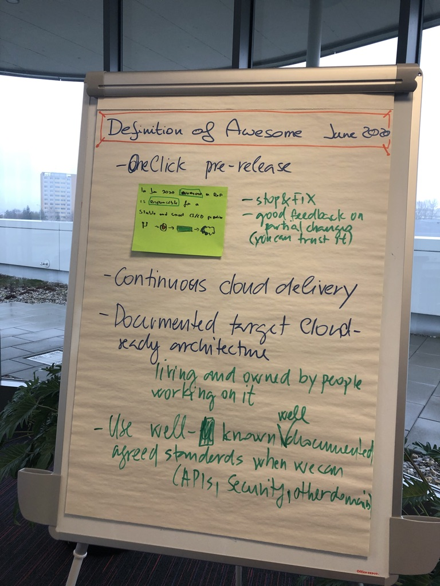
</figure>

Definition of Awesome:
* One-click pre-release is possible and stable: this also means that we have a stop & fix mindset with regard to broken builds.
* Continuous cloud delivery: we should be able to deliver to the cloud when we want to with a minimum effort related to this.
* Documented target cloud-ready architecture - this architectural documentation needs to be a living artifact which is owned by the people actually working on and with it.
* Use well-known and well documented agreed standards when we can: we make sure that our standards are well-known across the development community and we document our decision in a way that clarifies the reasoning behind them.

The teams had just done a technical excellence self-assessment, and some volunteers made an overview of the current technical health (and used the technical health assessment from the preparation to the 4-day event that started the LeSS adoption). They used this as the current condition for the Improvement Kata.

The group defined three next target conditions (topics that were the most blocking) that were logical and feasible next steps towards the challenge:

<figure>
  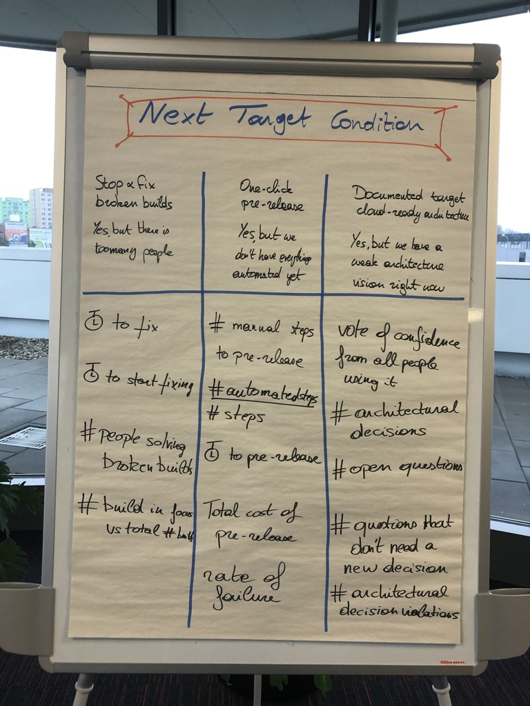
</figure>

For each of the next target conditions, the participants defined metrics to see the progress on the improvement for each next target condition.

**Stop & fix broken builds**:

* The time it takes for a broken build to be fixed.
* The time it takes to start fixing a broken build.
* Number of people solving broken builds.
* The number of builds in focus relative to the total number of builds.

**One-click pre-release**:

* Number of manual steps necessary to do a pre-release.
* Number of automated steps relative to the total number of steps.
* The time it takes to do a pre-release.
* The total cost of pre-release.
* Rate of failure of pre-releases.

**Documented target cloud-ready architecture**:

* Vote of confidence from all people using it.
* Number of architectural decisions.
* Number of open questions.
* Number of questions that don't need a new decision.
* Number of architectural violations in the codebase.

For these next target conditions, there were first experiments defined in the workshop:

* Set up the metrics for broken builds.
* Create a list of all steps necessary to do a pre-release.
* Survey on the discoverability of the current architectural documentation.

The participants were happy about the results and the results of the first workshop looked promising. However, the group did limited follow-up on this workshop and monthly iterations didn’t happen. We reflect on this in the [reflection on technical excellence section](#a3-general-reflection-on-technical-excellence-improvements).

### A.2 Remote architectural kata (cross-company)

Co-Learning (now: Simplification Officers) organized a remote Architectural Kata for three clients that are in a LeSS adoption. A kata in this context is practicing skills outside the domain of the real battle. Goal of this kata is to learn architectural techniques for developers to use in their daily work, e.g. during development and for Product Backlog Refinement. To increase learning, the participants (and the breakout groups) were mixed cross-company, to be able to share knowledge.

We asked the participants to read in advance, the following:

* What is a Kata? <https://archkatas.herokuapp.com/>
* C4 Modelling: <https://c4model.com/> (levels 1 to 3)
* Example Mapping: <https://cucumber.io/blog/bdd/example-mapping-introduction/>
* Architecture Patterns: <https://en.wikipedia.org/wiki/Architectural_pattern>

With a use case (‘Room with a view’, a next generation hotel reservation and management system), groups - cross-company - formed themselves to work together throughout the day in breakout rooms. In each iteration, groups worked with specific techniques on the use case. At the end of the round, they gathered with one of the other groups, to share their outcomes and learnings. This way, throughout the day, groups not only worked closely together, but also learned from the other groups. Each group had its own space in Mural, so they could design & draw together.

In the first iteration, the groups could decide on their own how they would architecture or model the use case. Some groups used other techniques than the ones provided and other groups started using C4 modeling right away. In the second iteration, questions were addressed about C4 modeling. After that, each group got the assignment to work on level 1 to 3 of C4 modeling together. In the third and final round, each group started adding details to the work with Example Mapping, to move to clear and well-scoped items for the case study. Each group had a facilitator to help them move forward. An example of an important aspect that facilitators focused on was: ‘first draw, then talk’.

*Example of the results of one group*:

<figure>
  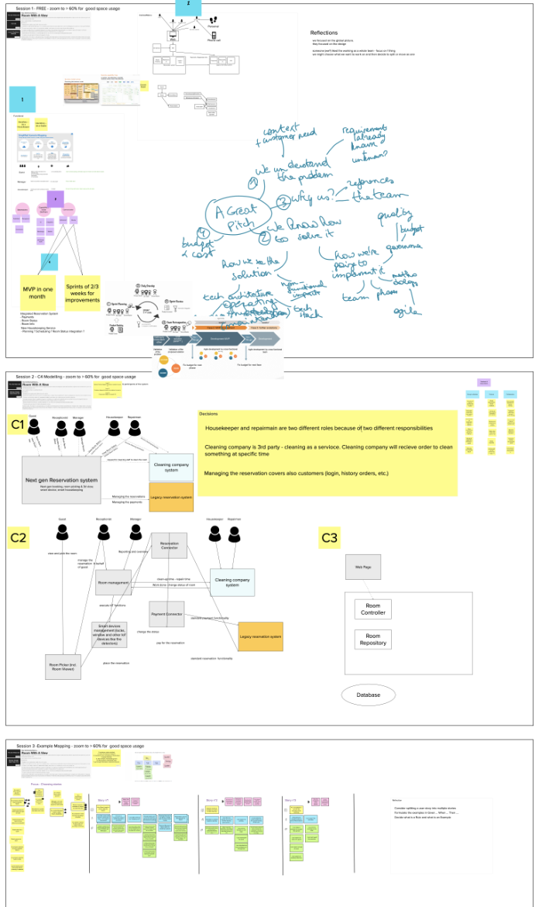
</figure>

Participants liked the learnings and at the end they identified experiments in their own context to use the learnings in their daily work.

### A.3 General reflection on technical excellence improvements

Technical excellence is an enabler of business agility. Before the start of the LeSS adoption, many activities were scattered across the organization. Examples are the execution of regression tests, fixing bugs, other support (all spread across many component teams) and testing & releasing the product (separated team). From the start of the LeSS adoption, teams shared these activities. For example support duty and releasing the product were done by teams on turns (‘duty’). Executing regression tests and fixing bugs were - mostly, except for high urgency bugs - done by (automated) selection and if needed discussed in Sprint Planning 1.

Teams took more responsibility for these ‘pains’ this way, and created more understanding of broader product matters by teams. Teams could do more - often small - improvements in how these things were done. E.g. when they develop a new feature, often they created automated tests as well, which made regression testing easier, faster and better. Before, the pains led to delays in delivery and quality problems in the product, which is significantly better now all teams (can) take responsibility for them. Though these pains weren’t gone - even not after 2 years in the adoption -, the teams reduced the pains significantly and at least didn’t block the delivery of value. Most ‘pain’ right now is for teams having these ‘duties’ and working on these pains instead of developing (customer) features. Slowly, this is improving as well, but the biggest pains are at least conquered. To improve technical excellence, it is important that teams have - and can take - the responsibility about the technical health, so they are able to do something about it.

The Product Owner (before the co-founder became PO) - and the product marketing team - didn’t prioritize much of the technical excellence work on the Product Backlog and they didn’t encourage teams much to increase the technical excellence (e.g. by asking to leave code better than teams found it). Enthusiasts still moved important initiatives forward, and teams still improved frustrating things related to technical excellence, but it never got the attention and focus teams wanted, to be able to make more impact. Teams often still preferred the delivery of PBI’s for customers because of the pressure they felt on this.

However, the technical excellence workshops and attention didn’t bring the value that was expected and desired. The results of the initial Improvement Kata looked promising, but they were not focused. Toyota Kata includes one challenge and one next target condition, to have more focus on the improvement. There should have been focus on one next target condition instead of three. On top of that, nobody took the lead to create a monthly iteration on the improvements and the discipline to follow-up on this. This way, there was almost no transparency about progress and no possibility to inspect & adapt.

The Product Owner should - at least - encourage technical excellence and take it into account in the product vision and balance it with customer needs. Teams should drive technical excellence forward themselves, but they should feel support from the Product Owner. Especially in an environment with teams that were not used to taking responsibility for technical excellence. Team representatives identified that larger ‘improvements’ were needed to bring technical excellence to a higher level, which would take significant amounts of time from teams. End of 2019, beginning of 2020, some teams and a Scrum Master were proactive in moving technical excellence forward. They included the Product Owner, some other important stakeholders and even the CEO in the technical excellence topic to drive it. They made significant improvements in the build pipeline, updating/upgrading of old versions/tools and some small improvements in code quality. A big accomplishment from the drivers was the higher transparency they created on future work on technical excellence on the Product Backlog and the continuous discussions about this with the Product Owner (and even the CEO). This led to more focus on small improvements, but the Product Owner often still postponed other and bigger technical excellence improvements to move forward with ‘urgent’ customer requests (or strategy changes). This improvement when the co-founder became PO and encouraged technical excellence related improvements.

## Appendix B: Preparation to the 4-day events that kicked off the LeSS adoption

### B.1 Remote preparation of on-site workshops

An analysis of the Y Soft R&D context from different perspectives started the preparation: organizational, work processes and technical health of the actual code. The goal of the remote preparation is to learn about the current state of Y Soft, to acquire a better understanding for both Y Soft and Co-Learning (as the partner in the LeSS adoption) and to learn together about next steps.

It started with an analysis on Y Soft internal tools like Confluence and printouts out of Y Soft’s internal ERP system, for the organizational assessment. Additionally, interviews with Scrum Masters and the head of Product within Y Soft to get more clarity and validate the understanding. The organizational assessment led to insights to cover in the following steps in the preparation for LeSS adoption, like the on-site organizational improvement kata workshop to redesign the organizational structure. The assessments of the work processes were done similarly by analyzing Y Soft’s Confluence and Jira, and interviews to get more information and validation.

The evaluation of the technical health:

* Using a dump of the commit logs in combination with gource.io (see image below).
* Analyzing Bamboo build plans and deployment plans, failures, success rates, run times etc.
* Analyzing branching strategies in place and architectural documentation extracted from git.

These were used to validate and learn with the developers how to improve. An example  learning point that developers took, is to make sure that the knowledge of people that are the single points of knowledge (of certain components or technologies) would be spread amongst teams in the team self-design and to make sure team members could learn this knowledge.

A graphical overview of the outcomes of the evaluation of the technical health looked like this:

<figure>
  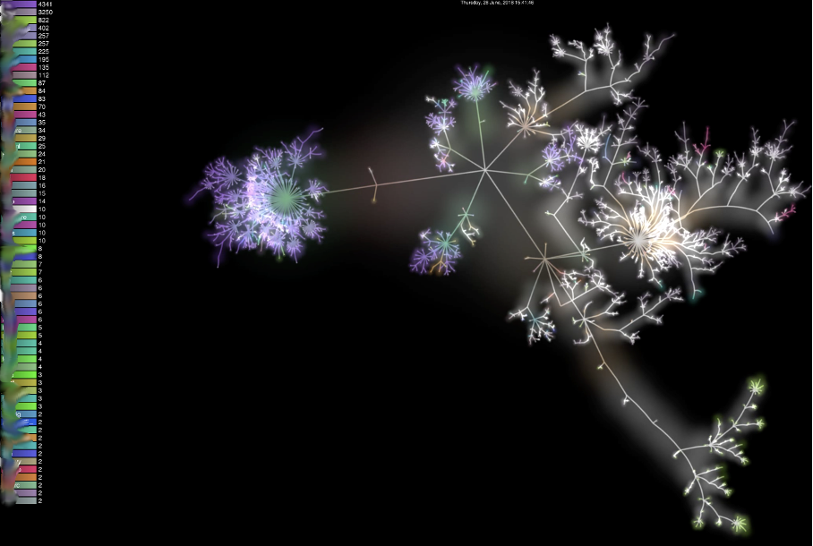
</figure>

The following results from the initial evaluation were addressed in the preparation of the LeSS adoption:

* Many management layers for a reasonably small organization
* No clear Product Owner - there are “Team PO’s”, Architects and Project Managers while these roles don’t exist in Scrum
* In a constant state of firefighting and checkbox hunting
* Jira workflows with more status differences than employees working with it
* +/- 75 explicit backlogs
* 898 build plans in total, maximum build time 25 hours, 50 build plans in continuous failure
* Releasing was difficult and took a lot of time, since each team focused on a specific part around (a) component(s)

The results were validated in workshops and taken as preparation for the 4-day event’s workshops.

### B.2 Educate everyone (August 2018)

The first step of the LeSS guide *Getting Started* is: educate everyone. The VP’s and Scrum Masters all joined Jürgen de Smet’s CLP to get a deeper understanding of LeSS. For all developers - and some others - potentially volunteering in the LeSS adoption, there was a Lego 4 Scrum workshop towards a LeSS organization. Jürgen made the workshop very intense, to really get the right volunteers and to know where they would sign up for. Emphasis is to understand it’s extremely important to collaborate with other teams, customers and users.

<figure>
  
</figure>

<figure>
  
</figure>

<figure>
  
</figure>

<figure>
  
</figure>

### B.3 Initial Organizational Improvement Kata (August 2018)

Based on the results from the preparation, an Organizational Improvement Kata was organized, based on the Toyota Kata approach. The direction and challenge that was set forward was to find the optimal organizational structure for starting in the LeSS adoption after the 4-day event.

<figure>
  
</figure>

In this workshop, the VP’s in R&D, HR, product marketing, Business and part of C-Level explored their current organizational setup in combination with validate findings from the preparation. Note that there was no Finance representative present, which in many cases would be beneficial. Financial policies often have big influence on the organizational patterns and should be reconsidered when moving towards LeSS. The participants discovered favorable patterns and less favorable patterns and these were noted down and discussed. The results are in the pictures below.

*Results from the Meddlers game on current situation:*

<figure>
  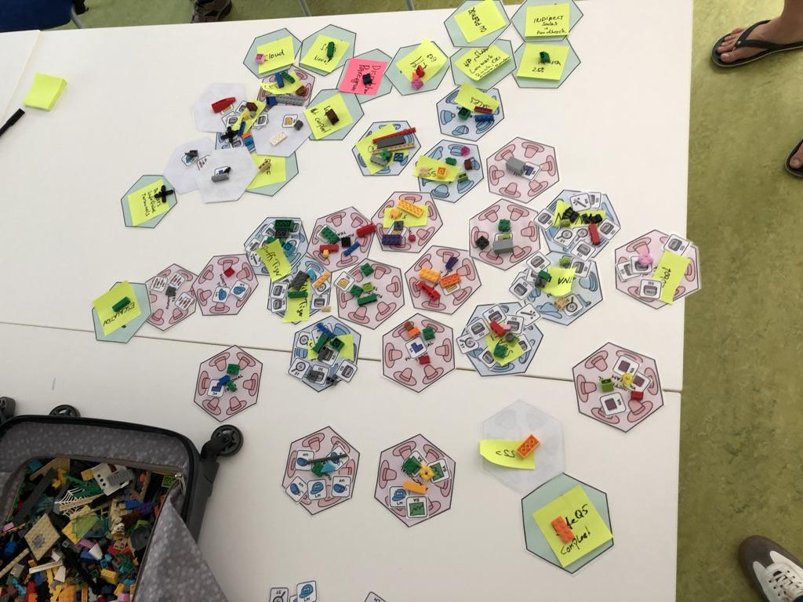
</figure>

Positive about the current situation:

* Component focus and deep knowledge of components
* Product is a central point for all requests
* UX & Security knowledge is within R&D
* Focus on support
* Lot of internal knowledge

Improvements for the current situation:

* Teams wait for each other a lot
* The build pipeline doesn’t work well on product level
* Almost no feedback back from the field
* No direct information flow to teams from the field
* Requests that go to the teams are not what the customer actually wanted
* No clarity for roles
* Support interrupts new development
* Escalations go through different channels
* Documentation is not right

A selected group was working to design a future state using the Meddlers Game from Management 3.0. They  explored options to elevate the favorable patterns discovered and eliminate most (not to say all) less favorable patterns.

The same group defined together what ‘product’ could mean in the context of the new organizational setup. Define product is the second step in the LeSS guide *Getting Started*. Volunteers from the ‘educate everyone’ session were added to get feedback on the results for the organizational setup. The whole group did a Feature Team Adoption Map exercise. This LeSS guide *Feature Team Adoption Maps* helps to make transparent the kind of organizational change you can expect for the LeSS adoption. It’s a representation of the gradually increasing work scope of the teams on one axis and the degree of cross-functionality of teams on the other axis.  It resulted in insights on the organizational setup and to set boundaries of what is in scope for the 4-day event that starts the LeSS adoption.

<figure>
  
</figure>

<figure>
  
</figure>

Once the scope was cleared out, the group continued with the Feature Team Adoption map to discover the needs in relation to licenses for tooling, hardware available on different development locations, skill gaps within current teams and locations and more.

Other workshops included e.g. how to gather requirements, validating the results from the technical evaluation and an understanding of the LeSS principles to managers. In hindsight, there should have been a workshop or training about the essence and principles of Scrum, which was not common knowledge for all developers.

Next, we classified the needs and preparation into a backlog with categories for ‘must before 4-day event’, ‘during 4-day event’ and ‘after 4-day event’. This list became a famous wiki page within Y Soft with actions to take in the course of preparing their 4-day event starting the LeSS adoption by the volunteers. The aim was set to have that event in November 2018.

The Wiki page looked like this:

<figure>
  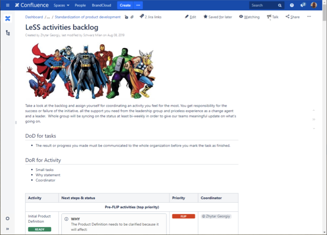
</figure>

There was no official ‘change team’ that joined and worked on these steps, but a (large) group of volunteers that led the change. However, the downside is that people appeared and disappeared from the volunteering group, which made it harder to move things forward. A small group - Scrum Masters mainly - took the lead to make sure the volunteers could do the right things. People joined the volunteering group, but the expectations for them were set at the meetings instead of set in advance.

The communication about the preparation goals and the workshops should have been done more and better. This would have made volunteers more aware of what was expected and their contribution would have been more dedicated.

An important observation was that nobody wanted to be the Product Owner for the newly defined product.

### B.4 Preparing the 4-day event starting the LeSS adoption

Within Y Soft, the VP and the Scrum Masters took the lead to further prepare the 4-day event. There was no official change team and the responsibilities for all activities were taken by volunteers. The volunteers met twice a week to synchronize on progress and discuss and plan next steps.

One activity was to set up communities (at that time still called ‘Communities of Practice’ and this terminology is still used in Y Soft) to be able to share knowledge between teams. The LeSS guide *Communities* is there to address cross-team concerns about e.g. skills, standards, tools and designs. Recommended communities include design/architecture and test. Developers were asked to set up communities they thought were useful, which resulted in many “communities” without any real impact. These communities “started”, there were meetings, but they had no clear goal and limited sharing of relevant knowledge. When the Scrum Masters realized that they don’t have experience with running communities, they used the external support to acquire knowledge from others. This resulted in a list of experiments people can try or avoid running internal communities.

Some of the communities that were set up within Y Soft used the community as a way to control work for e.g. components, which was dysfunctional for the self-managing of the teams. The Security community led to strong knowledge of team members on security and increased quality of security in the product, which the Scrum Masters considered as a success story. The community introduced ‘security champions’ in each team that joined the community and spread their knowledge into the teams. In 2021, there were just a few communities (test/Quality Assurance, development practices) still running and frequently sharing knowledge or improving quality. The main lesson to get communities working is to support people into organizing and structuring communities with a clear - and aligned between members - goal of the community with a community coordinator that has passion for the concern and a desire to cultivate a strong community.

Additionally external support was used to organize several in-depth technical workshops. In an event-storming workshop, volunteers linked their (technical) architecture back to business context. Teams had to move from a component focus to a whole-product focus, and these insights helped teams to better understand that whole product. Additionally, there was an internal Code Retreat on baby-step refactoring to bring in some necessary engineering practices for teams to move ahead. People could use the learnings of this workshop in their teams. This way, they could integrate all components in one product, including support, releasing and other activities.

*Technical workshops:*

<figure>
  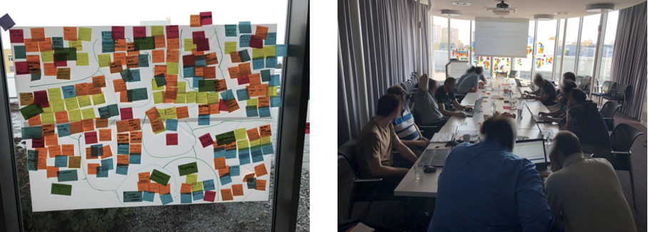
</figure>

One of the crucial activities that was needed in the preparation was to find a Product Owner. After searching and discussing this internally, the VP of product marketing took the role of Product Owner, as in the very first Scrum adoption at Easel in 1993. The people in his department from product marketing would help teams to get the needed customer understanding.

To engage people in the preparation steps, the Scrum Masters organized Open Spaces & Lean Coffees, where people could share the progress and address their struggles, fears or questions. *Open Space* is one of the LeSS guides for learning & coordination regularly to have participants self-organize in.

However, the communication about the LeSS adoption was failing. First, the communication was mainly done between the volunteers and with the use of Wiki. This led to low transparency to others that weren’t involved in the volunteering activities. And second, people ignored the mails that the Scrum Masters sent with updates. Consequence was that Scrum Masters and the VP that led the change had much more work to inform everyone and get them on the same page for the 4-day event. The VP that led the change became the Head of Product from the 4-day event on, as the only remaining VP for the product.

## Appendix C: 4-day event that started the LeSS adoption

In January of 2019, the 4-day event took place. All possible volunteers would join, including the Product Owner, management and some other supporting roles. The Head of Product explained to everyone the reason for the change in the introduction. In this section, we describe the steps of the event.

<figure>
  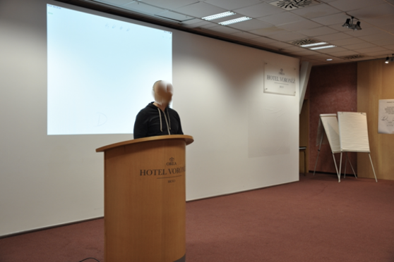
</figure>

Screenshot of - part of - the planning for the event:

<figure>
  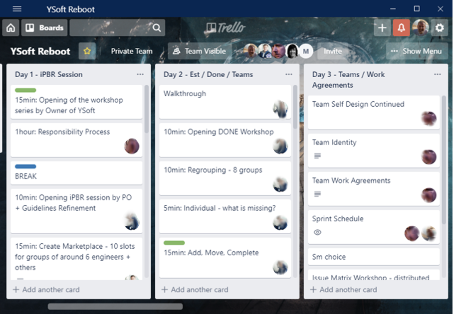
</figure>

### Day 1: initial Product Backlog Refinement (initial PBR)

The Product Owner shared the product vision as a starting point for initial Product Backlog Refinement. The LeSS guide of *initial PBR* is to make sure that teams have a Product Backlog with enough understood items to start working. It’s important to do at the start of a LeSS adoption, because usually the so-called “Product Backlogs” that exist follow the old structure, often functional or component focused instead of customer-focused. With feature teams, the Product Backlog Items (PBI’s) will be customer-focused and therefore the old “Product Backlogs” will often not be useful, but can be a good source for the initial PBR. Among several other reasons why initial PBR is important, it’s needed to make sure teams understand the PBI’s, instead of having PBI’s written down by one person, team or someone else and assuming others understand it.

*Product Owner sharing vision:*

<figure>
  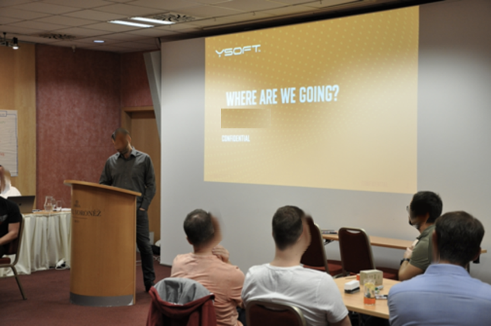
</figure>

The product vision was the starting point for the initial PBR, done together by all participants. First, engineers created a marketplace with 10 slots, so there would be around 6 people per item. People added items to the marketplace so each slot had an item (or several items) to refine in that slot. People worked in several iterations, and each iteration would go into more detail. After each iteration, people shared the results to each other in something like a LeSS Sprint Review Bazaar, but only for item analysis, not done features

*Example of a refinement slot discussion:*

<figure>
  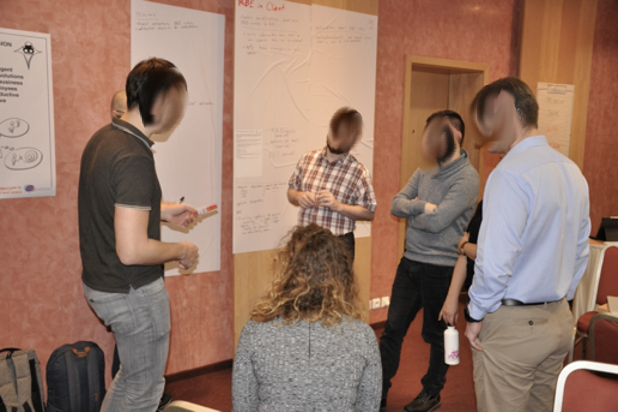
</figure>

After the Refinement iterations, groups of people did ‘mob documenting’, where they added the results of the Refinement to the Wiki and the Product Backlog. In the break, the Scrum Masters printed all items for the next step: estimation. Participants used slide & deal techniques to estimate all the items: participants placed items in categories and big categories were split further to get better estimations. The picture below shows how the items were placed on the floor and people categorized them.

*Mob documenting:*

<figure>
  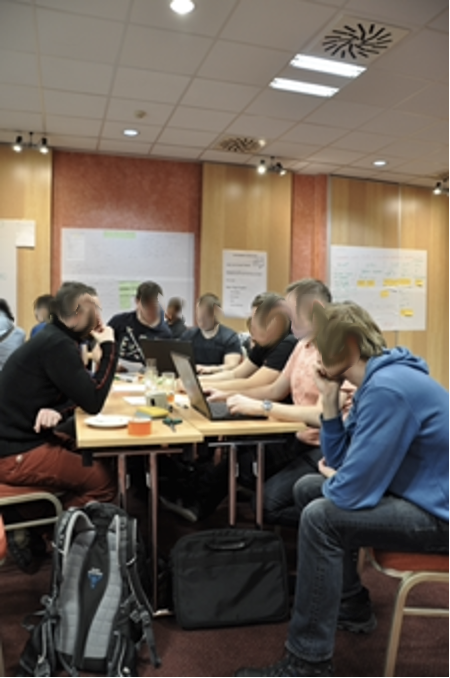
</figure>

*Estimating:*

<figure>
  
</figure>

<figure>
  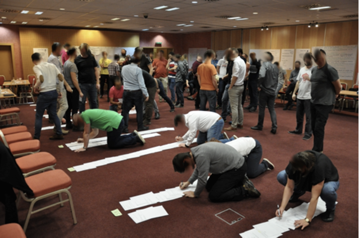
</figure>

### Day 2: Creating the Definition of Done & self-design the team

Everyone participated in a Definition of Done workshop, to get to a common Definition of Done (DoD) for the product. According to the LeSS guide *Creating the Definition of Done*, it was created before the first Sprint starts. Participants re-grouped with other people than in earlier sessions (8 groups) and started working with an initial DoD that was prepared in advance. In this group, they defined what activities are needed to be potentially shippable for the product. After the draft from each group, two groups came together to get to a common DoD for the two groups. This was repeated again, two (combined) groups came together to get to a common DoD for the two (originally four) groups. And finally, the last four DoD’s were made into 1 DoD with the entire group. These facilitation techniques were used from the LeSS guide *Cross-Team Meetings*, with diverge-merge cycles to create diversity in groups (with mixed groups), and merge back to get to one common result.

After that, they did an ‘undone’ workshop to discover which activities can be done each Sprint (following the LeSS guide *Creating the Definition of Done*). People divided activities that weren’t on the DoD - meaning teams weren’t able to get that ‘done’ - into the groups. Each group defined how the activities will get done (when, where & what) to identify all the missing pieces to get to a ‘perfect’ DoD and to be able to ship the product to customers. Teams would use this Definition of Undone to improve the DoD in the future. It gave teams transparency with whom to collaborate closely with about what. This gave the teams insight how to deal with (certain types of) ‘undone’ work and what opportunities are there to improve the DoD in the future.

*Definition of Done workshop:*

<figure>
  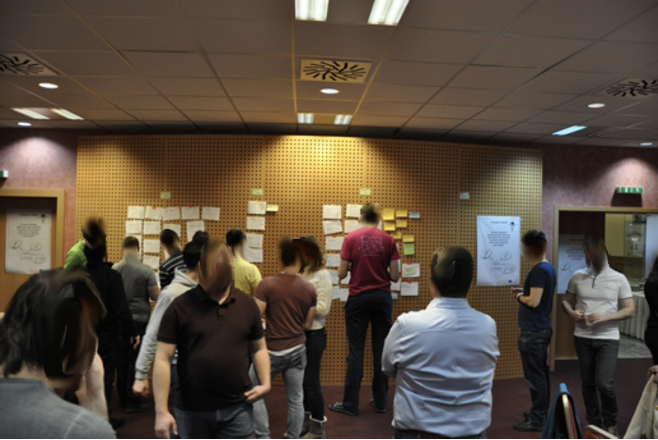
</figure>

<figure>
  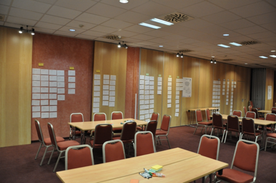
</figure>

Then, people ‘burned’ their old teams. Teams made materials about their current teams and what it meant to them. They literally burned these materials, as a way of saying goodbye to the old teams and being able to design the new teams with a fresh mind.

*Burning of old teams:*

<figure>
  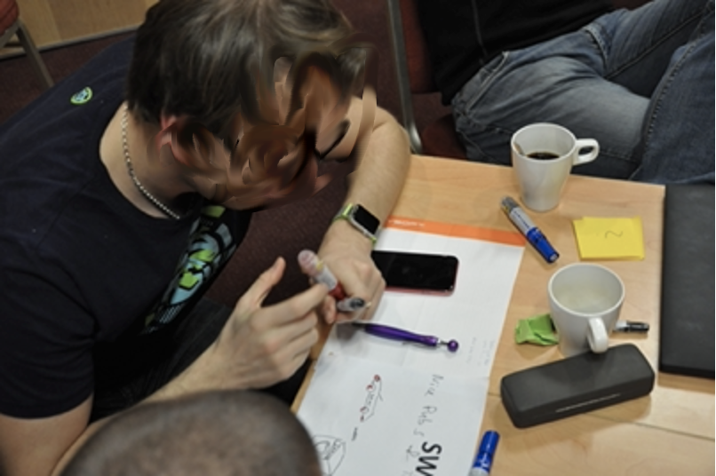
</figure>

<figure>
  
</figure>

Then, the team self-design workshop started. One of the LeSS adoption principles is *Use volunteering*, to engage people and it gives people the feeling of being empowered. An important part of this is to self-design the teams, meaning to let people decide themselves how the team looks like. The criteria for the self-design for the teams were:

* Team is co-located
* Size is between 6 and 10 people
* Being able to deliver as much of PBI’s independently as possible
* High diversity of skills and personalities

Before starting the workshop, it was announced that only volunteers that want to be a team member (following the ‘Use Volunteering’ adoption principle), Scrum Masters and managers could stay in the room, because they are the ones that are going to work together primarily in the new setting. All other people were requested to leave. Some architects were leaving and decided not to be part of a team. Each volunteer filled in a template ‘personal character sheet’. They included personal skills, technology skills and other important things that they wanted to add to their sheet. This sheet was used in each iteration of the team self-design subsequently.

The organizers set tables as places for a team, and people could move through the tables and decide to go to a team (diverge). Each table/team discussed what that team would need from its members and how they scored on the constraints. They filled in a team sheet to evaluate the combination of skills from the personal character sheet. After each iteration, each team shared their status with the other teams in a review (merge), to keep the overview. In each iteration, teams identified possible improvements for the next iteration. After three iterations, all team members were at least ‘ok’ with the team setup and that meant that the initial teams were final.

*Team self-design discussion:*

<figure>
  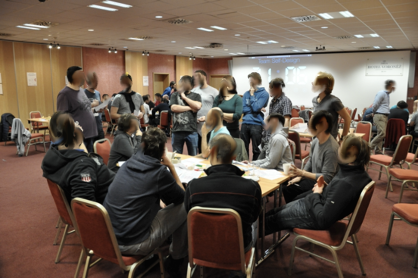
</figure>

### Day 3: Team agreements & follow-up with teams

Teams started day 3 with the final iteration of self-design. After the team self-design, teams worked on several things to get to some team agreements:

* Team name
* Team song
* Guiding principles to weigh options and make decisions
* Potential struggles for the team and how to cope with that
* Work agreements

The teams were also able to choose a Scrum Master from the group of Scrum Masters (constraint: co-located). After that, each team did a Done/Undone review in its team, to learn which parts of the DoD they were able to deliver and where they should improve.

Then, participants discussed the support for the product. Besides customer features, there will be other types of work, often bugs or defects coming in, often ‘sudden’ and not plannable. A support department within Y Soft takes care of first, second and third level support of the product, directly with customers. If the support department can’t fix the problem for the customer or needs R&D for that, they create a ‘level 4’ support ticket that is handled by R&D (meaning: the teams). The newly formed teams decided that one team per Sprint takes care of these level 4 support tickets and works with the support department (and customers sometimes) to fix these problems. This team is the fast-response team from the LeSS guide *Handling Special Items*, that enables a rotating responsibility shared among the teams for support and gives the other teams focus. Because the teams in the old structure were component focused and handled this support separately, for many teams it meant that they didn’t have the knowledge to support all tickets, and as a consequence they needed to learn that.

Additionally, teams agreed on distributed decision making models to make sure bugs (defects) are categorized and follow-ed up. The support team makes sure that categorization happens and needs to act when there is a high priority bug that has to be fixed as soon as possible. In the workshop, teams created a bug matrix to categorize bugs.

In advance, the Scrum Masters printed 100 open bugs and 100 recently closed bugs and created x- and y-axis on the floor. Teams chose ‘bug severity’ for the x-axis and ‘customer impact’ for the y-axis. Team members were asked to put the printed bugs relative to each other on the floor. After quite some bugs were added to the floor, they created some clusters. At that point, the organizers extended the x-axis and y-axis with 9 blocks, like this:

<figure>
  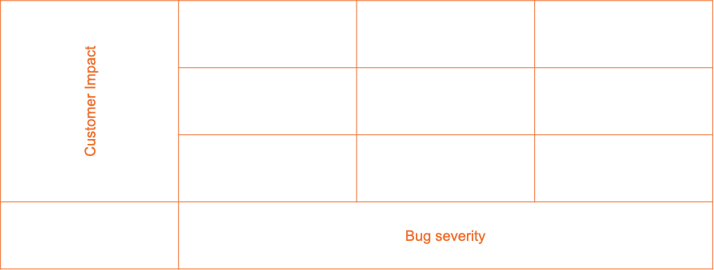
</figure>

The rules that were set forward were that all bugs had to be in one category (not on the line), and bugs would be placed relative to each other within the category. The good thing about doing this on the floor is that lines can be extended to left, right, top or bottom (as long as you don’t make the initial lines too close to the wall). The left and bottom categories usually stay quite empty, so then you can move the lines a bit and the second cells from the left will be the new left cells.

After adding all the bugs, together teams decided how each of the 9 cells were ‘categorized’ how they should be handled. The team with support duty could compare all new bugs to bugs that were categorized before and categorize a new bug, enabling a distributed decision making model.

*Bug matrix:*

<figure>
  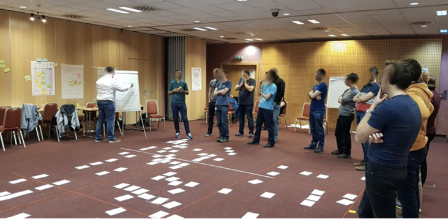
</figure>

### Day 4: Sprint Planning

On the last day of the event, teams did their first Sprint Planning One in the new setup, following the LeSS guide *Sprint Planning One*. Jürgen explained the purpose of the Sprint Planning and the guidelines of the Sprint Planning. The Product Owner opened the Sprint Planning by explaining the priorities from his perspective.

Each team shared which availability they have for the upcoming Sprint (holidays, meetings etc.) and the things they needed to finish that were already in progress. Additionally, they added bugs (with a high categorization from the bug matrix) to solve. Then, there was a bazaar for teams to share their selection and design of their Sprint, for the PBI’s they picked themselves. These PBI’s were printed so teams could grab them to select and discuss with other teams who would pick which PBI.

In the next step, each team crafted a Sprint Goal individually. Then, all Sprint Goals were collected and there was an agreement on an Overall Sprint Goal for all teams combined for the upcoming Sprint. Important to mention is that LeSS - in contrast to Scrum - doesn’t require a Sprint Goal. When useful and when there is a natural clear overall goal, it’s good to apply. But when there isn’t a natural clear overall goal (e.g. because of the heterogeneity of work across teams), then it’s better to not have a common Sprint Goal.

<figure>
  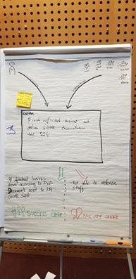
</figure>

Each team selected the - printed - PBI’s they want to work on into their Sprint Backlog (Magic Whitepaper on the wall) in their team space in the room. In the LeSS guide *Multi-Team Sprint Planning Two*, it’s emphasized to have the Sprint Planning Two in the same room with all teams, to be able to coordinate with other teams using the ‘*just talk*’ or ‘*just scream*’ technique. Team members looked at the selection of other teams with the instruction to minimize dependencies between teams and move things from teams to other teams. In LeSS, there are no dependencies, because each Feature Team has the necessary knowledge and skills to complete an end-to-end customer-centric feature. If not, the team is expected to learn or acquire the needed knowledge and skill. The teams were new, and therefore some features didn’t have teams yet with all the knowledge and skills to deliver it end-to-end. In Sprint Planning Two, the teams coordinated between each other how to deliver the features end-to-end, with help from knowledge and skills from other teams if needed, preferably by learning them. This way, there is no dependency, because the teams together - at the same time - make sure the features get done. In hindsight, the instruction to minimize dependencies might have given the wrong perception to teams, because the focus should be on learning or acquiring the knowledge and skills, by working together with the other teams. And these are not dependencies, but simply working together to learn and get features to done. Over time, that should have eliminated the perception of having dependencies, by giving the right message.

After Sprint Planning One, each team did their design on how to get things done in their Sprint Planning Two, following the *Multi-Team Sprint Planning Two* LeSS guide. A bazaar was done so teams could see what other teams had crafted and to be able to align if needed. Teams were asked whether the results were good enough to start the first Sprint. After that, teams did another iteration to get more specific results in their ‘plan’ of the Sprint and subsequently the ‘administration’ to update the Product Backlog and their Sprint Backlogs.

At the end, all participants celebrated with a dancing challenge! And from that moment the new teams would start working together in the new structure.

## Appendix D: Preparation and start event of the second experiment of OD changes

### Team design workshop 1

Goal of this workshop: determine the fixed team size number, form (draft) team designs, and check/learn about the possibility of end-to-end feature delivery by teams.

In the preparation, the Head of Product and the Scrum Masters communicated about:

* The constraints for the teams (co-located, fixed team size number across all teams & one person in one team only).
* What does it mean to deliver end-to-end with a team? Including what it means for ‘new’ roles for the teams like UX specialists and business analysts.
* Tips for designing the teams based on the previous team design.
* Question & Answer on questions from team members.

There are three sites with teams working on the product. On the biggest site (more than 50% of the teams), teams already started an initiative to improve the current team designs. From that initiative, a couple of team members helped in preparing for the workshop. Important input from these team members was e.g. the current status of the (draft) teams and the most common team size number.

*Reflection*: because the 3 sites differ in size (8 teams after the workshop on one site and 2 + 3 on the two other sites), we could have differentiated the way the 3 sites were preparing and participating in the workshop. The individual team discussions about who would be in which team, were much heavier for the biggest site. For the two smaller sites, the involvement from teams in some parts of the self-designing iterations was significantly smaller. For similar future situations, it would be good to consider how smaller sites would participate, but still include them in deciding how the team of teams as a whole would optimize best.

Because of the COVID-19 outbreak, this workshop was fully remote. Possibly one of the first team design workshops in LeSS fully remote. To be inclusive for everyone and to have an effective workshop, we used an online collaboration tool (Miro) heavily combined with Zoom to work in breakout sessions to discuss in teams.

So, how did the workshop look like:

1. <u>Responsibility Process</u>  remind everyone to take responsibility for crafting the best possible teams for the product.
2. <u>Identify current challenges from teams to deliver features end-to-end</u>: not only to take into account in the team design, but also to learn from after the workshop to increase (cross-functional) learning. Participants took 5 minutes to individually (and silently) add sticky notes to the area in the board. After that, theyr read other sticky notes for 3 minutes, and clustered and categorized the sticky notes. We did a small voting round to have a quick overview which of the categories were deemed most important.
3. <u>Determine definitive team size</u> All participants did an exercise to add pros and cons to the proposed sizes of 6 & 7 and to be able to add alternatives. We took the time to decide together with the teams what the fixed number would be. Some teams discussed it already in advance and came with 6 or 7 people per team as the best number. In the online collaboration tool, we put those options at the board and asked the participants two things, (1) Add pro’s & con’s per option, and (2) Add other options and arguments for that option (if any)  Two options were added: 8 people per team and 6 + 2 people per team. 2 people meaning: ‘non-developer’ roles, e.g. UX specialists or business analysts. This way a team could have 6 ‘developers’ and optionally add ‘non-developer’ roles, so there would be teams of 6, 7 & 8 in that scenario.  After the longest discussion of all workshops - a little over 20 minutes with 90+ people - participants voted for the (fixed team size) number. One of the team members suggested doing two rounds: a second round for the top 2 options, where also voters from the lowest 2 options could vote again for one of the top 2 options. The Scrum Masters expected that making a decision would be harder, but it was easier than expected. The fixed number of 7 was chosen by a clear majority. Afterwards, some people were happy about the size of the discussion as well: ‘it would have been longer if we had done this co-located’ and ‘because of the facilitation the discussion was kept to a minimum’. The teams felt more involved, because we asked the teams to come up with the fixed team size number. It felt better than a ‘directed’ decision. Even though, statistically, the chance to reach the number 7 is almost certain for any large group.  This fixed team size is unique for a LeSS adoption, and it’s definitely interesting to reflect on this. However, it doesn’t fit well in the setup of this case study. The downsides were small and after this event there was rarely a mention to this. An unexpected positive upside was that teams were very reflective and critical of the skills they added to their teams, because they had an upper-limit of seven people in their team. This made the team self-design reflective and people didn’t ‘just join’ teams, but were seriously discussing this before deciding on it.
4. <u>Self-design iteration 1</u> The first iteration was short, because of the preparations many of the participants did. We created team numbers in Miro with spaces per team to add names per round and evaluate per round. In the first round, we asked people to add their names to a team that makes sense to them and copy their preparations. This would be used to have a starting point, but also to check whether every team member was actually participating in the workshop.
5. <u>Self design iteration 2</u> The second round was a full iteration. The team numbers corresponded with the breakout sessions numbers. We asked people to add their name to a team in the second round (95% was the same as in the first round of course) and join the breakout session of that team. We asked them to discuss their current team, what they loved about this team, what they could improve in this team and how ‘diverse’ the team was. Some people were moving between teams and a lot of discussions happened. After the iteration, everybody got 10 minutes to read the outcomes of all the teams and ask questions if there was unclarity. After this round, the foundation was there with 13 teams, but there were some open ends (e.g. not every team had the correct size, a few people not happy with their place in a team).
6. <ul>Check upcoming work and how they could be delivered by the teams</u> In the third round, a selection of the Epics (*note: an ‘Epic’ is a cluster of PBI’s together in Y Soft, following the tooling they use for the PBL*) were prepared on the Miro board by the Scrum Masters in a table. Each team could indicate whether they can deliver that Epic end-to-end or were willing and able to learn it. We asked them to copy the Epics and drag them to their team’s space: either to 1) we are able to deliver it end-to-end or 2) we are able and **willing to** learn to deliver it end-to-end. We made the learning part for the Epics explicit to encourage teams to focus on customer centric features end-to-end more in the future. Teams evaluated the possible Epics for their team and added a green sticky note (we can deliver it end-to-end) or an orange sticky note (we are able and willing to learn to deliver it end-to-end) to the main table.  *Reflection*: we made clear in advance that we wouldn’t use the results about which teams could deliver which Epics afterwards. There was fear of some teams that this transparency would be used to challenge them later why they wouldn’t work on a certain Epic. Of course, teams could use this transparency themselves afterwards if they wanted to.
7. <u>Reflection and closing<u/> Participants added one thing they were happy about in the workshop and (maximum) one possible concern for the team design. This input was used by team members, but also by the Head of Product to work on during the time between the first and the second workshop.

We split the team design workshop in two parts on purpose. In co-located team designs, team members often chat in breaks about the team design. Learning from previous team designs is to take 30 minutes breaks between iterations to let that happen. Otherwise, these discussions will happen after the workshop and teams will change afterwards. Remotely, this chat in breaks is hard to accomplish. We organized a week between the first and second workshop, so team members could reflect and discuss open issues or concerns.

We used Miro to facilitate all steps in the workshop. The screenshots (second one not readable on purpose) below give an indication. During each step, the participants themselves were moving in Miro and adding/changing things. At maximum, 95 people were active in Miro at the same time. Most important facilitation tip: don’t have central discussions. Use other techniques for that, like taking 5 or 10 minutes after each breakout session to read the results or adding questions in sticky notes to someone else’s input.

<figure>
  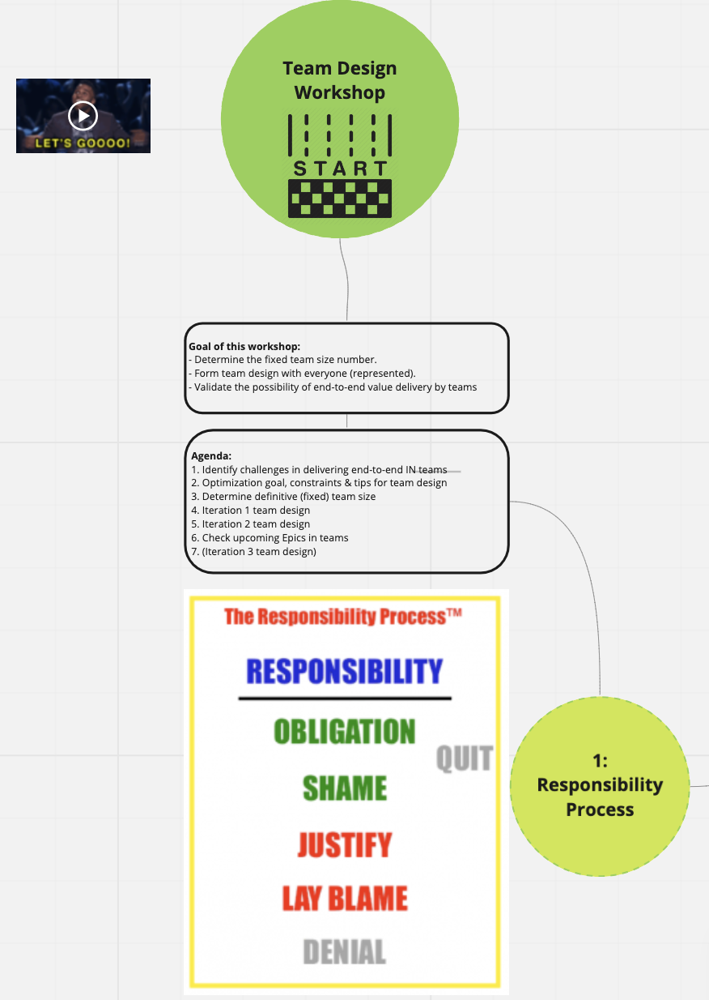
</figure>

<figure>
  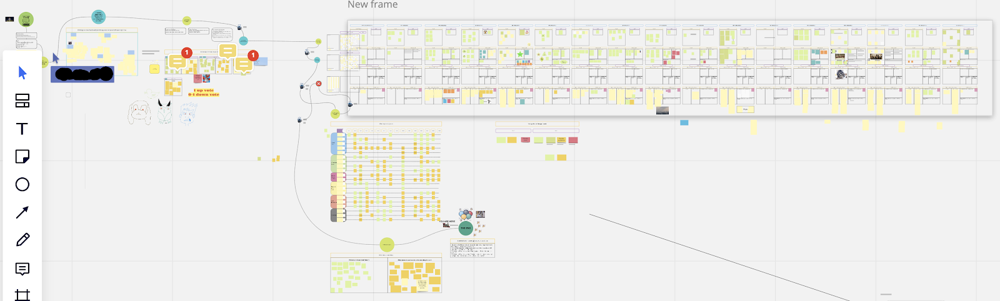
</figure>

### Team design workshop 2

Goal of this workshop: finalize the team design and identify follow-up steps to improve continuous learning for the future.

In the week between the two workshops, participants discussed many open ends of the team designs. Some teams were too big and some people didn’t have a team yet. The Head of Product addressed that it could be a valid outcome that someone wasn’t part of a team, and teams shouldn’t be forced to include members in their team they didn’t want to. The Scrum Masters, agile coach and Head of Product had a good overview on the status and helped by talking to the right people to get some things moving in between the workshops.

The second workshop had a similar structure to the first one. People used the online collaboration tool in the time between the workshops to keep progress of changes in their team design.

1. <u>Summary per team</u> Every team took 10 minutes to summarize their changes between the workshops and what they needed to do in the subsequent iteration(s). All people read the summaries of the others to be prepared for the next iteration.
2. <u>Self-design iteration 3</u> In this iteration - based on the summary - teams focused on discussing with other teams how to improve further and how to help other teams to improve. At the end of this iteration the teams were ‘ready’, all constraints were fulfilled and the foundation was there.
3. <u>Address blocking concerns</u> Teams voted whether there are blocking concerns to work with the team designs: ‘are you ready to start next Monday in these teams or does something need to be resolved?’ One team had a blocking concern, because they were too big (8 persons instead of 7). We organized a short breakout session about this blocking concern with the Head of Product, the people involved and people from some other teams that could help. One person that was desired to move to another team was sick and therefore both teams didn’t want to make the final decision. We agreed to solve this when this person was back, and teams voted again: ‘after this action point, is there another iteration of self-design needed?’ The answer was no by a large majority (just 2 people wanted another iteration of self-design) and we moved on.
4. <u>Next steps</u> People identified three types of next steps, 1) needed to address on event, 2) needed to address in the first new Sprint, 3) needed to address in the follow-up two Sprints. After that, we voted which of this input to take into account.
5. <u>Reflection and closing</u> Participants again added one thing they were happy about in the workshop and (maximum) one improvement for the facilitation for the actual event on May 11th.

One thing we planned to do in one of the two workshops, but couldn’t do due to a lack of time was to ‘identify learning to improve cross-functionality per team’. Each team would have identified what they need to learn, how they will learn it and what concrete actions they would take to increase their ability to deliver end-to-end. Instead of this, we included this topic explicitly in the Team Canvas on the event.

### Second event with organizational changes

The event kicked off the work in the new teams and working without managers. The event itself was mostly a day of ‘celebration’ and a formal start of a new step. Due to COVID-19, also this event was remote.

The CEO kicked off the event by thanking everyone for their active participation and important contribution to the overall strategy and success of Y Soft. He emphasized that we were able to deliver more value since the start of the LeSS adoption, even with many changes of people in the past (a bit more than a) year. He explained more about the changes in the company strategy and the importance and need for all teams to understand this. He encouraged teams to dive into the strategy and keep challenging the Product Owner and other stakeholders on it. He also talked about the ‘manager-less’ organization, because from that moment all managers in product development were removed. He ended by a vote on what should be on the grill when there is the possibility again for an on-site fun event.

After that, we had all teams together to reflect on the accomplishments and successes of the LeSS adoption that started more than a year before. It was very important to focus on the positive things. The reason to do the event was not because there were no improvements since the start of the LeSS adoption, but simply because the Head of Product - influenced by the CEO - wanted to make another big step forward. We asked team members to draw the accomplishments and successes and this was the result:

<figure>
  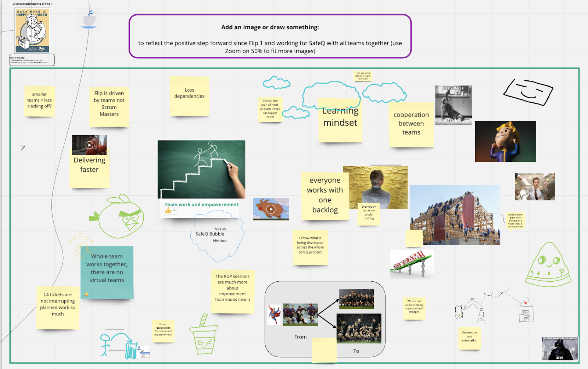
</figure>

Next, we asked each team to work on their Team Canvas. We asked them to come up with a team name (and a logo if they wanted). We added space for their ‘roles’ (focused on soft skills) in their team, important team values for them, how they collaborate, and how they make sure they learn (from each other). The exercise had the purpose to focus on their new team and have a starting point for them to work together.

*(small) Reflection*: there was a small insight about the team names: in the support tickets to some customers, the name of the team that solves the ticket is documented. Some team names might not be that good for external communication and there is no cohesion between the names. A possible experiment for next time is to have the teams choose a category together and select a team name belonging to that category. For example Star Wars as a category and ‘Darth Vader’ and ‘Luke Skywalker’ as team names.

<figure>
  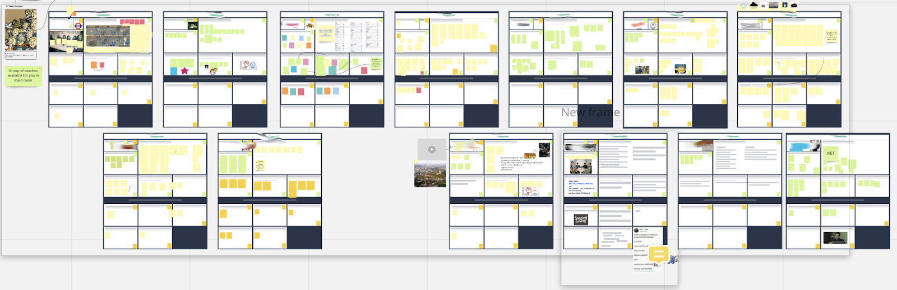
</figure>

*Team canvases*

Before lunch, teams solved a practical matter: the supporting team role. Each Sprint, teams rotate support duty. One team had a proposal to work with a buddy team, so new (hired) teams are up to speed faster in the support role and more learning across teams would be there. A back-up in case of issues would also be arranged this way. Teams that wanted this formed buddy’s and the teams solved this together.

After lunch, there was a small energizer and the topic ‘macro-processes’. Macro-processes are important aspects that used to be taken care of by managers that teams have to take care of themselves from now on. Examples of macro-processes are ‘on-boarding of new employees’ or ‘hiring new employees’. Teams need to take care of the macro-processes - in collaboration with e.g. HR for hiring - and used the time to choose the most important macro-processes. For the first two macro-processes, they made the first draft. In advance, a group of volunteers already made a template structure on how to define these ‘macro-processes’, similar to the LeSS complete picture.

In a brainstorming round, the Agile Coaches asked the teams what the Agile Coaches should focus on to help them:

<figure>
  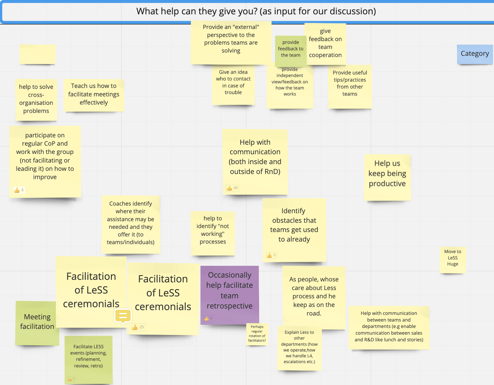
</figure>

The Agile Coaches used this input to define what perspectives they should have to have a wider system view and what their roles should be. In a later step, the Agile Coaches decided together who would focus on what.

<figure>
  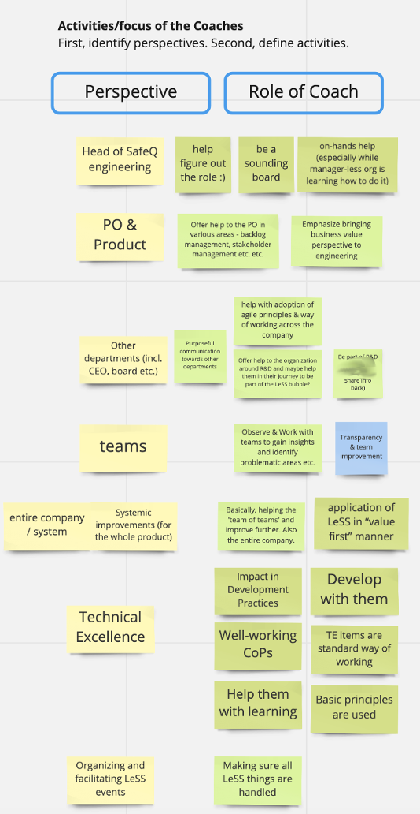
</figure>

*Result of discussion between Agile Coaches for their focus*

At the end of the day, all participants checked all the administrative and other operational tasks that needed to happen, because of the change of the teams. We asked all teams to discuss together how they would solve it and add a green sticky note when they were done:

<figure>
  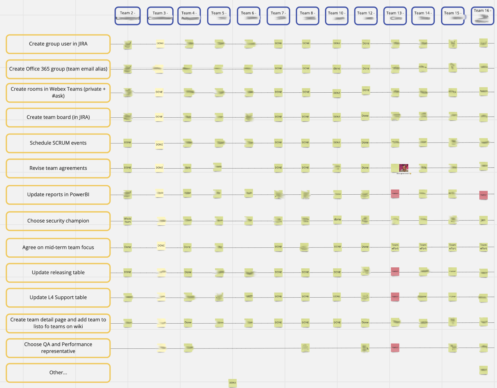
</figure>

We did the same thing for some general activities that need to happen and asked people to volunteer to solve them:

<figure>
  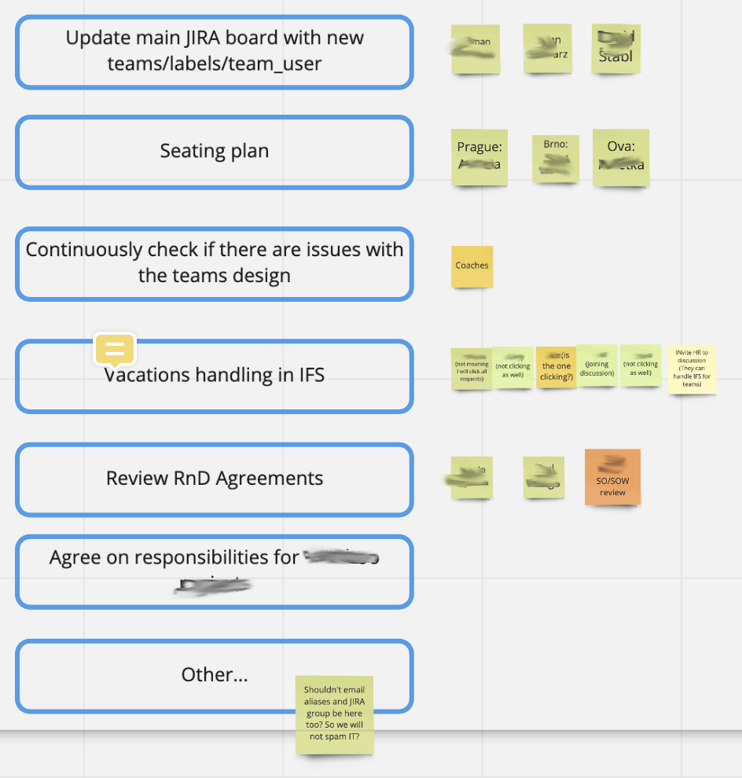
</figure>

The morning after, the first Sprint started with the new teams in the Sprint Planning. We asked as many people to join as possible (instead of only representatives), for two reasons:

* For teams with people that don’t know each other’s skills well yet, they can discuss together to select PBI’s.
* The Product Owner (starting a month the event) had a more strategic outline for the upcoming period prepared.

*Reflection on the workshops*: don’t postpone this kind of changes due to a pandemic: many things are achievable remotely with adjustments. When you postpone, the pain stays there and it’s great for behavior of <u>Larman’s Laws of Organizational Behavior</u> to revert the change.

Another learning is about having an interactive and inclusive way of doing the remote workshop. Make sure participants are engaged during the workshop by letting them give input, go to breakout rooms to have smaller discussions, and have interactions in an online collaboration tool. This makes the participants more involved, and the ‘voice of the loudest’ will be prevented.

Large-group organization and facilitation is a topic on its own. From the learnings at Y Soft, you can read and watch more here:

* <https://co-learning.eu/2020/06/11/a-full-remote-highly-collaborative-teams-self-design-workshop-with-80-people-yes/>
* <https://youtu.be/k6MD4kW0Xwo>

## Appendix E - adding a full new external team

Y Soft’s CEO and Head of Products wanted to increase the number of teams, to be able to have more capacity to deliver customer requests and strategic features. Here are some learnings about adding a fully new team - from an external vendor.

In the past, a specific vendor already supplied a full team in one of the (development) sites. This same vendor was asked to add a team in one of the other sites. The team could be treated as any other - internal - team and also be included in learning the product, customers and technologies, because there was a long-term contract. The main difference would be that the paycheck for the team members comes from another company. These prerequisites helped to have this new team learn the product like other teams.

The Head of Product announced that there would be a team added to a site, and together with the HR business partner he contacted the other teams in the site to discuss how they could onboard the new team in the best way. The new team would start with 3 people a few weeks later and would grow to a full team in the upcoming months. One of the teams at the site volunteered to help the team onboard and a couple of options were discussed how to onboard them best:

* *Temporarily add the 3 people to the volunteering team* This option was on the table, but the volunteering team didn’t consider it viable. This would harm their team dynamics for a while and would also not help them on focusing on on-boarding.
* *Start the 3 people team while working on something related to the volunteering team* In this option, the 3 people team would e.g. write automated tests for the feature of the volunteering team or at least test the feature(s) of the volunteering team. This would force them to work together with the volunteering team, and they would need to get a better understanding of the feature(s) and the technology. There would be temporarily an extra Daily Scrum with the 3 people team and representatives of the volunteering team.
* *Start the 3 people team with one or two travelers (the LeSS Travelers guide) in the first Sprints from the volunteering team* One or two travelers per Sprint would join the 3-person team with the main purpose of teaching them the features and technologies used. They and the travelers would work closely together and do a lot of mob programming together. After each Sprint, they would evaluate the need for the upcoming Sprint and decide who would be the best volunteers to next travel to the team.

The volunteering team chose the last option and it seemed to work quite well. The 3-person team came up to speed in a couple of Sprints and traveling was not needed anymore. They retained a close relationship with the volunteering team for future questions and Sprints, when something wouldn’t be clear or when they needed help. This illustrates the LeSS coordination guide *Just Talk*, recognizing the under-appreciated power of *social bonds* in supporting collaboration. In one of the last Sprints with travelers, they also took support duty (the LeSS “fast-response team” covered in the LeSS guide *Handling Special Items*), to learn how that would work and have a broader overview of the product. One of the travelers said the Sprints he traveled to the new team were among the best Sprints he had worked in. In the subsequent months, more people were added to the team and most of the knowledge sharing was done by the original 3 people to the newly added people.

For the goal of adding capacity, this approach worked quite well. The team was experienced in product development and had a good mindset of working together (many of them already worked together in previous assignments). The conclusion to draw in this context is that adding a new team this way, gives sort of a quick onboarding and being able to work as other teams relatively fast. The biggest advantage of this learning approach is that the existing teams were not much influenced and kept working like they were used to (only two travelers had to leave their team for 2 Sprints). The biggest disadvantage is that there is a lot of focus on learning in the starting period, and not a more gradual approach. However, starting with 3 people seemed like a good balance between learning, being able to teach others afterwards and actually working on the product.

## About the authors

Main author:

* Mark Uijen de Kleijn

Contributors:

* Georgiy Zhytar
* Milan Schwarz
* Jürgen De Smet
* Michal Donát

Reviewers:

* Viktor Grgic
* Craig Larman

